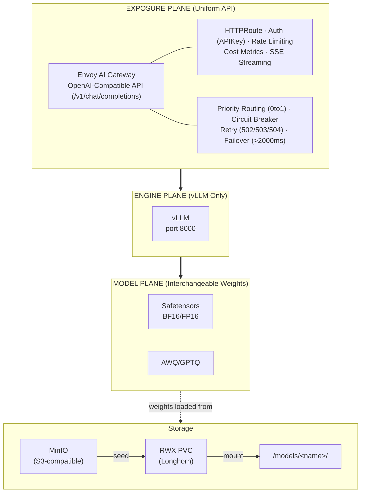
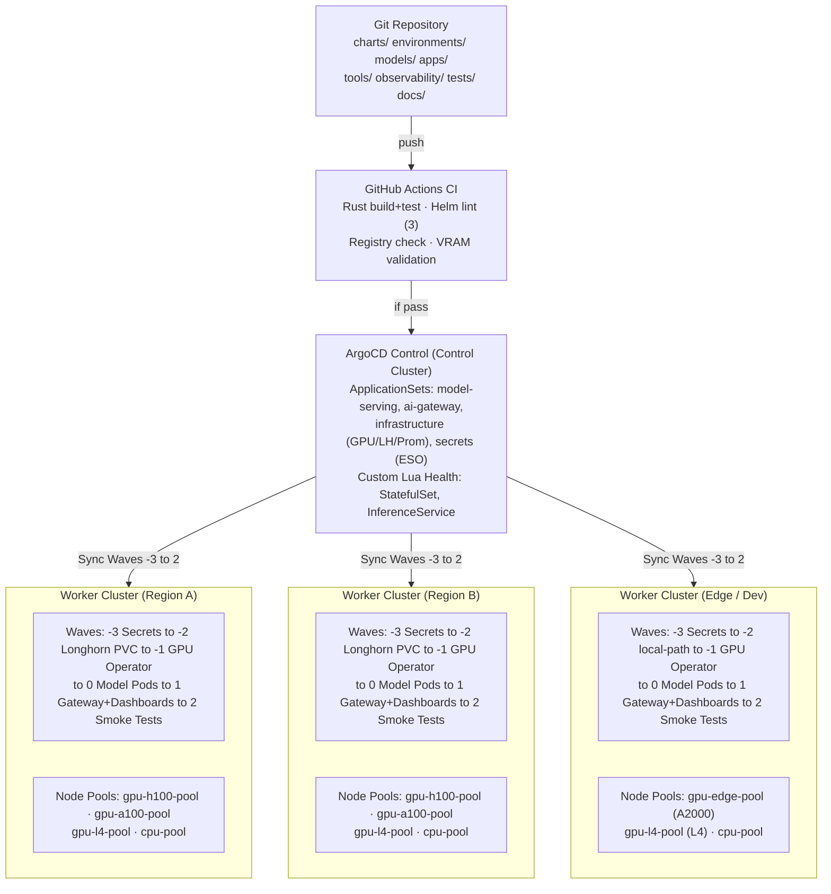
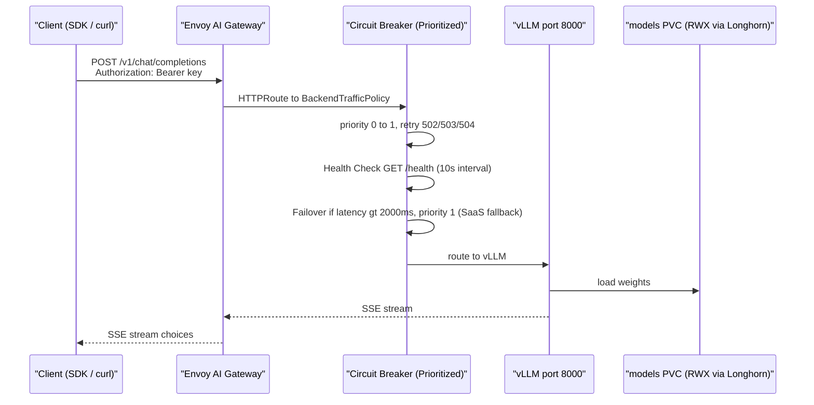
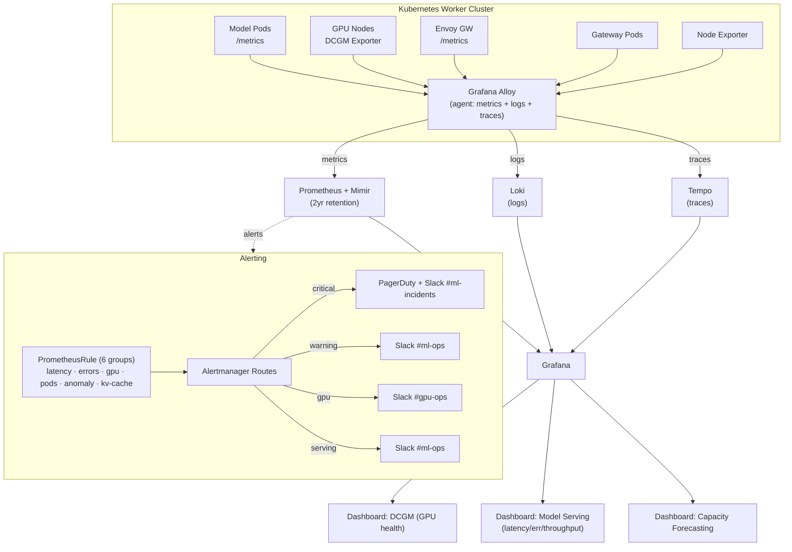
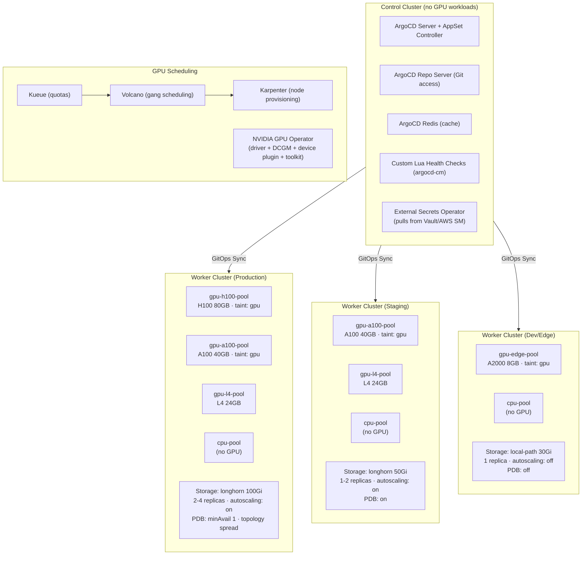
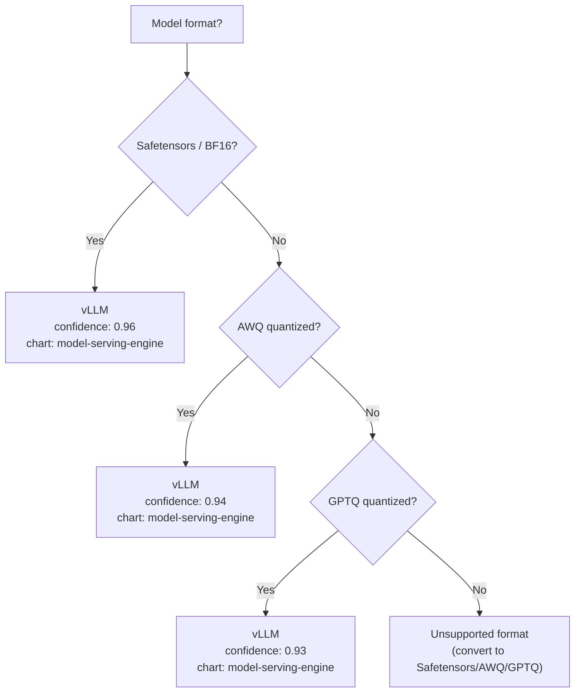

<div align="center">

# Custom-Ai-Ops

### Cloud-Scale Multi-Format ML Model Serving Platform

A highly resilient, long-term, multi-format ML model serving platform with triple-layer separation, designed to serve millions of users with auto-repair, capacity forecasting, and multi-year durability.

---


---

#### Orchestration & GitOps


#### Inference Engines


#### GPU & Hardware


#### Gateway & API


#### Observability (LGTM Stack)


#### Storage & Registry


#### Security & Supply Chain


#### Testing & CI/CD


#### Languages


</div>

---

## Table of Contents

- [Architecture Overview](#architecture-overview)
- [High-Level Architecture Diagram](#high-level-architecture-diagram)
- [Request Flow Diagram](#request-flow-diagram)
- [GitOps Deployment Pipeline](#gitops-deployment-pipeline)
- [Observability Stack Diagram](#observability-stack-diagram)
- [Infrastructure Topology](#infrastructure-topology)
- [Model Onboarding Pipeline](#model-onboarding-pipeline)
- [Auto-Healing Layers](#auto-healing-layers)
- [Format → Engine Decision Tree](#format--engine-decision-tree)
- [Repository Structure](#repository-structure)
- [Quick Start](#quick-start)
- [Sync Waves](#sync-waves)
- [Model Registry](#model-registry)
- [KV Cache Management](#kv-cache-management)
- [Observability](#observability)
- [CI/CD Pipeline](#cicd-pipeline)
- [Test Suites](#test-suites)
- [Documentation](#documentation)
- [Technology Stack](#technology-stack)
- [External Platform Integration](#external-platform-integration)
- [License](#license)

---

## Architecture Overview

The platform is built on a **triple-layer separation** principle that ensures maximum modularity and long-term maintainability. The key insight: **never rigidly couple the model format to the serving engine**.

### The Three Planes



**Why this matters:**
- Add a new model → no gateway change needed
- Change engine → no client-side change needed
- Switch to SaaS fallback → transparent to end users
- Each plane evolves independently over years

---

## High-Level Architecture Diagram



---

## Request Flow Diagram



---

## GitOps Deployment Pipeline


---

## Observability Stack Diagram



---

## Infrastructure Topology



---

## Model Onboarding Pipeline

```mermaid
graph LR
    S1["1. Identify Format<br/>Safetensors? AWQ/GPTQ?"]
    S2["2. engine-selector<br/>Detects format to engine<br/>to chart to confidence"]
    S3["3. vram-budget-calc<br/>VRAM = Total×0.90<br/>− model size − 1GB − KV cache<br/>FP8 check · BLOCK if &lt; 0"]
    S4["4. model-onboarding<br/>Scaffolds models/&lt;name&gt;/<br/>model.md · budget.md · eval-report.md"]
    S5["5. Generate Gateway Entry<br/>backends + models<br/>in ai-gateway/values.yaml"]
    S6["6. Open PR<br/>(values repo)"]
    S7["7. CI Validation<br/>helm lint --strict · helm template<br/>registry consistency · vram validation"]
    S8["8. ArgoCD Sync<br/>Waves -3 to 2<br/>self-heal ON · prune ON"]
    S9["9. Smoke Tests<br/>health 200 · auth 401/403<br/>chat completion · cost metric"]
    S10["10. Canary<br/>gateway priority 0<br/>canary to ramp-up"]
    S11["11. Full Traffic<br/>normal priority<br/>validate on real traffic"]
    S12["12. Document ADR<br/>(if new pattern)"]

    S1 --> S2 --> S3 --> S4 --> S5 --> S6
    S6 --> S7 --> S8 --> S9 --> S10 --> S11 --> S12
```



---

## Auto-Healing Layers

```mermaid
graph TB
    subgraph Layer1["Level 1 — Pod Level (Kubernetes native)"]
        L1A["Liveness probe fails<br/>to Kubernetes restarts pod"]
        L1B["Startup probe (long timeout)<br/>prevents kill during model loading"]
    end

    subgraph Layer2["Level 2 — GPU Node Level (NVIDIA GPU Operator)"]
        L2A["NVIDIA Xid error detected<br/>to GPU Operator cordons + drains node"]
        L2B["Pods migrate to healthy nodes<br/>to Karpenter provisions replacement node"]
    end

    subgraph Layer3["Level 3 — Config Drift (ArgoCD self-healing)"]
        L3A["Manual kubectl edit<br/>to ArgoCD detects drift"]
        L3B["Auto-re-syncs to Git state<br/>Correction in < 3 minutes"]
    end

    subgraph Layer4["Level 4 — Model Quality (Envoy AI Gateway)"]
        L4A["Latency > 2000ms or errors > 5%<br/>to Gateway circuit breaker triggers"]
        L4B["Failover to SaaS fallback (priority 1)<br/>to users unaffected"]
    end

    subgraph Layer5["Level 5 — Cluster Failover (External DNS + Envoy)"]
        L5A["Worker cluster unavailable<br/>to DNS-based failover to another region"]
        L5B["Gateway multi-backend with priority routing<br/>handles transparently"]
    end

    subgraph Layer6["Level 6 — Data Drift (Evidently AI)"]
        L6A["Model quality degrades silently<br/>to Evidently AI detects distribution shift"]
        L6B["Alert triggered<br/>to re-evaluation pipeline started"]
    end

    Layer1 -->|"if pod restart doesn't fix it"| Layer2
    Layer2 -->|"if node-level fails"| Layer3
    Layer3 -->|"if model quality degrades"| Layer4
    Layer4 -->|"if entire cluster fails"| Layer5
    Layer5 -->|"if data drift detected"| Layer6

    Principle["KEY PRINCIPLE: Every automated action leaves a Git trace for auditability<br/>(so 2 years later, we can understand why a rollback happened without log archaeology)"]
    Layer6 -.-> Principle
```



---

## Format → Engine Decision Tree



| Format | Engine | Confidence | Helm Chart | Port |
|---|---|---|---|---|
| Safetensors | vLLM | 0.96 | model-serving-engine | 8000 |
| AWQ | vLLM | 0.94 | model-serving-engine | 8000 |
| GPTQ | vLLM | 0.93 | model-serving-engine | 8000 |

This decision tree is codified in the `engine-selector` Rust CLI tool — not left to ad hoc human decisions.

---

## Repository Structure

```
Custom-Ai-Ops/
├── tools/                           # Rust CLI tools (workspace)
│   ├── engine-selector/             # Format→engine→family→cache-strategy decision tree (31 tests)
│   ├── vram-budget-calc/           # VRAM budget calculator (16 tests)
│   ├── model-onboarding/           # New model scaffold tool (14 tests)
│   └── cache-roi-calc/             # KV cache ROI calculator (Bible §9 formula)
│
├── charts/                          # Helm charts (3 total)
│   ├── bjw-template/               # Common base library chart
│   │                               # (security context, probes, volumes, tolerations)
│   ├── model-serving-engine/       # Unified vLLM engine chart
    │   │                               # (StatefulSet, KEDA ScaledObject, PDB, NetworkPolicy,
    │   │                               #  PVC, seed-job, swapoff DaemonSet, ServiceMonitor)
    │   └── ai-gateway/                 # Envoy AI Gateway (HTTPRoute, BackendTrafficPolicy,
                                    #  rate limiting, payload validation, sticky routing, secrets)
│
├── environments/                    # Environment-specific configurations
│   ├── dev/                         # 1 replica, local-path 30Gi, autoscaling off, PDB off
│   ├── staging/                     # 1-2 replicas, longhorn 50Gi, autoscaling on
│   └── prod/                        # 2-4 replicas, longhorn 100Gi, PDB, topology spread
│
├── apps/                            # ArgoCD ApplicationSets + bootstrap manifests
│   ├── argocd-appset-prod.yaml     # Prod: serving + infrastructure + secrets + gateway
│   ├── argocd-appset-staging.yaml   # Staging: serving + gateway
│   ├── argocd-appset-dev.yaml       # Dev: serving + gateway
│   ├── argocd-appprojects.yaml     # 2 AppProjects (model-serving, infrastructure) — sync-wave -10
│   ├── argocd-repo-credentials.yaml # Repo credential Secret + known_hosts ConfigMap — sync-wave -11
│   ├── argocd-notifications.yaml   # Slack + PagerDuty notifications (triggers, templates, subscriptions)
│   ├── argocd-health-checks.yaml   # Custom Lua health checks (StatefulSet, InferenceService)
│   └── external-secrets.yaml       # ClusterSecretStore + 4 ExternalSecrets (SaaS keys, alertmanager, registry, image-updater)
│
├── addons/                          # Cluster infrastructure addons (ArgoCD Applications)
│   ├── nvidia-gpu-operator/        # NVIDIA GPU Operator (driver, toolkit, DCGM, device plugin) — wave -1
│   ├── longhorn/                   # Longhorn distributed storage (RWX PVC) — wave -2
│   ├── prometheus-stack/           # kube-prometheus-stack (Prometheus, Grafana, Alertmanager) — wave -1
│   ├── keda/                        # KEDA autoscaler (vLLM queue depth + KV cache triggers) — wave -1
│   ├── external-secrets/           # External Secrets Operator (CRDs + controller) — wave -1
│   └── cert-manager/               # cert-manager + 2 ClusterIssuers (Let's Encrypt) — wave -1
│
├── observability/                   # Monitoring and alerting
│   ├── envoy-gateway-config.yaml    # HTTPRoute + BackendTrafficPolicy + HealthCheckPolicy
│   ├── prometheus-anomaly-rules.yaml # 6 rule groups: latency, errors, GPU, pods, anomaly, kv-cache
│   ├── alertmanager-routes/         # Alert routing: critical→PagerDuty+Slack, warning→Slack
│   └── grafana-dashboards/          # DCGM dashboard + model-serving dashboard
│
├── models/                          # Model registry and per-model documentation
│   ├── registry.yaml                # Declarative registry (2 models)
│   └── registry/                    # Per-model documentation directory
│
├── tests/                           # Test suites
│   ├── smoke/                       # Post-deployment smoke tests (bash: health, auth, chat, cost)
│   ├── load/                        # k6 load tests (staged ramp-up, p95 < 2000ms)
│   └── chaos/                        # LitmusChaos GPU chaos (pod-delete, network-latency, node-drain)
│
├── docs/                            # Documentation
│   ├── architecture/                # 8 architecture docs (00-07)
│   │   ├── 00-overview.md           #   Three-plane architecture overview
│   │   ├── 01-formats-and-engines.md #   Format-to-engine mapping + decision tree
│   │   ├── 02-gpu-scheduling.md     #   Node pools, VRAM formula, hardware constraints
│   │   ├── 03-gateway-federation.md #   Priority routing, health checks, failover
│   │   ├── 04-gitops-deployment.md  #   Sync waves, ArgoCD AppSet, Lua health checks
│   │   ├── 05-observability.md      #   LGTM stack, dashboards, anomaly detection
│   │   ├── 06-resilience-and-dr.md  #   Auto-healing layers, rollback strategy
│   │   └── 07-capacity-forecasting.md # Holt-Winters, KEDA predictive, recording rules
│   ├── explain/                     # Deep-dive technical references
│   │   ├── kv-cache.md              #   6-layer KV cache management architecture
│   │   ├── bible-kv-cache.md        #   KV Cache Bible (13 sections)
│   │   └── gpu.md                   #   In-depth GPU reference guide (332 lines)
│   ├── adr/                         # Architecture Decision Records
│   │   ├── 0001-multi-format-architecture.md
│   │   ├── 0002-envoy-ai-gateway.md
│   │   └── 0003-separate-engine-charts.md
│   ├── runbooks/                    # Incident response procedures
│   │   ├── gpu-node-failure.md      #   Cordon/drain, ECC/Xid/temp checks
│   │   ├── latency-spike.md         #   Check failover, GPU throttle, scale up
│   │   └── pod-crashloop.md         #   OOM/model-not-found/probe-failure
│   ├── env.md                       # Environment variables, secrets, external connections reference (19 sections)
│   ├── external-tools.md            # External platform configuration guide (12 platforms, 14 sections)
│   └── integration-report.md        # ArgoCD + external platform integration report (13 sections)
│
├── .github/workflows/ci.yaml        # CI: rust-tools, helm-lint, registry-consistency, vram-validation
│
├── impl.md                          # Reference architecture document
├── tests.md                         # Certification test suite (11 categories, 48 tests)
├── namage.md                        # Production lifecycle management
├── solve.md                         # End-to-end toolchain method
├── LICENSE                          # MIT License
└── README.md                        # This file
```

---

## Quick Start

### 1. Build Rust CLI Tools

```bash
# Build all tools in the workspace
cargo build --release

# Or build individually
cargo build --release --bin engine-selector
cargo build --release --bin vram-budget-calc
cargo build --release --bin model-onboarding
cargo build --release --bin cache-roi-calc
```

### 2. Run Tests

```bash
# Run all unit tests (61 tests across 4 crates)
cargo test

# Run tests for a specific tool
cargo test --bin engine-selector     # 31 tests
cargo test --bin vram-budget-calc    # 16 tests
cargo test --bin model-onboarding    # 14 tests
cargo test --bin cache-roi-calc     # 0 tests (CLI tool, no unit tests)
```

### 3. Use the Tools

```bash
# Select the best engine for a model
./target/release/engine-selector --model /path/to/model --json

# Override format detection
./target/release/engine-selector --model /path/to/model --format awq

# Calculate VRAM budget
./target/release/vram-budget-calc \
  --total-vram 8 \
  --model-size 4.7 \
  --quant awq \
  --gpu "RTX A2000" \
  --batch 1 \
  --context 8192 \
  --layers 32 \
  --heads 32 \
  --json

# Onboard a new model (scaffolds files)
./target/release/model-onboarding \
  --name my-model \
  --format safetensors \
  --vram-budget 8 \
  --gpu-pool "RTX A2000" \
  --dry-run
```

### 4. Validate Helm Charts

```bash
# Lint all charts
helm lint charts/bjw-template
helm lint charts/model-serving-engine
helm lint charts/ai-gateway

# Template dry-run
helm template charts/model-serving-engine --set model.name=test-model
```

### 5. Deploy via GitOps (ArgoCD)

```bash
# 1. Bootstrap: AppProjects + repo credentials (must be applied first)
kubectl apply -f apps/argocd-appprojects.yaml
kubectl apply -f apps/argocd-repo-credentials.yaml

# 2. Notifications (Slack + PagerDuty)
kubectl apply -f apps/argocd-notifications.yaml

# 3. ExternalSecrets (ClusterSecretStore + ExternalSecrets)
kubectl apply -f apps/external-secrets.yaml

# 4. ArgoCD ApplicationSets (per environment)
kubectl apply -f apps/argocd-appset-dev.yaml
kubectl apply -f apps/argocd-appset-staging.yaml
kubectl apply -f apps/argocd-appset-prod.yaml

# 5. Custom health checks
kubectl apply -f apps/argocd-health-checks.yaml
```

---

## Sync Waves

The GitOps pipeline manages deployments in ordered waves — each wave must reach "Healthy" before the next starts:

| Wave | Content | Justification |
|---|---|---|
| -11 | ArgoCD repo credential Secret + known_hosts ConfigMap | ArgoCD needs repo access before anything |
| -10 | ArgoCD AppProjects (model-serving, infrastructure) | Projects must exist before Applications |
| -3 | ExternalSecrets (ClusterSecretStore + ExternalSecrets) | Secrets must exist before workloads reference them |
| -2 | Longhorn storage, swapoff DaemonSet, seed jobs | Pods need ready volumes; swap disabled before GPU workloads |
| -1 | NVIDIA GPU Operator, Prometheus stack, KEDA, cert-manager, ESO, DCGM Exporter | Infrastructure must run before workloads |
| 0 | Model server StatefulSets | The core of the system |
| 1 | Gateway configuration (HTTPRoute, BackendTrafficPolicy), ServiceMonitor, Grafana dashboards | Depends on workloads being in place |
| 2+ | Post-sync smoke tests, notifications | Final validation |

---

## Model Registry

The declarative registry (`models/registry.yaml`) tracks all models with their format, engine, status, VRAM budget, GPU pool, and context length:

| Model | Format | Engine | Status | VRAM | GPU | Quant | Context |
|---|---|---|---|---|---|---|---|
| mistral-7b-instruct | Safetensors | vLLM | STAGED | 40 GB | A100 | bf16 | 32768 |
| llama-3-70b-instruct | Safetensors | vLLM | STANDBY | 80 GB | H100 | fp16 | 8192 |

When a model is onboarded via `model-onboarding`, it gets a dedicated directory with:
- **`model.md`** — Model datasheet (VRAM budget, status, context, fallback model)
- **`budget.md`** — Detailed VRAM calculation (proven by `vram-budget-calc`)
- **`eval-report.md`** — Quality validation results (MMLU, HellaSwag, ARC, TruthfulQA, latency benchmarks)

### VRAM Budget Formula

```
Usable VRAM     = Total VRAM × 0.90
Available       = Usable VRAM − Model Size − 1 GB Fixed Overhead − KV Cache
KV Cache        = 2 × Batch × Context × Layers × Heads × Bytes-per-weight / 1024³

If Available < 0  →  deployment BLOCKED by vram-budget-calc in CI
If FP8 on Ampere  →  deployment BLOCKED (no native FP8 support)
```

---

## Observability

### Health Checking

- Active health-checking at the Envoy AI Gateway level (`GET /health` endpoint)
- Immediate failover to fallback backend if latency > 2000ms
- Priority routing (priority 0 → priority 1) with circuit breaker (Prioritized)
- Retry on 502/503/504 (2 attempts)
- **Rate limiting**: 50 req/s per API key (HTTP 429 on excess) — protects KV cache from request floods
- **Payload validation**: max body size 4MiB (HTTP 413), required fields enforced (HTTP 400)
- **Sticky routing**: `x-sticky-session-key` header routes same-prefix requests to same replica (maximizes prefix cache hits)
- **Aggressive timeouts**: request 10s / backendRequest 8s — prevents KV cache thrashing from queued requests

### Monitoring Stack (LGTM)

| Layer | Tool | Purpose |
|---|---|---|
| Metrics | Prometheus + Mimir | Long-term metric storage (2-year retention) |
| Logs | Loki | Log aggregation (low storage cost) |
| Traces | Tempo + OpenTelemetry | Distributed tracing |
| Dashboards | Grafana | Unified visualization |
| GPU Metrics | DCGM Exporter | GPU utilization, memory, temperature, ECC errors |
| vLLM Metrics | ServiceMonitor | Scrapes vLLM `/metrics` every 10s (KV cache, queue, prefix cache, TTFT) |
| Collection | Grafana Alloy | Single agent for metrics + logs + traces |

### Grafana Dashboards

| Dashboard | Panels |
|---|---|
| `dcgm-dashboard.json` | GPU health (temperature, utilization, memory, ECC) |
| `model-serving-dashboard.json` | Request rate, P95 latency, error rate, tokens/s, OOM kills, **KV cache usage (%)**, **prefix cache hit rate (%)**, **request queue depth**, **TTFT (p95+p50)**, **KV cache swap-out blocks**, **GPU VRAM usage (DCGM)**, **LMCache L1/L2/L3 hit rates**, **prefill skip rate**, **cache ROI estimate ($/h)**, **cache affinity routing distribution** — **18 panels total** |

### Alerting Rules

| Category | Alert | Condition | Severity |
|---|---|---|---|
| Latency | HighLatency | p95 > 2s for 3m | Warning |
| Latency | CriticalLatency | p99 > 5s for 2m | Critical |
| Errors | HighErrorRate | > 5% for 5m | Warning |
| Errors | CriticalErrorRate | > 15% for 3m | Critical |
| GPU | GPUThermalThrottle | > 85°C | Critical |
| GPU | GPUUtilizationLow | < 10% for 30m | Warning |
| GPU | GPUMemoryNearExhaustion | > 95% for 2m | Critical |
| GPU | GPUEccErrors | > 100/h | Critical |
| Pods | CrashLooping | restarts > 3/h | Warning |
| Pods | NotReady | 10m | Warning |
| Anomaly | LatencyAnomaly | deriv > 0.1 for 10m | Warning |
| Anomaly | ThroughputAnomaly | deriv < -0.5 for 10m | Warning |
| KV Cache | VLLMKVCacheUsageHigh | `vllm:gpu_cache_usage_perc` > 0.85 for 30s | Warning |
| KV Cache | VLLMKVCacheUsageCritical | `vllm:gpu_cache_usage_perc` >= 1.0 | Critical |
| KV Cache | VLLMRequestsWaitingHigh | `vllm:num_requests_waiting` > 10 for 1m | Critical |
| KV Cache | VLLMSwapOutBlocksDetected | `increase(vllm:swap_out_blocks[5m])` > 0 | Critical |
| KV Cache | NodeSwapSpaceUsageHigh | swap usage > 10% for 2m | Critical |
| KV Cache | VLLMPrefixCacheHitRateLow | prefix cache hit < 20% for 10m | Warning |
| KV Cache | LMCacheL1HitRateLow | L1 CPU hit < 30% for 10m | Warning |
| KV Cache | LMCacheL2HitRateLow | L2 NVMe hit < 20% for 15m | Warning |
| KV Cache | LMCacheL3HitRateLow | L3 Redis/S3 hit < 10% for 15m | Warning |
| KV Cache | SSMModelPagedAttentionMisconfigured | SSM pod with PagedAttention args | Critical |
| KV Cache | VLLMPrefillSkipRateLow | prefill skip < 10% while queue busy | Info |
| KV Cache | CacheRoutingHeaderAbsent | `x-cache-affinity-key` missing during traffic | Info |

### Alert Routing

- **Critical** → PagerDuty + Slack `#ml-incidents`
- **Warning** → Slack `#ml-ops`
- **GPU** → Slack `#gpu-ops`
- **Serving** → Slack `#ml-ops`
- Inhibit: critical suppresses warning for same alert

---

## KV Cache Management

The platform implements an **8-layer defensive architecture** for vLLM KV cache management, as documented in [`docs/explain/kv-cache.md`](docs/explain/kv-cache.md) and [`docs/explain/bible-kv-cache.md`](docs/explain/bible-kv-cache.md). Each layer protects the KV cache from a different failure mode.

### Layer 1 — API Gateway (Edge Protection)

| Mechanism | Implementation | Failure Mode Prevented |
|---|---|---|
| Payload validation | `HTTPRouteFilter` maxBodySize 4MiB → HTTP 413 | Oversized payloads polluting KV cache |
| Rate limiting | `BackendTrafficPolicy` 50 req/s per `x-api-key` → HTTP 429 | Request floods overwhelming KV cache |
| Sticky routing | `x-sticky-session-key` header → same replica | Prefix cache misses from random routing |
| Aggressive timeouts | request 10s / backendRequest 8s | Queue thrashing from slow requests |

### Layer 2 — vLLM Engine (Cache Efficiency)

| Argument | Prod | Staging | Dev | Purpose |
|---|---|---|---|---|
| `--gpu-memory-utilization` | 0.90 | 0.88 | 0.85 | Reserve headroom for KV cache growth |
| `--max-model-len` | 8192 | 8192 | 4096 | Cap context length to business need |
| `--max-num-seqs` | 256 | 128 | 64 | Limit concurrent sequences in KV cache |
| `--kv-cache-dtype` | fp8 | fp8 | fp8 | Halve KV cache memory via quantization |
| `--enable-prefix-caching` | ✓ | ✓ | ✓ | Reuse KV cache for shared prefixes |
| `--block-size` | 16 | 16 | 16 | Optimal block size for paged attention |
| `--tensor-parallel-size` | 1 | 1 | 1 | Per-NVLink topology |

### Layer 3 — Kubernetes (Resource Protection)

| Mechanism | Implementation | Failure Mode Prevented |
|---|---|---|
| **QoS Guaranteed** | requests == limits (CPU/RAM/GPU) in all envs | Host OOM killer evicting vLLM pods |
| **swapoff DaemonSet** | `nsenter swapoff -a` on GPU nodes via DaemonSet | Host swapping KV cache pages to CPU RAM |
| **Node isolation** | `nodeSelector: nvidia.com/gpu.present: "true"` | CPU workloads competing for GPU node RAM |

### Layer 4 — Observability (Early Detection)

| Alert | Condition | Severity |
|---|---|---|
| `VLLMKVCacheUsageHigh` | `vllm:gpu_cache_usage_perc` > 0.85 for 30s | Warning |
| `VLLMKVCacheUsageCritical` | `vllm:gpu_cache_usage_perc` >= 1.0 | Critical |
| `VLLMRequestsWaitingHigh` | `vllm:num_requests_waiting` > 10 for 1m | Critical |
| `VLLMSwapOutBlocksDetected` | `increase(vllm:swap_out_blocks[5m])` > 0 | Critical |
| `NodeSwapSpaceUsageHigh` | swap usage > 10% for 2m | Critical |
| `VLLMPrefixCacheHitRateLow` | hit rate < 20% for 10m | Warning |
| `LMCacheL1HitRateLow` | L1 CPU hit < 30% for 10m | Warning |
| `LMCacheL2HitRateLow` | L2 NVMe hit < 20% for 15m | Warning |
| `LMCacheL3HitRateLow` | L3 distributed hit < 10% for 15m | Warning |
| `VLLMPrefillSkipRateLow` | prefill skip < 10% while queue busy | Info |
| `SSMModelPagedAttentionMisconfigured` | SSM pod detected with PagedAttention args | Critical |
| `CacheRoutingHeaderAbsent` | `x-cache-affinity-key` missing during traffic | Info |

**ServiceMonitor** scrapes vLLM `/metrics` every 10s with `honorLabels: true`. Grafana dashboard has **18 panels** including 6 LMCache hierarchy and ROI panels (see [`docs/architecture/05-observability.md`](docs/architecture/05-observability.md)).

### Layer 5 — Autoscaling (KEDA)

Classic CPU/RAM HPA is **inoperant for LLM workloads** (GPU-bound, not CPU-bound). The platform uses a KEDA `ScaledObject` with two Prometheus triggers:

| Trigger | Metric | Threshold | Action |
|---|---|---|---|
| Queue depth | `vllm:num_requests_waiting` | > 5 | Scale out |
| Cache pressure | `vllm:gpu_cache_usage_perc` | > 0.85 | Scale out |

- `minReplicaCount`: 2 (prod), `maxReplicaCount`: 4
- `pollingInterval`: 15s, `cooldownPeriod`: 60s
- Legacy HPA fallback retained for environments without KEDA

### Layer 6 — GitOps (Change Safety)

- All critical vLLM params centralized in `environments/{dev,staging,prod}/values.yaml`
- ArgoCD sync waves with self-heal + prune + ServerSideApply
- `vram-budget-calc` CI gate blocks deployment if KV cache budget < 0
- `cache-roi-calc` CLI tool computes ROI ratio, GPU savings, and break-even hit rate (Bible §9)
- k6 load tests validate before changes reach production
- Staging environment uses identical GPU hardware to prod

### Layer 7 — Distributed Cache Middleware (LMCache)

The platform deploys **LMCache** as a per-GPU-node DaemonSet to break the per-instance KV cache silo (Bible §4.3). Cache becomes shareable across pods, persistent across restarts, and hierarchical across memory tiers.

| Tier | Backend | Latency | Capacity (prod) | Enabled In |
|---|---|---|---|---|
| L0 | vLLM GPU HBM (PagedAttention) | ~ns | `gpu-memory-utilization` headroom | all envs |
| L1 | CPU DRAM (LMCache daemon) | ~µs | node-local RAM | prod, staging |
| L2 | Local NVMe disk (LMCache) | ~ms | 200 GiB | prod, staging |
| L3 | Redis (LMCache) | ~10ms | cluster-wide | prod |

| Parameter | Prod | Staging | Dev |
|---|---|---|---|
| `lmcache.enabled` | true | true | false |
| `lmcache.cpuWorkers` | 4 | 2 | — |
| `lmcache.disk.maxSize` | 200GiB | 100GiB | — |
| `lmcache.redis.enabled` | true | false | — |

Templates: `lmcache-daemonset.yaml`, `lmcache-configmap.yaml`, `lmcache-service.yaml`.

**SafeTensors Cache Persistence** — `cachePersistence` provisions a dedicated PVC (`/cache/kv`) via Longhorn so the KV cache survives pod restarts. On startup, vLLM restores from the persisted cache, reducing TTFT from ~11s to ~1.5s on a 128K context at 80% hit rate.

| Parameter | Prod | Staging | Dev |
|---|---|---|---|
| `cachePersistence.enabled` | true | true | false |
| `cachePersistence.storageClass` | longhorn | longhorn | — |
| `cachePersistence.size` | 50Gi | 30Gi | — |

### Layer 8 — Cache-Aware Routing (Cluster-Level Affinity)

Sticky routing by model name (`x-sticky-session-key` header) is augmented with **consistent-hash load balancing** on the `x-cache-affinity-key` header, derived from a prefix hash of the first 64 tokens of the system prompt.

| Mechanism | Implementation | Failure Mode Prevented |
|---|---|---|
| Prefix-hash routing | Envoy Lua filter (FNV-1a over first 512 bytes of body) → `x-cache-affinity-key` header | Random routing destroying prefix cache locality |
| Consistent-hash LB | `BackendTrafficPolicy` `loadBalancer.type: ConsistentHash` on `x-cache-affinity-key` | Cache misses from round-robin distribution |
| Cache invalidation policy | ConfigMap documents RAG/model/prompt invalidation triggers | Stale cache hits returning outdated content |

Template: `cache-routing-policy.yaml` (ConfigMap with Lua filter + invalidation policy).

**Multi-Family Model Support** — The `engine-selector` tool detects model family (Transformer, MoE, SSM/Mamba, Hybrid) and returns the correct cache strategy. SSM/Mamba models use a fixed-size recurrent state — `--enable-prefix-caching` and `--block-size` are **misconfigurations** for them (Bible §14). The `SSMModelPagedAttentionMisconfigured` alert catches this at runtime.

---

## CI/CD Pipeline

The GitHub Actions workflow (`.github/workflows/ci.yaml`) runs 4 jobs:

| Job | Description | Blocking |
|---|---|---|
| `rust-tools` | Build + test all 4 crates, clippy (deny warnings), fmt check | Yes |
| `helm-lint` | Lint all 3 charts + template dry-run with test values | Yes |
| `registry-consistency` | Validate each registry entry has chart dir, model dir, and required files | Yes |
| `vram-budget-validation` | Build `vram-budget-calc` and run for all LIVE/STAGED models — fails if budget exceeded | Yes |

---

## Test Suites

| Suite | Tool | Tests | Thresholds |
|---|---|---|---|
| **Smoke** (`tests/smoke/`) | Bash | Health 200, Auth 401/403, Chat completion 200 + content, Cost metric | All must pass |
| **Load** (`tests/load/`) | k6 | Staged ramp-up (5→10→20→10→0 VUs) | p95 < 2000ms, failed < 5% |
| **Chaos** (`tests/chaos/`) | LitmusChaos | pod-delete (60s), network-latency (120s/500ms), node-drain (60s) | Recovery within cold-start SLA |

### Certification Suite (`tests.md`)

The full certification suite defines **11 categories, 48 tests** with strict GO/NO-GO criteria:

| Category | Tests | Blocking |
|---|---|---|
| 1. Packaging & model integrity | 4 | Yes |
| 2. Declarative infrastructure | 5 | Yes |
| 3. ArgoCD synchronization | 5 | Yes |
| 4. Loading & startup | 3 | Yes |
| 5. Serving API | 5 | Yes |
| 6. GPU robustness & scheduling | 5 | Yes |
| 7. Load & performance | 5 | T7.1/T7.2 blocking |
| 8. Resilience & chaos engineering | 6 | T8.1/T8.2/T8.6 blocking |
| 9. Security | 5 | Yes |
| 10. Cost & governance | 2 | Before billed traffic |
| 11. End-to-end | 3 | Yes |

---

## Documentation

### Top-Level Documents

| Document | Description |
|---|---|
| [`impl.md`](impl.md) | Reference architecture (triple-layer separation, format/engine mapping, GitOps pipeline, observability, auto-healing, multi-year robustness) |
| [`tests.md`](tests.md) | Certification test suite (11 categories, 48 tests, GO/NO-GO criteria) |
| [`namage.md`](namage.md) | Production lifecycle management |
| [`solve.md`](solve.md) | End-to-end toolchain method |

### Architecture Docs (`docs/architecture/`)

| Doc | Title |
|---|---|
| [00-overview.md](docs/architecture/00-overview.md) | Three-plane architecture overview |
| [01-formats-and-engines.md](docs/architecture/01-formats-and-engines.md) | Format-to-engine mapping + decision tree |
| [02-gpu-scheduling.md](docs/architecture/02-gpu-scheduling.md) | Node pools, VRAM formula, hardware constraints |
| [03-gateway-federation.md](docs/architecture/03-gateway-federation.md) | Priority routing, health checks, failover |
| [04-gitops-deployment.md](docs/architecture/04-gitops-deployment.md) | Sync waves, ArgoCD AppSet, Lua health checks |
| [05-observability.md](docs/architecture/05-observability.md) | LGTM stack, dashboards, anomaly detection |
| [06-resilience-and-dr.md](docs/architecture/06-resilience-and-dr.md) | Auto-healing layers, rollback strategy |
| [07-capacity-forecasting.md](docs/architecture/07-capacity-forecasting.md) | Holt-Winters, KEDA predictive, recording rules |

### Architecture Decision Records (`docs/adr/`)

| ADR | Decision |
|---|---|
| [0001](docs/adr/0001-multi-format-architecture.md) | Multi-format architecture (vLLM-only) |
| [0002](docs/adr/0002-envoy-ai-gateway.md) | Envoy AI Gateway federation |
| [0003](docs/adr/0003-separate-engine-charts.md) | Separate engine charts per format |

### Runbooks (`docs/runbooks/`)

| Runbook | Scenario |
|---|---|
| [gpu-node-failure.md](docs/runbooks/gpu-node-failure.md) | GPU node failure: cordon/drain, ECC/Xid/temp checks |
| [latency-spike.md](docs/runbooks/latency-spike.md) | Latency spike: check failover, GPU throttle, scale up |
| [pod-crashloop.md](docs/runbooks/pod-crashloop.md) | Pod crash loop: OOM, model-not-found, probe-failure |

### Explain Docs (`docs/explain/`)

| Doc | Description |
|---|---|
| [kv-cache.md](docs/explain/kv-cache.md) | 6-layer KV cache management architecture (gateway, vLLM, K8s, observability, autoscaling, GitOps, distributed cache middleware, cache-aware routing) |
| [bible-kv-cache.md](docs/explain/bible-kv-cache.md) | KV Cache Bible — 13-section reference: math foundations, tools panorama (vLLM, SGLang, LMCache, Mooncake, Dynamo), by-format guide, ROI analysis, millions-of-users scaling, modular architecture, multi-family models (Transformer/MoE/SSM/Hybrid), anti-patterns |
| [gpu.md](docs/explain/gpu.md) | In-depth GPU reference: 3 families (consumer/workstation/datacenter), prefill vs decode, CUDA gap, per-GPU datasheets, microarchitecture comparison, infrastructure constraints |

### Integration & External Tools (`docs/`)

| Doc | Description |
|---|---|
| [integration-report.md](docs/integration-report.md) | Complete ArgoCD + external platform integration report (13 sections + 3 appendices: Git providers, ArgoCD config, registry, secrets, observability, alerting, SaaS fallback, CI/CD, multi-cluster, security, topology, checklist) |
| [external-tools.md](docs/external-tools.md) | Hands-on configuration guide for 12 external platforms (GitHub, ArgoCD, Helm repos, ESO, SaaS LLM, registries, PagerDuty, Slack, Prometheus, Longhorn, NVIDIA, cert-manager, KEDA) with exact commands, verification, troubleshooting |
| [env.md](docs/env.md) | Complete inventory of every environment variable, API key, secret, external URL, and HTTP header convention (19 sections: quick reference, GitHub, ArgoCD, ESO, SaaS, registries, alerting, observability, LMCache, cert-manager, KEDA, GPU, Longhorn, tests, runtime, Helm repos, bootstrap, verification, HTTP headers) |

---

## Technology Stack

| Layer | Tool | Version | Purpose |
|---|---|---|---|
| **Orchestration** | Kubernetes (Talos / k3s) | 1.28+ | Container orchestration |
| **GitOps** | ArgoCD | 2.8+ | Git-based continuous delivery |
| **Safetensors/AWQ/GPTQ engine** | vLLM | 0.6.3 | PagedAttention, continuous batching |
| **GPU scheduling** | NVIDIA GPU Operator | 24.9+ | Driver, DCGM, device plugin |
| **GPU scheduling** | Kueue | 0.6+ | Quotas, queues, priority |
| **GPU scheduling** | Volcano | 1.9+ | Gang scheduling |
| **Autoscaling** | KEDA | 2.14+ | Event-driven autoscaling on vLLM metrics (queue depth, KV cache usage) |
| **Node provisioning** | Karpenter | 0.37+ | On-demand GPU node provisioning |
| **API Gateway** | Envoy AI Gateway | latest | OpenAI-compatible uniform API |
| **Metrics** | Prometheus + Mimir | 2.50+ / 2.12+ | Metrics collection + long-term storage |
| **Logs** | Loki | 3.0+ | Log aggregation |
| **Traces** | Tempo + OpenTelemetry | 2.5+ | Distributed tracing |
| **Visualization** | Grafana | 10.4+ | Unified dashboards |
| **GPU metrics** | DCGM Exporter | 3.3+ | GPU utilization, memory, temp, ECC |
| **Collection** | Grafana Alloy | latest | Single agent (metrics + logs + traces) |
| **Storage** | Longhorn | 1.6+ | Distributed RWX PVC |
| **Object store** | MinIO | latest | S3-compatible model weight storage |
| **Image registry** | Harbor | 2.10+ | Self-hosted registry with CVE scan |
| **Model registry** | MLflow | 2.12+ | Model version tracking |
| **Secrets** | External Secrets Operator | 0.10+ | ClusterSecretStore + ExternalSecrets (AWS SM / Vault) |
| **Certificates** | cert-manager | 1.16+ | TLS cert provisioning (Let's Encrypt ClusterIssuers) |
| **Image signing** | cosign | 2.2+ | Supply chain security |
| **Secret scanning** | gitleaks | 8.0+ | Plaintext secret detection |
| **Load testing** | k6 | 0.50+ | Performance/load testing |
| **Chaos engineering** | LitmusChaos | 3.0+ | GPU chaos experiments |
| **CI/CD** | GitHub Actions | — | Build, test, lint, validate |
| **Notifications** | ArgoCD Notifications | — | Slack + PagerDuty sync/health alerts |
| **CLI tools** | Rust | 1.70+ | engine-selector, vram-budget-calc, model-onboarding, cache-roi-calc |
| **Drift detection** | Evidently AI | latest | Data quality monitoring (self-hosted) |

---

## External Platform Integration

The platform integrates with external systems via GitOps. All integration manifests live in `apps/` and `addons/`. See [`docs/integration-report.md`](docs/integration-report.md) for the complete 13-section report.

### ArgoCD GitOps

| Component | File | Purpose |
|---|---|---|
| AppProjects | `apps/argocd-appprojects.yaml` | 2 projects: `model-serving` (namespaced) + `infrastructure` (cluster-scoped) |
| Repo credentials | `apps/argocd-repo-credentials.yaml` | Repo Secret + known_hosts ConfigMap (real GitHub SSH keys) |
| ApplicationSets | `apps/argocd-appset-{dev,staging,prod}.yaml` | Per-env AppSets with sync waves |
| Notifications | `apps/argocd-notifications.yaml` | Slack + PagerDuty (4 triggers, 5 templates, 2 subscriptions) |
| Health checks | `apps/argocd-health-checks.yaml` | Custom Lua health checks (StatefulSet, InferenceService) |

### Cluster Addons

| Addon | Path | Version | Sync Wave |
|---|---|---|---|
| NVIDIA GPU Operator | `addons/nvidia-gpu-operator/` | 24.9.0 | -1 |
| Longhorn | `addons/longhorn/` | 1.7.2 | -2 |
| kube-prometheus-stack | `addons/prometheus-stack/` | 65.5.0 | -1 |
| KEDA | `addons/keda/` | 2.16.0 | -1 |
| External Secrets Operator | `addons/external-secrets/` | 0.10.0 | -1 |
| cert-manager | `addons/cert-manager/` | 1.16.0 | -1 |

### Secret Management

| Component | File | Purpose |
|---|---|---|
| ClusterSecretStore | `apps/external-secrets.yaml` | AWS Secrets Manager (IRSA) — Vault example commented out |
| ExternalSecret: SaaS keys | `apps/external-secrets.yaml` | 7 SaaS API keys (OpenAI, Anthropic, Google, Azure, Mistral, Cohere, Bedrock) |
| ExternalSecret: Alertmanager | `apps/external-secrets.yaml` | Full alertmanager config.yaml with PagerDuty + Slack credentials |
| ExternalSecret: Registry | `apps/external-secrets.yaml` | Docker registry pull secret |
| ExternalSecret: Image Updater | `apps/external-secrets.yaml` | GitHub token for ArgoCD Image Updater |

### SaaS Fallback Providers

The gateway supports automatic failover to SaaS providers when self-hosted latency exceeds 2000ms:

| Provider | Endpoint | Priority |
|---|---|---|
| OpenAI (GPT-4) | `https://api.openai.com/v1` | 1 |
| Anthropic (Claude) | `https://api.anthropic.com/v1` | 1 |
| Google Vertex AI | `https://us-central1-aiplatform.googleapis.com` | 1 |
| Azure OpenAI | `https://{resource}.openai.azure.com` | 1 |
| Mistral AI | `https://api.mistral.ai/v1` | 1 |
| Cohere | `https://api.cohere.ai/v1` | 1 |
| AWS Bedrock | `https://bedrock-runtime.{region}.amazonaws.com` | 1 |

### Alerting Routing

| Severity | Destination | Trigger |
|---|---|---|
| Critical | PagerDuty + Slack `#ml-incidents` | Sync failed, health degraded, KV cache critical |
| Warning | Slack `#ml-ops` | Sync running, KV cache high, latency high |
| GPU | Slack `#gpu-ops` | Thermal throttle, ECC errors, VRAM exhaustion |

### CI/CD Pipeline

| Job | Trigger | Purpose |
|---|---|---|
| `rust-tools` | Push/PR | `cargo test` on engine-selector, vram-budget-calc, model-onboarding, cache-roi-calc |
| `helm-lint` | Push/PR | `helm lint` + `helm template` on all 3 charts |
| `registry-consistency` | Push/PR | Validates model registry entries match chart values |
| `vram-budget-validation` | Push/PR | Blocks deployment if VRAM budget < 0 |

---

## License

MIT License