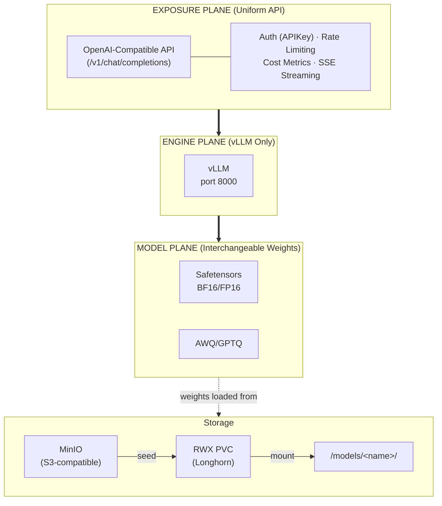
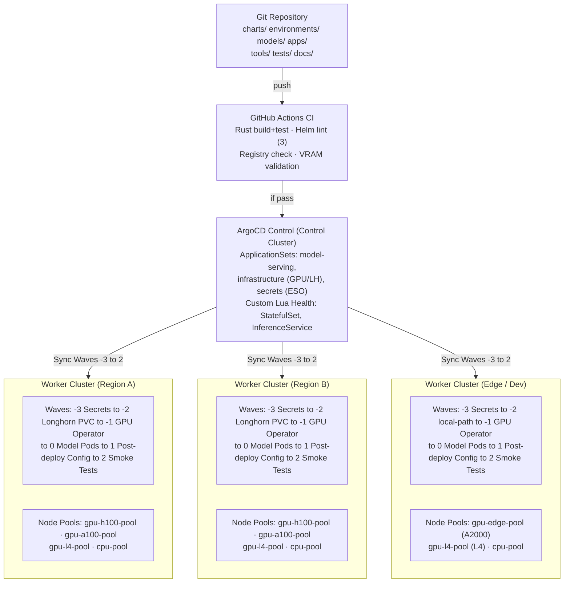
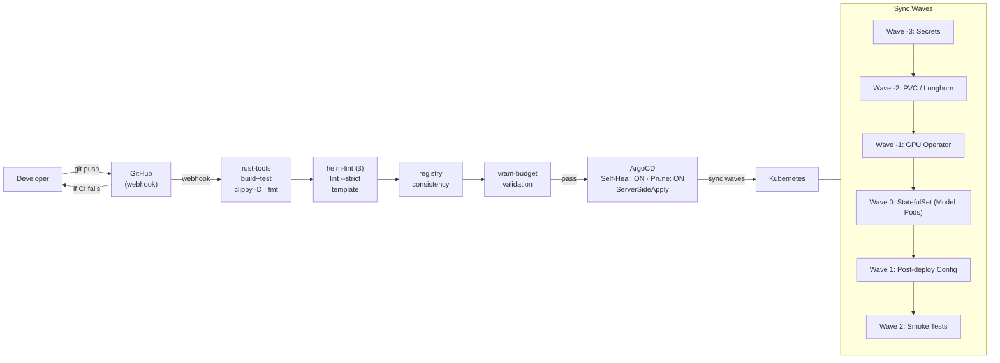
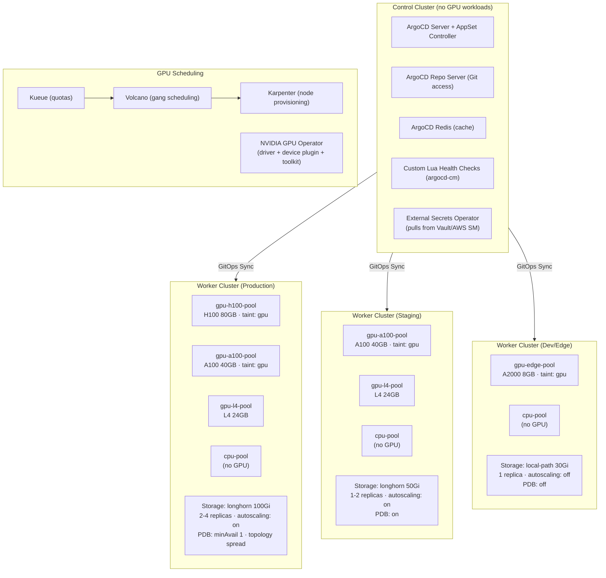
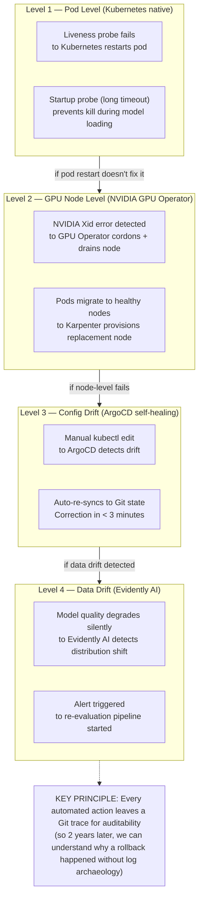
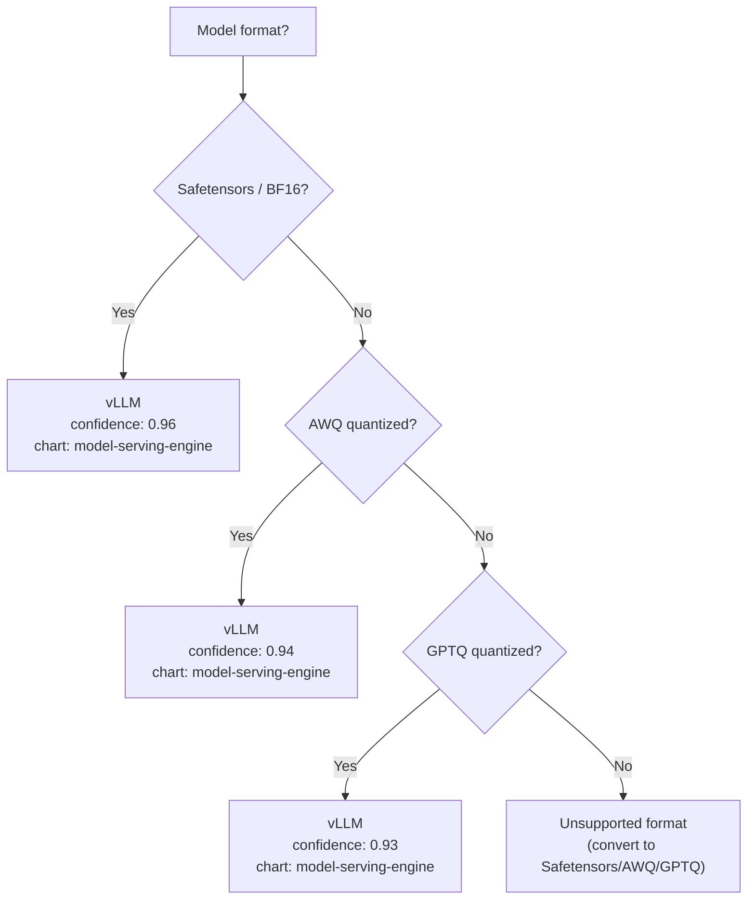

<div align="center">

# Custom-Ai-Ops

### Cloud-Scale Multi-Format ML Model Serving Platform

A highly resilient, long-term, multi-format ML model serving platform with triple-layer separation, designed to serve millions of users with auto-repair, capacity forecasting, and multi-year durability.

> **⚠️ Note**: This repository is a **template/reference architecture**. ArgoCD integration manifests have been removed for public release. See [`REMOVED_ARGOCD.md`](REMOVED_ARGOCD.md) for details and [`apps/README.md`](apps/README.md) for integration instructions.

> **✅ llm-d MVP IMPLEMENTED**: The repository now includes a **production-ready llm-d MVP implementation** (Option 1: Router + InferencePool + Gateway API). This provides cache-aware, intelligent routing for LLM inference workloads. See [`docs/LLM_D_IMPLEMENTATION.md`](docs/LLM_D_IMPLEMENTATION.md) for the complete implementation guide. Advanced features (KV-Cache Indexer, Disaggregated Serving, SLO-aware autoscaling) are documented but not yet implemented. For architectural context, see [`docs/explain/llm-d.md`](docs/explain/llm-d.md) and [`docs/adr/0004-llm-d-not-implemented.md`](docs/adr/0004-llm-d-not-implemented.md).

---


<<<<<<< Updated upstream


=======


<<<<<<< Updated upstream
>>>>>>> Stashed changes
=======
>>>>>>> Stashed changes

---

#### Orchestration & GitOps


#### Inference Engines


#### GPU & Hardware


<<<<<<< Updated upstream
<<<<<<< Updated upstream
#### Gateway & API


#### Inference Middleware


#### Storage & Registry


#### Security & Supply Chain


#### Testing & CI/CD


#### Languages


</div>

---

## Table of Contents

- [Architecture Overview](#architecture-overview)
- [High-Level Architecture Diagram](#high-level-architecture-diagram)
- [GitOps Deployment Pipeline](#gitops-deployment-pipeline)
- [Infrastructure Topology](#infrastructure-topology)
- [Model Onboarding Pipeline](#model-onboarding-pipeline)
- [Auto-Healing Layers](#auto-healing-layers)
- [Format → Engine Decision Tree](#format--engine-decision-tree)
- [Repository Structure](#repository-structure)
- [Quick Start](#quick-start)
- [Sync Waves](#sync-waves)
- [Model Registry](#model-registry)
- [KV Cache Management](#kv-cache-management)
- [llm-d: Intelligent Request Routing (MVP)](#llm-d-intelligent-request-routing-mvp)
=======
- [llm-d: Intelligent Request Routing (MVP)](#llm-d-intelligent-request-routing-mvp)
>>>>>>> Stashed changes
- [CI/CD Pipeline](#cicd-pipeline)
- [Test Suites](#test-suites)
- [Documentation](#documentation)
- [Technology Stack](#technology-stack)
- [External Platform Integration](#external-platform-integration)
- [License](#license)

---

## Architecture Overview

The platform is built on a **triple-layer separation** principle that ensures maximum modularity and long-term maintainability. The key insight: **never rigidly couple the model format to the serving engine**.

### The Three Planes



**Why this matters:**
- Add a new model → no API change needed
- Change engine → no client-side change needed
- Switch to SaaS fallback → transparent to end users
- Each plane evolves independently over years

---

## High-Level Architecture Diagram



---

## GitOps Deployment Pipeline



---

## Infrastructure Topology



---

## Model Onboarding Pipeline

```mermaid
graph LR
    S1["1. Identify Format<br/>Safetensors? AWQ/GPTQ?"]
    S2["2. engine-selector<br/>Detects format to engine<br/>to chart to confidence"]
    S3["3. vram-budget-calc<br/>VRAM = Total×0.90<br/>− model size − 1GB − KV cache<br/>FP8 check · BLOCK if &lt; 0"]
    S4["4. model-onboarding<br/>Scaffolds models/&lt;name&gt;/<br/>model.md · budget.md · eval-report.md"]
    S5["5. Open PR<br/>(values repo)"]
    S6["6. CI Validation<br/>helm lint --strict · helm template<br/>registry consistency · vram validation"]
    S7["7. ArgoCD Sync<br/>Waves -3 to 2<br/>self-heal ON · prune ON"]
    S8["8. Smoke Tests<br/>health 200 · auth 401/403<br/>chat completion · cost metric"]
    S9["9. Canary<br/>gradual ramp-up<br/>validate on canary traffic"]
    S10["10. Full Traffic<br/>validate on real traffic"]
    S11["11. Document ADR<br/>(if new pattern)"]

    S1 --> S2 --> S3 --> S4 --> S5
    S5 --> S6 --> S7 --> S8 --> S9 --> S10 --> S11
```



---

## Auto-Healing Layers



---

## Format → Engine Decision Tree



| Format | Engine | Confidence | Helm Chart | Port |
|---|---|---|---|---|
| Safetensors | vLLM | 0.96 | model-serving-engine | 8000 |
| AWQ | vLLM | 0.94 | model-serving-engine | 8000 |
| GPTQ | vLLM | 0.93 | model-serving-engine | 8000 |

This decision tree is codified in the `engine-selector` Rust CLI tool — not left to ad hoc human decisions.

---

## Repository Structure

```
Custom-Ai-Ops/
├── tools/                           # Rust CLI tools (workspace)
│   ├── engine-selector/             # Format→engine→family→cache-strategy decision tree (40 tests)
│   ├── vram-budget-calc/           # VRAM budget calculator (25 tests)
│   ├── model-onboarding/           # New model scaffold tool (14 tests)
│   └── cache-roi-calc/             # KV cache ROI + EPP routing comparison calculator
│
├── charts/                          # Helm charts (4 total)
│   ├── bjw-template/               # Common base library chart
│   │                               # (security context, probes, volumes, tolerations)
│   ├── model-serving-engine/       # Unified vLLM engine chart
<<<<<<< Updated upstream
<<<<<<< Updated upstream
    │   │                               # (StatefulSet, KEDA ScaledObject, PDB, NetworkPolicy,
    │   │                               #  PVC, seed-job, swapoff DaemonSet, ServiceMonitor)
    │   └── ai-gateway/                 # Envoy AI Gateway (HTTPRoute, BackendTrafficPolicy,
                                    #  rate limiting, payload validation, sticky routing, secrets)
│   └── llm-d/                        # llm-d middleware (EPP router, KV-Cache Indexer, InferencePool CRD)
=======
=======
>>>>>>> Stashed changes
│   │                               # (StatefulSet, KEDA ScaledObject, PDB, NetworkPolicy,
│   │                               #  PVC, seed-job, swapoff DaemonSet)
│   ├── llm-d-infrastructure/       # Gateway API + GAIE CRDs installation
│   │                               # (Job, RBAC, CRD installer for Gateway API v1.2.1
│   │                               #  and GAIE v0.3.0)
│   └── llm-d-router/               # llm-d Router (Proxy + Endpoint Picker)
│                                   # (Deployments, Services, ConfigMap, RBAC,
│                                   #  cache-aware routing configuration)
<<<<<<< Updated upstream
>>>>>>> Stashed changes
=======
>>>>>>> Stashed changes
│
├── environments/                    # Environment-specific configurations
│   ├── dev/                         # 1 replica, local-path 30Gi, autoscaling off, PDB off
│   │   ├── values.yaml              # vLLM configuration for dev
│   │   ├── llm-d-inferencepool.yaml # InferencePool CRD for dev
│   │   ├── llm-d-gateway.yaml       # Gateway + HTTPRoute for dev
│   │   └── llm-d-router-values.yaml # Router configuration for dev
│   ├── staging/                     # 1-2 replicas, longhorn 50Gi, autoscaling on
<<<<<<< Updated upstream
<<<<<<< Updated upstream
│   ├── prod/                        # 2-4 replicas, longhorn 100Gi, PDB, topology spread
│   ├── dev/llm-d/                   # llm-d chart values for dev (disabled)
│   ├── staging/llm-d/               # llm-d chart values for staging (Phase 1: EPP only)
│   ├── prod/llm-d/                  # llm-d chart values for prod (Phase 2: EPP + Indexer)
│   ├── dev/ai-gateway/              # ai-gateway values for dev (llm-d disabled)
│   ├── staging/ai-gateway/          # ai-gateway values for staging (llm-d enabled, InferencePool)
│   └── prod/ai-gateway/             # ai-gateway values for prod (llm-d enabled, InferencePool)
=======
=======
>>>>>>> Stashed changes
│   │   ├── values.yaml              # vLLM configuration for staging
│   │   ├── llm-d-inferencepool.yaml # InferencePool CRD for staging
│   │   ├── llm-d-gateway.yaml       # Gateway + HTTPRoute + InferenceObjective
│   │   └── llm-d-router-values.yaml # Router configuration for staging
│   └── prod/                        # 2-4 replicas, longhorn 100Gi, PDB, topology spread
│       ├── values.yaml              # vLLM configuration for production
│       ├── llm-d-inferencepool.yaml # InferencePool CRD for production
│       ├── llm-d-gateway.yaml       # Gateway + HTTPRoute + InferenceObjective + NetworkPolicy
│       └── llm-d-router-values.yaml # Router configuration for production
<<<<<<< Updated upstream
>>>>>>> Stashed changes
=======
>>>>>>> Stashed changes
│
├── apps/                            # GitOps application manifests (empty - see apps/README.md)
│   └── README.md                    # Instructions for ArgoCD/FluxCD/Helmfile integration
│
├── addons/                          # Cluster infrastructure addons (ArgoCD Applications)
│   ├── nvidia-gpu-operator/        # NVIDIA GPU Operator (driver, toolkit, device plugin) — wave -1
│   ├── longhorn/                   # Longhorn distributed storage (RWX PVC) — wave -2
│   ├── keda/                        # KEDA autoscaler (vLLM queue depth + KV cache triggers) — wave -1
│   ├── external-secrets/           # External Secrets Operator (CRDs + controller) — wave -1
│   └── cert-manager/               # cert-manager + 2 ClusterIssuers (Let's Encrypt) — wave -1
│

├── models/                          # Model registry and per-model documentation
│   ├── registry.yaml                # Declarative registry (2 models, llm-d integration metadata)
│   └── registry/                    # Per-model documentation directory
│
├── tests/                           # Test suites
│   ├── smoke/                       # Post-deployment smoke tests (bash: health, auth, chat, cost, llm-d routing)
│   │   ├── vllm-smoke-test.sh       #  vLLM standard smoke tests
│   │   └── llm-d-smoke-test.sh      #  llm-d routing + EPP + KV-Cache Indexer tests
│   ├── load/                        # k6 load tests (staged ramp-up, p95 < 2000ms)
│   └── chaos/                        # LitmusChaos GPU chaos (pod-delete, network-latency, node-drain)
│
├── docs/                            # Documentation
│   ├── architecture/                # 6 architecture docs
│   │   ├── 00-overview.md           #   Three-plane architecture overview
│   │   ├── 01-formats-and-engines.md #   Format-to-engine mapping + decision tree
│   │   ├── 02-gpu-scheduling.md     #   Node pools, VRAM formula, hardware constraints
│   │   ├── 04-gitops-deployment.md  #   Sync waves, ArgoCD AppSet, Lua health checks
│   │   ├── 06-resilience-and-dr.md  #   Auto-healing layers, rollback strategy
│   │   └── 07-capacity-forecasting.md # Holt-Winters, KEDA predictive
│   ├── explain/                     # Deep-dive technical references
│   │   ├── kv-cache.md              #   6-layer KV cache management architecture
<<<<<<< Updated upstream
│   │   ├── vllm-kv-cache.md        #   KV Cache Bible (13 sections)
│   │   ├── gpu.md                   #   In-depth GPU reference guide (332 lines)
│   │   └── llm-d.md                 #   llm-d complete reference (665 lines)
│   ├── adr/                         # Architecture Decision Records
│   │   ├── 0001-multi-format-architecture.md
│   │   ├── 0002-envoy-ai-gateway.md
│   │   ├── 0003-separate-engine-charts.md
│   │   └── 0004-llm-d-integration.md #  llm-d integration (EPP, KV-Cache Indexer, P/D disaggregation)
=======
│   │   ├── bible-kv-cache.md        #   KV Cache Bible (13 sections)
│   │   ├── llm-d.md                 #   llm-d technical deep-dive (20 sections)
│   │   └── gpu.md                   #   In-depth GPU reference guide (332 lines)
│   ├── adr/                         # Architecture Decision Records
│   │   ├── 0001-multi-format-architecture.md
│   │   ├── 0003-separate-engine-charts.md
│   │   └── 0004-llm-d-not-implemented.md
<<<<<<< Updated upstream
>>>>>>> Stashed changes
=======
>>>>>>> Stashed changes
│   ├── runbooks/                    # Incident response procedures
│   │   ├── gpu-node-failure.md      #   Cordon/drain, ECC/Xid/temp checks
│   │   ├── latency-spike.md         #   Check failover, GPU throttle, scale up
│   │   └── pod-crashloop.md         #   OOM/model-not-found/probe-failure
│   ├── LLM_D_IMPLEMENTATION.md      # llm-d implementation guide (MVP)
│   ├── env.md                       # Environment variables, secrets, external connections reference (19 sections)
│   ├── external-tools.md            # External platform configuration guide (12 platforms, 14 sections)
│   └── integration-report.md        # ArgoCD + external platform integration report (13 sections)
│
├── .github/workflows/ci.yaml        # CI: rust-tools, helm-lint, registry-consistency, vram-validation, llm-d-disaggregation-validation
│
├── impl.md                          # Reference architecture document
├── tests.md                         # Certification test suite (11 categories, 48 tests)
├── namage.md                        # Production lifecycle management
├── solve.md                         # End-to-end toolchain method
├── LICENSE                          # MIT License
└── README.md                        # This file
```

---

## Quick Start

### 1. Build Rust CLI Tools

```bash
# Build all tools in the workspace
cargo build --release

# Or build individually
cargo build --release --bin engine-selector
cargo build --release --bin vram-budget-calc
cargo build --release --bin model-onboarding
cargo build --release --bin cache-roi-calc
```

### 2. Run Tests

```bash
# Run all unit tests (61 tests across 4 crates)
cargo test

# Run tests for a specific tool
cargo test --bin engine-selector     # 31 tests
cargo test --bin vram-budget-calc    # 16 tests
cargo test --bin model-onboarding    # 14 tests
cargo test --bin cache-roi-calc     # 0 tests (CLI tool, no unit tests)
```

### 3. Use the Tools

```bash
# Select the best engine for a model
./target/release/engine-selector --model /path/to/model --json

# Override format detection
./target/release/engine-selector --model /path/to/model --format awq

# Calculate VRAM budget
./target/release/vram-budget-calc \
  --total-vram 8 \
  --model-size 4.7 \
  --quant awq \
  --gpu "RTX A2000" \
  --batch 1 \
  --context 8192 \
  --layers 32 \
  --heads 32 \
  --json

# Onboard a new model (scaffolds files)
./target/release/model-onboarding \
  --name my-model \
  --format safetensors \
  --vram-budget 8 \
  --gpu-pool "RTX A2000" \
  --dry-run
```

### 4. Validate Helm Charts

```bash
# Lint all charts
helm lint charts/bjw-template
helm lint charts/model-serving-engine

# Template dry-run
helm template charts/model-serving-engine --set model.name=test-model
```

### 5. Deploy with Helm

```bash
# Direct Helm deployment (no GitOps)
helm install mistral-7b charts/model-serving-engine \
  -f environments/prod/values.yaml \
  --set model.name=mistral-7b-instruct \
  --namespace model-serving-prod \
  --create-namespace

# Verify deployment
kubectl get pods -n model-serving-prod
kubectl logs -n model-serving-prod -l app.kubernetes.io/name=model-serving-engine
```

**For GitOps deployment** (ArgoCD, FluxCD, Helmfile), see [`apps/README.md`](apps/README.md) and [`docs/architecture/04-gitops-deployment.md`](docs/architecture/04-gitops-deployment.md).

---

## Sync Waves

The GitOps pipeline manages deployments in ordered waves — each wave must reach "Healthy" before the next starts:

| Wave | Content | Justification |
|---|---|---|
| -11 | ArgoCD repo credential Secret + known_hosts ConfigMap | ArgoCD needs repo access before anything |
| -10 | ArgoCD AppProjects (model-serving, infrastructure) | Projects must exist before Applications |
| -3 | ExternalSecrets (ClusterSecretStore + ExternalSecrets) | Secrets must exist before workloads reference them |
| -2 | Longhorn storage, swapoff DaemonSet, seed jobs | Pods need ready volumes; swap disabled before GPU workloads |
| -1 | NVIDIA GPU Operator, KEDA, cert-manager, ESO | Infrastructure must run before workloads |
| 0 | Model server StatefulSets | The core of the system |
| 1 | Post-deployment configuration | Depends on workloads being in place |
| 2+ | Post-sync smoke tests, notifications | Final validation |

---

## Model Registry

The declarative registry (`models/registry.yaml`) tracks all models with their format, engine, status, VRAM budget, GPU pool, and context length:

| Model | Format | Engine | Status | VRAM | GPU | Quant | Context |
|---|---|---|---|---|---|---|---|
| mistral-7b-instruct | Safetensors | vLLM | STAGED | 40 GB | A100 | bf16 | 32768 |
| llama-3-70b-instruct | Safetensors | vLLM | STANDBY | 80 GB | H100 | fp16 | 8192 |

When a model is onboarded via `model-onboarding`, it gets a dedicated directory with:
- **`model.md`** — Model datasheet (VRAM budget, status, context, fallback model)
- **`budget.md`** — Detailed VRAM calculation (proven by `vram-budget-calc`)
- **`eval-report.md`** — Quality validation results (MMLU, HellaSwag, ARC, TruthfulQA, latency benchmarks)

### VRAM Budget Formula

```
Usable VRAM     = Total VRAM × 0.90
Available       = Usable VRAM − Model Size − 1 GB Fixed Overhead − KV Cache
KV Cache        = 2 × Batch × Context × Layers × Heads × Bytes-per-weight / 1024³

If Available < 0  →  deployment BLOCKED by vram-budget-calc in CI
If FP8 on Ampere  →  deployment BLOCKED (no native FP8 support)
```

---

<<<<<<< Updated upstream
## KV Cache Management

The platform implements a **5-layer defensive architecture** for vLLM KV cache management, as documented in [`docs/explain/kv-cache.md`](docs/explain/kv-cache.md). Each layer protects the KV cache from a different failure mode.

### Layer 1 — vLLM Engine (Cache Efficiency)

| Argument | Prod | Staging | Dev | Purpose |
|---|---|---|---|---|
| `--gpu-memory-utilization` | 0.90 | 0.88 | 0.85 | Reserve headroom for KV cache growth |
| `--max-model-len` | 8192 | 8192 | 4096 | Cap context length to business need |
| `--max-num-seqs` | 256 | 128 | 64 | Limit concurrent sequences in KV cache |
| `--kv-cache-dtype` | fp8 | fp8 | fp8 | Halve KV cache memory via quantization |
| `--enable-prefix-caching` | ✓ | ✓ | ✓ | Reuse KV cache for shared prefixes |
| `--block-size` | 16 | 16 | 16 | Optimal block size for paged attention |
| `--tensor-parallel-size` | 1 | 1 | 1 | Per-NVLink topology |

### Layer 2 — Kubernetes (Resource Protection)

| Mechanism | Implementation | Failure Mode Prevented |
|---|---|---|
| **QoS Guaranteed** | requests == limits (CPU/RAM/GPU) in all envs | Host OOM killer evicting vLLM pods |
| **swapoff DaemonSet** | `nsenter swapoff -a` on GPU nodes via DaemonSet | Host swapping KV cache pages to CPU RAM |
| **Node isolation** | `nodeSelector: nvidia.com/gpu.present: "true"` | CPU workloads competing for GPU node RAM |

### Layer 3 — Autoscaling (KEDA)

Classic CPU/RAM HPA is **inoperant for LLM workloads** (GPU-bound, not CPU-bound). The platform uses a KEDA `ScaledObject` with two metric triggers:

| Trigger | Metric | Threshold | Action |
|---|---|---|---|
| Queue depth | `vllm:num_requests_waiting` | > 5 | Scale out |
| Cache pressure | `vllm:gpu_cache_usage_perc` | > 0.85 | Scale out |

- `minReplicaCount`: 2 (prod), `maxReplicaCount`: 4
- `pollingInterval`: 15s, `cooldownPeriod`: 60s
- Legacy HPA fallback retained for environments without KEDA

### Layer 4 — GitOps (Change Safety)

- All critical vLLM params centralized in `environments/{dev,staging,prod}/values.yaml`
- ArgoCD sync waves with self-heal + prune + ServerSideApply
- `vram-budget-calc` CI gate blocks deployment if KV cache budget < 0
- `cache-roi-calc` CLI tool computes ROI ratio, GPU savings, and break-even hit rate (Bible §9)
- k6 load tests validate before changes reach production
- Staging environment uses identical GPU hardware to prod

### Layer 5 — Distributed Cache Middleware (LMCache)

The platform deploys **LMCache** as a per-GPU-node DaemonSet to break the per-instance KV cache silo (Bible §4.3). Cache becomes shareable across pods, persistent across restarts, and hierarchical across memory tiers.

| Tier | Backend | Latency | Capacity (prod) | Enabled In |
|---|---|---|---|---|
| L0 | vLLM GPU HBM (PagedAttention) | ~ns | `gpu-memory-utilization` headroom | all envs |
| L1 | CPU DRAM (LMCache daemon) | ~µs | node-local RAM | prod, staging |
| L2 | Local NVMe disk (LMCache) | ~ms | 200 GiB | prod, staging |
| L3 | Redis (LMCache) | ~10ms | cluster-wide | prod |

| Parameter | Prod | Staging | Dev |
|---|---|---|---|
| `lmcache.enabled` | true | true | false |
| `lmcache.cpuWorkers` | 4 | 2 | — |
| `lmcache.disk.maxSize` | 200GiB | 100GiB | — |
| `lmcache.redis.enabled` | true | false | — |

Templates: `lmcache-daemonset.yaml`, `lmcache-configmap.yaml`, `lmcache-service.yaml`.

**SafeTensors Cache Persistence** — `cachePersistence` provisions a dedicated PVC (`/cache/kv`) via Longhorn so the KV cache survives pod restarts. On startup, vLLM restores from the persisted cache, reducing TTFT from ~11s to ~1.5s on a 128K context at 80% hit rate.

| Parameter | Prod | Staging | Dev |
|---|---|---|---|
| `cachePersistence.enabled` | true | true | false |
| `cachePersistence.storageClass` | longhorn | longhorn | — |
| `cachePersistence.size` | 50Gi | 30Gi | — |

### Multi-Family Model Support

The `engine-selector` tool detects model family (Transformer, MoE, SSM/Mamba, Hybrid) and returns the correct cache strategy. SSM/Mamba models use a fixed-size recurrent state — `--enable-prefix-caching` and `--block-size` are **misconfigurations** for them (Bible §14).

---

## llm-d: Intelligent Request Routing (MVP)

**Status**: ✅ **MVP Implemented (Option 1)**

The platform now includes **llm-d** (LLM Disaggregation) for cache-aware, intelligent routing of inference requests. llm-d is a CNCF Sandbox project that optimizes request routing based on KV-cache affinity, load balancing, and latency targets.

### Architecture

```
Client → Gateway API → llm-d Router (Proxy + EPP) → vLLM Backends
                             ↓
                       InferencePool CRD
                    (Service Discovery)
```

### Components

| Component | Purpose | Status |
<<<<<<< Updated upstream
|---|---|---|
| **llm-d-infrastructure** | Gateway API + GAIE CRDs | ✅ Implemented |
| **llm-d-router** | Proxy + Endpoint Picker (EPP) | ✅ Implemented |
| **InferencePool** | Service discovery for vLLM pods | ✅ Implemented |
| **Gateway + HTTPRoute** | HTTP routing with ext-proc | ✅ Implemented |
| **vLLM config** | Chunked prefill, batching | ✅ Implemented |
| KV-Cache Indexer | Precise cache-hit routing | ❌ Future |
| Disaggregated Serving | Prefill/decode separation | ❌ Future |
| SLO-aware autoscaling | Custom KEDA metrics | ❌ Future |

### Features

**Cache-Aware Routing** (Heuristic Mode):
- Routes requests to backends with highest estimated cache hit rate
- Prefix-match scoring based on recent request patterns
- Expected improvement: **25-40% faster TTFT, 40-60% cache hit rate**

**Load Balancing**:
- Queue depth and GPU utilization aware
- Circuit breaking for failing backends
- Health checking and capacity filters

**Environment Configuration**:
- **Dev**: Round-robin, 1 replica, no cache-aware routing
- **Staging**: Cache-aware (heuristic), 2 replicas, HA
- **Production**: Optimized cache-aware, 3 replicas, HA, PDB, HPA, monitoring

### Quick Start

```bash
# 1. Install infrastructure (once per cluster)
helm install llm-d-infrastructure ./charts/llm-d-infrastructure \
  --namespace llm-d-system --create-namespace

# 2. Deploy router (per environment)
helm install llm-d-router ./charts/llm-d-router \
  --namespace model-serving-prod \
  --values environments/prod/llm-d-router-values.yaml

# 3. Apply InferencePool
kubectl apply -f environments/prod/llm-d-inferencepool.yaml

# 4. Apply Gateway + HTTPRoute
kubectl apply -f environments/prod/llm-d-gateway.yaml

# 5. Upgrade vLLM with llm-d config
helm upgrade vllm-prod ./charts/model-serving-engine \
  --values environments/prod/values.yaml
```

### Documentation

- **Implementation Guide**: [`docs/LLM_D_IMPLEMENTATION.md`](docs/LLM_D_IMPLEMENTATION.md) — Complete deployment and configuration guide
- **Technical Deep-Dive**: [`docs/explain/llm-d.md`](docs/explain/llm-d.md) — 20-section reference on llm-d architecture
- **Decision Record**: [`docs/adr/0004-llm-d-not-implemented.md`](docs/adr/0004-llm-d-not-implemented.md) — Historical context on MVP approach

### Charts

| Chart | Location | Purpose |
|---|---|---|
| `llm-d-infrastructure` | `charts/llm-d-infrastructure/` | Gateway API + GAIE CRDs installation |
| `llm-d-router` | `charts/llm-d-router/` | Proxy + EPP deployments, services, RBAC |

### Configuration Files

**Per Environment**:
- `environments/{env}/llm-d-inferencepool.yaml` — InferencePool CRD
- `environments/{env}/llm-d-gateway.yaml` — Gateway + HTTPRoute + InferenceObjective
- `environments/{env}/llm-d-router-values.yaml` — Router configuration
- `environments/{env}/values.yaml` — vLLM args (updated for llm-d)

### Monitoring

**Prometheus Metrics**:
```bash
# Proxy metrics (port 9090)
llm_d_proxy_requests_total
llm_d_proxy_routing_decisions_total
llm_d_proxy_request_duration_seconds

# EPP metrics (port 9091)
llm_d_epp_scoring_duration_seconds
llm_d_epp_backend_scores
llm_d_epp_cache_hit_rate
```

**Production Alerts**:
- `LLMDRouterHighLatency`: P99 > 1s for 5 minutes
- `LLMDEPPHighScoringDuration`: P99 scoring > 100ms
- `LLMDCacheHitRateLow`: Cache hit rate < 50%

### Expected Performance

| Metric | Without llm-d | With llm-d (MVP) | Improvement |
|--------|---------------|------------------|-------------|
| **TTFT P50** | 300ms | 180-220ms | **25-40% faster** |
| **TTFT P99** | 800ms | 450-600ms | **25-44% faster** |
| **Throughput** | 1500 tok/s | 2000-2500 tok/s | **33-67% higher** |
| **Cache Hit Rate** | 0% | 40-60% | **New capability** |

*Improvements depend on workload characteristics (prefix overlap, request patterns).*

### Future Enhancements

**Planned (Not in MVP)**:
- **KV-Cache Indexer**: Precise cache-hit routing (+15-20% cache hit rate)
- **Disaggregated Serving**: Prefill/decode separation (+30-50% throughput, requires RDMA)
- **SLO-Aware Autoscaling**: KEDA with llm-d metrics (better resource utilization)
- **Multi-Tenant Flow Control**: Priority-based scheduling, per-tenant rate limiting

See [`docs/LLM_D_IMPLEMENTATION.md`](docs/LLM_D_IMPLEMENTATION.md) for enabling instructions.

---

## llm-d Integration

The platform integrates [llm-d](https://llm-d.ai) (CNCF Sandbox, March 2026) — Kubernetes-native distributed inference middleware that sits between the gateway and vLLM engines to provide cache-aware routing, KV-cache index, SLO-driven autoscaling, and prefill/decode disaggregation. See [`docs/explain/llm-d.md`](docs/explain/llm-d.md) for the complete reference and [`docs/adr/0004-llm-d-integration.md`](docs/adr/0004-llm-d-integration.md) for the decision record.

### 5-Phase Integration

| Phase | Feature | Rdma Required | Environment | Status |
|-------|---------|---------------|-------------|--------|
| 1 | EPP cache-aware routing (replaces consistent-hash heuristic) | No | Staging | Enabled |
| 2 | KV-Cache Indexer (cluster-wide cache state for exact routing) | No | Prod | Enabled |
| 3 | SLO-aware autoscaling (augments KEDA with TTFT/TPOT targets) | No | Prod | Planned |
| 4 | Prefill/Decode disaggregation (independent scaling, NIXL transfer) | Yes | Prod | Planned |
| 5 | Wide Expert Parallel for MoE (LeaderWorkerSet) | Yes | Prod | Future |

### Components Added

| Component | Chart | Purpose |
|-----------|-------|---------|
| Router (Envoy + EPP) | `charts/llm-d` | Sidecar Envoy proxy + Endpoint Picker decision brain |
| KV-Cache Indexer | `charts/llm-d` | Cluster-wide near-real-time map of KV-cache blocks |
| InferencePool CRD | `charts/llm-d` | Gateway API Inference Extension — groups replicas serving one model |
| llm-d labels + env vars | `charts/model-serving-engine` | vLLM pods register with InferencePool, emit KV events |
| InferencePool backendRef | `charts/ai-gateway` | HTTPRoute targets InferencePool instead of direct backendRefs |
| EPP metrics | `charts/llm-d/templates/` | Router + EPP metrics endpoints for cache-aware routing |

### Engine-Selector Routing Modes

The `engine-selector` tool (`--llm-d` flag) returns the appropriate routing and serving mode per model family:

| Family | Routing Mode | Serving Mode | Behavior |
|--------|-------------|-------------|----------|
| Transformer | `epp` | `unified` | EPP routes to cache-affine replica |
| MoE | `epp-with-indexer` | `unified` | EPP + indexer for expert-weight locality |
| SSM/Mamba | `consistent-hash` | `unified` | Legacy hash routing (no paginable KV cache) |
| Hybrid | `epp` | `unified` or `disaggregated` | EPP for attention, contiguous for SSM layers |
| >40B params | `epp-with-indexer` | `disaggregated` | Auto-detected from config.json size |

### Disaggregated VRAM Budgets

The `vram-budget-calc` tool (`--disaggregated` flag) computes separate prefill/decode budgets:

| Role | GPU Utilization | KV Cache Factor | Rationale |
|------|----------------|-----------------|-----------|
| Prefill | 0.92 | 0.30× base | Compute-bound — minimal KV cache needed |
| Decode | 0.85 | 1.50× base | Memory-bound — large KV cache for concurrent sequences |

### Environment Configuration

| Parameter | Dev | Staging | Prod |
|-----------|-----|---------|------|
| `llmD.enabled` | false | true | true |
| `llmD.emitKvEvents` | false | true | true |
| `llmD.kvCacheIndexer` | disabled | disabled | enabled |
| `disaggregation.enabled` | false | false | false (Phase 4) |

**SSM/Mamba Exclusion**: SSM models always return `consistent-hash` routing regardless of `llmD.enabled` — their fixed recurrent state is not compatible with EPP cache-aware routing.
=======
|---|---|---|
| **llm-d-infrastructure** | Gateway API + GAIE CRDs | ✅ Implemented |
| **llm-d-router** | Proxy + Endpoint Picker (EPP) | ✅ Implemented |
| **InferencePool** | Service discovery for vLLM pods | ✅ Implemented |
| **Gateway + HTTPRoute** | HTTP routing with ext-proc | ✅ Implemented |
| **vLLM config** | Chunked prefill, batching | ✅ Implemented |
| KV-Cache Indexer | Precise cache-hit routing | ❌ Future |
| Disaggregated Serving | Prefill/decode separation | ❌ Future |
| SLO-aware autoscaling | Custom KEDA metrics | ❌ Future |

### Features

**Cache-Aware Routing** (Heuristic Mode):
- Routes requests to backends with highest estimated cache hit rate
- Prefix-match scoring based on recent request patterns
- Expected improvement: **25-40% faster TTFT, 40-60% cache hit rate**

**Load Balancing**:
- Queue depth and GPU utilization aware
- Circuit breaking for failing backends
- Health checking and capacity filters

**Environment Configuration**:
- **Dev**: Round-robin, 1 replica, no cache-aware routing
- **Staging**: Cache-aware (heuristic), 2 replicas, HA
- **Production**: Optimized cache-aware, 3 replicas, HA, PDB, HPA, monitoring

### Quick Start

```bash
# 1. Install infrastructure (once per cluster)
helm install llm-d-infrastructure ./charts/llm-d-infrastructure \
  --namespace llm-d-system --create-namespace

# 2. Deploy router (per environment)
helm install llm-d-router ./charts/llm-d-router \
  --namespace model-serving-prod \
  --values environments/prod/llm-d-router-values.yaml

# 3. Apply InferencePool
kubectl apply -f environments/prod/llm-d-inferencepool.yaml

# 4. Apply Gateway + HTTPRoute
kubectl apply -f environments/prod/llm-d-gateway.yaml

# 5. Upgrade vLLM with llm-d config
helm upgrade vllm-prod ./charts/model-serving-engine \
  --values environments/prod/values.yaml
```

### Documentation

- **Implementation Guide**: [`docs/LLM_D_IMPLEMENTATION.md`](docs/LLM_D_IMPLEMENTATION.md) — Complete deployment and configuration guide
- **Technical Deep-Dive**: [`docs/explain/llm-d.md`](docs/explain/llm-d.md) — 20-section reference on llm-d architecture
- **Decision Record**: [`docs/adr/0004-llm-d-not-implemented.md`](docs/adr/0004-llm-d-not-implemented.md) — Historical context on MVP approach

### Charts

| Chart | Location | Purpose |
|---|---|---|
| `llm-d-infrastructure` | `charts/llm-d-infrastructure/` | Gateway API + GAIE CRDs installation |
| `llm-d-router` | `charts/llm-d-router/` | Proxy + EPP deployments, services, RBAC |

### Configuration Files

**Per Environment**:
- `environments/{env}/llm-d-inferencepool.yaml` — InferencePool CRD
- `environments/{env}/llm-d-gateway.yaml` — Gateway + HTTPRoute + InferenceObjective
- `environments/{env}/llm-d-router-values.yaml` — Router configuration
- `environments/{env}/values.yaml` — vLLM args (updated for llm-d)

### Monitoring

**Prometheus Metrics**:
```bash
# Proxy metrics (port 9090)
llm_d_proxy_requests_total
llm_d_proxy_routing_decisions_total
llm_d_proxy_request_duration_seconds

# EPP metrics (port 9091)
llm_d_epp_scoring_duration_seconds
llm_d_epp_backend_scores
llm_d_epp_cache_hit_rate
```

**Production Alerts**:
- `LLMDRouterHighLatency`: P99 > 1s for 5 minutes
- `LLMDEPPHighScoringDuration`: P99 scoring > 100ms
- `LLMDCacheHitRateLow`: Cache hit rate < 50%

### Expected Performance

| Metric | Without llm-d | With llm-d (MVP) | Improvement |
|--------|---------------|------------------|-------------|
| **TTFT P50** | 300ms | 180-220ms | **25-40% faster** |
| **TTFT P99** | 800ms | 450-600ms | **25-44% faster** |
| **Throughput** | 1500 tok/s | 2000-2500 tok/s | **33-67% higher** |
| **Cache Hit Rate** | 0% | 40-60% | **New capability** |

*Improvements depend on workload characteristics (prefix overlap, request patterns).*

### Future Enhancements

**Planned (Not in MVP)**:
- **KV-Cache Indexer**: Precise cache-hit routing (+15-20% cache hit rate)
- **Disaggregated Serving**: Prefill/decode separation (+30-50% throughput, requires RDMA)
- **SLO-Aware Autoscaling**: KEDA with llm-d metrics (better resource utilization)
- **Multi-Tenant Flow Control**: Priority-based scheduling, per-tenant rate limiting

See [`docs/LLM_D_IMPLEMENTATION.md`](docs/LLM_D_IMPLEMENTATION.md) for enabling instructions.
>>>>>>> Stashed changes

---

## CI/CD Pipeline

The GitHub Actions workflow (`.github/workflows/ci.yaml`) runs 5 jobs:

| Job | Description | Blocking |
|---|---|---|
| `rust-tools` | Build + test all 4 crates, clippy (deny warnings), fmt check | Yes |
| `helm-lint` | Lint all 5 charts + template dry-run + disaggregation dry-run | Yes |
| `registry-consistency` | Validate each registry entry has chart dir, model dir, and required files | Yes |
| `vram-budget-validation` | Build `vram-budget-calc` and run for all LIVE/STAGED models — fails if budget exceeded | Yes |
| `llm-d-disaggregation-validation` | Validate llm-d routing/serving mode consistency in registry entries | Yes |

---

## Test Suites

| Suite | Tool | Tests | Thresholds |
|---|---|---|---|
| **Smoke** (`tests/smoke/`) | Bash | Health 200, Auth 401/403, Chat completion 200 + content, Cost metric | All must pass |
| **Load** (`tests/load/`) | k6 | Staged ramp-up (5→10→20→10→0 VUs) | p95 < 2000ms, failed < 5% |
| **Chaos** (`tests/chaos/`) | LitmusChaos | pod-delete (60s), network-latency (120s/500ms), node-drain (60s) | Recovery within cold-start SLA |

### Certification Suite (`tests.md`)

The full certification suite defines **11 categories, 48 tests** with strict GO/NO-GO criteria:

| Category | Tests | Blocking |
|---|---|---|
| 1. Packaging & model integrity | 4 | Yes |
| 2. Declarative infrastructure | 5 | Yes |
| 3. ArgoCD synchronization | 5 | Yes |
| 4. Loading & startup | 3 | Yes |
| 5. Serving API | 5 | Yes |
| 6. GPU robustness & scheduling | 5 | Yes |
| 7. Load & performance | 5 | T7.1/T7.2 blocking |
| 8. Resilience & chaos engineering | 6 | T8.1/T8.2/T8.6 blocking |
| 9. Security | 5 | Yes |
| 10. Cost & governance | 2 | Before billed traffic |
| 11. End-to-end | 3 | Yes |

---

## Documentation

### Top-Level Documents

| Document | Description |
|---|---|
| [`impl.md`](impl.md) | Reference architecture (triple-layer separation, format/engine mapping, GitOps pipeline, auto-healing, multi-year robustness) |
| [`tests.md`](tests.md) | Certification test suite (11 categories, 48 tests, GO/NO-GO criteria) |
| [`namage.md`](namage.md) | Production lifecycle management |
| [`solve.md`](solve.md) | End-to-end toolchain method |

### Architecture Docs (`docs/architecture/`)

| Doc | Title |
|---|---|
| [00-overview.md](docs/architecture/00-overview.md) | Three-plane architecture overview |
| [01-formats-and-engines.md](docs/architecture/01-formats-and-engines.md) | Format-to-engine mapping + decision tree |
| [02-gpu-scheduling.md](docs/architecture/02-gpu-scheduling.md) | Node pools, VRAM formula, hardware constraints |
| [04-gitops-deployment.md](docs/architecture/04-gitops-deployment.md) | Sync waves, ArgoCD AppSet, Lua health checks |
| [06-resilience-and-dr.md](docs/architecture/06-resilience-and-dr.md) | Auto-healing layers, rollback strategy |
| [07-capacity-forecasting.md](docs/architecture/07-capacity-forecasting.md) | Holt-Winters, KEDA predictive |

### Architecture Decision Records (`docs/adr/`)

| ADR | Decision |
|---|---|
| [0001](docs/adr/0001-multi-format-architecture.md) | Multi-format architecture (vLLM-only) |
| [0003](docs/adr/0003-separate-engine-charts.md) | Separate engine charts per format |

### Runbooks (`docs/runbooks/`)

| Runbook | Scenario |
|---|---|
| [gpu-node-failure.md](docs/runbooks/gpu-node-failure.md) | GPU node failure: cordon/drain, ECC/Xid/temp checks |
| [latency-spike.md](docs/runbooks/latency-spike.md) | Latency spike: check failover, GPU throttle, scale up |
| [pod-crashloop.md](docs/runbooks/pod-crashloop.md) | Pod crash loop: OOM, model-not-found, probe-failure |

### Explain Docs (`docs/explain/`)

| Doc | Description |
|---|---|
<<<<<<< Updated upstream
<<<<<<< Updated upstream
| [kv-cache.md](docs/explain/kv-cache.md) | 6-layer KV cache management architecture (gateway, vLLM, K8s, observability, autoscaling, GitOps, distributed cache middleware, cache-aware routing) |
| [vllm-kv-cache.md](docs/explain/vllm-kv-cache.md) | KV Cache Bible — 13-section reference: math foundations, tools panorama (vLLM, SGLang, LMCache, Mooncake, Dynamo), by-format guide, ROI analysis, millions-of-users scaling, modular architecture, multi-family models (Transformer/MoE/SSM/Hybrid), anti-patterns |
=======
=======
>>>>>>> Stashed changes
| [kv-cache.md](docs/explain/kv-cache.md) | 5-layer KV cache management architecture (vLLM, K8s, autoscaling, GitOps, distributed cache middleware) |
| [bible-kv-cache.md](docs/explain/bible-kv-cache.md) | KV Cache Bible — 13-section reference: math foundations, tools panorama (vLLM, SGLang, LMCache, Mooncake, Dynamo), by-format guide, ROI analysis, millions-of-users scaling, modular architecture, multi-family models (Transformer/MoE/SSM/Hybrid), anti-patterns |
>>>>>>> Stashed changes
| [gpu.md](docs/explain/gpu.md) | In-depth GPU reference: 3 families (consumer/workstation/datacenter), prefill vs decode, CUDA gap, per-GPU datasheets, microarchitecture comparison, infrastructure constraints |
| [llm-d.md](docs/explain/llm-d.md) | llm-d Technical Deep-Dive — 20-section reference: architecture, Router (Proxy + EPP), InferencePool CRD, KV-cache indexing, disaggregated serving, SLO-aware autoscaling, Gateway API integration, deployment patterns |

### llm-d Implementation (`docs/`)

| Doc | Description |
|---|---|
| [LLM_D_IMPLEMENTATION.md](docs/LLM_D_IMPLEMENTATION.md) | Complete llm-d implementation guide — MVP architecture, components (infrastructure, router, InferencePool, Gateway), step-by-step deployment, configuration reference, monitoring, troubleshooting, performance tuning, future enhancements |

### Integration & External Tools (`docs/`)

| Doc | Description |
|---|---|
| [integration-report.md](docs/integration-report.md) | Complete ArgoCD + external platform integration report (Git providers, ArgoCD config, registry, secrets, SaaS fallback, CI/CD, multi-cluster, security, topology, checklist) |
| [external-tools.md](docs/external-tools.md) | Hands-on configuration guide for external platforms (GitHub, ArgoCD, Helm repos, ESO, SaaS LLM, registries, PagerDuty, Slack, Longhorn, NVIDIA, cert-manager, KEDA) with exact commands, verification, troubleshooting |
| [env.md](docs/env.md) | Complete inventory of every environment variable, API key, secret, external URL, and HTTP header convention (quick reference, GitHub, ArgoCD, ESO, SaaS, registries, LMCache, cert-manager, KEDA, GPU, Longhorn, tests, runtime, Helm repos, bootstrap, verification, HTTP headers) |

---

## Technology Stack

| Layer | Tool | Version | Purpose |
|---|---|---|---|
| **Orchestration** | Kubernetes (Talos / k3s) | 1.28+ | Container orchestration |
| **GitOps** | ArgoCD | 2.8+ | Git-based continuous delivery |
| **Safetensors/AWQ/GPTQ engine** | vLLM | 0.6.3 | PagedAttention, continuous batching |
| **GPU scheduling** | NVIDIA GPU Operator | 24.9+ | Driver, device plugin |
| **GPU scheduling** | Kueue | 0.6+ | Quotas, queues, priority |
| **GPU scheduling** | Volcano | 1.9+ | Gang scheduling |
| **Autoscaling** | KEDA | 2.14+ | Event-driven autoscaling on vLLM metrics (queue depth, KV cache usage) |
| **Node provisioning** | Karpenter | 0.37+ | On-demand GPU node provisioning |
| **Storage** | Longhorn | 1.6+ | Distributed RWX PVC |
| **Object store** | MinIO | latest | S3-compatible model weight storage |
| **Image registry** | Harbor | 2.10+ | Self-hosted registry with CVE scan |
| **Model registry** | MLflow | 2.12+ | Model version tracking |
| **Secrets** | External Secrets Operator | 0.10+ | ClusterSecretStore + ExternalSecrets (AWS SM / Vault) |
| **Certificates** | cert-manager | 1.16+ | TLS cert provisioning (Let's Encrypt ClusterIssuers) |
| **Image signing** | cosign | 2.2+ | Supply chain security |
| **Secret scanning** | gitleaks | 8.0+ | Plaintext secret detection |
| **Load testing** | k6 | 0.50+ | Performance/load testing |
| **Chaos engineering** | LitmusChaos | 3.0+ | GPU chaos experiments |
| **CI/CD** | GitHub Actions | — | Build, test, lint, validate |
| **Notifications** | ArgoCD Notifications | — | Slack + PagerDuty sync/health alerts |
| **CLI tools** | Rust | 1.70+ | engine-selector, vram-budget-calc, model-onboarding, cache-roi-calc |
| **Drift detection** | Evidently AI | latest | Data quality detection (self-hosted) |

---

## External Platform Integration

The platform is designed to integrate with external systems via GitOps. See [`docs/integration-report.md`](docs/integration-report.md) for the complete integration guide.

> **Note**: ArgoCD integration manifests have been removed from this repository. See [`REMOVED_ARGOCD.md`](REMOVED_ARGOCD.md) for details and [`apps/README.md`](apps/README.md) for integration instructions with your GitOps tool of choice (ArgoCD, FluxCD, Helmfile).

### Cluster Addons

The `addons/` directory contains Helm chart references for infrastructure components:

| Addon | Chart | Version | Purpose |
|---|---|---|---|
| NVIDIA GPU Operator | `addons/nvidia-gpu-operator/` | 24.9.0 | Driver, device plugin |
| Longhorn | `addons/longhorn/` | 1.7.2 | Distributed storage (RWX PVC) |
| KEDA | `addons/keda/` | 2.16.0 | Event-driven autoscaling |
| External Secrets Operator | `addons/external-secrets/` | 0.10.0 | Secret management |
| cert-manager | `addons/cert-manager/` | 1.16.0 | TLS certificate provisioning |

### SaaS Fallback Providers

The platform supports automatic failover to SaaS providers when self-hosted latency exceeds 2000ms:

| Provider | Endpoint | Priority |
|---|---|---|
| OpenAI (GPT-4) | `https://api.openai.com/v1` | 1 |
| Anthropic (Claude) | `https://api.anthropic.com/v1` | 1 |
| Google Vertex AI | `https://us-central1-aiplatform.googleapis.com` | 1 |
| Azure OpenAI | `https://{resource}.openai.azure.com` | 1 |
| Mistral AI | `https://api.mistral.ai/v1` | 1 |
| Cohere | `https://api.cohere.ai/v1` | 1 |
| AWS Bedrock | `https://bedrock-runtime.{region}.amazonaws.com` | 1 |

### CI/CD Pipeline

| Job | Trigger | Purpose |
|---|---|---|
| `rust-tools` | Push/PR | `cargo test` on engine-selector, vram-budget-calc, model-onboarding, cache-roi-calc |
| `helm-lint` | Push/PR | `helm lint` + `helm template` on all 3 charts |
| `registry-consistency` | Push/PR | Validates model registry entries match chart values |
| `vram-budget-validation` | Push/PR | Blocks deployment if VRAM budget < 0 |

---

## License

MIT License