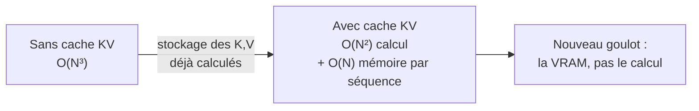
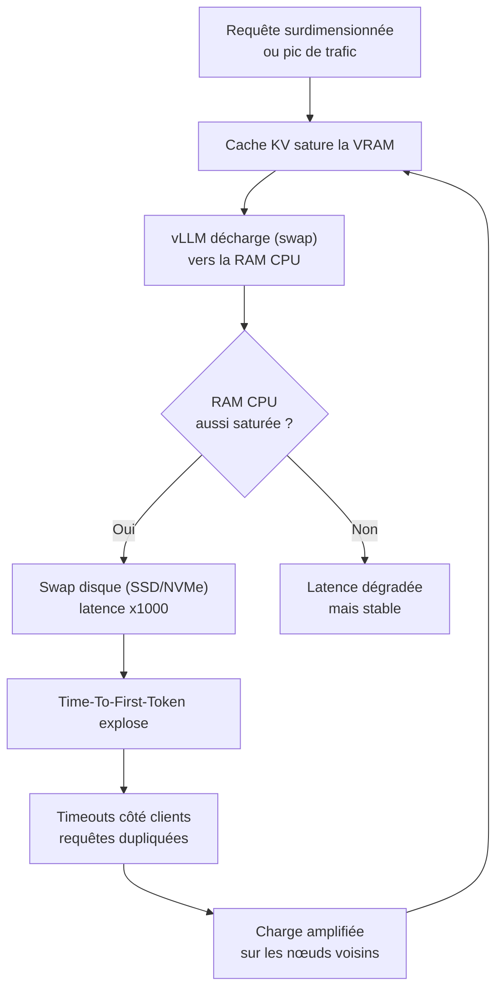
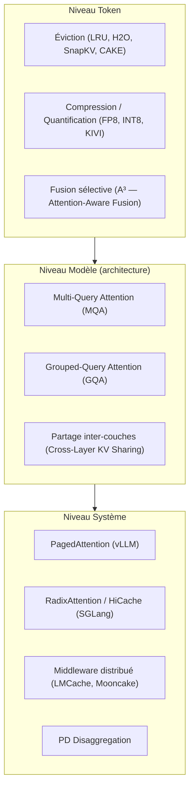
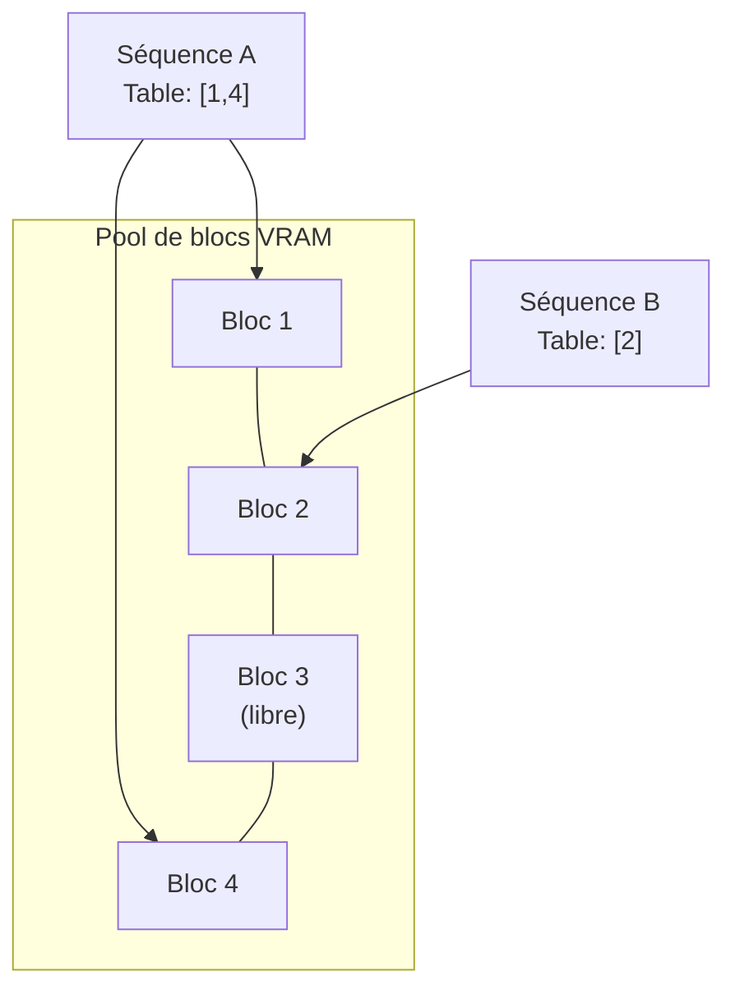
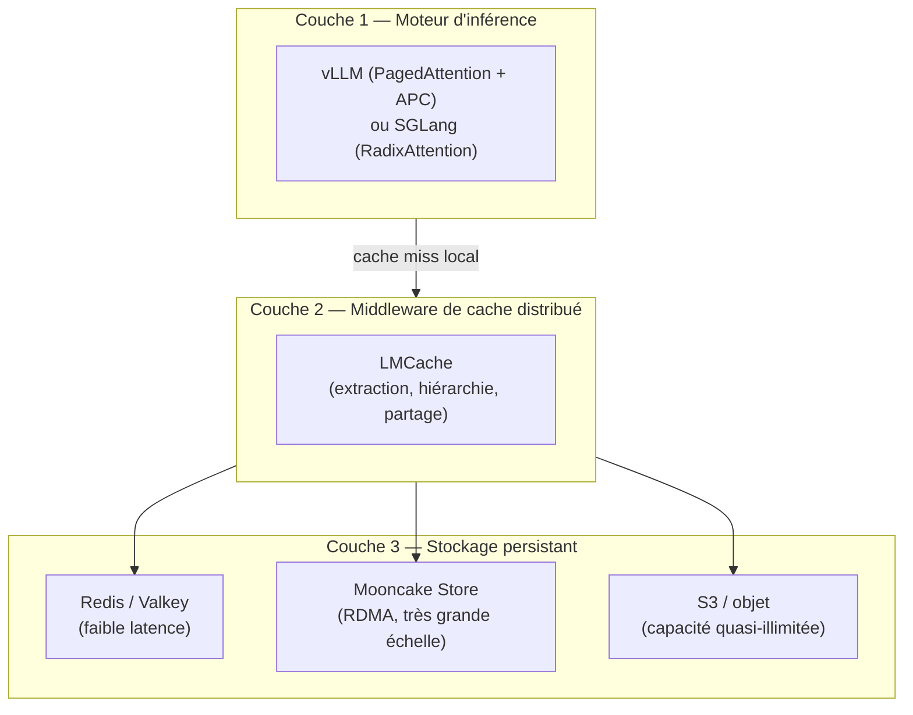
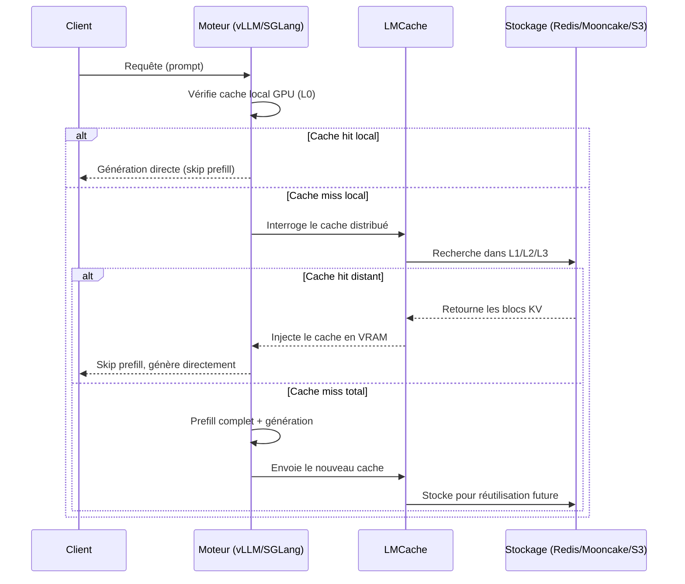
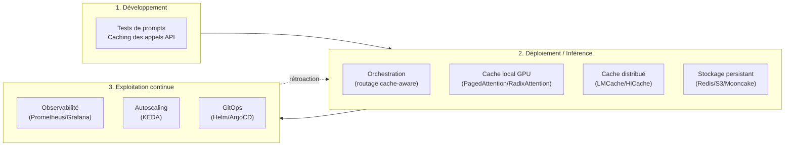
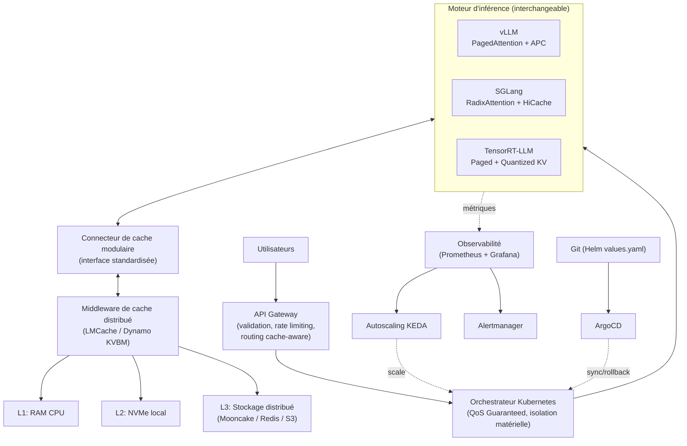
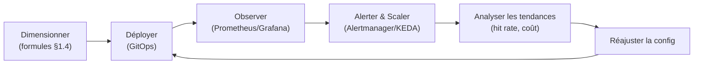

# La Bible du Cache KV — Fondements Mathématiques, Outils, Architecture et Stratégie à l'Échelle

> Document de référence complet : comment fonctionne le cache KV, pourquoi il est mathématiquement obligatoire, quels problèmes il crée, comment le gérer efficacement avec les meilleurs outils du marché (open-source et propriétaires), comment le combiner dans une architecture modulaire, et comment le manager dans la durée pour des millions d'utilisateurs.

---

## Table des matières

1. [Fondements mathématiques : pourquoi le cache est obligatoire](#partie-1)
2. [Les problèmes que le cache crée](#partie-2)
3. [La philosophie moderne de gestion du cache](#partie-3)
4. [Panorama complet des outils du marché](#partie-4)
5. [Gestion du cache par format de modèle](#partie-5)
6. [Les meilleures combinaisons d'outils](#partie-6)
7. [Position du cache dans une pipeline MLOps](#partie-7)
8. [Comment les grands acteurs gèrent leur cache](#partie-8)
9. [L'impact financier et le ROI](#partie-9)
10. [Gérer le cache pour des millions d'utilisateurs](#partie-10)
11. [Architecture modulaire et flexible recommandée](#partie-11)
12. [Manager le cache dans la durée](#partie-12)
13. [Checklist finale et glossaire](#partie-13)

---

## 1. Fondements mathématiques : pourquoi le cache est obligatoire

### 1.1 Le mécanisme d'attention

Un LLM basé sur l'architecture Transformer génère du texte de manière **autorégressive** : un token à la fois, chaque nouveau token dépendant statistiquement de tous ceux qui le précèdent. Ce lien se calcule via le **mécanisme d'auto-attention (self-attention)**.

Pour chaque token, le modèle projette son embedding en trois vecteurs, via des matrices de poids apprises $W_Q$, $W_K$, $W_V$ :

$$Q_i = x_i W_Q \quad K_i = x_i W_K \quad V_i = x_i W_V$$

L'attention pour un token de requête $t$ vis-à-vis de l'ensemble des tokens $1..t$ s'écrit :

$$\text{Attention}(Q_t, K_{1:t}, V_{1:t}) = \text{softmax}\left(\frac{Q_t \cdot K_{1:t}^T}{\sqrt{d_k}}\right) \cdot V_{1:t}$$

où $d_k$ est la dimension d'une tête d'attention (le facteur $\sqrt{d_k}$ stabilise numériquement le softmax).

**Point clé** : pour calculer l'attention du token $t$, il faut les vecteurs $K$ et $V$ de **tous** les tokens précédents. Or ces vecteurs sont **strictement identiques** d'une étape à l'autre — ils ne dépendent que du token qui les a générés, jamais du token qu'on est en train de prédire.

### 1.2 La preuve par la complexité algorithmique

**Sans cache**, à chaque nouvelle étape $t$, le modèle doit recalculer $K$ et $V$ pour les $t$ tokens de la séquence, puis effectuer le produit matriciel d'attention sur ces $t$ tokens — un coût de $O(t^2)$ par étape (produit $Q \times K^T$ plus pondération par $V$). En sommant sur toute une séquence de longueur $N$ :

$$\sum_{t=1}^{N} O(t^2) = O(N^3)$$

**Exemple concret** : générer 10 000 tokens sans cache demanderait, au vu de cette explosion cubique, des heures voire des jours de calcul redondant sur un GPU moderne — un temps totalement disqualifiant pour un produit interactif.

**Avec le cache KV**, à l'étape $t$, seuls $Q_t$, $K_t$, $V_t$ (le token courant) sont calculés. $K_{1:t-1}$ et $V_{1:t-1}$ sont lus directement en mémoire. Le coût de l'étape $t$ redevient $O(t)$ (un produit vecteur × matrice), et le coût total sur une séquence de longueur $N$ devient :

$$\sum_{t=1}^{N} O(t) = O(N^2)$$

*(Ce $O(N^2)$ restant correspond au coût incompressible de l'attention elle-même — chaque token doit, une fois dans sa vie, être comparé à tous ceux qui le précèdent. Le cache élimine la répétition de ce calcul, pas le calcul en lui-même.)*

| Sans cache | Avec cache KV |
|---|---|
| Complexité totale $O(N^3)$ | Complexité totale $O(N^2)$ |
| $K$, $V$ recalculés à chaque étape | $K$, $V$ calculés **une seule fois**, réutilisés |
| Génération de 10k tokens : ordre de grandeur d'heures/jours | Génération de 10k tokens : quelques secondes |
| Mathématiquement **impraticable** en production | **Seule implémentation viable** de l'attention séquentielle |

### 1.3 Pourquoi il est *mathématiquement impossible* de contourner le cache

Il n'existe **aucune identité algébrique** permettant de déduire $K_i$ et $V_i$ à partir des poids du modèle seuls, sans repasser le token $i$ dans le réseau. Ce sont des **valeurs numériques dépendantes des données** ($x_i W_K$, $x_i W_V$), pas des constantes structurelles. La seule alternative au stockage est donc la répétition intégrale du calcul — d'où : le cache n'est pas une optimisation facultative, c'est **la condition mathématique de possibilité** de l'inférence autorégressive à grande échelle.

### 1.4 La taille du cache — formule et exemple chiffré

La taille mémoire du cache KV, pour un batch donné, se calcule ainsi :

$$\text{Taille}_{\text{cache}} = 2 \times B \times L \times n_{kv} \times d_h \times S \times p$$

où :
- $2$ : un tenseur pour K, un pour V
- $B$ : taille du batch (nombre de séquences traitées en parallèle)
- $L$ : nombre de couches (layers) du Transformer
- $n_{kv}$ : nombre de têtes Key-Value (peut être réduit via MQA/GQA — voir §3)
- $d_h$ : dimension d'une tête d'attention
- $S$ : longueur de la séquence (contexte)
- $p$ : précision en octets (2 pour FP16, 1 pour INT8/FP8)

**Exemple concret** — Llama-3-70B (via des configurations GQA typiques : $L = 80$, $n_{kv} = 8$, $d_h = 128$), en FP16 ($p = 2$), pour une seule séquence ($B=1$) de 128 000 tokens :

$$2 \times 1 \times 80 \times 8 \times 128 \times 128\,000 \times 2 \approx 42~\text{Go}$$

Ce seul cache, pour une seule requête, **dépasse la VRAM d'un GPU grand public entier** et rivalise avec la taille des poids du modèle lui-même (~140 Go en FP16 pour 70B de paramètres). C'est ce chiffre qui explique pourquoi la gestion du cache est devenue un problème d'ingénierie à part entière.

---

## 2. Les problèmes que le cache crée

Résoudre le problème du calcul a fait naître un problème tout aussi structurant : **la mémoire**. Quatre problèmes concrets en découlent.

### 2.1 La croissance linéaire incontrôlée

Le cache grossit à chaque token généré, pour chaque séquence active, et personne ne connaît la longueur finale de la réponse à l'avance. Un système qui alloue "au pire cas" (longueur maximale du modèle) gaspille énormément de VRAM sur des séquences qui se terminent bien avant.

### 2.2 La fragmentation mémoire

Avant les techniques modernes (PagedAttention), la VRAM était allouée en blocs **contigus** de taille maximale par séquence. Comme les séquences ont des longueurs différentes et se terminent à des moments différents, cela crée une fragmentation externe (trous inutilisables entre blocs) et interne (marge réservée mais jamais utilisée) : **60 à 80 % de la VRAM allouée au cache pouvait être gaspillée**.

### 2.3 La redondance inter-requêtes

Si 1 000 utilisateurs envoient un prompt partageant le même préfixe (même prompt système, même document RAG), un système naïf recalcule ce préfixe 1 000 fois. C'est un gaspillage de calcul *et* de mémoire — le même contenu K/V est stocké en 1 000 exemplaires distincts au lieu d'un seul partagé.

### 2.4 L'effet cascade en production

En environnement réel, ces problèmes s'enchaînent :

Ce cercle vicieux — un crash OOM en cascade — est le scénario que toute architecture de production doit prévenir explicitement (voir Partie 11).

### 2.5 Nouveau problème né du volume : le coût économique

À l'échelle de millions de requêtes, la VRAM (la mémoire la plus chère du data center) devient le facteur limitant du coût d'infrastructure — pas le calcul brut. Chaque octet de cache gaspillé se traduit directement en GPU supplémentaires nécessaires, donc en coût d'exploitation (voir Partie 9).

---

## 3. La philosophie moderne de gestion du cache

Le changement de paradigme central : le cache KV n'est plus un **tampon temporaire jetable**, mais un **objet mémoire de premier ordre** — une donnée qu'on gère, qu'on partage, qu'on persiste, au même titre que n'importe quelle donnée applicative critique.

### 3.1 Les trois piliers

1. **Le cache est un goulot d'étranglement systémique** — pas le calcul. Sa gestion est un problème d'ingénierie système à part entière, pas un détail d'implémentation du moteur d'inférence.
2. **"Écrire intelligemment" plutôt que "tout écrire"** — toutes les paires K/V ne se valent pas ; certaines méritent d'être conservées longtemps (préfixes partagés, prompts systèmes), d'autres peuvent être évincées rapidement.
3. **Optimiser à tous les niveaux** — token, architecture du modèle, et système d'exploitation/orchestration.

### 3.2 Les trois niveaux d'optimisation

**Niveau token** — décider *quoi* garder :
- **Éviction** : LRU (Least Recently Used) reste la politique de base ; des méthodes plus fines comme **H2O**, **SnapKV** ou **CAKE** (Cascading and Adaptive KV cache Eviction) évaluent l'importance de chaque paire K/V pour ne garder que les tokens critiques.
- **Compression / quantification** : réduire la précision numérique (FP16 → FP8/INT8), avec des méthodes dédiées comme **KIVI**.
- **Fusion** : des algorithmes comme **A³** pré-fusionnent le cache de segments de texte selon leur pertinence.
- **Admission prédictive** : l'approche la plus récente (**Write-Gated KV / WG-KV**) décide *avant même d'écrire* si un token mérite le cache global ou seulement un cache local temporaire — gains rapportés de 46 à 57 % de mémoire économisée et 1,9 à 3,4x d'accélération sur des modèles Llama.

**Niveau modèle** — réduire *structurellement* la taille du cache :
- **Multi-Query Attention (MQA)** : toutes les têtes de requête partagent une seule tête K/V → cache divisé par $n_{heads}$.
- **Grouped-Query Attention (GQA)** : compromis intermédiaire, des groupes de têtes de requête partagent une tête K/V (utilisé par Llama 3, Mistral, etc.).
- **Cross-Layer KV Sharing** : réutiliser les mêmes K/V entre plusieurs couches du réseau.

**Niveau système** — gérer *physiquement* la mémoire (détaillé en Partie 4).

---

## 4. Panorama complet des outils du marché

### 4.1 vLLM — PagedAttention (la fondation)

**Mécanisme** : le cache KV est découpé en blocs de taille fixe (souvent 16 tokens, jusqu'à 64 selon la configuration), stockés en mémoire **non contiguë** — exactement comme la pagination mémoire d'un système d'exploitation. Chaque séquence référence ses blocs via une table de pages.

- **Automatic Prefix Caching (APC)** : chaque bloc est identifié par un hash du contenu + du préfixe, dans une table de hachage globale — les blocs identiques entre requêtes sont partagés automatiquement.
- **Politique d'éviction** : LRU.
- **Résultat mesuré** : le gaspillage mémoire tombe de 60-80 % à **moins de 4 %**, pour un débit jusqu'à 4x supérieur.
- **Limite** : le cache reste borné à la VRAM d'une seule instance — pas de persistance, pas de partage inter-nœuds nativement.
- **Quantification native** : vLLM supporte le cache KV en FP8 (`fp8_e4m3`, `fp8_e5m2`), avec calibration par tenseur ou par tête d'attention via `llm-compressor`, ce qui divise l'empreinte mémoire par deux avec une perte de qualité minime.

### 4.2 SGLang — RadixAttention et HiCache

**RadixAttention** organise le cache dans un **arbre radix** : chaque nœud représente le cache K/V d'un segment de tokens consécutifs ; un chemin racine → feuille représente le préfixe complet d'une requête. Les préfixes partagés entre requêtes réutilisent naturellement les mêmes nœuds.

**HiCache** étend RadixAttention avec une hiérarchie à trois niveaux inspirée du cache CPU moderne, via une structure appelée **HiRadixTree** qui référence où se trouve chaque segment de cache, quel que soit son niveau de stockage :

| Niveau | Support physique | Rôle |
|---|---|---|
| **L1** | Mémoire GPU | Cache actif, le plus rapide |
| **L2** | Mémoire hôte (CPU RAM) | Cache tiède, capacité étendue |
| **L3** | Stockage distribué (Mooncake, 3FS, NIXL, AIBrix KVCache) | Cache froid, persistant, partagé cluster-wide |

**Résultats mesurés** publiés par l'équipe SGLang/LMSYS : sur un scénario d'agent de code avec des dialogues dépassant 25K tokens, l'intégration de HiCache avec un backend 3FS a fait chuter le TTFT moyen de 56 %, doublé le débit d'inférence, et fait passer le taux de cache hit de 40 % à 80 %In a coding agent scenario using Qwen3-Coder-480B, the observed dialogues often stretched past 25K tokens around 8 turns per session. Without full KV cache retention, nearly every request required costly re-computation. By integrating SGLang HiCache with DeepSeek 3FS KVStore for large-scale historical KV caching, the session's average TTFT dropped by 56%, inference throughput doubled, and the cache hit rate jumped from 40% to 80%. Sur DeepSeek-R1-671B en déploiement PD-disaggregated, les cache hits ont réduit le TTFT de 84 % en moyenneIn our evaluation, we tested the DeepSeek-R1-671B model under PD-disaggregated deployment using in-house online requests sampled from a general QA scenario. On average, cache hits achieved an 84% reduction in TTFT compared to full re-computation, et globalement HiCache a atteint jusqu'à 6x de gain de débit et jusqu'à 80 % de réduction du TTFTIn our measurements, HiCache achieved up to 6× throughput improvement and up to 80% reduction in TTFT, closely mirroring the results reported by the community.

### 4.3 LMCache — le middleware de cache universel

LMCache s'est imposé comme la référence open-source pour transformer le cache KV en **donnée persistante et partageable**, indépendamment du moteur d'inférenceLMCache is a KV cache management layer for LLM inference. It turns KV cache from a temporary state into reusable AI-native knowledge that can be stored persistently, reused across multiple serving engines, monitored with an observability stack, and transformed for better generation quality.

**Architecture** : LMCache fonctionne comme un **processus démon indépendant** du moteur d'inférence — une panne du moteur n'entraîne pas la perte du cache (pas de "fate-sharing")Engine-independent deployment: LMCache, as a standalone daemon process, manages KV cache independently from the inference engine process, so that KV cache will not be lost even if the inference engine crashes.

**Backends de stockage pluggables** : LMCache s'interface avec une grande variété de backends via une interface unifiée : RAM CPU, disque local (SSD), Redis/Valkey, Mooncake, InfiniStore, stockage compatible S3, NIXL, GDSLMCache supports storage backends including CPU RAM, local disk (SSD), Redis/Valkey, Mooncake, InfiniStore, S3-compatible object storage, NIXL, and GDS.

**Fonctionnalités avancées** :
- **Non-prefix KV reuse** : réutilisation du cache au-delà du simple préfixe, via **CacheBlend**, qui recalcule sélectivement seulement les tokens nécessaires pour préserver la qualitéNon-prefix KV reuse: Extend KV reuse beyond prefix caching by reusing cached KV blocks at any position in the prompt. This leverages CacheBlend to selectively recompute tokens for quality recovery.
- **PD disaggregation** : transfert du cache entre workers de prefill et de decode via NVLink, RDMA ou TCP (via NIXL)PD disaggregation and KV transfer: Support KV cache transfer from prefill workers to decode workers over NVLink, RDMA, or TCP through transport layers such as NIXL.
- **Observabilité de production** : métriques Kubernetes standard, métriques spécifiques au cache (hit rate par requête/par token, cycle de vie), métriques de gestion par utilisateurProduction-level KV cache observability: LMCache provides a rich set of KV cache observability metrics, including typical Kubernetes metrics (health monitoring, performance diagnostics), KV-cache-specific metrics (request-level and token-level prefix cache hits, lifecycle, request-level KV cache performance), management metrics (user-specific usage).
- **Architecture multiprocessus (MP)**, sortie en avril 2026, permettant de faire tourner LMCache comme un service partagé entre plusieurs moteurs.

**Résultats mesurés** : jusqu'à **15x d'amélioration du débit** combiné à vLLM sur des workloads de question-réponse multi-tours et d'analyse de documentsOur evaluation shows that combining LMCACHE with vLLM achieves up to 15x improvement in throughput across workloads such as multi-round question answering and document analysis. Une étude de cas chiffrée sur un cluster 4×H100 montre une réduction de 69 % du coût de prefill pour 1 000 requêtes partageant un contexte système de 128K tokens, avec un TTFT ramené de 11 secondes à 1,5 seconde à 80 % de taux de hitOn a Llama 3.1 70B chatbot at 128K system prompt, this cuts TTFT from 11s to 1.5s and allows the GPU to handle 15x more decode requests per second instead of re-computing the same prefill. LMCache a atteint sa maturité de production en janvier 2026 et est désormais utilisé par Google Cloud GKE Inference, CoreWeave et CohereLMCache graduated to production in January 2026 and is now used by Google Cloud GKE Inference, CoreWeave, and Cohere, et a rejoint la PyTorch Foundation à l'automne 2025.

**Architecture de tiers typique** (documentée par la communauté) :

| Tier | Support | Latence | Capacité |
|---|---|---|---|
| Tier 0 | GPU HBM | sub-milliseconde | limitée à la VRAM (80 Go sur H100 SXM5) |
| Tier 1 | CPU DRAM | ~5 µs | 256-512 Go par nœud |
| Tier 2 | NVMe local | 100-500 µs | 2-4 To |
| Tier 3 | Stockage distant (Redis, S3, Mooncake) | réseau | quasi-illimité |

### 4.4 NVIDIA Dynamo KVBM (KV Block Manager)

Développé par NVIDIA, il **sépare la gestion mémoire des moteurs d'inférence** (vLLM, TensorRT-LLM) pour offrir une hiérarchie GPU ↔ CPU ↔ Disque avec transferts asynchrones optimisés. Dynamo s'intègre nativement avec vLLM et LMCacheBy integrating with popular inference engines like vLLM and open-source tools like LMCache, NVIDIA Dynamo simplifies KV Cache management, enabling efficient cache reuse and reduced recomputation. Des partenaires de stockage haute performance (Vast, WEKA) ont démontré des débits de 35 Go/s vers un seul GPU H100 via le plugin GPU Direct Storage (GDS), confirmant que le stockage n'est pas le goulot d'étranglementUsing the GPU Direct Storage (GDS) plugin in Dynamo, Vast achieved 35 GB/s throughput to a single NVIDIA H100 GPU, demonstrating full GPU saturation and confirming that storage was not a performance bottleneck.

### 4.5 Mooncake — l'architecture centrée sur le KVCache

Mooncake est la plateforme de service développée par Moonshot AI pour Kimi. Sa philosophie est radicale : au lieu de traiter le cache comme un sous-produit de l'inférence, **tout le système est organisé autour de lui**It features a KVCache-centric disaggregated architecture that separates the prefill and decoding clusters. It also leverages the underutilized CPU, DRAM, and SSD resources of the GPU cluster to implement a disaggregated cache of KVCache.

- **Séparation prefill/decode** : les deux phases tournent sur des clusters distincts.
- **Mooncake Store** : pool de cache distribué mutualisant CPU, DRAM, SSD et RDMA de l'ensemble du cluster GPU.
- **Conductor** : le scheduler central qui route chaque requête en fonction de la localisation actuelle du cache et de la chargeConductor is responsible for dispatching requests based on the current distribution of the KVCache and workloads. It also replicates or swaps certain blocks of the KVCache if it is beneficial for future inference.
- **Rejet précoce prédictif** : en cas de surcharge, Mooncake rejette intelligemment certaines requêtes en amont plutôt que de dégrader tout le cluster.

**Résultats mesurés** : jusqu'à **525 % d'augmentation de débit** dans certains scénarios simulés respectant les SLOExperiments show that Mooncake excels in long-context scenarios. Compared to the baseline method, Mooncake can achieve up to a 525% increase in throughput in certain simulated scenarios while adhering to SLOs, et en production, une augmentation de la capacité effective de traitement de **59 % à 498 %** selon les traces réellesIn tests using real traces, Mooncake increases the effective request capacity by 59% ∼ 498% when compared to baseline methods, all while complying with SLOs. Currently, Mooncake is operational across thousands of nodes, processing over 100 billion tokens daily. Le système tourne aujourd'hui sur des milliers de nœuds et traite plus de 100 milliards de tokens par jour.

### 4.6 Autres outils spécialisés notables

| Outil | Spécialisation | Point différenciant |
|---|---|---|
| **Unified Cache Manager (UCM)** | Cache "sparse" pour contextes très longs | Séparation compute/storage, réduction de latence 3-10x sur dialogues multi-tours |
| **WombatKV** | Cache sur stockage objet (S3) | Persistance extrême, cache adressable par contenu, survit aux redémarrages |
| **llm-d KV-Cache Manager** | Routage conscient du cache | Vue temps réel de la localisation du cache sur un cluster vLLM pour router intelligemment |
| **PiKV** | Cache pour architectures Mixture-of-Experts (MoE) | Cache distribué en parallèle, compression adaptée au routage MoE |
| **EdgeSync-LLM** | Inférence en périphérie (edge, Android) | Agnostique du moteur (llama.cpp, MLC-LLM), cache de fragments légers |
| **InfiniGen / H2O** | Recherche académique sur l'éviction | Déchargement de tenseurs, éviction de tokens par score d'importance |
| **Redis / Valkey** | Backend de stockage générique | Utilisé comme couche L2/L3 par LMCache et d'autres, faible latence (5-15 ms) |
| **Memcached** | Backend de stockage générique | Alternative plus simple à Redis pour du cache généraliste |

### 4.7 Tableau de synthèse — quand choisir quoi

| Besoin dominant | Outil recommandé |
|---|---|
| Éliminer la fragmentation mémoire GPU sur une seule instance | **vLLM (PagedAttention)** |
| Contextes très longs, dialogues multi-tours, cache hiérarchique intégré au moteur | **SGLang (HiCache)** |
| Persistance et partage inter-instances/inter-moteurs, indépendance vis-à-vis du moteur | **LMCache** |
| Écosystème NVIDIA complet avec transferts GPUDirect Storage | **NVIDIA Dynamo KVBM** |
| Cluster à très grande échelle, séparation stricte prefill/decode | **Mooncake** |
| Cache adressable, persistant sur objet, partage inter-équipes | **WombatKV** |
| Routage optimal dans un cluster vLLM multi-pods | **llm-d KV-Cache Manager** |
| Modèles Mixture-of-Experts | **PiKV** |
| Inférence sur device/edge | **EdgeSync-LLM** |

---

## 5. Gestion du cache par format de modèle

Il faut distinguer clairement deux objets : le **format du modèle** (comment les poids sont stockés, une fois pour toutes) et le **cache KV** (un objet dynamique créé à chaque inférence). Le format des poids ne détermine pas directement la gestion du cache — c'est le **moteur d'inférence** qui l'implémente. Mais chaque écosystème a ses spécificités.

### 5.1 SafeTensors — le conteneur de persistance

SafeTensors ne gère pas le cache activement ; il sert de **format de sérialisation sûr** pour le persister sur disque :

1. **Quantification** : le cache FP16 est réduit à 4 bits (Q4) pour diviser sa taille par 4.
2. **Sérialisation** : écriture dans un fichier `.safetensors` avec métadonnées (forme, type).
3. **Restauration** : au redémarrage, le moteur lit, déquantifie, et réinjecte directement dans la couche d'attention — **sans repasser par un pré-remplissage complet**.

Impact mesuré : réduction du TTFT pouvant atteindre un facteur **136x** pour un modèle Gemma 3 12B lors de la restauration d'un cache persisté.

### 5.2 ONNX — le défi du graphe statique

ONNX représente le modèle comme un graphe d'opérations **statique**, alors que le cache KV est **dynamique** (sa taille change à chaque token). Solutions employées :

- **Double export** : un graphe pour le *prefill* (sans cache), un graphe pour le *decode* (avec `past_key_values` en entrée et `present_key_values` en sortie).
- **`past_present_share_buffer`** : optimisation d'ONNX Runtime qui fait pointer les buffers "passé" et "présent" vers le même bloc mémoire, évitant les copies inutiles.
- **API haut niveau** : ONNX Runtime GenAI (`generate()`) gère le cache en interne automatiquement.

### 5.3 GGUF — l'optimisation pour l'inférence locale

Format de prédilection de llama.cpp et Ollama. Le cache est géré **entièrement par le moteur**, indépendamment du format de poids (qui gère lui sa propre quantification : Q4_K_M, Q8_0, etc.). Pour un modèle 7B avec un contexte de 4K tokens, le cache KV nécessite environ 2 Go supplémentaires, alloués en CPU ou GPU selon la configuration.

### 5.4 TensorRT-LLM / TensorRT Engine — l'optimisation matérielle poussée

Le format d'entrée est un moteur `.engine` compilé, optimisé pour une architecture GPU précise. Fonctionnalités de cache avancées natives :
- **Paged KV Cache** (blocs de taille fixe, allocation dynamique)
- **KV Cache Reuse** (partage de préfixe)
- **Quantification FP8** du cache
- **Offloading** vers la mémoire hôte en cas de saturation GPU
- Contrôle fin via `free_gpu_memory_fraction`

### 5.5 Synthèse

| Format | Rôle | Gestion du cache KV |
|---|---|---|
| SafeTensors | Persistance sûre des tenseurs | Conteneur de sauvegarde/restauration du cache sur disque |
| ONNX | Interopérabilité | Nécessite export dual + gestion explicite des buffers |
| GGUF | Inférence locale (CPU) | Déléguée entièrement au moteur (llama.cpp) |
| TensorRT Engine | Performance GPU NVIDIA | Pagination, quantification et partage natifs, très avancés |

En pratique, un projet mature combine ces formats : **SafeTensors** pour persister le cache, **ONNX** pour l'interopérabilité multi-plateforme, **TensorRT-LLM** ou **vLLM** pour l'inférence haute performance en production.

---

## 6. Les meilleures combinaisons d'outils

Aucun outil ne couvre seul tous les besoins. La bonne pratique consiste à **empiler des couches complémentaires**.

### 6.1 La combinaison de référence : moteur + middleware + stockage

**Flux type d'une requête** :

### 6.2 Pourquoi cette combinaison fonctionne

- **vLLM/SGLang** résolvent la fragmentation et l'usage GPU local — mais leur cache est un "silo" borné à une instance.
- **LMCache** (ou Mooncake/HiCache) brise ce silo : le cache devient partageable entre requêtes, entre instances, et persistant entre redémarrages.
- **Le stockage** (Redis pour la vitesse, Mooncake pour l'échelle RDMA, S3 pour la capacité/le coût) fournit la capacité que la VRAM ne peut jamais offrir.

### 6.3 Autres combinaisons notables

- **SGLang + HiCache + Mooncake Store** : combinaison native recommandée par l'équipe SGLang pour les contextes ultra-longs et le déploiement PD-disaggregatedMooncake serves as a high-performance L3 storage backend for SGLang HiCache, enabling distributed KV cache storage across multiple servers with RDMA-accelerated data transfer.
- **vLLM + NVIDIA Dynamo + LMCache** : combinaison optimale sur infrastructure NVIDIA complète, avec transferts GPUDirect Storage.
- **TensorRT-LLM + LMCache (connecteur MP)** : LMCache expose désormais un adaptateur natif pour TensorRT-LLM, permettant de partager le même cache entre vLLM et TensorRT-LLM au sein d'un même cluster hétérogène.

### 6.4 Principe de modularité

Le principe directeur pour une architecture **flexible et pérenne** : découpler strictement le moteur d'inférence du middleware de cache, via une interface de connecteur standardisée (comme le fait LMCache avec son "modular KV cache connector"a modular KV cache connector component, decoupling LMCACHE from the rapid evolution of inference engines). Cela permet de changer de moteur d'inférence (vLLM → SGLang → TensorRT-LLM) sans perdre l'investissement fait dans la couche de cache distribué.

---

## 7. Position du cache dans une pipeline MLOps

- **Phase développement** : itération sur les prompts, avec un caching léger côté API pour accélérer les tests et limiter les coûts.
- **Phase déploiement** : le cœur du système — orchestration, cache local, cache distribué, stockage, exactement comme décrit dans les Parties 4 et 6.
- **Phase d'exploitation continue** : observabilité, autoscaling, déploiement GitOps — c'est ce qui transforme une architecture de cache correcte en un **système géré dans la durée** (voir Partie 12).

Le cache n'est donc jamais une "brique isolée" : c'est une couche transversale qui traverse tout le cycle de vie MLOps, du prompt engineering jusqu'au rollback en production.

---

## 8. Comment les grands acteurs gèrent leur cache

Les principaux fournisseurs d'API appliquent tous une forme de **prompt caching** — l'application, côté client de leur API, de la même philosophie que le cache KV interne.

| Fournisseur | Mécanisme | Conditions | Réduction de coût |
|---|---|---|---|
| **OpenAI** | Automatique | Prompts ≥ 1024 tokens, réutilisation par tranches de 128 tokens | Jusqu'à 90 % sur les tokens d'entrée |
| **Anthropic** | Manuel (`cache_control`) | Blocs à marquer explicitement, TTL de 5 min ou 1 heure | Jusqu'à 90 % sur les tokens en cache |
| **Google (Gemini)** | Explicite + implicite | Explicite = cache persistant créé à la demande ; implicite = automatique sur modèles récents | Jusqu'à 75 % |
| **DeepSeek** | Automatique, sur disque | Cache automatique pour les préfixes de prompts | Réduction d'un ordre de grandeur |

**Recommandation pratique pour vos applications** :
- Structurez systématiquement vos prompts avec les éléments **statiques et volumineux en premier** (instructions système, contexte RAG, schémas d'outils), et les éléments **variables en dernier** (question spécifique de l'utilisateur).
- Utilisez les mécanismes natifs des fournisseurs (`cache_control` pour Anthropic, structuration pour OpenAI/DeepSeek) plutôt que de réinventer une couche de cache applicative.

---

## 9. L'impact financier et le ROI

### 9.1 Le principe économique fondamental

L'objectif stratégique : **briser l'équation coût = utilisateurs × requêtes**. Sans cache, chaque requête coûte le plein tarif du calcul. Avec un cache bien géré, le coût dépend de la **nouveauté** de la requête, pas de son volume brut.

### 9.2 Chiffres de référence

- Les tokens en cache sont facturés jusqu'à **10x moins cher** que les tokens standards chez les principaux fournisseurs d'API.
- Une architecture combinant vLLM + LMCache correctement configurée peut réduire les coûts d'infrastructure GPU de **60 à 90 %** sur des charges à fort taux de réutilisation (RAG, chatbots avec prompt système long, agents multi-tours).
- Étude de cas chiffrée : pour un document "chaud" de 3 774 tokens servi à 80 millions d'agents, le coût de recalcul intégral s'élèverait à environ 1,5 million de dollars, contre environ 0,03 million en réutilisant le cache — un facteur de réduction de **49,7x**.
- Sur un cluster 4×H100 SXM5 en spot ($5,72/h), un scénario de 1 000 requêtes à 128K tokens de contexte partagé passe de $17,47 sans cache à environ $5,44 avec 80 % de hit rate — soit **69 % d'économie sur le seul poste prefill**Without LMCache, 1,000 requests with a 128K-token system prompt each cost roughly: 1,000 × 11s × $0.001588/cluster-second = $17.47 in prefill compute · With LMCache at 80% cache hit rate (800 hits at 1.5s, 200 cold at 11s): 200 × 11s + 800 × 1.5s = 2,200 + 1,200 = 3,400 cluster-seconds.

### 9.3 Le calcul du ROI

$$\text{ROI} = \frac{\text{Coût GPU économisé (calcul redondant évité)} - \text{Coût du stockage additionnel (RAM/SSD/S3)}}{\text{Coût du stockage additionnel}}$$

Le stockage (RAM, SSD, objet) est systématiquement un ordre de grandeur moins cher que la VRAM GPU. Le ROI devient donc quasi automatiquement positif dès que le **taux de cache hit** dépasse un seuil relativement bas (de l'ordre de 20-30 % selon la configuration matérielle) — au-delà, chaque point de hit rate supplémentaire est un gain quasi pur.

### 9.4 Facteurs qui déterminent la rentabilité

1. **Le taux de réutilisation du cache (hit rate)** — le levier le plus puissant, directement lié à la structuration des prompts (statique en premier, variable en dernier).
2. **La bande passante réseau** vers le stockage distant — en dessous d'un certain débit, charger depuis un cache distant peut devenir plus lent que recalculer ; LMCache documente un point de croisement autour de contextes de 256K tokens sur des liens à 32 GbpsWhen the network bandwidth is low (i.e., 32 Gbps), LMCACHE's KV cache loading outperforms naive prefilling only when the input context length exceeds 256K tokens. In contrast, when the bandwidth is higher (i.e., 64 or 128 Gbps), LMCACHE's loading consistently achieves lower delay than naive prefilling across all context lengths.
3. **La politique de troncature de contexte** — attention : tronquer le contexte pour économiser du calcul peut, paradoxalement, réduire le taux de hit du cache de préfixe de moitiécontext truncation, which is a widely applied technique in industry, can greatly reduce prefix cache hit ratio by half. Un arbitrage explicite est nécessaire entre les deux optimisations.

---

## 10. Gérer le cache pour des millions d'utilisateurs

### 10.1 Les deux leviers structurants

1. **Maximiser le cache hit** : structurer systématiquement les prompts (statique → variable), activer le prefix caching partout, et router les requêtes similaires vers les mêmes pods (sticky routing par affinité).
2. **Hiérarchiser le cache** : ne jamais tout garder en VRAM. Répartir sur plusieurs niveaux selon la fréquence d'accès.

### 10.2 Architecture de cache à grande échelle

| Niveau | Support | Latence typique | Rôle à l'échelle |
|---|---|---|---|
| L0 | VRAM GPU | sub-ms | Requêtes très fréquentes, session active |
| L1 | RAM CPU | ~5 µs | Requêtes récentes, capacité 5-10x supérieure à la VRAM |
| L2 | NVMe local | 100-500 µs | Historique de session, contenus tièdes |
| L3 | Stockage distribué (Redis/Mooncake/S3) | 5-15 ms (Redis) à quelques dizaines de ms (S3) | Persistance long terme, partage cluster-wide, capacité quasi-illimitée |

### 10.3 Routage conscient du cache (cache-aware routing)

À l'échelle de millions de requêtes, le routage devient un problème critique : envoyer une requête vers un pod qui ne possède pas le cache pertinent annule le bénéfice de toute la hiérarchie. Des outils comme **llm-d KV-Cache Manager** maintiennent une vue quasi temps-réel de la localisation du cache sur l'ensemble du cluster pour orienter chaque requête vers le pod optimal.

### 10.4 Le rejet prédictif sous charge

Mooncake introduit un principe précieux à cette échelle : plutôt que d'accepter toute requête et de dégrader tout le cluster en cas de surcharge, un **rejet précoce basé sur une prédiction de charge** protège le système — il vaut mieux refuser proprement 5 % des requêtes que dégrader la latence de 100 % d'entre elles.

### 10.5 Checklist "millions d'utilisateurs"

- [ ] Prefix caching activé sur 100 % des pods (vLLM APC ou SGLang RadixAttention)
- [ ] Middleware de cache distribué déployé (LMCache ou HiCache+Mooncake)
- [ ] Routage cache-aware en place (sticky routing minimal, ou solution dédiée type llm-d)
- [ ] Hiérarchie de stockage complète (GPU → CPU → NVMe → distant) configurée et dimensionnée
- [ ] Politique de rejet précoce / load shedding sous surcharge
- [ ] Monitoring du hit rate en continu, avec alerte si le hit rate chute sous un seuil cible
- [ ] Tests de charge réguliers reproduisant le trafic réel (proportion de préfixes partagés, longueur de contexte)

---

## 11. Architecture modulaire et flexible recommandée

L'architecture ci-dessous synthétise l'ensemble du document en une pile complète, pensée pour être **modulaire** (chaque couche remplaçable indépendamment) et **flexible** (adaptable d'un déploiement mono-GPU à un cluster multi-milliers de nœuds).

### 11.1 Pourquoi cette architecture est modulaire

- Le **moteur d'inférence** est interchangeable grâce au connecteur de cache standardisé — migrer de vLLM à SGLang ou TensorRT-LLM ne casse pas la couche de cache distribué.
- Le **middleware de cache** (LMCache ou Dynamo KVBM) est lui-même découplé du backend de stockage — on peut passer de Redis à Mooncake sans réécrire la logique applicative.
- L'**observabilité et l'autoscaling** sont branchés sur des métriques standardisées (Prometheus), indépendantes du moteur choisi.

### 11.2 Pourquoi elle est flexible

- Un déploiement mono-GPU peut n'utiliser que la couche `ENGINE` (PagedAttention seul suffit déjà à réduire le gaspillage à moins de 4 %).
- Un déploiement multi-nœuds ajoute progressivement `CONNECTOR` + `MW` + les tiers de stockage, sans réécrire la couche `ENGINE`.
- Un déploiement à très grande échelle (des milliers de nœuds) active la disaggregation prefill/decode et un stockage RDMA type Mooncake Store, en gardant la même architecture logique.

---

## 12. Manager le cache dans la durée

Gérer le cache n'est pas un projet ponctuel mais une **discipline opérationnelle continue**. Quatre dimensions à maintenir dans le temps :

### 12.1 Observabilité continue

Surveiller en permanence : `gpu_cache_usage_perc`, `num_requests_waiting`, le taux de cache hit par niveau (L0/L1/L2/L3), et le TTFT. Un cache qui fonctionnait bien à 100 requêtes/s peut se dégrader silencieusement à 10 000 requêtes/s si le hit rate chute sans alerte associée.

### 12.2 Réévaluation périodique du dimensionnement

À mesure que le trafic et les modèles évoluent (contextes plus longs, nouveaux modèles GQA vs MHA), les paramètres de dimensionnement (`gpu-memory-utilization`, taille des tiers L1/L2/L3) doivent être réévalués — idéalement trimestriellement, ou après tout changement significatif de modèle ou de charge.

### 12.3 Gouvernance des changements (GitOps)

Toute modification de configuration de cache doit passer par Git + ArgoCD, jamais en modification manuelle sur un nœud de production. Cela garantit un historique complet, une capacité de rollback immédiate, et la reproductibilité des tests de charge en amont.

### 12.4 Tests de charge récurrents

Le comportement du cache dépend fortement du matériel sous-jacent (architecture GPU, bande passante NVLink/RDMA) et du profil de trafic réel (proportion de préfixes partagés, longueur moyenne de contexte). Des tests de charge périodiques — pas seulement au lancement — permettent de détecter une dérive avant qu'elle n'impacte les utilisateurs.

### 12.5 Cycle de vie complet

---

## 13. Checklist finale et glossaire

### 13.1 Checklist de gestion complète du cache KV

- [ ] Le mécanisme mathématique du cache est compris par l'équipe (§1) — sert de base à tout arbitrage technique
- [ ] Les paramètres du moteur d'inférence sont calibrés en mode défensif (`gpu-memory-utilization` 0.85-0.90, `max-model-len` plafonné au besoin réel)
- [ ] Le prefix caching est activé (APC vLLM ou RadixAttention SGLang)
- [ ] Un middleware de cache distribué est déployé si le cluster dépasse une poignée de nœuds (LMCache, Dynamo KVBM, ou Mooncake selon l'échelle)
- [ ] La hiérarchie de stockage (GPU → CPU → NVMe → distant) est dimensionnée selon les formules de la Partie 1
- [ ] Le routage est cache-aware (sticky routing minimal, ou solution dédiée à grande échelle)
- [ ] L'observabilité couvre le hit rate à chaque niveau, pas seulement la VRAM
- [ ] L'autoscaling réagit aux métriques de cache (`num_requests_waiting`, `gpu_cache_usage_perc`), pas au CPU/RAM classique
- [ ] La configuration est versionnée et déployée en GitOps, avec rollback testé
- [ ] Un calcul de ROI est documenté (taux de hit vs coût de stockage additionnel)
- [ ] Des tests de charge périodiques valident le comportement réel sous trafic représentatif

### 13.2 Glossaire

| Terme | Définition |
|---|---|
| **KV Cache** | Structure mémoire stockant les vecteurs Key et Value déjà calculés pour éviter leur recalcul |
| **PagedAttention** | Technique de vLLM qui pagine le cache KV en blocs non contigus, façon mémoire virtuelle d'un OS |
| **RadixAttention** | Technique de SGLang organisant le cache dans un arbre radix pour un partage de préfixe optimal |
| **Prefix Caching / APC** | Réutilisation automatique du cache pour les tokens partagés entre requêtes |
| **TTFT** | Time To First Token — délai avant le premier token généré, très sensible au cache |
| **PD Disaggregation** | Séparation physique des phases prefill (calcul intensif) et decode (mémoire intensive) sur des nœuds différents |
| **GQA / MQA** | Grouped/Multi-Query Attention — réductions architecturales de la taille du cache par partage de têtes |
| **Cache hit / miss** | Succès ou échec de la recherche d'un segment de cache déjà calculé |
| **Load shedding** | Rejet volontaire de requêtes (HTTP 429) pour protéger la stabilité du système sous charge |
| **QoS Guaranteed** | Classe de qualité de service Kubernetes où requests = limits, protégeant le pod de l'éviction |

---

*Document de synthèse — combine les fondements mathématiques de l'attention Transformer, l'état de l'art des outils open-source de gestion du cache KV (vLLM, SGLang, LMCache, Mooncake, NVIDIA Dynamo, et l'écosystème élargi), les pratiques de production Kubernetes/GitOps, et l'analyse financière du ROI — pour concevoir et manager un système de cache KV modulaire, flexible et économiquement optimisé, du prototype à l'échelle de millions d'utilisateurs.*