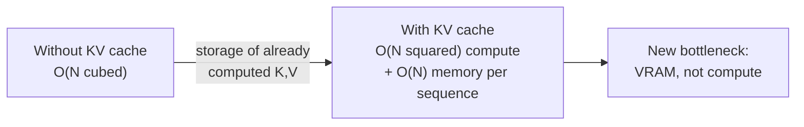
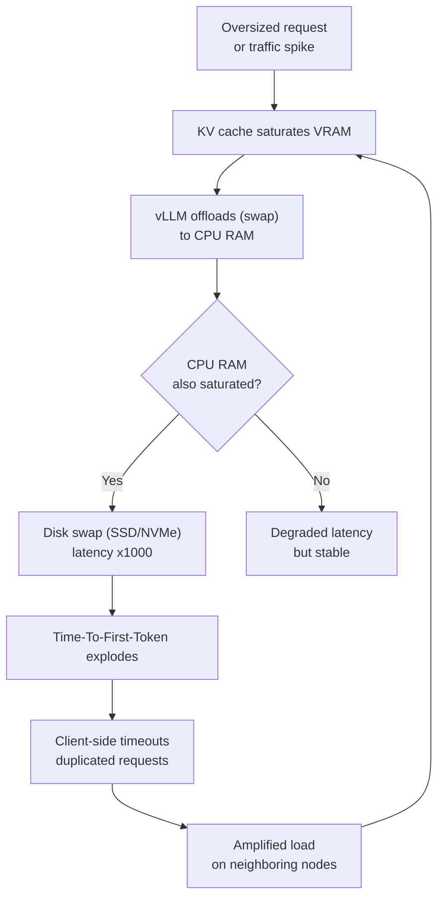
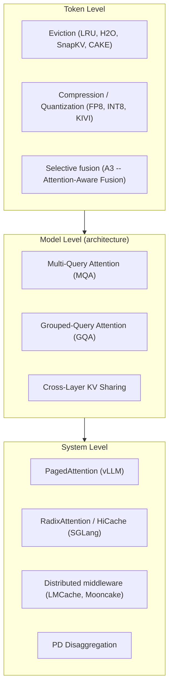
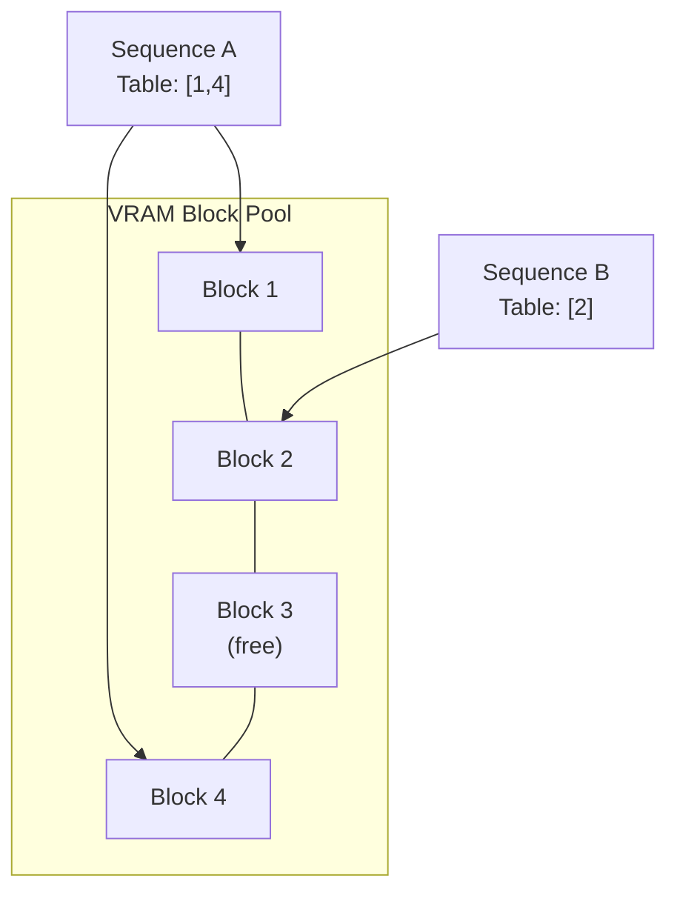
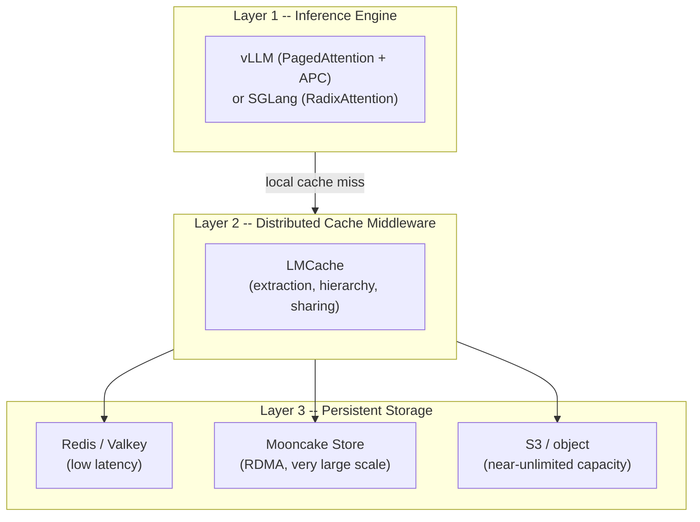
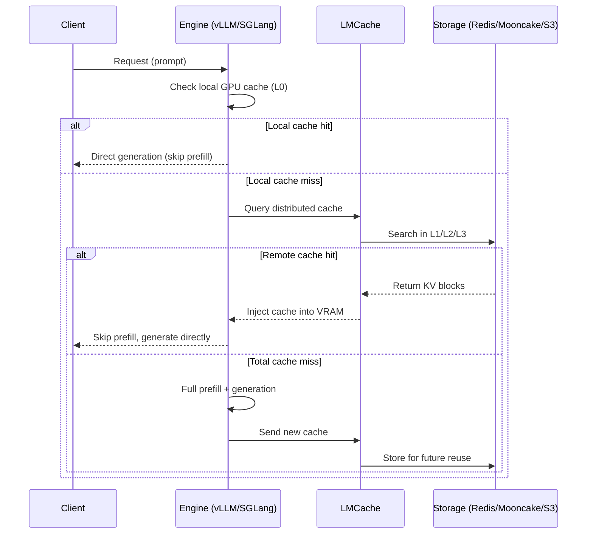
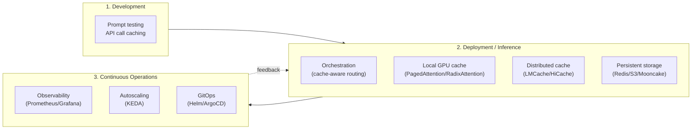
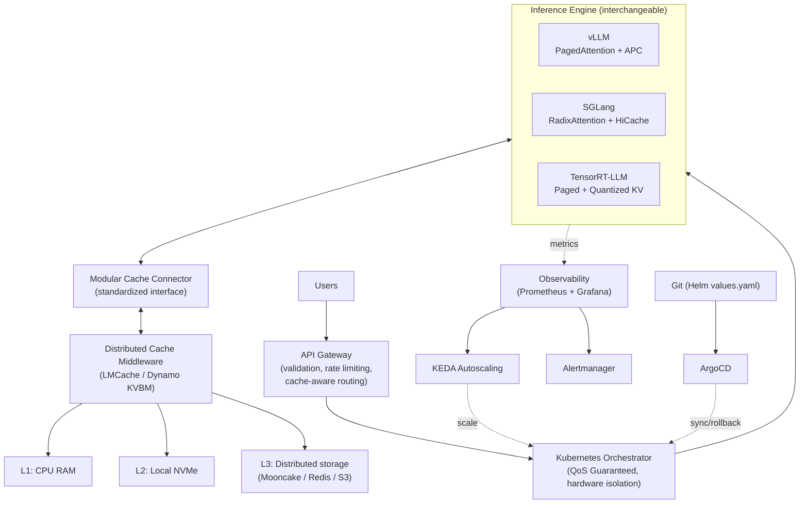
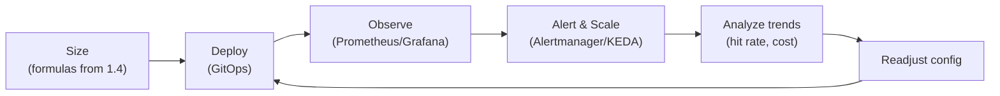

# The KV Cache Bible — Mathematical Foundations, Tools, Architecture, and Strategy at Scale

> Complete reference document: how the KV cache works, why it is mathematically mandatory, what problems it creates, how to manage it effectively with the best tools on the market (open-source and proprietary), how to combine them in a modular architecture, and how to manage it over time for millions of users.

---

## Table of Contents

1. [Mathematical foundations: why the cache is mandatory](#part-1)
2. [The problems the cache creates](#part-2)
3. [The modern cache management philosophy](#part-3)
4. [Comprehensive panorama of market tools](#part-4)
5. [Cache management by model format](#part-5)
6. [The best tool combinations](#part-6)
7. [Position of the cache in an MLOps pipeline](#part-7)
8. [How major players manage their cache](#part-8)
9. [Financial impact and ROI](#part-9)
10. [Managing cache for millions of users](#part-10)
11. [Recommended modular and flexible architecture](#part-11)
12. [Managing cache over time](#part-12)
13. [Final checklist and glossary](#part-13)

---

## 1. Mathematical Foundations: Why the Cache Is Mandatory

### 1.1 The Attention Mechanism

A Transformer-based LLM generates text in an **autoregressive** manner: one token at a time, each new token depending statistically on all those that precede it. This link is computed via the **self-attention mechanism**.

For each token, the model projects its embedding into three vectors, via learned weight matrices $W_Q$, $W_K$, $W_V$:

$$Q_i = x_i W_Q \quad K_i = x_i W_K \quad V_i = x_i W_V$$

The attention for a query token $t$ with respect to the set of tokens $1..t$ is written:

$$\text{Attention}(Q_t, K_{1:t}, V_{1:t}) = \text{softmax}\left(\frac{Q_t \cdot K_{1:t}^T}{\sqrt{d_k}}\right) \cdot V_{1:t}$$

where $d_k$ is the dimension of an attention head (the $\sqrt{d_k}$ factor numerically stabilizes the softmax).

**Key point**: to compute the attention of token $t$, the $K$ and $V$ vectors of **all** previous tokens are needed. Yet these vectors are **strictly identical** from one step to the next — they depend only on the token that generated them, never on the token being predicted.

### 1.2 The Proof by Algorithmic Complexity

**Without cache**, at each new step $t$, the model must recompute $K$ and $V$ for the $t$ tokens of the sequence, then perform the attention matrix product over these $t$ tokens — a cost of $O(t^2)$ per step (product $Q \times K^T$ plus weighting by $V$). Summing over an entire sequence of length $N$:

$$\sum_{t=1}^{N} O(t^2) = O(N^3)$$

**Concrete example**: generating 10,000 tokens without cache would require, given this cubic explosion, hours or even days of redundant computation on a modern GPU — a time totally disqualifying for an interactive product.

**With the KV cache**, at step $t$, only $Q_t$, $K_t$, $V_t$ (the current token) are computed. $K_{1:t-1}$ and $V_{1:t-1}$ are read directly from memory. The cost of step $t$ returns to $O(t)$ (a vector x matrix product), and the total cost over a sequence of length $N$ becomes:

$$\sum_{t=1}^{N} O(t) = O(N^2)$$

*(This remaining $O(N^2)$ corresponds to the incompressible cost of attention itself — each token must, once in its lifetime, be compared to all those that precede it. The cache eliminates the repetition of this computation, not the computation itself.)*

| Without cache | With KV cache |
|---|---|
| Total complexity $O(N^3)$ | Total complexity $O(N^2)$ |
| $K$, $V$ recomputed at each step | $K$, $V$ computed **once**, reused |
| Generating 10k tokens: order of magnitude hours/days | Generating 10k tokens: a few seconds |
| Mathematically **impractical** in production | **Only viable implementation** of sequential attention |

### 1.3 Why It Is *Mathematically Impossible* to Bypass the Cache

There exists **no algebraic identity** that allows deducing $K_i$ and $V_i$ from the model weights alone, without passing token $i$ through the network. They are **data-dependent numerical values** ($x_i W_K$, $x_i W_V$), not structural constants. The only alternative to storage is therefore full repetition of the computation — hence: the cache is not an optional optimization, it is **the mathematical condition of possibility** for large-scale autoregressive inference.

### 1.4 Cache Size — Formula and Quantified Example

The memory size of the KV cache, for a given batch, is calculated as follows:

$$\text{Cache Size} = 2 \times B \times L \times n_{kv} \times d_h \times S \times p$$

where:
- $2$: one tensor for K, one for V
- $B$: batch size (number of sequences processed in parallel)
- $L$: number of Transformer layers
- $n_{kv}$: number of Key-Value heads (can be reduced via MQA/GQA — see Part 3)
- $d_h$: dimension of an attention head
- $S$: sequence length (context)
- $p$: precision in bytes (2 for FP16, 1 for INT8/FP8)

**Concrete example** — Llama-3-70B (via typical GQA configurations: $L = 80$, $n_{kv} = 8$, $d_h = 128$), in FP16 ($p = 2$), for a single sequence ($B=1$) of 128,000 tokens:

$$2 \times 1 \times 80 \times 8 \times 128 \times 128\,000 \times 2 \approx 42~\text{GB}$$

This single cache, for a single request, **exceeds the VRAM of an entire consumer GPU** and rivals the size of the model weights themselves (~140 GB in FP16 for 70B parameters). It is this figure that explains why cache management has become an engineering problem in its own right.

---

## 2. The Problems the Cache Creates

Solving the computation problem gave birth to an equally structuring problem: **memory**. Four concrete problems result.

### 2.1 Uncontrolled Linear Growth

The cache grows at each generated token, for each active sequence, and no one knows the final response length in advance. A system that allocates "for the worst case" (maximum model length) wastes enormous amounts of VRAM on sequences that end well before.

### 2.2 Memory Fragmentation

Before modern techniques (PagedAttention), VRAM was allocated in **contiguous** blocks of maximum size per sequence. Since sequences have different lengths and end at different times, this creates external fragmentation (unusable holes between blocks) and internal fragmentation (reserved but never used margin): **60 to 80% of the VRAM allocated to the cache could be wasted**.

### 2.3 Inter-Request Redundancy

If 1,000 users send a prompt sharing the same prefix (same system prompt, same RAG document), a naive system recomputes this prefix 1,000 times. This is a waste of computation *and* memory — the same K/V content is stored in 1,000 distinct copies instead of a single shared one.

### 2.4 The Cascade Effect in Production

In a real environment, these problems chain together:

This vicious circle — a cascading OOM crash — is the scenario that any production architecture must explicitly prevent (see Part 11).

### 2.5 New Problem Born of Volume: Economic Cost

At the scale of millions of requests, VRAM (the most expensive memory in the data center) becomes the limiting factor of infrastructure cost — not raw computation. Every byte of wasted cache translates directly into additional GPUs needed, and therefore into operational cost (see Part 9).

---

## 3. The Modern Cache Management Philosophy

The central paradigm shift: the KV cache is no longer a **disposable temporary buffer**, but a **first-class memory object** — data that is managed, shared, and persisted, just like any critical application data.

### 3.1 The Three Pillars

1. **The cache is a systemic bottleneck** — not computation. Its management is an engineering problem in its own right, not an implementation detail of the inference engine.
2. **"Write intelligently" rather than "write everything"** — not all K/V pairs are equal; some deserve to be kept long (shared prefixes, system prompts), others can be evicted quickly.
3. **Optimize at all levels** — token, model architecture, and operating system/orchestration.

### 3.2 The Three Optimization Levels

**Token level** — deciding *what* to keep:
- **Eviction**: LRU (Least Recently Used) remains the baseline policy; finer methods like **H2O**, **SnapKV**, or **CAKE** (Cascading and Adaptive KV cache Eviction) evaluate the importance of each K/V pair to keep only critical tokens.
- **Compression / quantization**: reducing numerical precision (FP16 to FP8/INT8), with dedicated methods like **KIVI**.
- **Fusion**: algorithms like **A3** pre-fuse the cache of text segments based on their relevance.
- **Predictive admission**: the most recent approach (**Write-Gated KV / WG-KV**) decides *before even writing* whether a token deserves the global cache or only a temporary local cache — reported gains of 46 to 57% memory saved and 1.9 to 3.4x speedup on Llama models.

**Model level** — *structurally* reducing cache size:
- **Multi-Query Attention (MQA)**: all query heads share a single K/V head -> cache divided by $n_{heads}$.
- **Grouped-Query Attention (GQA)**: intermediate compromise, groups of query heads share a K/V head (used by Llama 3, Mistral, etc.).
- **Cross-Layer KV Sharing**: reusing the same K/V across multiple network layers.

**System level** — *physically* managing memory (detailed in Part 4).

---

## 4. Comprehensive Panorama of Market Tools

### 4.1 vLLM — PagedAttention (The Foundation)

**Mechanism**: the KV cache is divided into fixed-size blocks (often 16 tokens, up to 64 depending on configuration), stored in **non-contiguous** memory — exactly like an operating system's paged memory. Each sequence references its blocks via a page table.

- **Automatic Prefix Caching (APC)**: each block is identified by a hash of content + prefix, in a global hash table — identical blocks across requests are shared automatically.
- **Eviction policy**: LRU.
- **Measured result**: memory waste drops from 60-80% to **less than 4%**, for throughput up to 4x higher.
- **Limitation**: the cache remains bounded to a single instance's VRAM — no persistence, no cross-node sharing natively.
- **Native quantization**: vLLM supports FP8 KV cache (`fp8_e4m3`, `fp8_e5m2`), with per-tensor or per-attention-head calibration via `llm-compressor`, halving the memory footprint with minimal quality loss.

### 4.2 SGLang — RadixAttention and HiCache

**RadixAttention** organizes the cache in a **radix tree**: each node represents the K/V cache of a segment of consecutive tokens; a root-to-leaf path represents the complete prefix of a request. Prefixes shared between requests naturally reuse the same nodes.

**HiCache** extends RadixAttention with a three-level hierarchy inspired by modern CPU caches, via a structure called **HiRadixTree** that references where each cache segment is located, regardless of its storage level:

| Level | Physical medium | Role |
|---|---|---|
| **L1** | GPU memory | Active cache, fastest |
| **L2** | Host memory (CPU RAM) | Warm cache, extended capacity |
| **L3** | Distributed storage (Mooncake, 3FS, NIXL, AIBrix KVCache) | Cold cache, persistent, cluster-wide sharing |

**Measured results** published by the SGLang/LMSYS team: in a coding agent scenario with dialogues exceeding 25K tokens, integrating HiCache with a 3FS backend reduced average TTFT by 56%, doubled inference throughput, and increased the cache hit rate from 40% to 80%. On DeepSeek-R1-671B in PD-disaggregated deployment, cache hits reduced TTFT by 84% on average. Overall, HiCache achieved up to 6x throughput improvement and up to 80% reduction in TTFT.

### 4.3 LMCache — The Universal Cache Middleware

LMCache has established itself as the open-source reference for transforming the KV cache into **persistent and shareable data**, independent of the inference engine.

**Architecture**: LMCache runs as an **independent daemon process** from the inference engine — an engine crash does not cause cache loss (no "fate-sharing").

**Pluggable storage backends**: LMCache interfaces with a wide variety of backends via a unified interface: CPU RAM, local disk (SSD), Redis/Valkey, Mooncake, InfiniStore, S3-compatible storage, NIXL, GDS.

**Advanced features**:
- **Non-prefix KV reuse**: cache reuse beyond simple prefix matching, via **CacheBlend**, which selectively recomputes only the necessary tokens to preserve quality.
- **PD disaggregation**: cache transfer between prefill and decode workers via NVLink, RDMA, or TCP (via NIXL).
- **Production observability**: standard Kubernetes metrics, cache-specific metrics (hit rate per request/per token, lifecycle), per-user management metrics.
- **Multi-process architecture (MP)**, released in April 2026, allowing LMCache to run as a shared service across multiple engines.

**Measured results**: up to **15x throughput improvement** combined with vLLM on multi-turn question-answering and document analysis workloads. A quantified case study on a 4xH100 cluster shows a 69% reduction in prefill cost for 1,000 requests sharing a 128K-token system prompt, with TTFT reduced from 11 seconds to 1.5 seconds at 80% hit rate. LMCache reached production maturity in January 2026 and is now used by Google Cloud GKE Inference, CoreWeave, and Cohere, and joined the PyTorch Foundation in fall 2025.

**Typical tiered architecture** (documented by the community):

| Tier | Medium | Latency | Capacity |
|---|---|---|---|
| Tier 0 | GPU HBM | sub-millisecond | limited to VRAM (80 GB on H100 SXM5) |
| Tier 1 | CPU DRAM | ~5 us | 256-512 GB per node |
| Tier 2 | Local NVMe | 100-500 us | 2-4 TB |
| Tier 3 | Remote storage (Redis, S3, Mooncake) | network | near-unlimited |

### 4.4 NVIDIA Dynamo KVBM (KV Block Manager)

Developed by NVIDIA, it **separates memory management from inference engines** (vLLM, TensorRT-LLM) to offer a GPU to CPU to disk hierarchy with optimized asynchronous transfers. Dynamo integrates natively with vLLM and LMCache. High-performance storage partners (Vast, WEKA) have demonstrated 35 GB/s throughput to a single H100 GPU via the GPU Direct Storage (GDS) plugin, confirming that storage is not the bottleneck.

### 4.5 Mooncake — The KVCache-Centric Architecture

Mooncake is the serving platform developed by Moonshot AI for Kimi. Its philosophy is radical: instead of treating the cache as a byproduct of inference, **the entire system is organized around it**.

- **Prefill/decode separation**: the two phases run on distinct clusters.
- **Mooncake Store**: a distributed cache pool mutualizing CPU, DRAM, SSD, and RDMA across the entire GPU cluster.
- **Conductor**: the central scheduler that routes each request based on current cache location and load.
- **Predictive early rejection**: under overload, Mooncake intelligently rejects certain requests upstream rather than degrading the entire cluster.

**Measured results**: up to **525% throughput increase** in certain simulated scenarios adhering to SLOs. In production, an increase in effective processing capacity of **59% to 498%** depending on real traces. The system now runs on thousands of nodes and processes more than 100 billion tokens per day.

### 4.6 Other Notable Specialized Tools

| Tool | Specialization | Differentiating point |
|---|---|---|
| **Unified Cache Manager (UCM)** | "Sparse" cache for very long contexts | Compute/storage separation, 3-10x latency reduction on multi-turn dialogues |
| **WombatKV** | Cache on object storage (S3) | Extreme persistence, content-addressable cache, survives restarts |
| **llm-d KV-Cache Manager** | Cache-aware routing | Real-time view of cache location on a vLLM cluster for intelligent routing |
| **PiKV** | Cache for Mixture-of-Experts (MoE) architectures | Distributed cache in parallel, compression adapted to MoE routing |
| **EdgeSync-LLM** | Edge inference (Android) | Engine-agnostic (llama.cpp, MLC-LLM), lightweight fragment cache |
| **InfiniGen / H2O** | Academic research on eviction | Tensor offloading, token eviction by importance score |
| **Redis / Valkey** | Generic storage backend | Used as L2/L3 layer by LMCache and others, low latency (5-15 ms) |
| **Memcached** | Generic storage backend | Simpler alternative to Redis for general-purpose caching |

### 4.7 Summary Table — When to Choose What

| Dominant need | Recommended tool |
|---|---|
| Eliminate GPU memory fragmentation on a single instance | **vLLM (PagedAttention)** |
| Very long contexts, multi-turn dialogues, hierarchical cache integrated into the engine | **SGLang (HiCache)** |
| Persistence and cross-instance/cross-engine sharing, engine independence | **LMCache** |
| Complete NVIDIA ecosystem with GPUDirect Storage transfers | **NVIDIA Dynamo KVBM** |
| Very large-scale cluster, strict prefill/decode separation | **Mooncake** |
| Addressable, object-persistent cache, cross-team sharing | **WombatKV** |
| Optimal routing in a multi-pod vLLM cluster | **llm-d KV-Cache Manager** |
| Mixture-of-Experts models | **PiKV** |
| On-device/edge inference | **EdgeSync-LLM** |

---

## 5. Cache Management by Model Format

One must clearly distinguish two objects: the **model format** (how weights are stored, once and for all) and the **KV cache** (a dynamic object created at each inference). The weight format does not directly determine cache management — it is the **inference engine** that implements it. But each ecosystem has its specificities.

### 5.1 SafeTensors — The Persistence Container

SafeTensors does not actively manage the cache; it serves as a **safe serialization format** for persisting it to disk:

1. **Quantization**: the FP16 cache is reduced to 4 bits (Q4) to divide its size by 4.
2. **Serialization**: writing to a `.safetensors` file with metadata (shape, type).
3. **Restoration**: on restart, the engine reads, dequantizes, and reinjects directly into the attention layer — **without going through a complete prefill**.

Measured impact: TTFT reduction up to a factor of **136x** for a Gemma 3 12B model when restoring a persisted cache.

### 5.2 ONNX — The Static Graph Challenge

ONNX represents the model as a **static** operations graph, whereas the KV cache is **dynamic** (its size changes at each token). Solutions employed:

- **Dual export**: one graph for *prefill* (without cache), one graph for *decode* (with `past_key_values` as input and `present_key_values` as output).
- **`past_present_share_buffer`**: an ONNX Runtime optimization that makes "past" and "present" buffers point to the same memory block, avoiding unnecessary copies.
- **High-level API**: ONNX Runtime GenAI (`generate()`) manages the cache internally automatically.

### 5.3 GGUF — Optimization for Local Inference

The format of choice for llama.cpp and Ollama. The cache is managed **entirely by the engine**, independently of the weight format (which handles its own quantization: Q4_K_M, Q8_0, etc.). For a 7B model with a 4K-token context, the KV cache requires approximately 2 GB additional, allocated in CPU or GPU depending on configuration.

### 5.4 TensorRT-LLM / TensorRT Engine — Pushed Hardware Optimization

The input format is a compiled `.engine` file, optimized for a specific GPU architecture. Native advanced cache features:
- **Paged KV Cache** (fixed-size blocks, dynamic allocation)
- **KV Cache Reuse** (prefix sharing)
- **FP8 quantization** of the cache
- **Offloading** to host memory in case of GPU saturation
- Fine control via `free_gpu_memory_fraction`

### 5.5 Summary

| Format | Role | KV cache management |
|---|---|---|
| SafeTensors | Safe tensor persistence | Cache save/restore container on disk |
| ONNX | Interoperability | Requires dual export + explicit buffer management |
| GGUF | Local inference (CPU) | Fully delegated to the engine (llama.cpp) |
| TensorRT Engine | NVIDIA GPU performance | Native paging, quantization, and sharing, very advanced |

In practice, a mature project combines these formats: **SafeTensors** to persist the cache, **ONNX** for cross-platform interoperability, **TensorRT-LLM** or **vLLM** for high-performance production inference.

---

## 6. The Best Tool Combinations

No single tool covers all needs. The best practice is to **stack complementary layers**.

### 6.1 The Reference Combination: Engine + Middleware + Storage

**Typical request flow**:

### 6.2 Why This Combination Works

- **vLLM/SGLang** solve fragmentation and local GPU usage — but their cache is a "silo" bounded to a single instance.
- **LMCache** (or Mooncake/HiCache) breaks this silo: the cache becomes shareable across requests, across instances, and persistent across restarts.
- **Storage** (Redis for speed, Mooncake for RDMA scale, S3 for capacity/cost) provides the capacity that VRAM can never offer.

### 6.3 Other Notable Combinations

- **SGLang + HiCache + Mooncake Store**: native combination recommended by the SGLang team for ultra-long contexts and PD-disaggregated deployment.
- **vLLM + NVIDIA Dynamo + LMCache**: optimal combination on full NVIDIA infrastructure, with GPUDirect Storage transfers.
- **TensorRT-LLM + LMCache (MP connector)**: LMCache now exposes a native adapter for TensorRT-LLM, allowing the same cache to be shared between vLLM and TensorRT-LLM within the same heterogeneous cluster.

### 6.4 The Modularity Principle

The guiding principle for a **flexible and durable** architecture: strictly decouple the inference engine from the cache middleware, via a standardized connector interface (as LMCache does with its "modular KV cache connector"). This allows changing the inference engine (vLLM to SGLang to TensorRT-LLM) without losing the investment made in the distributed cache layer.

---

## 7. Position of the Cache in an MLOps Pipeline

- **Development phase**: prompt iteration, with lightweight API-side caching to accelerate tests and limit costs.
- **Deployment phase**: the core of the system — orchestration, local cache, distributed cache, storage, exactly as described in Parts 4 and 6.
- **Continuous operations phase**: observability, autoscaling, GitOps deployment — this is what transforms a correct cache architecture into a **system managed over time** (see Part 12).

The cache is therefore never an "isolated brick": it is a transversal layer that spans the entire MLOps lifecycle, from prompt engineering to production rollback.

---

## 8. How Major Players Manage Their Cache

Major API providers all apply some form of **prompt caching** — the application, on the client side of their API, of the same philosophy as internal KV caching.

| Provider | Mechanism | Conditions | Cost reduction |
|---|---|---|---|
| **OpenAI** | Automatic | Prompts >= 1024 tokens, reuse in 128-token increments | Up to 90% on input tokens |
| **Anthropic** | Manual (`cache_control`) | Blocks to mark explicitly, TTL of 5 min or 1 hour | Up to 90% on cached tokens |
| **Google (Gemini)** | Explicit + implicit | Explicit = persistent cache created on demand; implicit = automatic on recent models | Up to 75% |
| **DeepSeek** | Automatic, on disk | Automatic cache for prompt prefixes | Order-of-magnitude reduction |

**Practical recommendation for your applications**:
- Systematically structure your prompts with **static and voluminous elements first** (system instructions, RAG context, tool schemas), and **variable elements last** (the user's specific question).
- Use providers' native mechanisms (`cache_control` for Anthropic, structuring for OpenAI/DeepSeek) rather than reinventing an application-level cache layer.

---

## 9. Financial Impact and ROI

### 9.1 The Fundamental Economic Principle

The strategic objective: **break the equation cost = users x requests**. Without cache, each request costs the full computation price. With well-managed cache, the cost depends on the **novelty** of the request, not its raw volume.

### 9.2 Reference Figures

- Cached tokens are billed up to **10x cheaper** than standard tokens at major API providers.
- An architecture combining vLLM + LMCache correctly configured can reduce GPU infrastructure costs by **60 to 90%** on workloads with high prefix reuse (RAG, chatbots with long system prompts, multi-turn agents).
- Quantified case study: for a "hot" document of 3,774 tokens served to 80 million agents, the full recomputation cost would be approximately 1.5 million dollars, versus approximately 0.03 million when reusing the cache — a reduction factor of **49.7x**.
- On a 4xH100 SXM5 spot cluster ($5.72/h), a scenario of 1,000 requests at 128K tokens of shared context goes from $17.47 without cache to approximately $5.44 with 80% hit rate — **69% savings on prefill alone**.

### 9.3 ROI Calculation

$$\text{ROI} = \frac{\text{GPU cost saved (avoided redundant computation)} - \text{Additional storage cost (RAM/SSD/S3)}}{\text{Additional storage cost}}$$

Storage (RAM, SSD, object) is systematically an order of magnitude cheaper than GPU VRAM. The ROI therefore becomes quasi-automatically positive as soon as the **cache hit rate** exceeds a relatively low threshold (around 20-30% depending on hardware configuration) — beyond that, each additional hit rate point is near-pure gain.

### 9.4 Factors That Determine Profitability

1. **Cache reuse rate (hit rate)** — the most powerful lever, directly linked to prompt structuring (static first, variable last).
2. **Network bandwidth** to remote storage — below a certain throughput, loading from a remote cache can become slower than recomputing; LMCache documents a crossover point around 256K-token contexts on 32 Gbps links.
3. **Context truncation policy** — attention: truncating context to save computation can, paradoxically, reduce the prefix cache hit rate by half. An explicit trade-off is necessary between the two optimizations.

---

## 10. Managing Cache for Millions of Users

### 10.1 The Two Structuring Levers

1. **Maximize cache hit**: systematically structure prompts (static to variable), activate prefix caching everywhere, and route similar requests to the same pods (sticky routing by affinity).
2. **Hierarchize the cache**: never keep everything in VRAM. Distribute across multiple levels according to access frequency.

### 10.2 Large-Scale Cache Architecture

| Level | Medium | Typical latency | Role at scale |
|---|---|---|---|
| L0 | GPU VRAM | sub-ms | Very frequent requests, active session |
| L1 | CPU RAM | ~5 us | Recent requests, capacity 5-10x greater than VRAM |
| L2 | Local NVMe | 100-500 us | Session history, warm content |
| L3 | Distributed storage (Redis/Mooncake/S3) | 5-15 ms (Redis) to tens of ms (S3) | Long-term persistence, cluster-wide sharing, near-unlimited capacity |

### 10.3 Cache-Aware Routing

At the scale of millions of requests, routing becomes a critical problem: sending a request to a pod that does not hold the relevant cache cancels the benefit of the entire hierarchy. Tools like **llm-d KV-Cache Manager** maintain a near-real-time view of cache location across the entire cluster to direct each request to the optimal pod.

### 10.4 Predictive Rejection Under Load

Mooncake introduces a valuable principle at this scale: rather than accepting every request and degrading the entire cluster under overload, an **early rejection based on load prediction** protects the system — it is better to cleanly refuse 5% of requests than to degrade the latency of 100% of them.

### 10.5 "Millions of Users" Checklist

- [ ] Prefix caching activated on 100% of pods (vLLM APC or SGLang RadixAttention)
- [ ] Distributed cache middleware deployed (LMCache or HiCache+Mooncake)
- [ ] Cache-aware routing in place (minimal sticky routing, or dedicated solution like llm-d)
- [ ] Complete storage hierarchy (GPU to CPU to NVMe to remote) configured and sized
- [ ] Early rejection / load shedding policy under overload
- [ ] Continuous hit rate monitoring, with alert if hit rate drops below a target threshold
- [ ] Regular load tests reproducing real traffic (proportion of shared prefixes, context length)

---

## 11. Recommended Modular and Flexible Architecture

The architecture below synthesizes the entire document into a complete stack, designed to be **modular** (each layer replaceable independently) and **flexible** (adaptable from a single-GPU deployment to a multi-thousand-node cluster).

### 11.1 Why This Architecture Is Modular

- The **inference engine** is interchangeable thanks to the standardized cache connector — migrating from vLLM to SGLang or TensorRT-LLM does not break the distributed cache layer.
- The **cache middleware** (LMCache or Dynamo KVBM) is itself decoupled from the storage backend — one can switch from Redis to Mooncake without rewriting application logic.
- **Observability and autoscaling** are connected to standardized metrics (Prometheus), independent of the chosen engine.

### 11.2 Why It Is Flexible

- A single-GPU deployment can use only the `ENGINE` layer (PagedAttention alone already reduces waste to less than 4%).
- A multi-node deployment progressively adds `CONNECTOR` + `MW` + storage tiers, without rewriting the `ENGINE` layer.
- A very large-scale deployment (thousands of nodes) activates prefill/decode disaggregation and RDMA storage like Mooncake Store, keeping the same logical architecture.

---

## 12. Managing Cache Over Time

Managing the cache is not a one-time project but a **continuous operational discipline**. Four dimensions to maintain over time:

### 12.1 Continuous Observability

Continuously monitor: `gpu_cache_usage_perc`, `num_requests_waiting`, the hit rate per level (L0/L1/L2/L3), and TTFT. A cache that worked well at 100 requests/s can silently degrade at 10,000 requests/s if the hit rate drops without an associated alert.

### 12.2 Periodic Resizing

As traffic and models evolve (longer contexts, new GQA vs MHA models), sizing parameters (`gpu-memory-utilization`, L1/L2/L3 tier sizes) must be reevaluated — ideally quarterly, or after any significant model or load change.

### 12.3 Change Governance (GitOps)

Any cache configuration change must go through Git + ArgoCD, never through manual modification on a production node. This guarantees a complete history, immediate rollback capability, and reproducibility of upstream load tests.

### 12.4 Recurring Load Tests

Cache behavior strongly depends on the underlying hardware (GPU architecture, NVLink/RDMA bandwidth) and the real traffic profile (proportion of shared prefixes, average context length). Periodic load tests — not just at launch — allow detecting drift before it impacts users.

### 12.5 Complete Lifecycle

---

## 13. Final Checklist and Glossary

### 13.1 Complete KV Cache Management Checklist

- [ ] The mathematical mechanism of the cache is understood by the team (Part 1) — serves as the basis for all technical trade-offs
- [ ] Inference engine parameters are calibrated in defensive mode (`gpu-memory-utilization` 0.85-0.90, `max-model-len` capped at actual need)
- [ ] Prefix caching is activated (vLLM APC or SGLang RadixAttention)
- [ ] A distributed cache middleware is deployed if the cluster exceeds a handful of nodes (LMCache, Dynamo KVBM, or Mooncake depending on scale)
- [ ] The storage hierarchy (GPU to CPU to NVMe to remote) is sized according to the formulas in Part 1
- [ ] Routing is cache-aware (minimal sticky routing, or dedicated solution at large scale)
- [ ] Observability covers the hit rate at each level, not just VRAM
- [ ] Autoscaling reacts to cache metrics (`num_requests_waiting`, `gpu_cache_usage_perc`), not to classic CPU/RAM
- [ ] Configuration is versioned and deployed via GitOps, with tested rollback
- [ ] An ROI calculation is documented (hit rate vs additional storage cost)
- [ ] Periodic load tests validate real behavior under representative traffic

### 13.2 Glossary

| Term | Definition |
|---|---|
| **KV Cache** | Memory structure storing already-computed Key and Value vectors to avoid their recomputation |
| **PagedAttention** | vLLM technique that pages the KV cache in non-contiguous blocks, like OS virtual memory |
| **RadixAttention** | SGLang technique organizing the cache in a radix tree for optimal prefix sharing |
| **Prefix Caching / APC** | Automatic cache reuse for tokens shared between requests |
| **TTFT** | Time To First Token — delay before the first generated token, highly sensitive to cache |
| **PD Disaggregation** | Physical separation of prefill (computation-intensive) and decode (memory-intensive) phases on different nodes |
| **GQA / MQA** | Grouped/Multi-Query Attention — architectural reductions of cache size through head sharing |
| **Cache hit / miss** | Success or failure of finding an already-computed cache segment |
| **Load shedding** | Voluntary request rejection (HTTP 429) to protect system stability under load |
| **QoS Guaranteed** | Kubernetes quality of service class where requests = limits, protecting the pod from eviction |

---

*Synthesis document — combines the mathematical foundations of Transformer attention, the state of the art of open-source KV cache management tools (vLLM, SGLang, LMCache, Mooncake, NVIDIA Dynamo, and the broader ecosystem), Kubernetes/GitOps production practices, and financial ROI analysis — to design and manage a modular, flexible, and economically optimized KV cache system, from prototype to millions of users.*