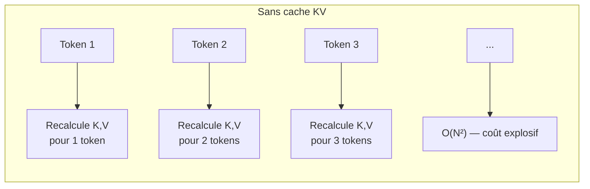
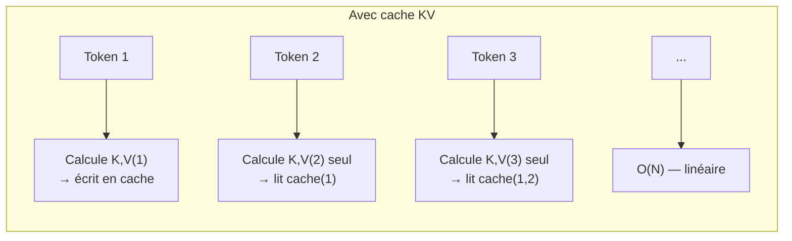
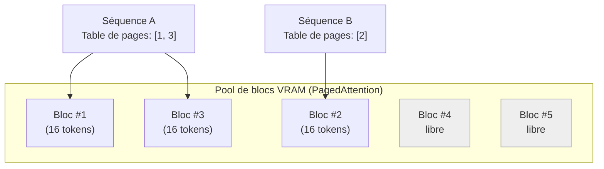
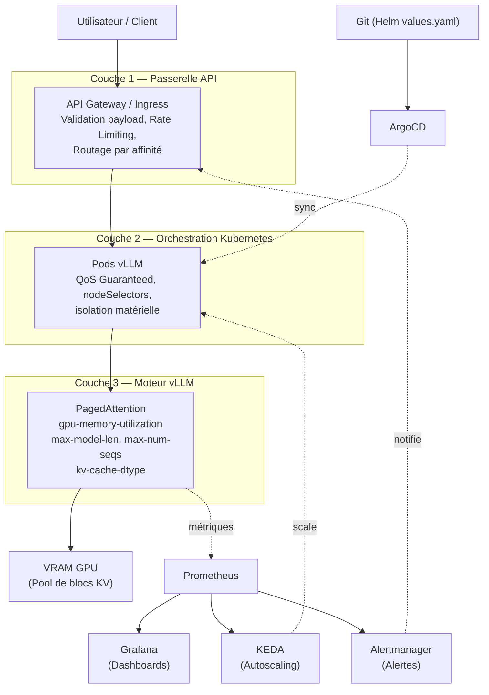
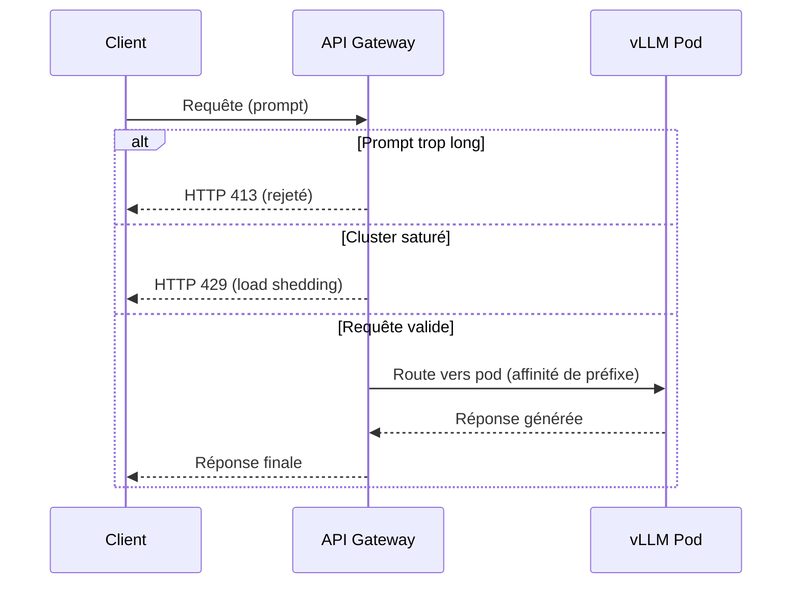
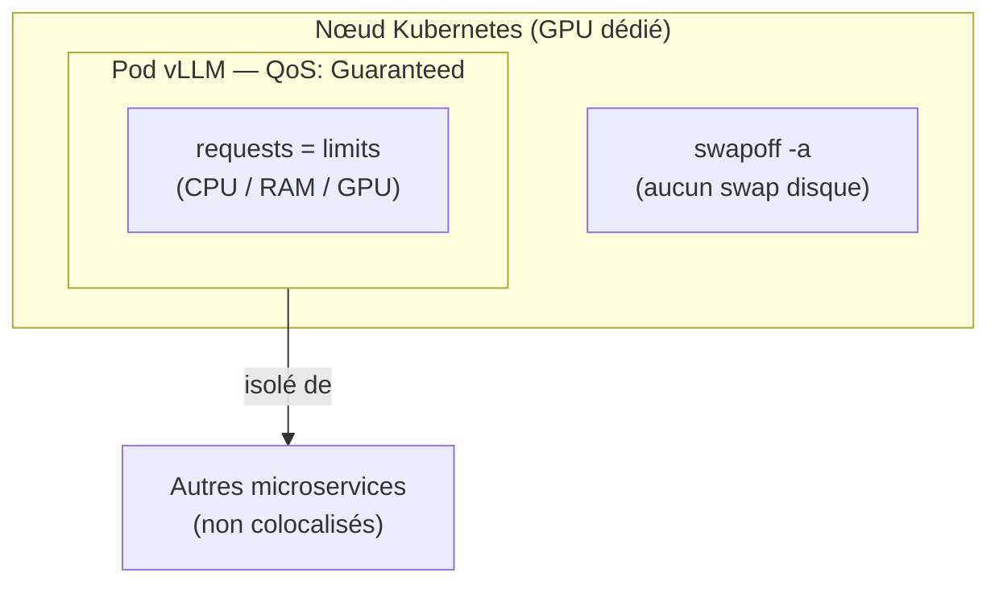
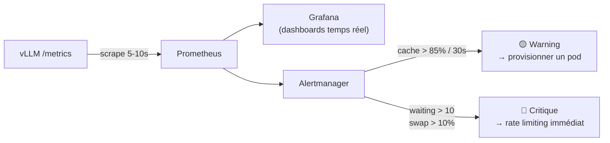
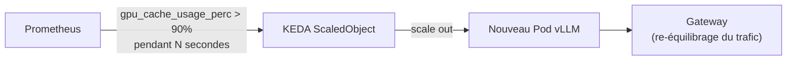
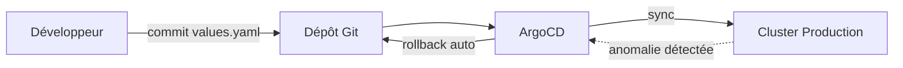

# Guide Complet : Gestion du Cache KV en Production sur Infrastructure IA

> Architecture, fonctionnement interne, précautions défensives et pipeline complet pour le service de modèles de langage à l'échelle (vLLM / Kubernetes)

---

## Table des matières

1. [Fonctionnement fondamental du cache KV](#1-fonctionnement-fondamental-du-cache-kv)
2. [PagedAttention : la solution de vLLM](#2-pagedattention--la-solution-de-vllm)
3. [Anatomie de la pipeline complète](#3-anatomie-de-la-pipeline-complète)
4. [Couche 1 — La passerelle API (Gateway)](#4-couche-1--la-passerelle-api-gateway)
5. [Couche 2 — Le moteur d'inférence (vLLM)](#5-couche-2--le-moteur-dinférence-vllm)
6. [Couche 3 — L'orchestration Kubernetes](#6-couche-3--lorchestration-kubernetes)
7. [Couche 4 — Observabilité et alerting](#7-couche-4--observabilité-et-alerting)
8. [Couche 5 — Autoscaling piloté par métriques](#8-couche-5--autoscaling-piloté-par-métriques)
9. [Couche 6 — GitOps et Infrastructure as Code](#9-couche-6--gitops-et-infrastructure-as-code)
10. [Anticiper les incidents : cartographie des risques](#10-anticiper-les-incidents--cartographie-des-risques)
11. [Checklist de mise en production](#11-checklist-de-mise-en-production)
12. [Annexe : tableau récapitulatif des paramètres](#12-annexe--tableau-récapitulatif-des-paramètres)

---

## 1. Fonctionnement fondamental du cache KV

### 1.1 Le problème que résout le cache

Les modèles Transformer (Llama, Qwen, DeepSeek, Mistral...) génèrent le texte de façon **autorégressive** : un token à la fois, chaque nouveau token dépendant de tous les précédents via le mécanisme de **Self-Attention**.

Sans optimisation, chaque nouvelle prédiction obligerait à recalculer les projections **Key (K)** et **Value (V)** de *toute* la séquence déjà générée. Le coût de calcul croît alors de façon quadratique : $\mathcal{O}(N^2)$.

Le cache KV résout ce problème en conservant en VRAM les tenseurs K et V déjà calculés. À l'étape $N$, seul le token courant est traité ; le reste est lu directement depuis la mémoire. La complexité redevient linéaire : $\mathcal{O}(N)$.

### 1.2 Le coût caché : la VRAM

Le gain en calcul se paie en mémoire. Pour un modèle comme Llama-3-70B, chaque token de contexte peut représenter plusieurs mégaoctets de cache KV une fois multiplié par le nombre de couches et de têtes d'attention. Avec des centaines de requêtes concurrentes et des contextes de plusieurs milliers de tokens, la VRAM devient **la ressource la plus critique et la plus coûteuse de toute l'infrastructure** — bien avant le calcul brut (FLOPs).

---

## 2. PagedAttention : la solution de vLLM

### 2.1 Le problème de l'allocation statique

Avant vLLM, les moteurs d'inférence (ex. anciennes versions de HuggingFace Transformers) allouaient un bloc de mémoire **contigu** et de **taille maximale** pour chaque requête, dès le début — car on ne connaît pas à l'avance la longueur de la réponse. Résultat : jusqu'à **80 % de la VRAM allouée était gaspillée** (fragmentation interne et externe).

### 2.2 Le principe : la pagination façon OS

vLLM applique à la VRAM la même logique qu'un système d'exploitation applique à la RAM avec la mémoire virtuelle paginée :

- Le cache KV est découpé en **petits blocs non contigus** (16 ou 32 tokens par bloc en général).
- Chaque séquence dispose d'une **table de pages** qui référence ses blocs, où qu'ils soient physiquement en VRAM.
- Les blocs sont alloués **à la demande**, au fur et à mesure de la génération — jamais par anticipation sur toute la longueur maximale.

**Bénéfice mesuré :** le gaspillage mémoire tombe de ~80 % à **moins de 4 %**. Cette VRAM libérée permet de traiter des batchs beaucoup plus larges simultanément, donc un débit global bien supérieur sur le même matériel.

### 2.3 Fonctionnalités qui en découlent

| Fonctionnalité | Description | Bénéfice |
|---|---|---|
| **Automatic Prefix Caching (APC)** | Réutilise les blocs déjà calculés pour un préfixe commun (prompt système, document RAG partagé) | Évite de recalculer le même contexte pour chaque utilisateur |
| **Copy-on-Write** | Les séquences issues d'un même prompt (ex. sampling parallèle) partagent les blocs jusqu'à divergence | Réduit la duplication mémoire |
| **Swapping CPU** | En cas de saturation VRAM, décharge des blocs entiers vers la RAM CPU | Évite un crash OOM brutal, au prix de latence |

---

## 3. Anatomie de la pipeline complète

Une gestion « zéro erreur » du cache KV ne se joue pas uniquement dans vLLM : elle se construit **par couches**, de l'entrée réseau jusqu'au déploiement GitOps. Une seule couche mal configurée peut provoquer un effet cascade (une requête → saturation VRAM → crash OOM → bascule du trafic → crash des nœuds voisins).

Chaque couche a un rôle précis : **filtrer en amont, isoler pendant l'exécution, mesurer en continu, réagir automatiquement, et déployer de façon reproductible.**

---

## 4. Couche 1 — La passerelle API (Gateway)

C'est le premier bouclier. Une requête qui passe cette étape sans contrôle impacte directement la VRAM du GPU.

### Limites inhérentes

- **Taille de sortie imprévisible** : on contrôle la taille du prompt (input), jamais la longueur exacte de la réponse générée. Le cache KV grossit pourtant à chaque token produit.
- **Redondance des contextes** : si 100 utilisateurs envoient le même prompt système ou le même document RAG, le cache KV est recalculé 100 fois par défaut.

### Précautions à appliquer

- **Validation stricte des payloads** : rejeter en amont (HTTP 400/413) tout prompt dépassant une taille définie, avant même que la requête n'atteigne vLLM.
- **Routage par affinité (sticky routing)** : envoyer les requêtes partageant un même préfixe (même prompt système, même utilisateur/session) vers le **même pod**, afin de maximiser le taux de réussite du Prefix Caching local.
- **Rate limiting et load shedding** : renvoyer un code HTTP 429 plutôt que de laisser la file d'attente de vLLM s'engorger.
- **Timeouts agressifs** : annuler une requête en file d'attente au-delà d'un seuil (ex. 10 s) — l'utilisateur a probablement déjà abandonné, inutile de consommer du cache pour rien.

---

## 5. Couche 2 — Le moteur d'inférence (vLLM)

C'est ici que les réglages fins font la différence entre un système résilient et un système fragile.

### Limite structurelle

Le paramètre `gpu_memory_utilization` réserve une taille **fixe** de VRAM pour le cache dès le démarrage. Trop gourmand → le contexte CUDA interne plante. Pas assez → le débit de requêtes concurrentes (batching) est artificiellement limité.

### Précautions et réglages recommandés

| Paramètre | Valeur recommandée (production) | Rôle |
|---|---|---|
| `--gpu-memory-utilization` | `0.85` – `0.90` | Réserve une marge de sécurité pour le contexte CUDA et les pics d'attention |
| `--max-model-len` | Aligné sur le besoin métier réel (ex. `4096` ou `8192`, pas 32k par défaut) | Empêche une seule requête hors norme de vider tout le pool de blocs |
| `--max-num-seqs` | `128`–`256` selon les tests de charge | Plafonne la concurrence pour éviter le swap CPU en cascade |
| `--kv-cache-dtype` | `fp8` ou `int8` (au lieu de `fp16`) | Divise par deux l'empreinte mémoire du cache, perte de précision négligeable |
| `--enable-prefix-caching` | activé | Réutilise les blocs pour les préfixes partagés (prompt système, RAG) |
| `block_size` | `16` (standard) | Granularité des pages ; plus petit = moins de fragmentation, plus de surcharge de table |
| `tensor_parallel_size` | selon le nombre de GPU NVLink | Distribue poids + cache KV sur plusieurs GPU pour les modèles volumineux (DeepSeek, Qwen) |

> **Piège n°1 le plus fréquent** : laisser `max-model-len` à sa valeur maximale par défaut du modèle. Le cache KV croît linéairement avec la taille du contexte — un seul prompt mal formé peut consommer tout le pool.

---

## 6. Couche 3 — L'orchestration Kubernetes

L'objectif : isoler complètement l'environnement d'exécution de vLLM pour qu'aucun élément externe ne vienne perturber la VRAM allouée.

### Limites inhérentes

- **L'autoscaling classique est aveugle** : un HPA basé sur CPU/RAM standard ne voit rien, car la VRAM est allouée à ~90 % dès le démarrage, indépendamment de la charge réelle.
- **Le swapping système en cascade** : si le cache KV déborde vers la RAM CPU, et que la RAM CPU elle-même déborde vers le disque (swap OS), la latence explose — de quelques millisecondes à plusieurs secondes par token.

### Précautions à appliquer

- **QoS Guaranteed** : fixer des `requests` et `limits` CPU/RAM/GPU strictement identiques dans les manifestes, pour garantir la priorité absolue du pod et éviter qu'il soit préempté ou tué par l'OOM Killer de l'hôte.
- **`swapoff -a`** sur tous les nœuds GPU : interdire tout swap disque au niveau OS.
- **nodeSelectors / tolerations** : dédier des nœuds physiques à l'inférence IA, sans partage avec d'autres microservices consommant du CPU ou de la bande passante PCIe.
- **Alignement Helm** : centraliser les paramètres critiques (`gpu-memory-utilization`, `max-num-seqs`, `max-model-len`) dans `values.yaml`, différenciés par environnement (staging/production).

---

## 7. Couche 4 — Observabilité et alerting

> **Règle d'or : ce qui n'est pas mesuré ne peut pas être sécurisé.**

### Limite critique

Un crash OOM se produit en quelques millisecondes. Un monitoring qui scrute les métriques toutes les minutes verra le crash, mais ne pourra jamais l'anticiper.

### Métriques clés à surveiller (exposées nativement par vLLM en Prometheus)

| Métrique | Signification | Seuil d'alerte |
|---|---|---|
| `vllm:gpu_cache_usage_perc` | Taux de remplissage du pool de blocs KV | **Warning** > 85 % pendant 30 s · **Critique** ≥ 100 % (requêtes rejetées/en file) |
| `vllm:num_requests_waiting` | File d'attente de requêtes bloquées faute de cache libre | **Critique** > 10 → déclencher le scaling |
| `vllm:swap_out_blocks` / `vllm:cpu_swap_space_usage` | Volume de blocs déchargés vers la RAM CPU | **Critique** > 10 % → réduire le trafic entrant immédiatement |

### Précautions

- **Scrutation haute fréquence** : interroger l'endpoint `/metrics` de vLLM toutes les 5 à 10 secondes (pas toutes les minutes).
- **Alerting à deux niveaux** (Warning / Critique) via Alertmanager, avec notification vers l'équipe d'astreinte et déclenchement automatique du provisioning.
- **Dashboards Grafana** centralisant : taux de cache hit, Time To First Token (TTFT), utilisation VRAM, file d'attente.

---

## 8. Couche 5 — Autoscaling piloté par métriques

L'autoscaling classique (CPU/RAM) étant inopérant pour les LLM, on utilise **KEDA (Kubernetes Event-driven Autoscaling)** branché directement sur Prometheus.

### Logique de déclenchement

- Scaler **non pas** sur le CPU, mais sur `vllm:num_requests_waiting` (file d'attente qui grossit) ou `vllm:gpu_cache_usage_perc` (cache bloqué au-dessus de 90 % durablement).
- Un nouveau pod est ajouté **avant** que la saturation ne provoque des rejets massifs.

---

## 9. Couche 6 — GitOps et Infrastructure as Code

La configuration du cache **ne doit jamais** être modifiée manuellement sur un serveur en production.

- **Helm** : centraliser tous les arguments critiques dans `values.yaml`, versionnés par environnement.
- **ArgoCD** : synchronisation continue depuis Git ; en cas d'anomalie après un changement de configuration, un **rollback immédiat** vers le commit précédent restaure le service sans intervention manuelle.
- **Tests de charge obligatoires avant tout changement** de `block_size` ou de `gpu-memory-utilization`, sur un environnement de staging possédant **exactement le même matériel GPU** qu'en production (le comportement du PagedAttention varie selon l'architecture matérielle). Outils recommandés : `k6`, `Locust`, ou `benchmark_serving.py` (natif vLLM).

---

## 10. Anticiper les incidents : cartographie des risques

| Risque | Cause racine | Signal précurseur | Action préventive |
|---|---|---|---|
| Crash OOM GPU | `gpu-memory-utilization` trop agressif ou `max-model-len` non plafonné | `gpu_cache_usage_perc` proche de 100 % | Plafonner `max-model-len`, garder 10-15 % de marge VRAM |
| Effondrement de la latence | Swap CPU → swap disque en cascade | `swap_out_blocks` en hausse continue | `swapoff -a`, alerte dès que le swap CPU dépasse 10 % |
| Effet domino inter-nœuds | Un nœud crashé bascule son trafic sur les voisins, qui saturent à leur tour | Pic simultané de `num_requests_waiting` sur plusieurs pods | Load shedding (429) en amont + QoS Guaranteed |
| Pod tué par l'hôte | `requests` ≠ `limits` (QoS Burstable/BestEffort) | Redémarrages fréquents du pod vLLM | Aligner strictement requests = limits |
| File d'attente illimitée | Pas de rate limiting à la Gateway | `num_requests_waiting` croît sans redescendre | Rate limiting dynamique + timeout agressif |
| Cache gaspillé sur contextes redondants | Pas de routage par affinité | Faible taux de hit du Prefix Caching | Sticky routing par préfixe/utilisateur |

---

## 11. Checklist de mise en production

- [ ] `--gpu-memory-utilization` fixé entre 0.85 et 0.90 (jamais 1.0)
- [ ] `--max-model-len` aligné sur le besoin métier réel, pas sur le maximum théorique du modèle
- [ ] `--max-num-seqs` calibré via tests de charge (k6/Locust/benchmark_serving.py)
- [ ] `--enable-prefix-caching` activé si contextes partagés fréquents
- [ ] `--kv-cache-dtype fp8` ou `int8` évalué pour doubler la capacité concurrente
- [ ] Gateway : validation stricte des payloads (rejet HTTP 400/413)
- [ ] Gateway : rate limiting + load shedding (HTTP 429)
- [ ] Gateway : routage par affinité de préfixe (sticky routing)
- [ ] Kubernetes : `requests` = `limits` (QoS Guaranteed)
- [ ] Kubernetes : `swapoff -a` sur tous les nœuds GPU
- [ ] Kubernetes : nodeSelectors/tolerations pour isoler les nœuds IA
- [ ] Prometheus : scraping `/metrics` toutes les 5-10 secondes
- [ ] Alertmanager : seuils Warning (85 %) et Critique (100 % / file > 10)
- [ ] KEDA : autoscaling basé sur `num_requests_waiting` et `gpu_cache_usage_perc`
- [ ] Helm + ArgoCD : configuration versionnée, rollback testé
- [ ] Tests de charge réalisés sur staging avec matériel GPU identique à la production

---

## 12. Annexe : tableau récapitulatif des paramètres

| Paramètre vLLM | Domaine | Défaut prudent | Impact si mal réglé |
|---|---|---|---|
| `gpu_memory_utilization` | Moteur | 0.85–0.90 | Trop haut → OOM ; trop bas → sous-utilisation |
| `max_model_len` | Moteur | selon besoin métier | Trop haut → une requête peut vider tout le cache |
| `max_num_seqs` | Moteur | 128–256 | Trop haut → swap CPU en cascade |
| `kv_cache_dtype` | Moteur | fp8/int8 | fp16 par défaut = 2x plus de VRAM utilisée |
| `block_size` | Moteur | 16 | Trop petit → surcharge table de pages ; trop grand → fragmentation |
| `tensor_parallel_size` | Moteur/Matériel | selon GPU NVLink | Mal réglé → sous-exploitation multi-GPU |
| `gpu_cache_usage_perc` | Monitoring | alerte à 85 % | Non surveillé → OOM sans préavis |
| `num_requests_waiting` | Monitoring | alerte à 10 | Non surveillé → dégradation UX silencieuse |
| requests = limits (K8s) | Orchestration | strictement identiques | Sinon → pod tué par OOM Killer de l'hôte |

---

*Document de référence — synthèse de l'architecture de gestion du cache KV pour infrastructures d'inférence LLM en production (vLLM + Kubernetes + GitOps).*