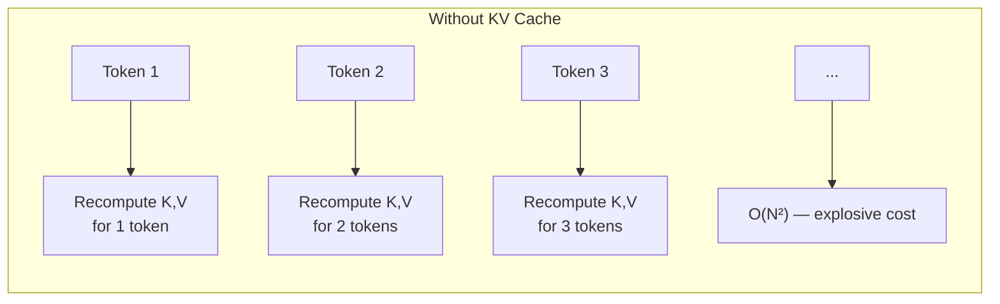
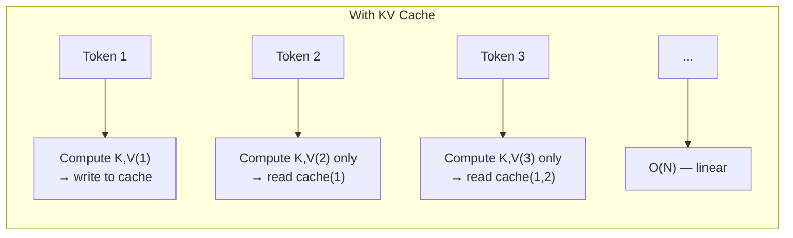
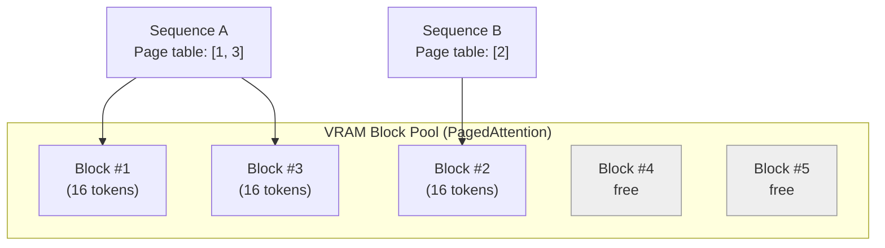
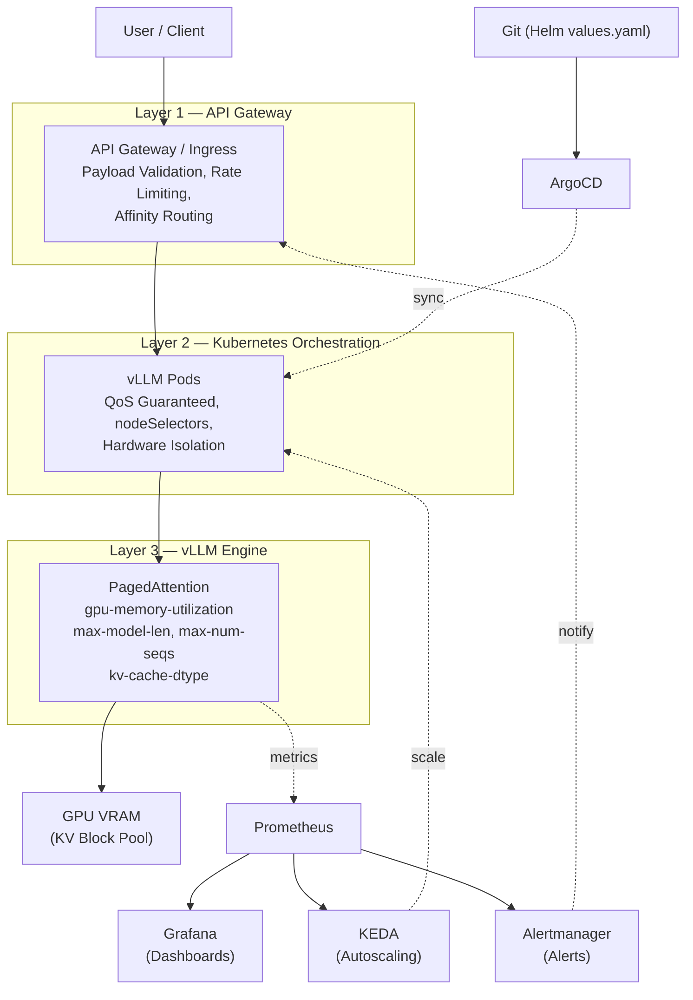
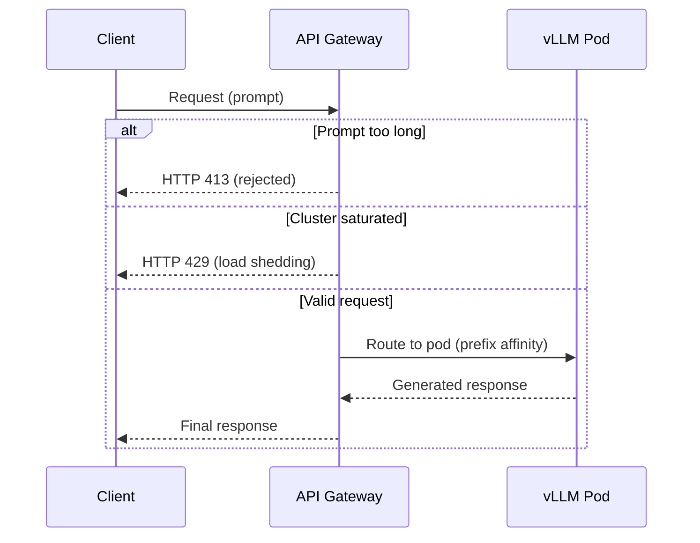
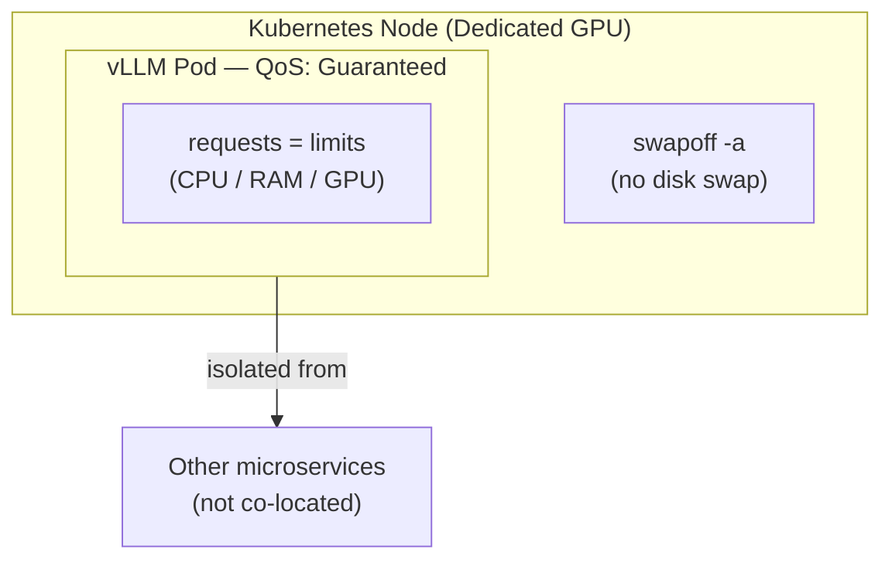
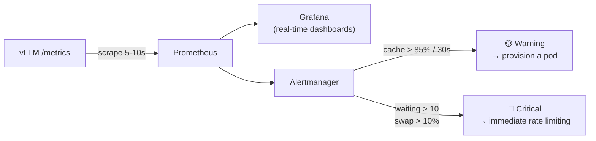
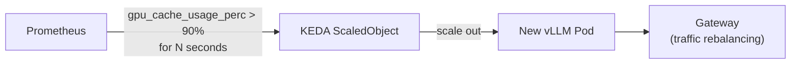
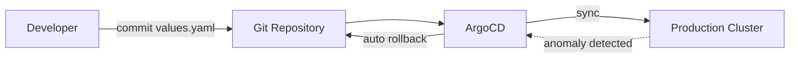

# Complete Guide: KV Cache Management in Production on AI Infrastructure

> Architecture, internal mechanics, defensive precautions, and complete pipeline for serving language models at scale (vLLM / Kubernetes)

---

## Table of Contents

1. [Fundamental Operation of the KV Cache](#1-fundamental-operation-of-the-kv-cache)
2. [PagedAttention: vLLM's Solution](#2-pagedattention-vllms-solution)
3. [Anatomy of the Complete Pipeline](#3-anatomy-of-the-complete-pipeline)
4. [Layer 1 — The API Gateway](#4-layer-1--the-api-gateway)
5. [Layer 2 — The Inference Engine (vLLM)](#5-layer-2--the-inference-engine-vllm)
6. [Layer 3 — Kubernetes Orchestration](#6-layer-3--kubernetes-orchestration)
7. [Layer 4 — Observability and Alerting](#7-layer-4--observability-and-alerting)
8. [Layer 5 — Metrics-Driven Autoscaling](#8-layer-5--metrics-driven-autoscaling)
9. [Layer 6 — GitOps and Infrastructure as Code](#9-layer-6--gitops-and-infrastructure-as-code)
10. [Anticipating Incidents: Risk Mapping](#10-anticipating-incidents-risk-mapping)
11. [Production Readiness Checklist](#11-production-readiness-checklist)
12. [Appendix: Parameter Summary Table](#12-appendix-parameter-summary-table)

---

## 1. Fundamental Operation of the KV Cache

### 1.1 The Problem the Cache Solves

Transformer models (Llama, Qwen, DeepSeek, Mistral...) generate text in an **autoregressive** fashion: one token at a time, with each new token depending on all previous ones via the **Self-Attention** mechanism.

Without optimization, each new prediction would require recomputing the **Key (K)** and **Value (V)** projections for the *entire* sequence already generated. The computational cost then grows quadratically: $\mathcal{O}(N^2)$.

The KV cache solves this problem by retaining the already-computed K and V tensors in VRAM. At step $N$, only the current token is processed; the rest is read directly from memory. The complexity returns to linear: $\mathcal{O}(N)$.

### 1.2 The Hidden Cost: VRAM

The computational gain is paid for in memory. For a model like Llama-3-70B, each context token can represent several megabytes of KV cache once multiplied by the number of layers and attention heads. With hundreds of concurrent requests and contexts of several thousand tokens, VRAM becomes **the most critical and most expensive resource in the entire infrastructure** — well ahead of raw compute (FLOPs).

---

## 2. PagedAttention: vLLM's Solution

### 2.1 The Problem with Static Allocation

Before vLLM, inference engines (e.g., older versions of HuggingFace Transformers) allocated a **contiguous** block of **maximum size** for each request, from the start — because the response length is not known in advance. Result: up to **80% of allocated VRAM was wasted** (internal and external fragmentation).

### 2.2 The Principle: OS-Style Paging

vLLM applies to VRAM the same logic that an operating system applies to RAM with paged virtual memory:

- The KV cache is divided into **small non-contiguous blocks** (typically 16 or 32 tokens per block).
- Each sequence has a **page table** that references its blocks, wherever they are physically located in VRAM.
- Blocks are allocated **on demand**, as generation progresses — never speculatively for the entire maximum length.

**Measured benefit:** memory waste drops from ~80% to **less than 4%**. This freed VRAM allows processing much larger batches simultaneously, resulting in significantly higher overall throughput on the same hardware.

### 2.3 Features That Follow

| Feature | Description | Benefit |
|---|---|---|
| **Automatic Prefix Caching (APC)** | Reuses already-computed blocks for a common prefix (system prompt, shared RAG document) | Avoids recomputing the same context for each user |
| **Copy-on-Write** | Sequences derived from the same prompt (e.g., parallel sampling) share blocks until they diverge | Reduces memory duplication |
| **CPU Swapping** | On VRAM saturation, offloads entire blocks to CPU RAM | Prevents a brutal OOM crash, at the cost of latency |

---

## 3. Anatomy of the Complete Pipeline

A "zero-error" KV cache management strategy does not play out solely within vLLM: it is built **in layers**, from the network entry point to the GitOps deployment. A single misconfigured layer can trigger a cascade effect (one request → VRAM saturation → OOM crash → traffic failover → neighboring nodes crash).

Each layer has a precise role: **filter upstream, isolate during execution, measure continuously, react automatically, and deploy reproducibly.**

---

## 4. Layer 1 — The API Gateway

This is the first shield. A request that passes this step uncontrolled directly impacts the GPU's VRAM.

### Inherent Limitations

- **Unpredictable output size**: you control the prompt size (input), but never the exact length of the generated response. The KV cache grows with every token produced.
- **Context redundancy**: if 100 users send the same system prompt or the same RAG document, the KV cache is recomputed 100 times by default.

### Precautions to Apply

- **Strict payload validation**: reject upstream (HTTP 400/413) any prompt exceeding a defined size, before the request even reaches vLLM.
- **Sticky routing (affinity routing)**: send requests sharing a common prefix (same system prompt, same user/session) to the **same pod**, to maximize the local Prefix Caching hit rate.
- **Rate limiting and load shedding**: return an HTTP 429 code rather than letting vLLM's request queue back up.
- **Aggressive timeouts**: cancel a queued request beyond a threshold (e.g., 10 s) — the user has likely already given up; no point consuming cache for nothing.

---

## 5. Layer 2 — The Inference Engine (vLLM)

This is where fine-tuning makes the difference between a resilient system and a fragile one.

### Structural Limitation

The `gpu_memory_utilization` parameter reserves a **fixed** amount of VRAM for the cache at startup. Too greedy → the internal CUDA context crashes. Too little → the concurrent request throughput (batching) is artificially limited.

### Recommended Precautions and Settings

| Parameter | Recommended Value (Production) | Role |
|---|---|---|
| `--gpu-memory-utilization` | `0.85` – `0.90` | Reserves a safety margin for the CUDA context and attention spikes |
| `--max-model-len` | Aligned to actual business need (e.g., `4096` or `8192`, not 32k by default) | Prevents a single oversized request from draining the entire block pool |
| `--max-num-seqs` | `128`–`256` depending on load tests | Caps concurrency to avoid cascading CPU swap |
| `--kv-cache-dtype` | `fp8` or `int8` (instead of `fp16`) | Halves the cache memory footprint with negligible precision loss |
| `--enable-prefix-caching` | enabled | Reuses blocks for shared prefixes (system prompt, RAG) |
| `block_size` | `16` (standard) | Page granularity; smaller = less fragmentation, more table overhead |
| `tensor_parallel_size` | depends on NVLink GPU count | Distributes weights + KV cache across multiple GPUs for large models (DeepSeek, Qwen) |

> **Most common pitfall #1**: leaving `max-model-len` at the model's default maximum. The KV cache grows linearly with context size — a single malformed prompt can consume the entire pool.

---

## 6. Layer 3 — Kubernetes Orchestration

The objective: completely isolate vLLM's execution environment so that no external element disrupts the allocated VRAM.

### Inherent Limitations

- **Classic autoscaling is blind**: a standard CPU/RAM-based HPA sees nothing, because VRAM is allocated to ~90% at startup, regardless of actual load.
- **Cascading system swapping**: if the KV cache overflows to CPU RAM, and CPU RAM itself overflows to disk (OS swap), latency explodes — from a few milliseconds to several seconds per token.

### Precautions to Apply

- **QoS Guaranteed**: set strictly identical CPU/RAM/GPU `requests` and `limits` in the manifests, to guarantee absolute pod priority and prevent it from being preempted or killed by the host's OOM Killer.
- **`swapoff -a`** on all GPU nodes: forbid any disk swap at the OS level.
- **nodeSelectors / tolerations**: dedicate physical nodes to AI inference, without sharing with other microservices consuming CPU or PCIe bandwidth.
- **Helm alignment**: centralize critical parameters (`gpu-memory-utilization`, `max-num-seqs`, `max-model-len`) in `values.yaml`, differentiated by environment (staging/production).

---

## 7. Layer 4 — Observability and Alerting

> **Golden rule: what is not measured cannot be secured.**

### Critical Limitation

An OOM crash occurs in milliseconds. Monitoring that scrapes metrics every minute will see the crash but can never anticipate it.

### Key Metrics to Monitor (natively exposed by vLLM in Prometheus)

| Metric | Meaning | Alert Threshold |
|---|---|---|
| `vllm:gpu_cache_usage_perc` | KV block pool fill ratio | **Warning** > 85% for 30 s · **Critical** ≥ 100% (requests rejected/queued) |
| `vllm:num_requests_waiting` | Queue of requests blocked due to lack of free cache | **Critical** > 10 → trigger scaling |
| `vllm:swap_out_blocks` / `vllm:cpu_swap_space_usage` | Volume of blocks offloaded to CPU RAM | **Critical** > 10% → reduce incoming traffic immediately |

### Precautions

- **High-frequency scraping**: query vLLM's `/metrics` endpoint every 5 to 10 seconds (not every minute).
- **Two-level alerting** (Warning / Critical) via Alertmanager, with notification to the on-call team and automatic provisioning trigger.
- **Grafana dashboards** centralizing: cache hit rate, Time To First Token (TTFT), VRAM usage, request queue depth.

---

## 8. Layer 5 — Metrics-Driven Autoscaling

Since classic autoscaling (CPU/RAM) is inoperable for LLMs, we use **KEDA (Kubernetes Event-driven Autoscaling)** connected directly to Prometheus.

### Trigger Logic

- Scale **not** on CPU, but on `vllm:num_requests_waiting` (growing queue) or `vllm:gpu_cache_usage_perc` (cache stuck above 90% persistently).
- A new pod is added **before** saturation causes massive rejections.

---

## 9. Layer 6 — GitOps and Infrastructure as Code

Cache configuration must **never** be modified manually on a production server.

- **Helm**: centralize all critical arguments in `values.yaml`, versioned per environment.
- **ArgoCD**: continuous synchronization from Git; in case of anomaly after a configuration change, an **immediate rollback** to the previous commit restores service without manual intervention.
- **Mandatory load tests before any change** to `block_size` or `gpu-memory-utilization`, on a staging environment with **exactly the same GPU hardware** as production (PagedAttention behavior varies by hardware architecture). Recommended tools: `k6`, `Locust`, or `benchmark_serving.py` (vLLM native).

---

## 10. Anticipating Incidents: Risk Mapping

| Risk | Root Cause | Early Warning Signal | Preventive Action |
|---|---|---|---|
| GPU OOM crash | `gpu-memory-utilization` too aggressive or `max-model-len` uncapped | `gpu_cache_usage_perc` near 100% | Cap `max-model-len`, keep 10-15% VRAM margin |
| Latency collapse | CPU swap → cascading disk swap | `swap_out_blocks` rising continuously | `swapoff -a`, alert as soon as CPU swap exceeds 10% |
| Domino effect across nodes | A crashed node fails traffic over to neighbors, which saturate in turn | Simultaneous spike in `num_requests_waiting` across multiple pods | Upstream load shedding (429) + QoS Guaranteed |
| Pod killed by host | `requests` ≠ `limits` (Burstable/BestEffort QoS) | Frequent vLLM pod restarts | Strictly align requests = limits |
| Unlimited request queue | No rate limiting at the Gateway | `num_requests_waiting` grows without receding | Dynamic rate limiting + aggressive timeout |
| Wasted cache on redundant contexts | No affinity routing | Low Prefix Caching hit rate | Sticky routing by prefix/user |

---

## 11. Production Readiness Checklist

- [ ] `--gpu-memory-utilization` set between 0.85 and 0.90 (never 1.0)
- [ ] `--max-model-len` aligned to actual business need, not the model's theoretical maximum
- [ ] `--max-num-seqs` calibrated via load tests (k6/Locust/benchmark_serving.py)
- [ ] `--enable-prefix-caching` enabled if shared contexts are frequent
- [ ] `--kv-cache-dtype fp8` or `int8` evaluated to double concurrent capacity
- [ ] Gateway: strict payload validation (HTTP 400/413 rejection)
- [ ] Gateway: rate limiting + load shedding (HTTP 429)
- [ ] Gateway: prefix affinity routing (sticky routing)
- [ ] Kubernetes: `requests` = `limits` (QoS Guaranteed)
- [ ] Kubernetes: `swapoff -a` on all GPU nodes
- [ ] Kubernetes: nodeSelectors/tolerations to isolate AI nodes
- [ ] Prometheus: scrape `/metrics` every 5-10 seconds
- [ ] Alertmanager: Warning (85%) and Critical (100% / queue > 10) thresholds
- [ ] KEDA: autoscaling based on `num_requests_waiting` and `gpu_cache_usage_perc`
- [ ] Helm + ArgoCD: versioned configuration, rollback tested
- [ ] Load tests performed on staging with GPU hardware identical to production

---

## 12. Appendix: Parameter Summary Table

| vLLM Parameter | Domain | Safe Default | Impact if Misconfigured |
|---|---|---|---|
| `gpu_memory_utilization` | Engine | 0.85–0.90 | Too high → OOM; too low → underutilization |
| `max_model_len` | Engine | per business need | Too high → a single request can drain the entire cache |
| `max_num_seqs` | Engine | 128–256 | Too high → cascading CPU swap |
| `kv_cache_dtype` | Engine | fp8/int8 | fp16 default = 2x more VRAM consumed |
| `block_size` | Engine | 16 | Too small → page table overhead; too large → fragmentation |
| `tensor_parallel_size` | Engine/Hardware | per NVLink GPUs | Misconfigured → underutilization of multi-GPU |
| `gpu_cache_usage_perc` | Monitoring | alert at 85% | Unmonitored → OOM without warning |
| `num_requests_waiting` | Monitoring | alert at 10 | Unmonitored → silent UX degradation |
| requests = limits (K8s) | Orchestration | strictly identical | Otherwise → pod killed by host OOM Killer |

---

*Reference document — synthesis of the KV cache management architecture for LLM inference infrastructures in production (vLLM + Kubernetes + GitOps).*