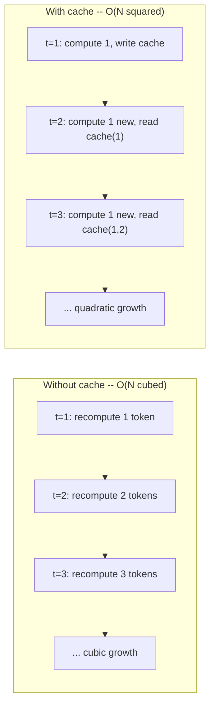
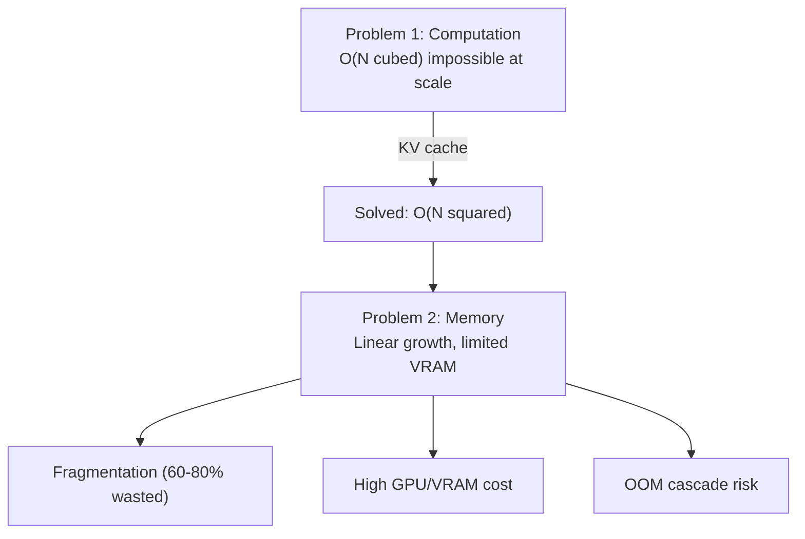
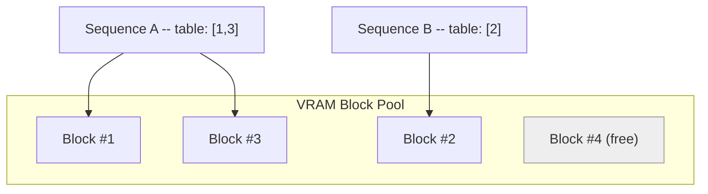
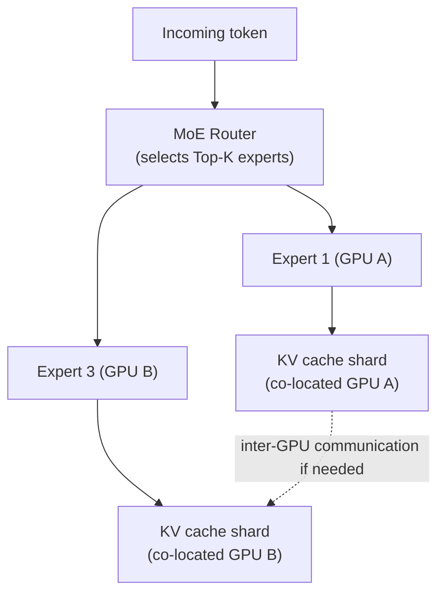
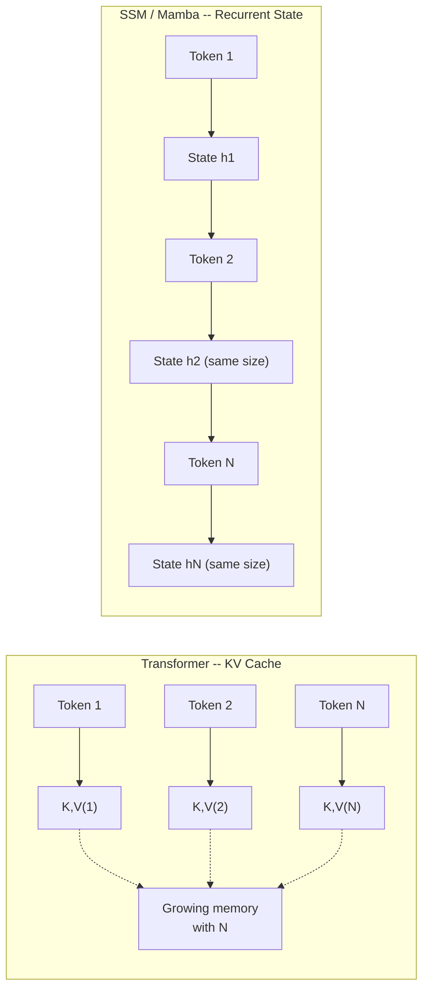
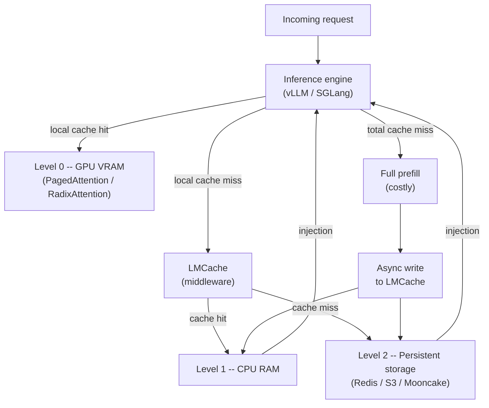
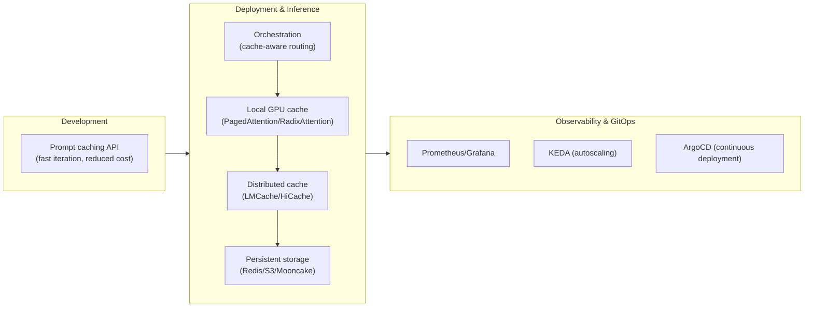
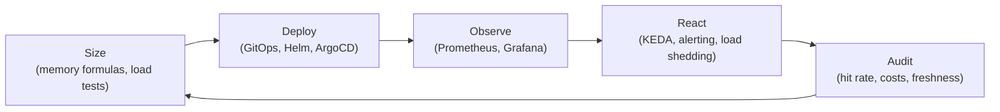

# The Master Guide to KV Cache Management for AI Inference
### Mathematical Foundations, Tools, Formats, Model Families, System Architecture, and Economic Strategy

---

## Table of Contents

1. [Why the Cache Exists: The Mathematical Proof](#1)
2. [The Cache Paradox: A Problem Solved, A Problem Created](#2)
3. [The Modern Philosophy: Cache as a First-Class Object](#3)
4. [PagedAttention and System Memory Management](#4)
5. [Cache by Model Family](#5)
   - 5.1 [Transformers (Classical Attention)](#5-1)
   - 5.2 [Mixture of Experts (MoE)](#5-2)
   - 5.3 [State Space Models (SSM / Mamba)](#5-3)
   - 5.4 [Hybrid Architectures (Transformer + SSM)](#5-4)
   - 5.5 [Spiking Neural Networks](#5-5)
6. [Cache by Model Format](#6)
7. [Comprehensive Panorama of Tools, Open-Source and Commercial](#7)
8. [How to Combine Tools: The Layered Architecture](#8)
9. [Position of the Cache in an MLOps Pipeline](#9)
10. [How Major Players Manage Their Cache](#10)
11. [The Financial Angle: Costs, ROI, and Cache Economics](#11)
12. [Managing Cache at the Scale of Millions of Users](#12)
13. [Long-Term Cache Governance and Management](#13)
14. [Checklist and Anti-Patterns](#14)
15. [Glossary](#15)

---

## 1. Why the Cache Exists: The Mathematical Proof

### 1.1 Autoregressive Generation

An LLM produces text **token by token**. Each token $t$ is predicted from all the tokens that precede it, via the Transformer's **self-attention** mechanism:

$$
\text{Attention}(Q, K, V) = \text{softmax}\left(\frac{QK^T}{\sqrt{d_k}}\right)V
$$

To generate token $t+1$, the model must compute the attention between its current **Query** and the **Keys/Values** of *all* tokens $1 \dots t$.

### 1.2 The Cost Without Cache: A Cubic Explosion

Without memoization, at each step $t$, the model would recompute the $K$ and $V$ projections for the **entire** sequence already produced:

$$
\text{Total Cost} = \sum_{t=1}^{N} O(t^2) = O(N^3)
$$

This is not a pessimistic approximation: it is a direct consequence of the fact that the attention computation at step $t$ itself costs $O(t^2)$ (matrix product $Q \times K^T$ over $t$ tokens), and we repeat this operation $N$ times. Concretely, generating 10,000 tokens without cache would take several months on a supercomputer.

### 1.3 Why This Computation Cannot Be "Bypassed"

The argument is purely algebraic. To obtain the attention score $Q_t \cdot K_i^T$, one needs the exact numerical value of $K_i$. This value depends only on token $i$ (and the model's weights), **never** on the new token we are trying to predict. There are only two ways to obtain it:

1. **Recompute it** by passing token $i$ through the entire network — slow and redundant.
2. **Store it** the first time and read it back — this is the cache.

There is no third mathematical path. The KV cache is therefore not an optional optimization: it is the **only viable implementation** of autoregressive attention in production.

### 1.4 The Cost With Cache: Linear Per Step, Quadratic Overall

With the cache, at step $t$ we compute only $Q_t, K_t, V_t$ (cost $O(1)$ in new tokens) and read back the $t-1$ previous pairs (cost $O(t)$ in memory reads):

$$
\text{Total Cost} = \sum_{t=1}^{N} O(t) = O(N^2)
$$

| | Without cache | With KV cache |
|---|---|---|
| Cost per step | $O(t^2)$ | $O(t)$ |
| Total cost for $N$ tokens | $O(N^3)$ | $O(N^2)$ |
| 10,000 tokens | Months | A few seconds |

### 1.5 The Memory Sizing Formula

The KV cache size in bytes follows a direct formula:

$$
\text{Cache Size} = 2 \times B \times L \times H_{kv} \times D_h \times P \times \text{sizeof(dtype)}
$$

where: $B$ = batch size, $L$ = number of layers, $H_{kv}$ = number of Key/Value heads, $D_h$ = dimension per head, $P$ = current sequence length, and the factor 2 corresponds to the K **and** V tensors separately.

**Concrete example**: for a model like *Phi-4-mini-instruct*, with a batch of 1 and a context of 4096 tokens, the cache weighs approximately **4 GB**. For a 70-billion-parameter model with a 128,000-token context, the KV cache alone can exceed **40 GB** — rivaling, or even exceeding, the size of the model weights themselves.

---

## 2. The Cache Paradox: A Problem Solved, A Problem Created

The cache transforms a **computation problem** (GPU/FLOPs, insurmountable) into a **memory problem** (VRAM, manageable but expensive). This is progress, but this new problem has its own complexity:

- **Unbounded linear growth**: the cache size grows with context length *and* with batch size. Without a limit, a single very long-context request can consume the entire available memory pool.
- **Fragmentation**: a naive allocation (contiguous, sized for the maximum theoretical length) wastes **60 to 80%** of reserved memory, since the actual response length is never known in advance.
- **Disproportionate hardware cost**: GPU VRAM is the most expensive and scarce resource in the entire AI infrastructure — far more so than raw computation.
- **Cascade effect**: a saturated cache on one node can trigger an OOM crash, which shifts traffic to neighboring nodes, which in turn saturate.

---

## 3. The Modern Philosophy: Cache as a First-Class Object

The paradigm shift in recent years is to no longer treat the KV cache as a **disposable temporary buffer**, but as a **first-class system resource**, actively managed at three levels:

| Level | Question Asked | Techniques |
|---|---|---|
| **Token** | What to keep, what to discard, how to compress? | Eviction (LRU, H2O, SnapKV, KVzip, CAKE), quantization (FP8/INT8, KIVI), fusion (A3) |
| **Model** | How to reduce cache size through architecture? | Multi-Query Attention (MQA), Grouped-Query Attention (GQA), Multi-head Latent Attention (MLA), cross-layer sharing |
| **System** | How to organize, move, and share the cache? | PagedAttention, RadixAttention, memory hierarchy (LMCache, HiCache), PD Disaggregation |

A more recent and subtle evolution concerns **admission**: instead of managing the cache *after* writing (eviction) or *at* read time (selection), one decides **before even writing** whether a token deserves to be stored. The *Write-Gated KV* (WG-KV) mechanism learns to predict the future usefulness of a token; only high-usefulness tokens enter a persistent "global" cache, while others remain in a temporary "local" cache — with memory reductions of 46 to 57% and speedups of 1.9 to 3.4x observed on Llama models.

| Traditional view | Modern philosophy |
|---|---|
| Temporary buffer | First-class memory object |
| Store everything | Filter before writing |
| Fragmented (60-80% waste) | Paged (less than 4% waste) |
| Isolated optimization | Optimization at all levels |
| Reactive | Predictive |

---

## 4. PagedAttention and System Memory Management

### 4.1 The Static Allocation Problem

Before vLLM, engines allocated a **contiguous** block of **maximum size** for each sequence, from the start, since the final response length is unknown. The measured waste reached 60 to 80% of reserved VRAM.

### 4.2 The Paging Principle

vLLM applies to VRAM the same logic that an operating system applies to RAM with paged virtual memory:

- The cache is divided into **non-contiguous blocks** of fixed size (16 or 32 tokens).
- Each sequence owns a **page table** referencing its blocks, regardless of their physical position.
- Blocks are allocated **on demand**, never speculatively.

**Result**: waste drops below **4%**, with throughput multiplied by 2 to 4x on the same hardware.

### 4.3 Automatic Prefix Caching (APC)

Each block is identified by a **hash** of its tokens and its prefix. A global hash table allows identical blocks to be shared across multiple requests — typically a common system prompt or a shared RAG document. The eviction policy is **LRU** (Least Recently Used).

### 4.4 RadixAttention (SGLang): A Tree-Based Alternative

SGLang organizes the cache in a **radix tree**: each node represents the cache of a token segment; prefixes shared by multiple requests naturally reuse the same nodes, without requiring an exact hash over the entire prefix.

---

## 5. Cache by Model Family

This is where current architectural diversity radically changes the game: **KV cache is not universal**. Each model family has a different notion of "memory of the past," and therefore a different management strategy.

### 5.1 Transformers (Classical Attention)

This is the reference case covered in the previous sections: a KV cache that **grows linearly** with sequence length, one tensor per layer and per head, managed by paging (PagedAttention) or radix tree (RadixAttention).

**Variants that change cache management:**

- **Sliding Window Attention (SWA)**: each token attends only to a fixed window of previous tokens (e.g., Gemma 2/3, Mistral). The cache no longer needs to grow indefinitely; a **rolling buffer** can be used, but eviction and hit management becomes more complex since one must track which tokens are still "in the window."
- **Multi-Query Attention (MQA) / Grouped-Query Attention (GQA)**: multiple Query heads share the same Key/Value, directly reducing cache size by a factor proportional to the number of shared heads.
- **Multi-Head Latent Attention (MLA)**, used by DeepSeek: compresses K/V into a lower-dimensional latent space before storing them, reducing memory without the quality loss observed with classical MQA/GQA.

### 5.2 Mixture of Experts (MoE)

MoE models (Mixtral, DeepSeek-MoE, etc.) activate only a subset of "experts" (sub-networks) per token, via a router that selects the relevant Top-K experts. The **KV cache itself remains dense**: attention applies normally, independent of MoE routing. The difficulty lies elsewhere:

- **Expert cache vs KV cache**: beyond the classical KV cache, MoE systems must also manage an **expert weight cache** in memory (particularly critical on memory-limited devices), with LRU/LFU eviction policies or predictive approaches (MoE-Infinity) that anticipate which experts will be needed.
- **KV cache fragmentation across GPUs**: when experts are distributed across multiple GPUs (expert parallelism), the KV cache of tokens processed by different experts can end up physically scattered. A request that needs to attend to earlier tokens may then require costly inter-GPU communication — a problem that PagedAttention and GQA/MQA do not solve natively, since they operate at the single-device level.
- **Specialized solutions**: frameworks like **PiKV** specifically address this problem with an **expert-sharded KV cache** (each cache shard co-located with the expert that produced it), cache-aware routing, and adaptive eviction that more aggressively prunes entries related to rarely-solicited experts — yielding throughput gains of 2.3 to 3.1x and memory reductions of 2.8 to 3.5x.
- **Order of magnitude**: for a 7B MoE model with 128k context and 16 experts, the full KV cache can exceed 24 GB, with non-negligible inter-node communication latency.

### 5.3 State Space Models (SSM / Mamba)

This is where the rupture is most radical. SSMs (Mamba, Mamba-2, Mamba-3) **do not use a KV cache at all**. Instead of storing the K/V of each past token, they compress the entire past into a **fixed-size recurrent state**, updated at each new token — exactly like historical RNNs/LSTMs, but with a **selectivity** mechanism (S4, S6, and in Mamba-3 a multi-head variant) that learns what to retain and what to forget based on the input.

**Direct consequence on memory:**

$$
\text{SSM state size} = \text{constant}, \quad \text{independent of } N \text{ (sequence length)}
$$

Whether the sequence is 1,000 or 128,000 tokens, the memory footprint of the recurrent state remains stable, typically **2 to 4 GB**, compared to tens of gigabytes for a Transformer KV cache at the same length.

For a Mamba-2 model, one can show that the state size per layer equals $H \times P \times N$ (with $P=64$, $N=128$ typically), which is approximately equivalent to a Transformer KV cache of **only 128 tokens** — but since Mamba models generally have twice as many layers as a comparable Transformer, the total state size ends up equaling that of a classical KV cache... **without ever growing further**, regardless of context length.

**The trade-off (the "fixed memory wall")**: this compression comes at a price. The state cannot be "unrolled" backward or shared at the token level like a classical KV cache — it is fundamentally different, it cannot be easily restored to a past time $t$ without replaying the recurrence. On tasks requiring precise information retrieval in long context (*needle-in-a-haystack*, multi-step reasoning), a Transformer that can "revisit" each individual token via its KV cache outperforms a pure SSM, whose fixed state remains a **lossy** representation, regardless of the sophistication of the transition dynamics.

**What this implies for cache management:**

- **No paging possible**: the SSM state has no token-by-token structure to evict; it requires a **single, contiguous allocation** per layer and per sequence, the opposite of paged KV cache which uses scatter-gather accesses.
- **Prefix caching becomes complex**: for a Transformer, reusing a common prefix means reusing identifiable KV blocks by hash. For an SSM, one must decide **when and how** to checkpoint the evolving recurrent state for later reuse — an open problem actively being worked on in current research.

### 5.4 Hybrid Architectures (Transformer + SSM)

Faced with the precision/memory trade-off of pure SSMs, models like **Jamba** (AI21 Labs) or the **Zamba** family interleave SSM layers (fast, constant memory) with classical or sparse attention layers (precise for information retrieval), seeking the best of both worlds.

**Specific memory management challenge for hybrids**: each layer type has a radically different memory profile:

| | Attention layers | SSM layers |
|---|---|---|
| Structure | Paged KV blocks, variable size | Contiguous state, fixed size |
| Operations | Scatter-gather, evictable | In-place read/write, non-evictable |
| Growth | Linear with context | Constant |

This heterogeneity makes global memory management much more delicate than with a homogeneous model: the system must allocate **two different types of memory** within the same inference pipeline, with distinct paging policies. Recent research ("asymmetric paging") proposes dedicated schemes that page KV blocks classically while treating the SSM state as a single, non-fragmentable block, allocated once for the entire duration of the sequence.

Other hybrid architectures combine a **sliding window** with **full attention** on only certain layers (e.g., Gemma 2/3, Ministral), which also creates heterogeneous cache lifetimes per layer — some evict after the window, others retain the entire history.

### 5.5 Spiking Neural Networks

SNNs represent the deepest rupture from the KV cache paradigm, as they rely neither on attention nor on SSM-type recurrence, but on **binary spiking neurons** whose internal state is the **membrane potential**.

**The mechanism (Leaky Integrate-and-Fire neuron, LIF):**

$$
u_i^{l,t} = \lambda \, u_i^{l,t-1} + \sum_j w_{ij}\, s_j^{l-1,t} - s_i^{l,t-1}\,\theta
$$

where $u$ is the membrane potential, $\lambda$ the leak factor, $s$ the binary spike (0 or 1) emitted if the potential exceeds threshold $\theta$.

**What replaces the "cache" here**: there are no K/V tensors to store. The only memory carried from one time step to the next is the **membrane potential** of each neuron — a scalar (or small vector) per neuron, updated in place, comparable in spirit to the recurrent state of an SSM but at a much finer, binary-output neuronal granularity.

**SNN-specific memory challenges:**

- **No growth with context**: as with SSMs, the memory footprint per neuron remains constant, regardless of the number of time steps processed.
- **Hidden cost of "Spiking Transformers"**: some hybrid architectures combine spiking and attention (Spikformer, SpikingResformer, Spike-Driven-Transformer). They reintroduce a need to store attention scores, causing **additional memory overhead** compared to a pure SNN — an active research problem, where recent approaches attempt to approximate attention through membrane potential dynamics alone to avoid materializing a full attention matrix.
- **Membrane potential quantization**: mirroring FP8/INT8 KV cache quantization, recent work explores representing the membrane potential in very low precision to reduce memory footprint on embedded devices, with a direct trade-off on model accuracy.
- **Temporal reversibility**: some "reversible" SNN architectures avoid storing the membrane potential at *every* time step during training — only the final state is kept, intermediate states being reconstructed by inverse deduction. This trick, though designed for training, illustrates the same philosophy as the cache: store only what is strictly necessary.

**Comparative summary of the five families:**

| Family | Memorized object | Growth with context | Evictable / pageable | Typical management tool |
|---|---|---|---|---|
| **Transformer** | K/V cache per token | Linear | Yes (PagedAttention, RadixAttention) | vLLM, SGLang, TensorRT-LLM |
| **MoE** | Dense K/V cache + expert weight cache | Linear (KV) + fixed per active expert | Yes for KV; LRU/LFU for experts | PiKV, MoE-Infinity |
| **SSM (Mamba)** | Fixed-size recurrent state | Constant | No (single contiguous allocation) | Native Mamba runtime, vLLM (SSM support) |
| **Hybrid (Transformer+SSM)** | KV cache (attention layers) + state (SSM layers) | Mixed | Partially (paged for KV only) | Active research (asymmetric paging) |
| **Spiking (SNN)** | Membrane potential per neuron | Constant | No (in-place update) | Dedicated neuromorphic frameworks (Loihi, etc.) |

---

## 6. Cache by Model Format

One must distinguish the **weight storage format** (static, defined once) from the **KV cache** (dynamic, created at each inference). The format does not directly determine cache behavior — it is the **inference engine** that implements it which is responsible. But each ecosystem has its own constraints.

### 6.1 SafeTensors — The Persistence Container

SafeTensors is a safe serialization format for tensors. It does not actively manage the cache, but serves as a **disk persistence medium**:

1. The KV cache (typically in FP16) is quantized to 4 bits (Q4) to reduce its size by a factor of 4.
2. The quantized tensors are serialized in a `.safetensors` file with their metadata.
3. On restart, the engine reads them back, dequantizes them, and reinjects them directly into the attention layer — avoiding a complete prefill.

This mechanism can reduce *Time-To-First-Token* by up to a factor of 136x on certain models (measured on Gemma 3 12B), and is becoming a persistence standard in frameworks like vLLM or MLX.

### 6.2 TensorRT Engine — Pushed Hardware Optimization

The `.engine` format of TensorRT-LLM, compiled for a specific NVIDIA GPU architecture, embeds advanced cache features: paged cache, FP8 cache quantization, cache reuse between requests sharing a prefix, and offloading to host RAM in case of VRAM saturation.

### 6.3 Summary

| Format | Primary role | KV cache management |
|---|---|---|
| **SafeTensors** | Safe serialization | **Persistence** container for cache on disk |
| **TensorRT Engine** | NVIDIA GPU optimization | Native paging, quantization, and sharing |

In practice, a project often combines multiple formats: SafeTensors to persist the cache, and vLLM or TensorRT-LLM for high-performance inference.

---

## 7. Comprehensive Panorama of Tools, Open-Source and Commercial

### 7.1 Inference Engines with Integrated Cache Management

| Tool | Core mechanism | Key strength |
|---|---|---|
| **vLLM** | PagedAttention + Automatic Prefix Caching (LRU) | Open-source reference, waste less than 4%, throughput 2-4x |
| **SGLang** | RadixAttention + HiCache (L1 GPU / L2 CPU / L3 distributed) | Native hierarchical cache, ultra-long contexts |
| **TensorRT-LLM** | Paged cache, quantized, circular buffer, reuse | Pushed NVIDIA optimizations, FP8/FP4 |

### 7.2 Specialized KV Cache Management Frameworks

| Tool | Specialization | Key strength |
|---|---|---|
| **LMCache** | Cross-engine cache middleware | L1 (CPU) / L2 (disk/Redis/S3) hierarchy, throughput up to 15x |
| **Dynamo KVBM (NVIDIA)** | Distributed KV block management | Async GPU to CPU to disk transfers |
| **Unified Cache Manager (UCM)** | Sparse retrieval for very long contexts | Storage-compute separation, latency divided by 3 to 10 |
| **WombatKV** | Cache on object storage (S3) | Extreme persistence and sharing, content-addressable |
| **llm-d KV-Cache Manager** | Cache-aware routing | Global cluster view, maximized hit rate |
| **PiKV** | KV cache for MoE architectures | Expert sharding, adaptive eviction, 2.3-3.1x throughput |
| **EdgeSync-LLM** | KV fragment cache for edge (mobile) | Engine-agnostic (MLC-LLM) |
| **InfiniGen / H2O** | Token offloading and eviction | Academic reference in memory management |
| **Mooncake** | High-performance third-party cache engine | Ultra-fast RDMA transfers |

### 7.3 Storage Backends (L2/L3 Layers)

| Tool | Role |
|---|---|
| **Redis / Valkey** | Low-latency distributed cache (5-15 ms), cross-pod sharing |
| **Memcached** | General-purpose distributed in-memory cache, simpler than Redis |
| **Mooncake Store** | KV-optimized storage, RDMA for inter-node transfers |
| **S3 (or equivalent object storage)** | Massive and inexpensive persistence, near-unlimited capacity |

---

## 8. How to Combine Tools: The Layered Architecture

The three pillars **vLLM/SGLang + LMCache + storage backend** are not competing: they occupy different strata and combine naturally.

**Typical request flow:**

1. The request lands on a vLLM/SGLang instance.
2. The engine checks its local GPU cache (Level 0).
3. On miss, it queries LMCache, which searches CPU RAM (Level 1), then persistent storage (Level 2).
4. **Cache hit**: data is reinjected, prefill is **entirely skipped** — spectacular latency gain.
5. **Total cache miss**: prefill executes normally, and the new cache is sent asynchronously to LMCache for future reuse.

Without this sharing layer, each instance remains a silo: a request landing on a different instance does not benefit from work already done elsewhere, causing redundant recomputation at the cluster level.

---

## 9. Position of the Cache in an MLOps Pipeline

The cache is not an isolated brick: it is a multi-level system integrated into the complete chain, from development to production.

This layered architecture maximizes the cache hit rate at each stage while minimizing costs, and enables fully automated control from Git (see the GitOps section of the complementary guide on defensive cache management).

---

## 10. How Major Players Manage Their Cache

Major API providers have each developed a proprietary **Prompt Caching** strategy to reduce costs and latency:

| Provider | Mechanism | Conditions | Cost reduction |
|---|---|---|---|
| **OpenAI** | Automatic | Prompts >= 1024 tokens, 128-token increments | Up to 90% on cached tokens |
| **Anthropic** | Manual (`cache_control`) | Blocks to mark explicitly, TTL 5 min or 1h | Up to 90% |
| **Google (Gemini)** | Explicit + implicit | Implicit is automatic on recent models | Up to 75% |
| **DeepSeek** | Automatic, disk cache | Automatic prefix caching on HDD | Order-of-magnitude reduction |

**Practical recommendation inherited from these strategies**: always structure your prompts with static, voluminous elements (system instructions, RAG context, tool schemas) **at the beginning** of the prompt, and variable elements (the user's specific question) **at the end**. Cache systems work by exact prefix matching — any change at the start of the prompt invalidates the cache for everything that follows.

---

## 11. The Financial Angle: Costs, ROI, and Cache Economics

### 11.1 The Central Economic Principle

The strategic objective is to **break the equation cost = users x requests**. With effective cache management, the cost of inference becomes proportional not to request volume, but to their **novelty**.

### 11.2 Token Cost

Providers bill cached tokens **up to 10x cheaper** than standard tokens. Bill reductions of 59% to 80% are commonly reported on workloads with high prefix reuse.

### 11.3 Infrastructure Cost

By avoiding redundant computation, GPU load decreases drastically — allowing the same volume of users to be served with less hardware, or to absorb growth without additional investment. The cost of L2 storage (Redis, S3) is negligible compared to the savings realized on GPUs.

### 11.4 Quantified ROI Example

For a "hot" document of 3,774 tokens served to 80 million agents: the systematic recomputation cost would be approximately **1.5 million dollars**, versus approximately **0.03 million dollars** when reusing the cache — a reduction factor close to **50x**.

### 11.5 Hidden Costs to Anticipate

- **Operational complexity**: a distributed multi-level cache system adds a non-negligible maintenance surface.
- **L2/L3 storage cost**: moderate compared to GPU, but real at large scale — a cost-benefit analysis remains necessary.
- **Cache freshness**: without an invalidation mechanism, a stale cache (e.g., updated RAG knowledge base) becomes a source of silent errors.
- **Network latency**: a poorly placed remote backend (S3) can cancel part of the expected latency gains.

### 11.6 Summary of Industry-Observed Gains

| Lever | Typical gain |
|---|---|
| Throughput | Up to 15x |
| Time-To-First-Token | Reduced by 3 to 10x |
| API cost (cached tokens) | -59% to -90% |
| Overall infrastructure cost | -60% to -90% |

---

## 12. Managing Cache at the Scale of Millions of Users

### 12.1 Maximize the Cache Hit Rate

This is the most powerful lever at this scale: structure applications so that the maximum number of requests share identical prefixes (common system prompt, stable RAG context at the beginning of the prompt).

### 12.2 Systematically Hierarchize

| Level | Medium | Typical latency | Relative cost |
|---|---|---|---|
| L0 | GPU VRAM | Microseconds | Very high |
| L1 | CPU RAM | Tens of microseconds | Moderate |
| L2 | Distributed storage (Redis/S3/Mooncake) | 5-15 ms (Redis) to more for S3 | Low |

### 12.3 Cache-Aware Routing as a Scalability Condition

At massive volumes, a simple round-robin load balancer destroys the cache benefit by dispersing similar requests across different instances. Prefix-affinity routing (sticky routing), coupled with a global cluster view (in the manner of the llm-d KV-Cache Manager), becomes essential to maintain a high hit rate as the number of instances grows.

### 12.4 Prefill/Decode Separation (PD Disaggregation)

At large scale, physically separating nodes dedicated to prefill (computation-intensive) from nodes dedicated to decode (cache/memory-intensive) allows each phase to be optimized independently, without one penalizing the other in shared resources.

---

## 13. Long-Term Cache Governance and Management

Managing the cache is not a one-time configuration operation: it is a **continuous lifecycle**.

- **Size**: periodically recalculate the cache size formula as models, maximum contexts, or traffic volumes evolve.
- **Deploy** in a versioned manner: any cache configuration (block_size, gpu-memory-utilization, cache TTL) must be a Git artifact, never a manual modification in production.
- **Observe** continuously: cache hit ratio, TTFT, and VRAM utilization must be tracked as business metrics, not just technical ones.
- **React automatically**: autoscaling and load shedding driven by cache metrics, never by CPU alone.
- **Audit periodically**: revalidate that cached data remains fresh (invalidation upon knowledge base updates), and that the L2/L3 storage cost/benefit ratio remains favorable as volumes evolve.

---

## 14. Checklist and Anti-Patterns

### Checklist

- [ ] Cache sizing formula applied and revalidated at each model change
- [ ] PagedAttention or RadixAttention activated depending on the chosen engine
- [ ] Prefix caching activated if prefixes are shared between requests
- [ ] Prompts structured with static content at the beginning
- [ ] L0/L1/L2 layered architecture in place if volume justifies it
- [ ] Cache-aware routing in place beyond a handful of instances
- [ ] High-frequency monitoring (5-10s) of cache metrics
- [ ] Autoscaling driven by cache metrics, not by CPU
- [ ] Cache invalidation policy documented and tested
- [ ] The model format and its associated engine are consistent with the chosen cache strategy
- [ ] The model family (Transformer / MoE / SSM / Hybrid / SNN) has been taken into account in the cache tool selection

### Anti-Patterns to Absolutely Avoid

- Applying a Transformer-style paging strategy to an SSM model (the state is not fragmentable).
- Ignoring the expert cache in a MoE deployment by only managing the KV cache.
- Leaving `max-model-len` at the model's maximum theoretical value "just in case."
- Deploying a distributed cache (LMCache) without affinity routing — the sharing benefit is then canceled by network latency.
- Modifying `block_size` or `gpu-memory-utilization` in production without prior load tests on identical hardware.
- Neglecting cache invalidation when updating a RAG corpus.

---

## 15. Glossary

| Term | Short definition |
|---|---|
| **KV Cache** | Memory of already-computed Key/Value tensors, reused at each new token |
| **PagedAttention** | Paged management of KV cache in non-contiguous blocks (vLLM) |
| **RadixAttention** | Cache management via a radix tree of shared prefixes (SGLang) |
| **Prefix Caching** | Reusing cache for an identical token prefix across requests |
| **TTFT** | Time-To-First-Token, delay before the first generated token |
| **Prefill / Decode** | Initial prompt processing phase vs token-by-token generation phase |
| **Recurrent state (SSM)** | Fixed-size compressed representation replacing the KV cache in Mamba models |
| **Membrane potential (SNN)** | Scalar internal state of a spiking neuron, updated in place |
| **QoS Guaranteed** | Kubernetes quality of service class guaranteeing requests = limits |
| **Load Shedding** | Voluntary request rejection (HTTP 429) to protect the system under high load |

---

*Master reference document — mathematical, architectural, economic, and multi-family synthesis of cache management for AI model inference (Transformers, MoE, SSM, Hybrids, Spiking).*