# llm-d — La Référence Complète

### Inférence distribuée native Kubernetes pour les grands modèles de langage — Théorie, communication interne et mise en œuvre en production

> Document de synthèse exhaustif : pourquoi llm-d existe, comment il est architecturé, comment ses composants communiquent réellement entre eux (Kubernetes, ZMQ, HTTP, NIXL/RDMA), comment il s'intègre avec vLLM et LMCache, et comment le déployer concrètement.

---

## Table des matières

1. [Résumé exécutif](#1-résumé-exécutif)
2. [Pourquoi llm-d existe — l'espace du problème](#2-pourquoi-llm-d-existe--lespace-du-problème)
3. [Identité du projet, gouvernance et timeline](#3-identité-du-projet-gouvernance-et-timeline)
4. [Vue d'ensemble de l'architecture](#4-vue-densemble-de-larchitecture)
5. [Le Router llm-d : Proxy + Endpoint Picker (EPP)](#5-le-router-llm-d--proxy--endpoint-picker-epp)
6. [Le KV-Cache Indexer — anatomie interne](#6-le-kv-cache-indexer--anatomie-interne)
7. [Comment llm-d communique réellement : les deux plans](#7-comment-llm-d-communique-réellement--les-deux-plans)
8. [Comment llm-d "parle" à vLLM et LMCache — le plan de contrôle](#8-comment-llm-d-parle-à-vllm-et-lmcache--le-plan-de-contrôle)
9. [Le cache KV en trois phases — de la mémoire locale à la ressource routable](#9-le-cache-kv-en-trois-phases--de-la-mémoire-locale-à-la-ressource-routable)
10. [Désagrégation Prefill/Decode (P/D)](#10-désagrégation-prefilldecode-pd)
11. [Wide Expert Parallelism (pour les modèles MoE)](#11-wide-expert-parallelism-pour-les-modèles-moe)
12. [Autoscaling piloté par les SLO](#12-autoscaling-piloté-par-les-slo)
13. [Intégration avec vLLM](#13-intégration-avec-vllm)
14. [Intégration avec LMCache](#14-intégration-avec-lmcache)
15. [Support multi-moteurs : SGLang et TensorRT-LLM](#15-support-multi-moteurs--sglang-et-tensorrt-llm)
16. [Le chemin de données complet, de bout en bout](#16-le-chemin-de-données-complet-de-bout-en-bout)
17. [Relation avec Kubernetes, KServe, Gateway API et LeaderWorkerSet](#17-relation-avec-kubernetes-kserve-gateway-api-et-leaderworkerset)
18. [Mise en œuvre concrète : prérequis et préparation du cluster](#18-mise-en-œuvre-concrète--prérequis-et-préparation-du-cluster)
19. [Mise en œuvre concrète : déployer les "Well-Lit Paths"](#19-mise-en-œuvre-concrète--déployer-les-well-lit-paths)
20. [Mise en œuvre concrète : configurer le service désagrégé avec LMCache + NIXL](#20-mise-en-œuvre-concrète--configurer-le-service-désagrégé-avec-lmcache--nixl)
21. [Observabilité : métriques et tableaux de bord](#21-observabilité--métriques-et-tableaux-de-bord)
22. [Considérations opérationnelles, limites et risques](#22-considérations-opérationnelles-limites-et-risques)
23. [Framework de décision : quand adopter llm-d](#23-framework-de-décision--quand-adopter-llm-d)
24. [Glossaire](#24-glossaire)
25. [Sources primaires](#25-sources-primaires)

---

## 1. Résumé exécutif

**llm-d** est une pile d'inférence distribuée, native Kubernetes et orientée haute performance, pour servir des grands modèles de langage (LLM) en production.

Deux choses importantes à clarifier d'emblée :

- llm-d **n'est pas** un moteur de serving de modèles — il ne remplace ni vLLM ni SGLang.
- llm-d **n'est pas** une plateforme MLOps complète — il ne remplace pas KServe.

llm-d est une **couche d'orchestration middleware** qui se place entre un plan de contrôle Kubernetes-natif (KServe, ou une simple Gateway) et un ou plusieurs moteurs de serving (principalement vLLM), et qui fait de ces moteurs un système distribué unique, conscient du cache et piloté par les SLO.

### Les quatre piliers de capacités

| Pilier | Ce qu'il apporte |
|---|---|
| **Routage intelligent** | Achemine chaque requête vers la réplique la plus susceptible d'avoir déjà les blocs de KV-cache pertinents, au lieu d'un round-robin ou d'un sticky-routing aveugle. |
| **Serving désagrégé** | Sépare la phase de *prefill* (compute-bound) de la phase de *decode* (memory-bandwidth-bound) sur des pods indépendamment scalables. |
| **Gestion du KV-cache** | Maintient un index quasi temps réel de la localisation des blocs de cache, et peut hiérarchiser le stockage du cache entre HBM GPU, RAM CPU, et stockage local/distant. |
| **Excellence opérationnelle** | Autoscaling piloté par les SLO, contrôle de flux pour l'équité multi-tenant, et traitement par batch compatible OpenAI. |

llm-d a été lancé par **Red Hat** en mai 2025, avec comme contributeurs fondateurs **Google Cloud, IBM Research, CoreWeave et NVIDIA**, puis rejoint par **AMD, Cisco, Hugging Face, Intel, Lambda et Mistral AI**, ainsi que des soutiens académiques (UC Berkeley, University of Chicago). En **mars 2026**, lors de KubeCon Europe (Amsterdam), le projet a été donné à la **Cloud Native Computing Foundation (CNCF)** en tant que projet **Sandbox** — le stade de maturité le plus précoce des trois niveaux CNCF (Sandbox → Incubating → Graduated).

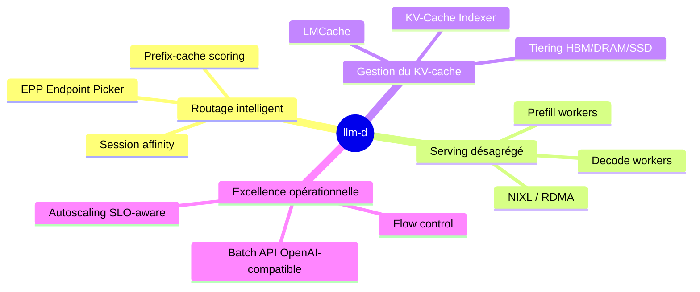
```mermaid
mindmap
  root((llm-d))
    Routage intelligent
      EPP Endpoint Picker
      Prefix-cache scoring
      Session affinity
    Serving désagrégé
      Prefill workers
      Decode workers
      NIXL / RDMA
    Gestion du KV-cache
      KV-Cache Indexer
      Tiering HBM/DRAM/SSD
      LMCache
    Excellence opérationnelle
      Autoscaling SLO-aware
      Flow control
      Batch API OpenAI-compatible
```

---

## 2. Pourquoi llm-d existe — l'espace du problème

Les requêtes d'inférence LLM sont fondamentalement différentes des requêtes HTTP classiques sans état, et les patterns génériques de répartition de charge les gèrent mal.

### 2.1 Les requêtes LLM ont un état caché

Chaque requête transporte un état invisible : le **KV-cache** (les tenseurs clé/valeur produits par les couches d'attention en traitant le prompt). Si une requête suivante réutilise une partie d'un prompt déjà vu (un system prompt, un long contexte RAG, une conversation multi-tours) et qu'elle est routée vers une réplique qui possède déjà les blocs de cache correspondants, le moteur peut **sauter entièrement le recalcul**. Si elle est routée vers une réplique "froide", les mêmes tokens doivent être retraités depuis zéro.

### 2.2 Les requêtes sont coûteuses et très variables

Une seule requête peut occuper un GPU pendant plusieurs secondes et consommer des milliers de tokens. Le ratio tokens d'entrée / tokens de sortie varie énormément : un tour de chat court et une requête RAG de 8K tokens imposent des charges radicalement différentes à l'accélérateur.

### 2.3 Prefill et decode ont des profils de performance opposés

- **Prefill** (traitement du prompt) : *compute-bound* — sature les FLOPs du GPU.
- **Decode** (génération token par token) : *memory-bandwidth-bound* — limité par la vitesse de transfert entre HBM et cœurs de calcul.

Faire tourner les deux phases sur le même GPU signifie qu'aucune des deux n'est utilisée de façon optimale, et qu'un long prefill pour un utilisateur peut bloquer la latence de decode de tous les autres utilisateurs concurrents sur ce pod.

### 2.4 Round-robin et sticky routing sont aveugles au cache

Le load balancing des Services Kubernetes et le routage sticky-session L7 classique n'ont aucune notion de localité du KV-cache, de profondeur de file par réplique, ou de coût par requête. Ils ne peuvent pas répondre à la question qui compte le plus pour l'efficacité de l'inférence : *"quelle réplique a déjà le cache pertinent ?"*

### 2.5 La réponse de llm-d

L'objectif affiché de llm-d est de fournir un **"well-lit path"** — un plan éprouvé, benchmarké et reproductible — pour que n'importe quelle organisation puisse adopter les optimisations d'inférence distribuée de pointe (routage conscient du cache, désagrégation, parallélisme expert large) sur son infrastructure Kubernetes existante, à travers les accélérateurs NVIDIA, AMD, Intel et TPU, sans avoir à inventer cette infrastructure elle-même.

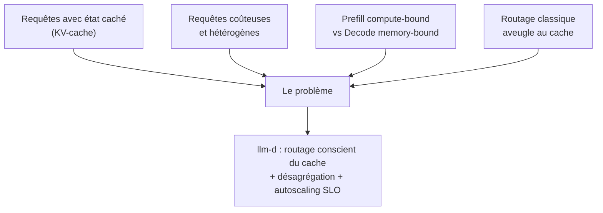
```mermaid
flowchart TB
    P1["Requêtes avec état caché<br/>(KV-cache)"] --> Prob[Le problème]
    P2["Requêtes coûteuses<br/>et hétérogènes"] --> Prob
    P3["Prefill compute-bound<br/>vs Decode memory-bound"] --> Prob
    P4["Routage classique<br/>aveugle au cache"] --> Prob
    Prob --> Sol["llm-d : routage conscient du cache<br/>+ désagrégation + autoscaling SLO"]
```

---

## 3. Identité du projet, gouvernance et timeline

| Fait | Détail |
|---|---|
| Organisation fondatrice | Red Hat (annonce initiale, Red Hat Summit, mai 2025) |
| Contributeurs fondateurs | Red Hat, Google Cloud, IBM Research, CoreWeave, NVIDIA |
| Partenaires arrivés ensuite | AMD, Cisco, Hugging Face, Intel, Lambda, Mistral AI |
| Soutiens académiques | UC Berkeley, University of Chicago |
| Statut CNCF | Sandbox, accepté en mars 2026 à KubeCon Europe (Amsterdam) |
| Licence | Apache 2.0 |
| Dépôts | `github.com/llm-d/llm-d` (core), plus dépôts séparés : `llm-d-router`, `llm-d-inference-scheduler`, `llm-d-kv-cache-manager`, `llm-d-benchmark`, `llm-d-deployer`, etc. |
| Projets CNCF adjacents | KServe, Gateway API Inference Extension (GAIE), Volcano (via son sous-projet Kthena), KAITO |

**Nuance importante pour la planification** : CNCF Sandbox est le plus précoce des trois niveaux de maturité CNCF (Sandbox → Incubating → Graduated). Cela signale une légitimité et une gouvernance neutre vis-à-vis des vendeurs, mais **ne garantit explicitement pas** de stabilité de production. La documentation du projet recommande systématiquement de valider les performances et la correction en staging avant de déployer llm-d en production, et il faut s'attendre à des changements d'API cassants entre releases tant qu'il reste en Sandbox.

**Note de terminologie** : le composant appelé "Inference Scheduler" dans la proposition fondatrice s'appelle aujourd'hui le **llm-d Router**, composé d'un **Proxy** et d'un **Endpoint Picker (EPP)**.

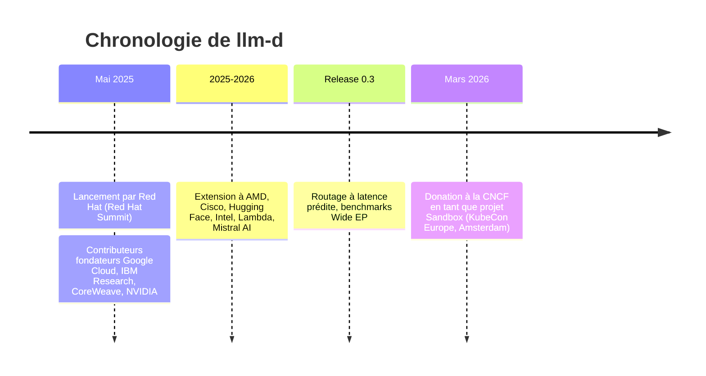
```mermaid
timeline
    title Chronologie de llm-d
    Mai 2025 : Lancement par Red Hat (Red Hat Summit)
             : Contributeurs fondateurs Google Cloud, IBM Research, CoreWeave, NVIDIA
    2025-2026 : Extension à AMD, Cisco, Hugging Face, Intel, Lambda, Mistral AI
    Release 0.3 : Routage à latence prédite, benchmarks Wide EP
    Mars 2026 : Donation à la CNCF en tant que projet Sandbox (KubeCon Europe, Amsterdam)
```

---

## 4. Vue d'ensemble de l'architecture

Au plus haut niveau, llm-d transforme un cluster Kubernetes en une fabrique d'inférence coordonnée avec trois briques architecturales :

1. **Le Router** (Proxy + Endpoint Picker) — le point d'entrée intelligent.
2. **L'InferencePool** — une Custom Resource Kubernetes représentant un groupe logique et découvrable de pods de serving de modèles servant le même modèle.
3. **Les Model Servers** — les moteurs d'inférence réels (principalement vLLM, aussi SGLang), qui exposent les métriques et les événements de KV-cache dont dépend le Router.

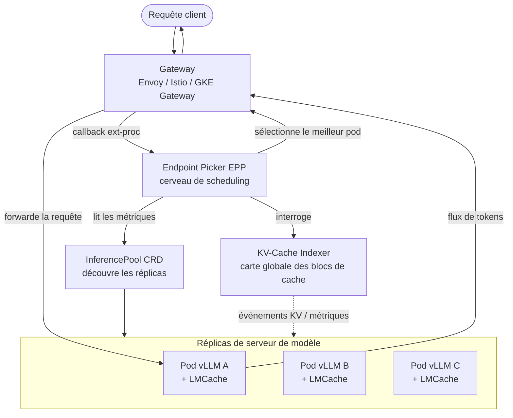
```mermaid
flowchart TB
    Client([Requête client]) --> GW[Gateway<br/>Envoy / Istio / GKE Gateway]
    GW -->|callback ext-proc| EPP[Endpoint Picker EPP<br/>cerveau de scheduling]
    EPP -->|interroge| Indexer[KV-Cache Indexer<br/>carte globale des blocs de cache]
    EPP -->|lit les métriques| Pool[InferencePool CRD<br/>découvre les réplicas]

    subgraph Pool_Members["Réplicas de serveur de modèle"]
        V1[Pod vLLM A<br/>+ LMCache]
        V2[Pod vLLM B<br/>+ LMCache]
        V3[Pod vLLM C<br/>+ LMCache]
    end

    Pool --> Pool_Members
    Indexer -.événements KV / métriques.-> Pool_Members
    EPP -->|sélectionne le meilleur pod| GW
    GW -->|forwarde la requête| V1
    V1 -->|flux de tokens| GW
    GW --> Client
```

Le système est conçu pour une **adoption incrémentale** : une équipe peut commencer par déployer uniquement le Router avec routage conscient du cache sur son pool vLLM existant (aucun prérequis réseau au-delà d'un réseau de cluster normal), et ne superposer que plus tard la désagrégation prefill/decode (qui exige un interconnect haute performance) et le parallélisme expert large.

---

## 5. Le Router llm-d : Proxy + Endpoint Picker (EPP)

### 5.1 Rôle du Proxy

Le **Proxy** est le composant du plan de données (généralement Envoy, ou une passerelle basée sur Envoy comme Istio ou la GKE Inference Gateway). Il termine les connexions client et, pour chaque requête d'inférence, appelle l'Endpoint Picker via le protocole *external processing* (ext-proc) d'Envoy avant de décider où transférer la requête.

### 5.2 Rôle de l'Endpoint Picker (EPP)

L'EPP est le véritable "cerveau" de décision. Il implémente le **Endpoint Picker Protocol**, qui fait partie de la **Gateway API Inference Extension (GAIE)**, un effort du SIG-Network de Kubernetes dont llm-d est une implémentation de référence principale. L'EPP évalue l'état courant de l'InferencePool et exécute un pipeline de scheduling en quatre étapes, entièrement pluggable :

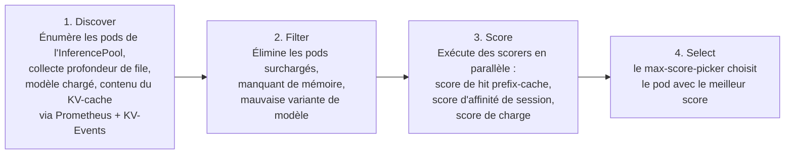
```mermaid
flowchart LR
    A["1. Discover<br/>Énumère les pods de l'InferencePool,<br/>collecte profondeur de file,<br/>modèle chargé, contenu du KV-cache<br/>via Prometheus + KV-Events"] --> B["2. Filter<br/>Élimine les pods surchargés,<br/>manquant de mémoire,<br/>mauvaise variante de modèle"]
    B --> C["3. Score<br/>Exécute des scorers en parallèle :<br/>score de hit prefix-cache,<br/>score d'affinité de session,<br/>score de charge"]
    C --> D["4. Select<br/>le max-score-picker choisit<br/>le pod avec le meilleur score"]
```

### 5.3 Anatomie interne du Scheduler et des plugins

Le **Scheduler** est un composant hautement modulaire au sein de l'EPP, basé sur une architecture à plugins. Le cycle complet de scheduling est le suivant :

- **ProfilePicker** : sélectionne quels profils de scheduling exécuter (par exemple `decode-profile`, `prefill-profile`).
- **Filters** : réduisent la liste des endpoints candidats.
- **Scorers** : notent chaque endpoint candidat restant.
- **Picker** : sélectionne le meilleur endpoint selon les scores.

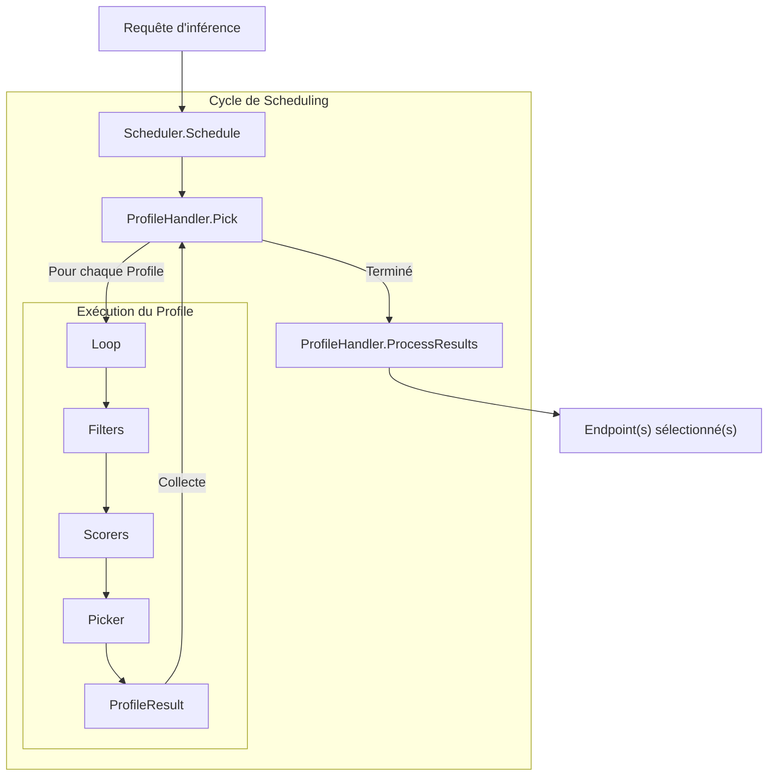
```mermaid
flowchart TD
    Req[Requête d'inférence] --> S[Scheduler.Schedule]
    subgraph Cycle["Cycle de Scheduling"]
        S --> Pick[ProfileHandler.Pick]
        Pick -->|Pour chaque Profile| Loop
        subgraph Exec["Exécution du Profile"]
            Loop --> Filters[Filters]
            Filters --> Scorers[Scorers]
            Scorers --> Picker[Picker]
            Picker --> Result[ProfileResult]
        end
        Result -->|Collecte| Pick
        Pick -->|Terminé| PRs[ProfileHandler.ProcessResults]
    end
    PRs --> Target["Endpoint(s) sélectionné(s)"]
```

Cette architecture par profils est ce qui permet à un même EPP de gérer aussi bien le routage simple (un seul profil) que la désagrégation P/D (deux profils, `decode` puis conditionnellement `prefill`, voir Section 10).

### 5.4 Signaux de scheduling clés

Selon la configuration, l'EPP peut combiner les signaux suivants :

- **Localité du prefix-cache** — ce pod détient-il déjà les blocs de KV-cache pour le préfixe de ce prompt ?
- **Utilisation du KV-cache** — quelle marge de cache reste-t-il à chaque pod candidat ?
- **Profondeur de file / requêtes en vol** — à quel point chaque pod est-il actuellement engorgé ?
- **Rôle prefill vs. decode** — dans les déploiements désagrégés, des filtres comme `prefill-filter` / `decode-filter` restreignent les candidats au bon pool.
- **Affinité de session** — utile pour les conversations multi-tours même sans indexation complète du prefix-cache.
- **Latence prédite** (expérimental depuis la release 0.3) — un scorer basé sur la prédiction de latence, qui a montré jusqu'à 3x d'amélioration de la latence P90 pour les charges à long prefill dans les benchmarks propres de llm-d.

### 5.5 Routage précis vs. heuristique du prefix-cache

llm-d supporte deux niveaux de conscience du cache :

- **Routage heuristique** : approxime la localité du cache (par exemple via un hachage cohérent du préfixe du prompt et l'historique de routage récent) sans interroger l'état réel du cache. Moins coûteux, fidélité plus faible.
- **Routage précis** : interroge le KV-Cache Indexer pour une vue quasi temps réel de quels blocs sont sur quel pod, permettant des décisions exactes maximisant les hits de cache. Fidélité plus haute, plus d'infrastructure à faire tourner.

### 5.6 InferencePool et CRD associées

L'**InferencePool** est une custom resource de la Gateway API Inference Extension qui regroupe les réplicas servant un même modèle et les relie à un EPP :

```yaml
apiVersion: inference.networking.x-k8s.io/v1alpha2
kind: InferencePool
metadata:
  name: llm-pool
  namespace: llm-serving
spec:
  targetPortNumber: 8000
  selector:
    app: vllm-llm-d
  endpointPickerConfig:
    extensionRef:
      name: llm-d-epp
```

Deux ressources compagnes affinent le comportement de l'EPP :

- **InferenceObjective** — configure les objectifs de scheduling pour une classe de requêtes (niveau de priorité, cible de performance).
- **InferenceModelRewrite** — permet l'aliasing/réécriture du nom de modèle au niveau du routage.

---

## 6. Le KV-Cache Indexer — anatomie interne

### 6.1 Pourquoi le cache est le levier le plus puissant

Un hit de cache permet au moteur de sauter entièrement le recalcul de l'attention sur le préfixe partagé. Un miss signifie un recalcul complet. C'est pourquoi le routage conscient du cache est constamment cité par le projet et ses adoptants comme **la capacité la plus mature et à plus fort effet de levier** de llm-d — elle ne nécessite aucun matériel réseau spécial et délivre la majorité des gains de latence et de débit atteignables.

### 6.2 Modules internes de l'Indexeur

L'**Index** est une bibliothèque Go qui maintient une vue globalement cohérente de la résidence des blocs de cache à travers le cluster. Il est composé de plusieurs modules :

| Module | Objectif |
|---|---|
| `kvcache.Indexer` | Orchestrateur global |
| `kvblock.TokenProcessor` | Conversion des tokens en clés de blocs (hachage) |
| `kvblock.Scorer` | Calcul du score de hit de cache par pod |
| `kvblock.Index` | Structure d'index des blocs |
| `kvevents.Pool` | Consommation des événements ZMQ émis par les pods |

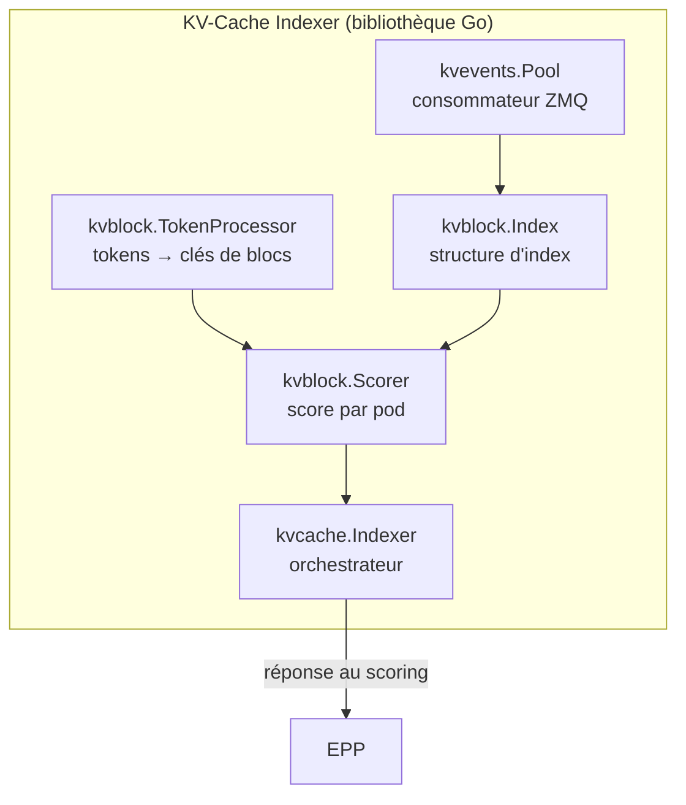
```mermaid
flowchart TB
    subgraph Indexer["KV-Cache Indexer (bibliothèque Go)"]
        TP[kvblock.TokenProcessor<br/>tokens → clés de blocs]
        POOL[kvevents.Pool<br/>consommateur ZMQ]
        IDX[kvblock.Index<br/>structure d'index]
        SC[kvblock.Scorer<br/>score par pod]
        ORCH[kvcache.Indexer<br/>orchestrateur]
    end
    POOL --> IDX
    TP --> SC
    IDX --> SC
    SC --> ORCH
    ORCH -->|réponse au scoring| EPP[EPP]
```

### 6.3 Types d'événements KV

Les serveurs de modèles publient trois types d'événements vers l'Indexeur :

| Événement | Description |
|---|---|
| `BlockStored` | Un bloc de cache est créé sur un tier de stockage spécifique |
| `BlockRemoved` | Un bloc est évincé d'un tier |
| `AllBlocksCleared` | Le cache entier du pod est vidé (reset complet) |

### 6.4 Modes de livraison des événements

1. **Centralisé** : chaque pod se connecte à un unique endpoint hébergé par l'EPP.
2. **Découverte de pods** : chaque pod bind son propre socket ZMQ ; l'EPP découvre les pods via l'API Kubernetes et s'abonne à chacun indépendamment (mode le plus courant en production, voir Section 7).

### 6.5 Offloading hiérarchique / multi-tier

La HBM du GPU est rare et coûteuse. llm-d (largement via LMCache, voir Section 14) supporte une hiérarchie de cache à plusieurs niveaux :

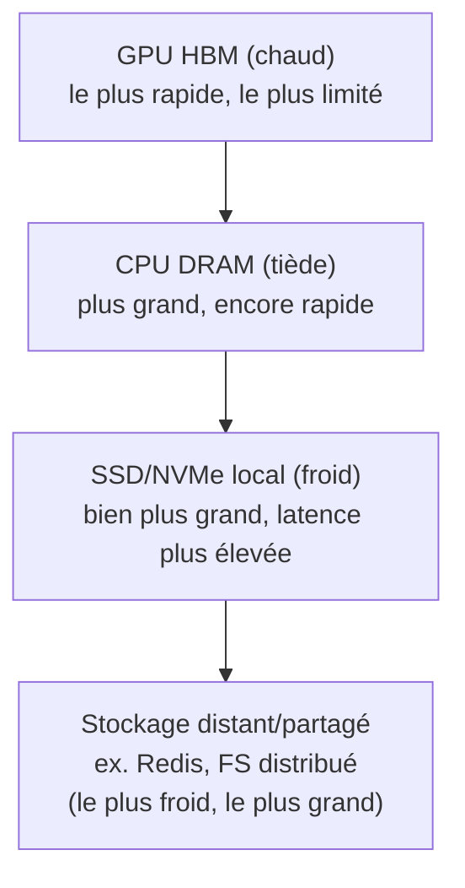
```mermaid
flowchart TB
    HBM["GPU HBM (chaud)<br/>le plus rapide, le plus limité"] --> DRAM["CPU DRAM (tiède)<br/>plus grand, encore rapide"]
    DRAM --> SSD["SSD/NVMe local (froid)<br/>bien plus grand, latence plus élevée"]
    SSD --> REMOTE["Stockage distant/partagé<br/>ex. Redis, FS distribué<br/>(le plus froid, le plus grand)"]
```

Les blocs sont automatiquement promus et rétrogradés entre les tiers selon la récence et la fréquence d'accès. Des scorers comme `precise-prefix-cache-scorer` sont conscients du tier, donc le routeur peut préférer un pod avec un bloc résidant en HBM chaude plutôt qu'un pod qui devrait rapatrier le même bloc depuis la RAM CPU ou le disque.

### 6.6 Effet sur les deux métriques de serving dominantes

- **TTFT (Time-To-First-Token)** : directement réduit par les hits de cache, puisque l'étape de prefill lourde en calcul pour la portion cachée est sautée.
- **Débit (tokens/s)** : amélioré car les cycles GPU ne sont pas gaspillés à recalculer des préfixes identiques à travers une charge de prompt partagé ou multi-tours.

---

## 7. Comment llm-d communique réellement : les deux plans

Pour bien comprendre comment llm-d fonctionne au quotidien, il faut voir son architecture comme **deux plans de communication bien distincts**, chacun avec des rôles, des protocoles et des exigences de performance très différents.

| Canal de communication | Direction | Protocole | Objectif |
|---|---|---|---|
| **Flux d'événements (Write Path)** | vLLM → llm-d | **ZMQ** (PUB/SUB) | Publier les changements d'état du KV-cache (ajouts, suppressions) |
| **API de scoring (Read Path)** | Routeur llm-d → Indexeur | **HTTP** (REST) | Interroger l'index pour savoir quel pod a le plus de cache pour un prompt donné |

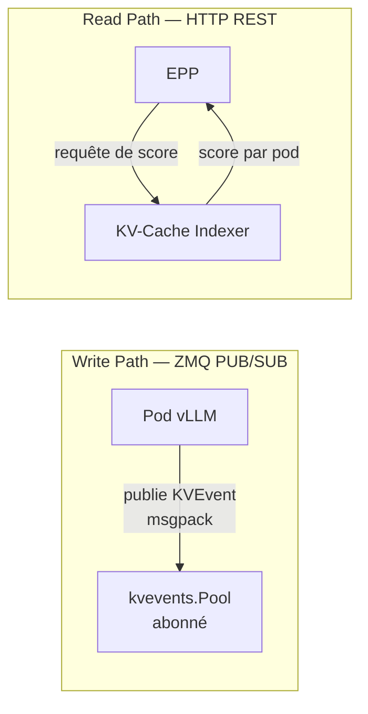
```mermaid
flowchart LR
    subgraph WritePath["Write Path — ZMQ PUB/SUB"]
        V1[Pod vLLM] -->|publie KVEvent<br/>msgpack| Sub[kvevents.Pool<br/>abonné]
    end
    subgraph ReadPath["Read Path — HTTP REST"]
        EPP2[EPP] -->|requête de score| IDX2[KV-Cache Indexer]
        IDX2 -->|score par pod| EPP2
    end
```

### 7.1 Le cerveau de l'orchestration : la communication par ZMQ

**ZMQ (ZeroMQ)** est la pièce maîtresse pour la communication non-bloquante et à haute vitesse entre les serveurs de modèles (vLLM) et le plan de contrôle de llm-d. Il ne s'agit pas de transporter les données des modèles elles-mêmes, mais les **métadonnées** cruciales sur l'état du cache.

- **Architecture Pub/Sub** : chaque pod vLLM agit comme un **éditeur (publisher)** qui publie en continu des événements dès que son cache local change. Le routeur llm-d, via son composant `kvevents.Pool`, agit comme un **abonné (subscriber)**.
- **Mécanisme de découverte** : pour une scalabilité maximale, chaque pod vLLM **bind son propre socket ZMQ**. Chaque réplica du routeur llm-d s'abonne alors à **chaque pod indépendamment**. Cette architecture "en étoile" assure une haute disponibilité et une tolérance aux pannes.
- **Format des messages** : les événements sont publiés sur des topics structurés, par exemple `kv@<POD_IP>@<MODEL_NAME>`. Le payload est sérialisé en **msgpack**, un format binaire léger et rapide.

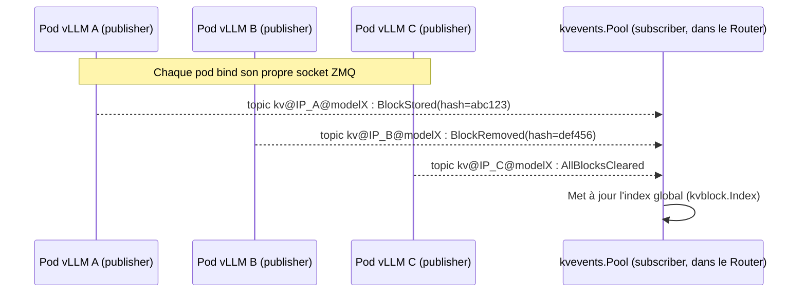
```mermaid
sequenceDiagram
    participant PodA as Pod vLLM A (publisher)
    participant PodB as Pod vLLM B (publisher)
    participant PodC as Pod vLLM C (publisher)
    participant KVP as kvevents.Pool (subscriber, dans le Router)

    Note over PodA,PodC: Chaque pod bind son propre socket ZMQ
    PodA-->>KVP: topic kv@IP_A@modelX : BlockStored(hash=abc123)
    PodB-->>KVP: topic kv@IP_B@modelX : BlockRemoved(hash=def456)
    PodC-->>KVP: topic kv@IP_C@modelX : AllBlocksCleared
    KVP->>KVP: Met à jour l'index global (kvblock.Index)
```

### 7.2 Le moteur de performance : la communication HPC (CUDA, RDMA, NIXL)

Si ZMQ gère la **stratégie** (où se trouve le cache), une autre couche, bien plus rapide, gère le **mouvement des données elles-mêmes** : le transfert des poids du modèle et du KV-cache entre GPU.

- **L'enjeu** : dans une architecture désagrégée, le KV-cache doit être transféré du pod *prefill* au pod *decode* **avant** que le premier token ne soit généré. La latence de ce transfert impacte directement le TTFT.
- **La solution : NIXL et une pile en couches**. llm-d utilise **NIXL (NVIDIA Inference Xfer Library)** comme bibliothèque de transfert principale. NIXL agit comme une couche d'abstraction, permettant à vLLM d'initier des transferts sans connaître les détails du réseau sous-jacent. Il fonctionne en mode **pull-based** : le pod *decode* lit directement la mémoire GPU du pod *prefill* via des **lectures RDMA one-sided**, réduisant la charge CPU et la synchronisation.

NIXL s'appuie sur une pile de transport modulaire :

| Backend | Rôle |
|---|---|
| **UCX (Unified Communication X)** | Backend par défaut ; framework mature de l'écosystème HPC, abstrait InfiniBand, RoCE et TCP. |
| **UCCL (Unified Cloud Communication Library)** | Backend plus récent, contrôle plus fin, flow splitting et congestion control adaptés aux patterns de trafic IA. |
| **libfabric** | Utilisé spécifiquement sur AWS pour supporter l'EFA (Elastic Fabric Adapter). |

llm-d intègre aussi des bibliothèques et kernels optimisés CUDA comme **NVSHMEM**, **DeepEP** et **FlashInfer**. La chaîne de compilation gère ces dépendances complexes en compilant UCX et NVSHMEM avant de construire les kernels spécialisés. Le support s'étend également à **Intel XPU**, **Google TPU** et **AMD ROCm**.

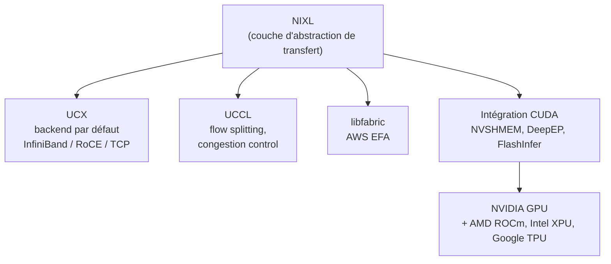
```mermaid
flowchart TB
    NIXL["NIXL<br/>(couche d'abstraction de transfert)"]
    NIXL --> UCX["UCX<br/>backend par défaut<br/>InfiniBand / RoCE / TCP"]
    NIXL --> UCCL["UCCL<br/>flow splitting,<br/>congestion control"]
    NIXL --> LIBFABRIC["libfabric<br/>AWS EFA"]
    NIXL --> CUDA["Intégration CUDA<br/>NVSHMEM, DeepEP, FlashInfer"]
    CUDA --> HW["NVIDIA GPU<br/>+ AMD ROCm, Intel XPU, Google TPU"]
```

### 7.3 Synthèse : une architecture de communication à deux vitesses

- **ZMQ** est le **système nerveux** : il transmet l'information (métadonnées sur l'état du cache) de façon légère et asynchrone, permettant à tous les serveurs vLLM de publier l'état de leur cache pour que le routeur prenne des décisions quasi temps réel.
- **NIXL / RDMA / CUDA** est le **système musculaire** : il déplace massivement les données réelles (poids, KV-cache) entre GPU, de façon ultra-rapide.

llm-d orchestre ces deux mondes pour offrir une infrastructure d'inférence distribuée à la fois intelligente et extrêmement performante.

---

## 8. Comment llm-d "parle" à vLLM et LMCache — le plan de contrôle

Il faut voir cela comme une **orchestration en trois couches** qui fonctionne en continu : des déclarations Kubernetes, des flux d'événements, et des connecteurs API.

### 8.1 Les ressources personnalisées Kubernetes (CRD) — le "quoi orchestrer"

- **`InferencePool`** : définit un groupe de serveurs de modèles (pods vLLM) servant le même modèle. Elle indique quels pods surveiller (sélecteur de labels), sur quel port ils écoutent, et où trouver l'EPP.

  > *Exemple concret* : un fichier YAML dit à llm-d : *"Va chercher tous les pods qui ont le label `model: llama3` et `role: prefill` dans le namespace `llm-d` ; ils formeront mon InferencePool pour le pré-remplissage."*

- **`HTTPRoute`** : dit au Proxy comment acheminer le trafic externe vers le bon `InferencePool`.

### 8.2 Les connecteurs — l'interface technique avec vLLM

Pour interagir avec vLLM et LMCache, llm-d s'appuie sur des **connecteurs**, des morceaux de code qui s'intègrent dans l'API de vLLM :

- **`OffloadingConnector`** (natif de vLLM) : activé en passant des arguments au lancement de vLLM. Permet à vLLM de décharger son cache KV vers le CPU ou un stockage partagé — llm-d fournit un backend (*llm-d FS backend*) permettant à ce connecteur d'écrire sur un système de fichiers partagé, qui peut être LMCache.
- **Connecteur LMCache** (externe) : llm-d configure vLLM pour déléguer toute la gestion de son cache à LMCache.

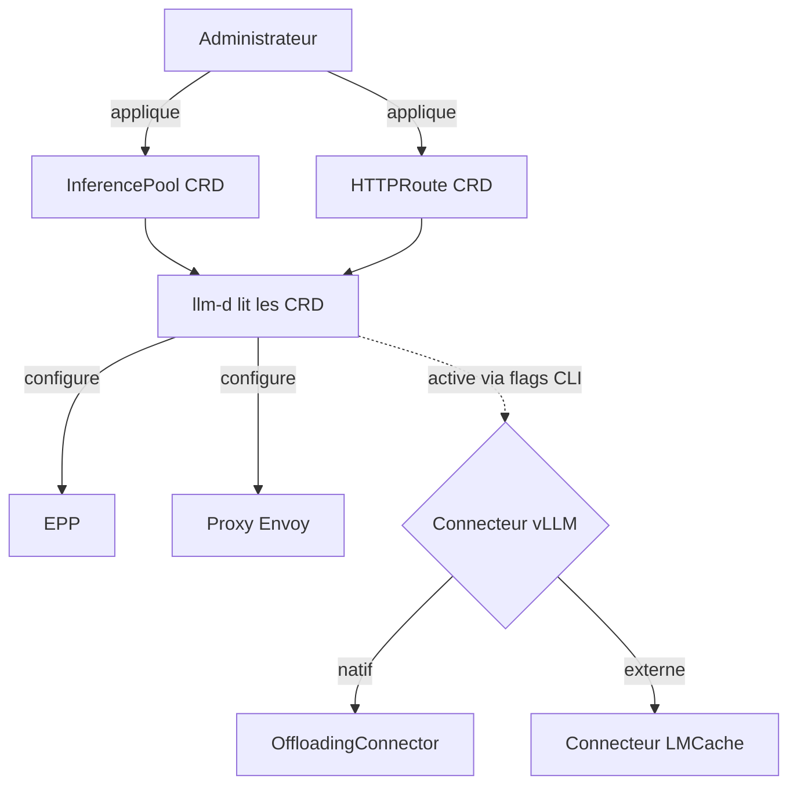
```mermaid
flowchart TB
    Admin[Administrateur] -->|applique| CR1[InferencePool CRD]
    Admin -->|applique| CR2[HTTPRoute CRD]
    CR1 --> LLMD[llm-d lit les CRD]
    CR2 --> LLMD
    LLMD -->|configure| EPP3[EPP]
    LLMD -->|configure| Proxy3[Proxy Envoy]
    LLMD -.active via flags CLI.-> Conn{Connecteur vLLM}
    Conn -->|natif| Off[OffloadingConnector]
    Conn -->|externe| LMC[Connecteur LMCache]
```

### 8.3 Le dialogue en deux temps avec vLLM

**A. vLLM parle à llm-d — le "chemin d'écriture" (Write Path)**

Chaque pod vLLM publie des `KVEvents` en ZMQ PUB/SUB (voir Section 7.1), reçus par le `kvevents.Pool` du KV-Cache Manager de llm-d.

> *Exemple* : un utilisateur envoie un long prompt à `vLLM-Pod-A`. Le pod calcule le KV-cache, puis publie immédiatement : *"Cache pour le hash `abc123` disponible sur moi (Pod-A, IP X, mémoire GPU)."* Le KV-Cache Manager met à jour son index global.

**B. llm-d parle à vLLM — le "chemin de lecture" (Read Path)**

Quand une nouvelle requête arrive, l'EPP interroge le KV-Cache Manager, reçoit un score de "cache hit" par pod, choisit le meilleur, et donne l'instruction au Proxy d'acheminer la requête vers ce pod précis.

> *Exemple* : un nouvel utilisateur envoie une requête avec le même prompt `abc123`. Le KV-Cache Manager répond : *"vLLM-Pod-A a un score de 1.0 (cache complet), les autres 0.0."* L'EPP instruit le Proxy d'acheminer vers Pod-A, qui génère la réponse extrêmement rapidement, sans recalculer le prompt.

### 8.4 LMCache comme "mémoire secondaire" partagée

LMCache n'est pas un composant qui "parle" directement à llm-d — c'est un **système de stockage** que llm-d utilise via vLLM. Quand la mémoire GPU d'un pod vLLM est saturée (ou selon une politique définie), le pod peut **décharger (offload)** ses blocs de cache les moins utilisés vers LMCache. Une fois là, ces blocs deviennent disponibles pour **tous les autres pods vLLM du cluster**.

> *Exemple* : `vLLM-Pod-A` décharge le cache `abc123` vers LMCache via l'`OffloadingConnector` activé par llm-d, puis publie : *"Cache pour `abc123` maintenant disponible sur le stockage partagé."* Plus tard, `vLLM-Pod-B` reçoit une requête pour `abc123` : n'ayant pas le cache en local, il le **charge (load)** depuis LMCache dans sa propre mémoire GPU avant de générer — le calcul lourd est de nouveau évité, même si le cache a changé de serveur physique.

### 8.5 Synthèse du cycle de vie complet d'une requête

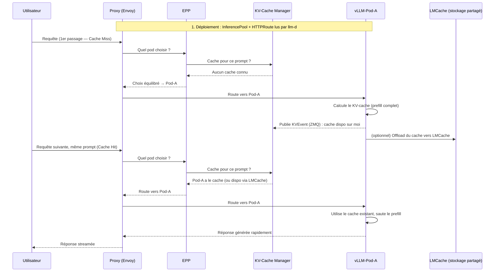
```mermaid
sequenceDiagram
    participant U as Utilisateur
    participant Proxy as Proxy (Envoy)
    participant EPP as EPP
    participant KVM as KV-Cache Manager
    participant PA as vLLM-Pod-A
    participant LMC as LMCache (stockage partagé)

    Note over Proxy,PA: 1. Déploiement : InferencePool + HTTPRoute lus par llm-d

    U->>Proxy: Requête (1er passage — Cache Miss)
    Proxy->>EPP: Quel pod choisir ?
    EPP->>KVM: Cache pour ce prompt ?
    KVM-->>EPP: Aucun cache connu
    EPP-->>Proxy: Choix équilibré → Pod-A
    Proxy->>PA: Route vers Pod-A
    PA->>PA: Calcule le KV-cache (prefill complet)
    PA-->>KVM: Publie KVEvent (ZMQ) : cache dispo sur moi
    PA->>LMC: (optionnel) Offload du cache vers LMCache

    U->>Proxy: Requête suivante, même prompt (Cache Hit)
    Proxy->>EPP: Quel pod choisir ?
    EPP->>KVM: Cache pour ce prompt ?
    KVM-->>EPP: Pod-A a le cache (ou dispo via LMCache)
    EPP-->>Proxy: Route vers Pod-A
    Proxy->>PA: Route vers Pod-A
    PA->>PA: Utilise le cache existant, saute le prefill
    PA-->>Proxy: Réponse générée rapidement
    Proxy-->>U: Réponse streamée
```

---

## 9. Le cache KV en trois phases — de la mémoire locale à la ressource routable

Ce schéma conceptuel illustre le cœur neuronal de llm-d : la transformation du KV-cache, habituellement une ressource **locale et éphémère** à un seul GPU, en une **ressource réseau partagée, indexée et routable** à l'échelle de tout le cluster.

### Phase 1 — L'indexation du cache (la "mémoire vive" du cluster)

Lorsque vLLM reçoit un prompt, il calcule les clés et valeurs d'attention (KV-cache), une phase de calcul lourde (le *prefill*). Sans coordination, un autre serveur recevant le même prompt plus tard **recalculerait** ces mêmes valeurs — un gaspillage de calcul et d'électricité.

Dans le système : `vLLM1` reçoit "Prompt A", exécute le prefill, stocke le cache en HBM locale, puis **publie un événement** (ZMQ) : *"Cache du préfixe 'Prompt A' disponible sur moi."* Le `KV-Cache Manager` s'abonne à tous ces événements et met à jour sa table de hachage globale en quelques millisecondes.

### Phase 2 — Le routage "intelligent" (l'évitement du recalcul)

Sans routage conscient du cache, un load-balancer classique enverrait "Prompt A" vers `vLLM2` avec 50% de chances, provoquant un cache miss coûteux.

Dans le système : un nouveau client envoie le même "Prompt A" au Router (EPP). Le Router interroge le KV-Cache Manager : *"Pour ce préfixe, quel est le meilleur candidat ?"* L'index répond : *"vLLM1 est le plus à chaud."* Le Router achemine **exclusivement** vers `vLLM1`, qui saute le prefill et passe directement au decode — c'est un **"Cache Hit"**.

### Phase 3 — La mutualisation et la hiérarchie du cache (la stratégie de coûts)

La mémoire GPU (HBM) est le composant le plus cher et le plus rare du cluster. Si `vLLM1` accumule trop de caches peu utilisés, il sature sa mémoire.

Dans le système : `vLLM1` **offload** le cache vers le **stockage partagé LMCache** (souvent RAM CPU rapide ou NVMe). Le cache devient **persistant et partagé** : même si `vLLM1` redémarre, est saturé, ou si le routeur envoie la requête suivante vers `vLLM2`, celui-ci peut **charger** ce cache depuis LMCache avant de générer. Le prefill est de nouveau évité, même si le cache a changé de serveur physique.

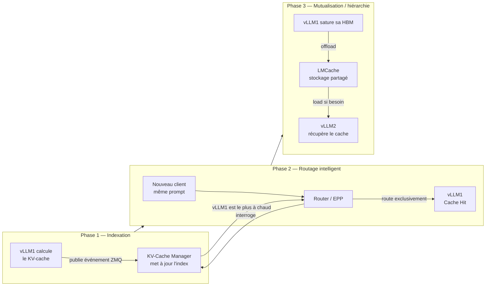
```mermaid
flowchart LR
    subgraph Phase1["Phase 1 — Indexation"]
        V1[vLLM1 calcule<br/>le KV-cache] -->|publie événement ZMQ| KVM1[KV-Cache Manager<br/>met à jour l'index]
    end
    subgraph Phase2["Phase 2 — Routage intelligent"]
        C2[Nouveau client<br/>même prompt] --> R2[Router / EPP]
        R2 -->|interroge| KVM1
        KVM1 -->|"vLLM1 est le plus à chaud"| R2
        R2 -->|route exclusivement| V1b[vLLM1<br/>Cache Hit]
    end
    subgraph Phase3["Phase 3 — Mutualisation / hiérarchie"]
        V1c[vLLM1 sature sa HBM] -->|offload| LMC3[LMCache<br/>stockage partagé]
        LMC3 -->|load si besoin| V2b[vLLM2<br/>récupère le cache]
    end
    Phase1 --> Phase2 --> Phase3
```

### Synthèse : comment ces trois phases interagissent

Ce n'est pas une simple séquence, mais un **cycle de vie continu** :

1. La **Phase 1** rend le cache **découvrable** (l'orchestrateur sait où se trouve la connaissance).
2. La **Phase 2** rend le cache **exploitable** (le routeur oriente le trafic exactement là où se trouve la connaissance, pour un gain de vitesse maximal).
3. La **Phase 3** rend le cache **durable et transportable** (libère les ressources chères et évite de perdre le travail si un serveur change).

En production, ce mécanisme tourne en boucle des milliers de fois par seconde. llm-d atteint ainsi deux objectifs majeurs :

- **Réduction drastique du coût par token** : moins de recalculs de prefill = moins de consommation GPU.
- **Latence quasi constante** : la durée de réponse dépend principalement de la longueur de la génération, et non plus de la longueur du prompt initial, car le calcul lourd est contourné grâce au routage précis vers le cache.

---

## 10. Désagrégation Prefill/Decode (P/D)

### 10.1 L'idée centrale

Au lieu de faire tourner prefill et decode pour une requête sur le même GPU/pod, llm-d peut router l'étape de traitement du prompt vers un **worker prefill**, et l'étape de génération de tokens vers un **worker decode** séparément scalé, en transférant le KV-cache calculé entre eux via un interconnect haute performance.

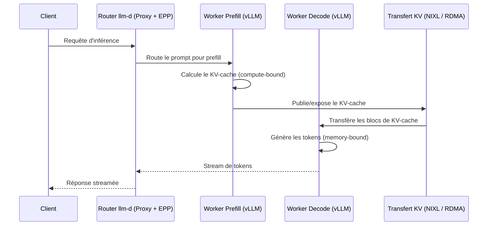
```mermaid
sequenceDiagram
    participant Client
    participant Router as Router llm-d (Proxy + EPP)
    participant Prefill as Worker Prefill (vLLM)
    participant Decode as Worker Decode (vLLM)
    participant Xfer as Transfert KV (NIXL / RDMA)

    Client->>Router: Requête d'inférence
    Router->>Prefill: Route le prompt pour prefill
    Prefill->>Prefill: Calcule le KV-cache (compute-bound)
    Prefill->>Xfer: Publie/expose le KV-cache
    Xfer->>Decode: Transfère les blocs de KV-cache
    Decode->>Decode: Génère les tokens (memory-bound)
    Decode-->>Router: Stream de tokens
    Router-->>Client: Réponse streamée
```

### 10.2 Pourquoi cela aide

- Chaque phase tourne sur du matériel adapté à son goulot d'étranglement.
- Les longs prefills ne bloquent plus le decode des autres utilisateurs concurrents sur le même GPU.
- Le **TPOT** (Time-Per-Output-Token) devient plus stable et prédictible — important pour les engagements de SLA.
- Chaque pool (prefill, decode) peut être scalé indépendamment selon son propre signal de goulot d'étranglement.

### 10.3 Le prérequis dur : la performance réseau

Le transfert de KV-cache entre workers prefill et decode déplace des tenseurs de plusieurs gigaoctets par requête. Si l'interconnect est lent, le coût du transfert peut dépasser le coût de simplement recalculer le cache, annulant tout le bénéfice. La désagrégation en production suppose donc un **interconnect haute performance** : NIC compatibles RDMA, NVLink pour le transfert intra-nœud, InfiniBand ou RoCE pour le transfert inter-nœuds. Sur un réseau cloud classique 1GbE/10GbE sans RDMA, la désagrégation ne paiera probablement pas et ne devrait généralement pas être activée.

### 10.4 La couche de transport : NIXL

Le transport du KV-cache sur ce chemin est géré par **NIXL**, la même couche décrite en Section 7.2, qui est aussi celle utilisée par les implémentations de prefill désagrégé de vLLM et LMCache (voir Sections 13–14).

### 10.5 Le "Decider" et le routing sidecar — la logique de décision fine

L'EPP utilise un **`disagg-profile-handler`** qui suit ces étapes :

1. Le proxy transfère la requête à l'EPP.
2. Le `disagg-profile-handler` exécute le `decode-profile` pour sélectionner un endpoint **D**.
3. Le **Decider** consulte l'état du cache sur D pour décider si la requête doit réellement être désagrégée.
4. Si **non** (petit suffixe non-caché) → l'EPP retourne uniquement D.
5. Si **oui** (grand suffixe non-caché) → l'EPP exécute le `prefill-profile` pour sélectionner un endpoint **P**, et retourne P et D.

### 10.6 Filtrage par labels

llm-d utilise le label **`llm-d.ai/role`** avec les valeurs :

- `prefill` → workers dédiés au préremplissage
- `decode` → workers dédiés à la génération

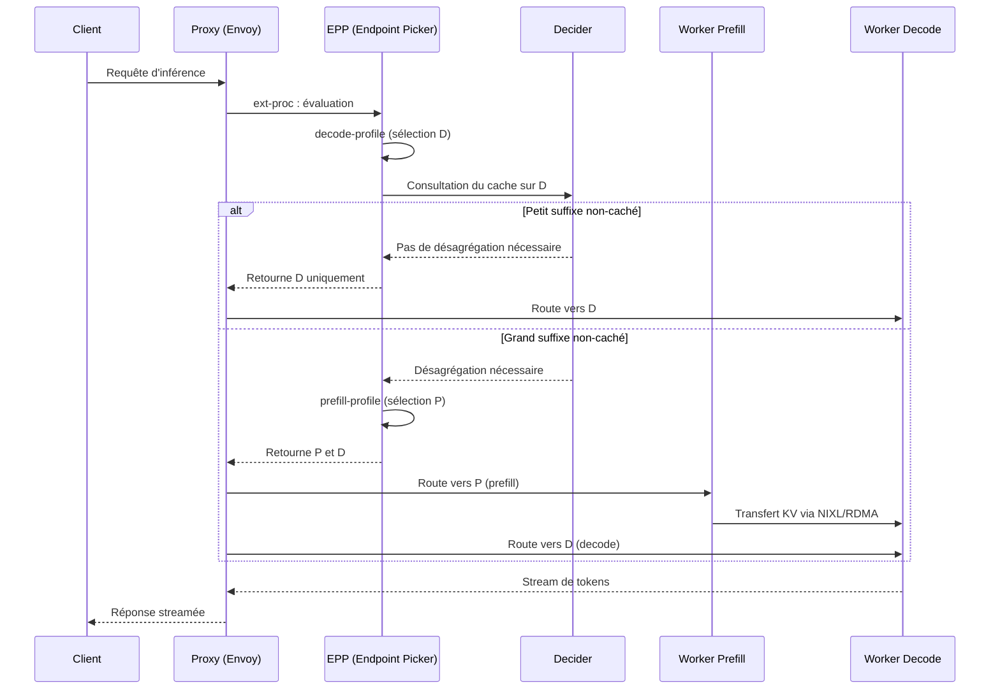
```mermaid
sequenceDiagram
    participant Client
    participant Proxy as Proxy (Envoy)
    participant EPP as EPP (Endpoint Picker)
    participant Decider as Decider
    participant P as Worker Prefill
    participant D as Worker Decode

    Client->>Proxy: Requête d'inférence
    Proxy->>EPP: ext-proc : évaluation
    EPP->>EPP: decode-profile (sélection D)
    EPP->>Decider: Consultation du cache sur D
    alt Petit suffixe non-caché
        Decider-->>EPP: Pas de désagrégation nécessaire
        EPP-->>Proxy: Retourne D uniquement
        Proxy->>D: Route vers D
    else Grand suffixe non-caché
        Decider-->>EPP: Désagrégation nécessaire
        EPP->>EPP: prefill-profile (sélection P)
        EPP-->>Proxy: Retourne P et D
        Proxy->>P: Route vers P (prefill)
        P->>D: Transfert KV via NIXL/RDMA
        Proxy->>D: Route vers D (decode)
    end
    D-->>Proxy: Stream de tokens
    Proxy-->>Client: Réponse streamée
```

---

## 11. Wide Expert Parallelism (pour les modèles MoE)

Pour les modèles Mixture-of-Experts (ex. architectures de la classe DeepSeek-R1, 500 Go+ de poids), un seul GPU ne peut pas économiquement héberger tous les experts. Le well-lit path **Wide Expert Parallelism (Wide EP)** de llm-d distribue les experts sur de nombreux GPU.

### 11.1 Le flux dispatch/combine

1. Chaque rank exécute l'attention indépendamment (parallélisme de données).
2. Le routeur MoE sélectionne les `topk` experts pour chaque token (ex. 8 sur 256 pour DeepSeek).
3. Les tokens sont **dispatchés** vers les ranks experts appropriés.
4. Chaque expert s'exécute indépendamment.
5. Les tokens sont **combinés** (*combine*) vers le rank d'attention original.

### 11.2 Infrastructure requise

- Le dispatch/combine utilise le backend **DeepEP** sur **NVSHMEM**, avec **RDMA initié par le GPU** (transport `ibgda`).
- Nécessite une connectivité **full-mesh InfiniBand/RoCE**.
- Guide validé sur **32 GPU NVIDIA H200 ou B200**.
- Orchestration via **LeaderWorkerSet (LWS)**, une CRD Kubernetes, pour coordonner les groupes de workers multi-hôtes (un pod leader coordonnant un ensemble de pods workers).


```mermaid
flowchart LR
    subgraph DPEP["Déploiement DP/EP"]
        A[Rank 1: Attention] -->|Dispatch| E1[Expert 1]
        A -->|Dispatch| E3[Expert 3]
        B[Rank 2: Attention] -->|Dispatch| E2[Expert 2]
        B -->|Dispatch| E4[Expert 4]
        C[Rank N: Attention] -->|Dispatch| E1
        C -->|Dispatch| E2
        E1 -->|Combine| A
        E2 -->|Combine| B
        E3 -->|Combine| A
        E4 -->|Combine| C
    end
    subgraph DeepEPBox["DeepEP"]
        D1[All-to-All RDMA<br/>via NVSHMEM / ibgda]
    end
    E1 <--> D1
    E2 <--> D1
    E3 <--> D1
    E4 <--> D1
```

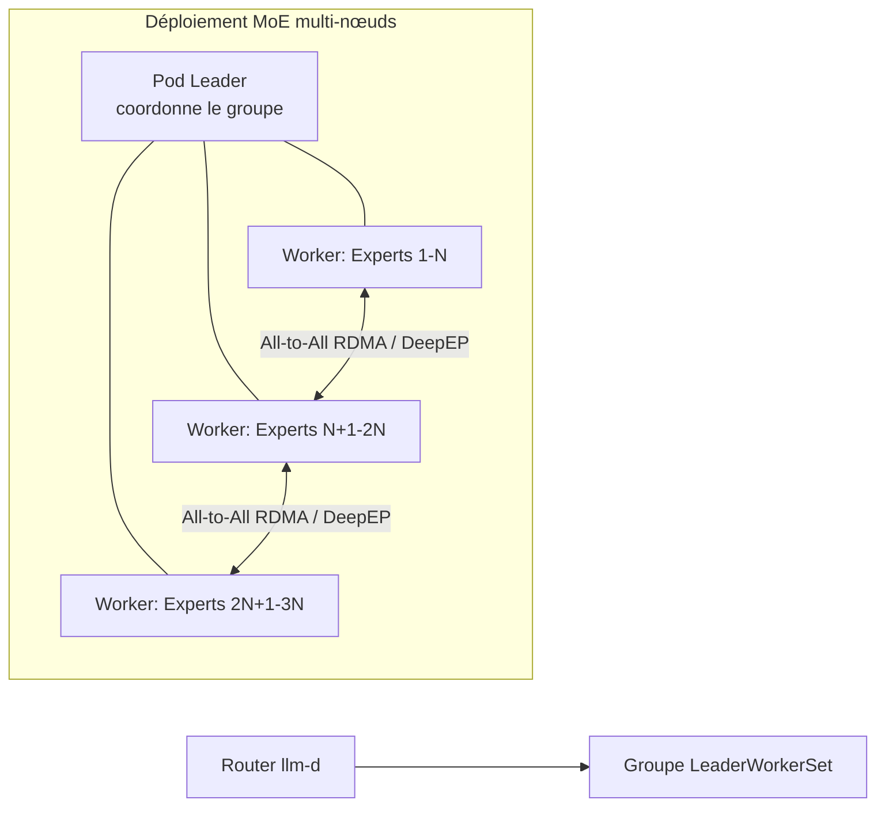
```mermaid
flowchart LR
    Router4[Router llm-d] --> LWS4[Groupe LeaderWorkerSet]
    subgraph LWSGroup["Déploiement MoE multi-nœuds"]
        Leader4[Pod Leader<br/>coordonne le groupe]
        W1_4[Worker: Experts 1-N]
        W2_4[Worker: Experts N+1-2N]
        W3_4[Worker: Experts 2N+1-3N]
        Leader4 --- W1_4
        Leader4 --- W2_4
        Leader4 --- W3_4
        W1_4 <-->|All-to-All RDMA / DeepEP| W2_4
        W2_4 <-->|All-to-All RDMA / DeepEP| W3_4
    end
```

Dans les benchmarks propres de la release 0.3 de llm-d, ce chemin a scalé le débit du parallélisme expert jusqu'à environ **2,2k tokens/s par GPU H200**. Comme pour la désagrégation, cette fonctionnalité suppose un interconnect rapide entre nœuds.

---

## 12. Autoscaling piloté par les SLO

L'autoscaling Kubernetes générique (HPA basé CPU/mémoire, ou règles KEDA simples déclenchées par la profondeur de file) n'a aucune notion des niveaux de service spécifiques à l'inférence. Le pilier "excellence opérationnelle" de llm-d superpose une logique d'autoscaling sur des signaux d'inférence réels.

### 12.1 Signaux utilisés

- Utilisation / taux de hit du KV-cache
- Profondeur de file et nombre de requêtes en vol, par pool (prefill vs. decode)
- TTFT / TPOT observés, comparés aux cibles SLO configurées

### 12.2 Principe de scaling — proactif et basé sur un modèle de file d'attente

L'autoscaling de llm-d est **proactif** et s'appuie sur :

- Un **modèle de file d'attente** : analyse pilotée par les SLO basée sur la théorie des files d'attente.
- Le **SLOMultiplier** : le ratio maximal tolérable entre le temps d'itération sous charge et la latence de base.

L'autoscaler compare les signaux réels aux cibles SLO :

- Si un dépassement de SLO est proche → **scale out**.
- Si la marge est confortable et le taux de hit de cache élevé → **scale in**.

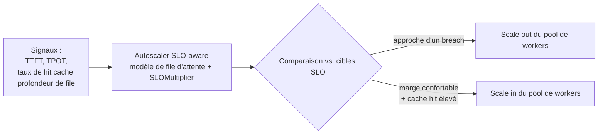
```mermaid
flowchart LR
    M["Signaux :<br/>TTFT, TPOT,<br/>taux de hit cache,<br/>profondeur de file"] --> A[Autoscaler SLO-aware<br/>modèle de file d'attente + SLOMultiplier]
    A --> D{Comparaison vs. cibles SLO}
    D -->|approche d'un breach| Out[Scale out du pool de workers]
    D -->|marge confortable<br/>+ cache hit élevé| In[Scale in du pool de workers]
```

L'intention affichée est de laisser les clusters tourner plus "chauds" — c'est-à-dire plus proches de l'utilisation complète — avant de scaler, extrayant plus de travail utile par GPU tout en respectant les objectifs de latence, plutôt que de provisionner de manière conservatrice "au cas où".

llm-d inclut aussi un **contrôle de flux** pour l'équité multi-tenant (pour qu'un tenant bruyant ne puisse pas affamer les autres en temps GPU) et des **API de batch compatibles OpenAI** pour l'inférence asynchrone hors-ligne à grande échelle, maximisant l'utilisation matérielle en dehors du chemin de serving en ligne.

---

## 13. Intégration avec vLLM

vLLM est le moteur de serving principal et le plus profondément supporté par llm-d (SGLang est aussi supporté comme moteur alternatif dans certains well-lit paths — voir Section 15).

La séparation des responsabilités est nette :

- **vLLM** possède tout ce qui se passe **à l'intérieur** d'une réplique : chargement du modèle, PagedAttention, batching, la boucle réelle de génération de tokens — et, crucialement, l'exposition des métriques et événements de KV-cache dont dépend le reste de la pile.
- **llm-d** possède tout ce qui se passe **à travers** les réplicas : quelle réplique reçoit quelle requête, comment les phases sont réparties entre réplicas, et comment tout le pool scale.

### 13.1 Ce que chaque pod vLLM doit faire

1. Exposer des **métriques compatibles Prometheus** — profondeur de file, pourcentage d'utilisation du KV-cache GPU, nombre de requêtes en cours/en attente, etc. — consommées par les scorers de l'EPP.
2. Émettre des **événements de KV-cache** (création/éviction de blocs) qui alimentent le KV-Cache Indexer pour le routage précis du prefix-cache.
3. S'**enregistrer auprès de l'InferencePool** pour que le Router puisse le découvrir comme candidat valide.
4. Pour les déploiements désagrégés, démarrer avec le bon `--kv-transfer-config` pour savoir s'il agit comme producteur KV (prefill) ou consommateur KV (decode), et via quel connecteur (voir Section 14).

### 13.2 Le connecteur KV — la couture technique

L'évolution architecturale de vLLM (la réécriture du moteur "V1") a spécifiquement ajouté une **interface de connecteur KV propre et pluggable** dans le cœur, pour que des systèmes externes de cache/transfert — comme LMCache et des connecteurs basés NIXL — puissent s'attacher **sans forker vLLM**. Cette interface de connecteur est la couture technique qui rend possibles les fonctionnalités conscientes du cache et désagrégées de llm-d sans que vLLM lui-même ne devienne un système distribué.

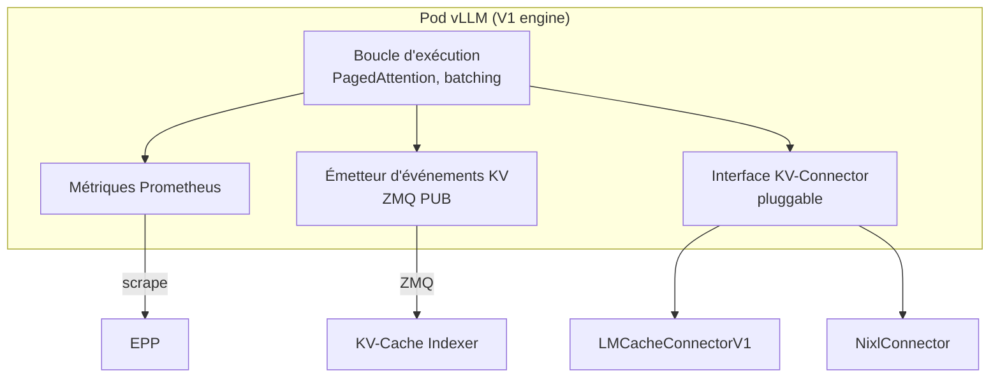
```mermaid
flowchart TB
    subgraph vLLMPod["Pod vLLM (V1 engine)"]
        Exec[Boucle d'exécution<br/>PagedAttention, batching]
        Metrics[Métriques Prometheus]
        KVEvt[Émetteur d'événements KV<br/>ZMQ PUB]
        ConnAPI[Interface KV-Connector<br/>pluggable]
    end
    Exec --> Metrics
    Exec --> KVEvt
    Exec --> ConnAPI
    ConnAPI --> LMCacheConn[LMCacheConnectorV1]
    ConnAPI --> NixlConn[NixlConnector]
    Metrics -->|scrape| EPP5[EPP]
    KVEvt -->|ZMQ| IndexerBox[KV-Cache Indexer]
```

---

## 14. Intégration avec LMCache

**LMCache** est un projet open-source indépendant qui étend les moteurs d'inférence (principalement vLLM) avec une couche de KV-cache multi-tier haute performance. Dans l'écosystème llm-d, LMCache est communément décrit comme la **couche de KV-cache par défaut** de llm-d — il ne fait pas partie du code de llm-d lui-même, mais les well-lit paths et guides de llm-d l'intègrent comme la manière recommandée d'obtenir un cache hiérarchisé et une réutilisation de cache inter-nœuds.

### 14.1 Mode d'intégration : le connecteur KV plug-in

LMCache s'attache à vLLM via l'API KV-Connector de vLLM. Dans le moteur V1 actuel de vLLM, la classe de connecteur pertinente est **`LMCacheConnectorV1`**. C'est le chemin d'intégration principal et recommandé : il permet à LMCache de gérer sa propre indexation de blocs et sa mémoire multi-tier (HBM GPU → RAM CPU → SSD local → stockage distant/partagé) tout en s'appuyant sur la boucle d'exécution de vLLM.

Un chemin alternatif, plus léger, est le **connecteur d'offloading natif de vLLM**, qui étend le cache vers la RAM CPU ou un système de fichiers partagé sans intégrer toute la pile LMCache — utile quand seul un simple offload CPU est nécessaire, pas un cache complet multi-tier/partagé.

### 14.2 Désagrégation prefill avec LMCache — le câblage concret

Pour la désagrégation P/D, chaque instance vLLM est lancée avec un `kv-transfer-config` sélectionnant un connecteur KV et un rôle :

```bash
# Instance Prefill (producteur)
vllm serve meta-llama/Llama-3.1-8B-Instruct \
  --port 7100 \
  --kv-transfer-config \
  '{"kv_connector":"LMCacheConnectorV1","kv_role":"kv_producer",
    "kv_connector_extra_config":{"discard_partial_chunks": false,
    "lmcache_rpc_port":"producer1"}}'

# Instance Decode (consommateur)
UCX_TLS=cuda_ipc,cuda_copy,tcp \
LMCACHE_CONFIG_FILE=lmcache-decoder-config.yaml \
CUDA_VISIBLE_DEVICES=1 \
vllm serve meta-llama/Llama-3.1-8B-Instruct \
  --port 7200 \
  --kv-transfer-config \
  '{"kv_connector":"LMCacheConnectorV1","kv_role":"kv_consumer",
    "kv_connector_extra_config":{"discard_partial_chunks": false,
    "lmcache_rpc_port":"consumer1"}}'
```

Sous le capot, LMCache utilise **NIXL** comme transport de transfert KV (supportant NVLink, NIC RDMA, ou TCP en repli), donc la même couche NIXL décrite en Section 7.2 transporte les tenseurs déplacés par le connecteur de LMCache.

vLLM propose aussi un chemin plus minimal, **`NixlConnector`**, pour les équipes voulant un envoi/réception NIXL pleinement asynchrone sans la pile LMCache complète (stockage multi-tier, réutilisation de cache inter-requêtes à l'échelle du pool). Les deux peuvent même être composés via **`MultiConnector`** de vLLM, ex. `[NixlConnector (kv_producer), LMCacheMPConnector]`, pour que le transfert KV en direct et le cache multi-tier durable coexistent.

Chaque instance vLLM de ce setup tourne typiquement avec son propre processus serveur LMCache (ils ne doivent pas en partager un), démarré indépendamment :

```bash
lmcache server \
  --port 6555 --http-port 8090 \
  --l1-size-gb 100 --eviction-policy LRU --chunk-size 256 \
  --instance-id prefiller
```

Un routeur en amant de la paire prefill/decode (dans le cas de llm-d, le Router/EPP décrit en Section 5) envoie chaque requête vers une instance prefill puis une instance decode en séquence, en enfilant la poignée de main NIXL entre les deux.

### 14.3 Ce que LMCache apporte spécifiquement

| Capacité | Fournie par |
|---|---|
| Stockage KV multi-tier (HBM → DRAM → SSD → distant) | LMCache |
| Réutilisation de cache inter-requête, inter-réplica ("CacheBlend") | LMCache |
| Transfert de KV-cache pour la désagrégation prefill/decode | Connecteur NIXL de LMCache, ou `NixlConnector` natif de vLLM |
| Visibilité cluster-wide de la localisation du cache | KV-Cache Indexer de llm-d, alimenté par les événements émis par LMCache/vLLM |
| Décision de quel pod router selon cette visibilité | Endpoint Picker de llm-d |

En résumé : **LMCache gère et déplace le cache** ; **llm-d sait où est le cache et route en conséquence**. Aucun ne remplace l'autre — ce sont des couches complémentaires.

---

## 15. Support multi-moteurs : SGLang et TensorRT-LLM

Bien que vLLM soit le moteur le plus profondément intégré, llm-d supporte également **SGLang** et **TensorRT-LLM** (`trtllm-serve`) comme moteurs de serving alternatifs.

SGLang est supporté à travers l'ensemble des well-lit paths :

- Routage "prefix-aware"
- Gestion distribuée du KV-cache
- Désagrégation P/D
- Autoscaling SLO-aware et contrôle de flux

```mermaid
flowchart TB
    Router6[Router llm-d / EPP] --> Eng{Moteur de serving}
    Eng --> VLLM6[vLLM<br/>intégration la plus profonde]
    Eng --> SGL6[SGLang<br/>tous les well-lit paths]
    Eng --> TRT6[TensorRT-LLM<br/>trtllm-serve]
```

---

## 16. Le chemin de données complet, de bout en bout

```mermaid
sequenceDiagram
    participant C as Client
    participant GW as Gateway (Envoy/Istio)
    participant EPP as Endpoint Picker
    participant IDX as KV-Cache Indexer
    participant PF as Pod vLLM Prefill (+LMCache)
    participant DC as Pod vLLM Decode (+LMCache)

    C->>GW: POST /v1/chat/completions
    GW->>EPP: ext-proc : évaluer la requête
    EPP->>IDX: Quel pod détient ce préfixe ?
    IDX-->>EPP: Pod PF a 80% du préfixe en cache
    EPP-->>GW: Route : prefill → PF, decode → DC
    GW->>PF: Transfère le prompt
    PF->>PF: Calcule les 20% restants du KV-cache
    PF->>DC: Transfère le KV-cache complet via LMCache/NIXL
    DC->>DC: Génère les tokens (streaming)
    DC-->>GW: Flux SSE de tokens
    GW-->>C: Réponse streamée
    PF-->>IDX: Émet les événements de blocs KV (créés/évincés)
    DC-->>IDX: Émet les événements de blocs KV (créés/évincés)
```

Cette vue composite résume tout : l'intelligence de routage (Sections 5–6) décide **où** ; la désagrégation (Section 10) décide **comment** le travail est réparti ; LMCache et NIXL (Section 14) décident **comment** le cache se déplace physiquement ; et l'autoscaler (Section 12) décide **combien** de pods existent pour accomplir tout cela.

---

## 17. Relation avec Kubernetes, KServe, Gateway API et LeaderWorkerSet

llm-d ne réinvente délibérément pas les primitives Kubernetes. Il compose avec :

- **Gateway API / Gateway API Inference Extension (GAIE)** : llm-d est une implémentation de référence principale de GAIE, notamment de l'`InferencePool` et de l'Endpoint Picker Protocol ; le dépôt GAIE possède la définition de l'API `InferencePool`, tandis que le dépôt du router de llm-d possède désormais l'implémentation de l'EPP et les API `InferenceObjective` / `InferenceModelRewrite`.
- **KServe** : gère le **cycle de vie du modèle** — déploiement, versionnage, rollout canary — via sa custom resource `LLMInferenceService`, tandis que llm-d gère le **routage et l'optimisation du cache au moment de l'inférence**, en dessous. Les deux sont explicitement conçus pour être superposés, pas en compétition : *"llm-d complète plutôt qu'il ne remplace KServe."* Concrètement, KServe utilise `LLMInferenceService` pour déclarer la configuration P/D, et llm-d fournit LeaderWorkerSet pour l'orchestration multi-nœuds — la combinaison apportant scalabilité, performance et maîtrise des coûts.
- **LeaderWorkerSet (LWS)** : une API Kubernetes (menée par Google) pour orchestrer des groupes de workers multi-nœuds avec une topologie leader/worker ; llm-d l'utilise pour le parallélisme expert large et d'autres topologies désagrégées multi-nœuds.
- **KEDA / HPA** : la logique d'autoscaling SLO-aware de llm-d est conçue pour se superposer aux autoscalers Kubernetes standards, ou pour leur fournir des signaux, plutôt que de remplacer le mécanisme de scaling sous-jacent.
- **Volcano / Kueue / KAITO** : reconnus dans la propre candidature CNCF Sandbox de llm-d comme des projets adjacents avec un recouvrement de portée partiel (scheduling batch/gang, toolchain de déploiement de modèle) ; llm-d reste délibérément agnostique sur la manière dont les serveurs de modèles sont déployés.

```mermaid
flowchart TB
    subgraph ControlPlane["Plan de contrôle"]
        KServe7["KServe<br/>(cycle de vie du modèle, rollout)"]
    end
    subgraph DataPlaneRouting["Plan de données conscient de l'inférence"]
        GAIE7["Gateway API +<br/>Inference Extension"]
        LLMD7["Router llm-d (EPP)"]
    end
    subgraph Compute["Couche de calcul"]
        VLLM7["Pods vLLM / SGLang"]
        LWS7["LeaderWorkerSet<br/>(groupes multi-nœuds)"]
    end
    KServe7 --> GAIE7
    GAIE7 --> LLMD7
    LLMD7 --> VLLM7
    LLMD7 --> LWS7
```

---

## 18. Mise en œuvre concrète : prérequis et préparation du cluster

Avant de déployer n'importe quel well-lit path de llm-d, les prérequis documentés sont :

### 18.1 Outillage client (sur la machine de l'opérateur)

```bash
kubectl version --client   # v1.30+ recommandé
helm version                # v3.12+
yq --version
kustomize version
helmfile --version
nvidia-smi                  # confirmer le pilote GPU / la visibilité
```

### 18.2 CRD côté cluster — Gateway API et l'extension d'inférence

```bash
# 1. CRD Gateway API
kubectl apply -f https://github.com/kubernetes-sigs/gateway-api/releases/download/v1.2.1/standard-install.yaml

# 2. CRD Gateway API Inference Extension (GAIE)
kubectl apply -f https://github.com/kubernetes-sigs/gateway-api-inference-extension/releases/download/v0.3.0/manifests.yaml
```

### 18.3 Secrets

La plupart des guides de serving de modèles attendent un secret Kubernetes portant un token Hugging Face, conventionnellement nommé `llm-d-hf-token`, utilisé pour tirer des poids de modèles fermés (gated).

### 18.4 Étiquetage matériel

Les nœuds du cluster doivent être étiquetés et préparés pour le backend d'accélérateur spécifique utilisé (CUDA pour NVIDIA, ROCm pour AMD, XPU pour Intel, ou pools de nœuds spécifiques TPU sur GKE).

### 18.5 Prérequis réseau — uniquement pour la désagrégation / Wide EP

Interconnect compatible RDMA (InfiniBand ou RoCE) entre les nœuds qui échangeront du KV-cache ou du trafic expert-parallèle. **Non requis** pour le chemin de base de routage conscient du cache.

> ⚠️ Toujours confirmer les numéros de version exacts (tags de release Gateway API et GAIE) sur les pages GitHub releases actuelles de llm-d et de gateway-api-inference-extension avant de déployer, car ces éléments évoluent vite tant que le projet est en CNCF Sandbox.

---

## 19. Mise en œuvre concrète : déployer les "Well-Lit Paths"

llm-d livre ses patterns de production sous forme de **"well-lit paths"** — des blueprints benchmarkés, reproductibles, basés sur des charts Helm — plutôt qu'un installeur monolithique unique.

### 19.1 Catalogue complet des well-lit paths

1. **Intelligent Inference Scheduling** — le chemin de base de routage conscient du cache (vLLM ou SGLang, serving à phase unique).
2. **Precise Prefix-Cache Routing** — ajoute le KV-Cache Indexer pour un routage exact (non heuristique) des hits de cache.
3. **Wide EP / LWS** — serving MoE multi-nœuds.
4. **Flow Control** — équité multi-tenant et priorisation des requêtes.
5. **Predicted-Latency Routing** — le scorer expérimental de latence prédite.
6. **Batch Gateway** — inférence asynchrone par batch compatible OpenAI.

```mermaid
flowchart TB
    Base[1. Intelligent Inference Scheduling<br/>routage baseline] --> Precise[2. Precise Prefix-Cache Routing<br/>KV-Cache Indexer]
    Precise --> Flow[4. Flow Control<br/>équité multi-tenant]
    Precise --> Pred[5. Predicted-Latency Routing<br/>expérimental]
    Precise --> Wide[3. Wide EP / LWS<br/>MoE multi-nœuds]
    Base --> Batch[6. Batch Gateway<br/>inférence asynchrone]
```

### 19.2 Installation représentative du chemin de routage de base

```bash
helm repo add llm-d https://llm-d.github.io/llm-d-deployer
helm repo update

helm install llm-d llm-d/llm-d \
  --namespace llm-serving \
  --create-namespace \
  --set model.name=Qwen/Qwen3-32B \
  --set prefill.replicas=2 \
  --set decode.replicas=4 \
  --set gpu.type=nvidia-h100 \
  --set autoscaling.enabled=true \
  --set autoscaling.scaleToZero=true

# Vérification
kubectl get pods -n llm-serving -w
kubectl get inferencepool -n llm-serving
```

> ⚠️ Traiter les flags `--set` ci-dessus comme illustratifs. llm-d étant un projet CNCF Sandbox à évolution rapide avec des charts Helm par dépôt (router, indexer, guides well-lit-path), toujours tirer le schéma exact de `values.yaml` depuis le guide well-lit-path spécifique suivi dans la documentation actuelle de llm-d/llm-d (`guides/README.md` et les fichiers `guides/<path>/README.md`) plutôt que de supposer que les noms de flags sont stables entre releases.

### 19.3 Piège fréquent au premier déploiement

Le choix par défaut à faire explicitement après l'installation est le câblage de l'`HTTPRoute` : cette ressource référence la Gateway et l'InferencePool par nom, et si les noms de release sont personnalisés (par ex. via un `RELEASE_NAME_POSTFIX`), l'`HTTPRoute` doit être mise à jour en conséquence avant d'être appliquée — un mode d'échec fréquent au premier déploiement.

---

## 20. Mise en œuvre concrète : configurer le service désagrégé avec LMCache + NIXL

Voici la mécanique à câbler pour activer la désagrégation P/D avec LMCache sous un pool routé par llm-d (exemple mono-nœud, généralisable au multi-nœuds avec IP routables).

### Étape 1 — installer les dépendances dans l'image du serveur de modèle

```bash
pip install lmcache
# NIXL (tiré automatiquement via l'extra lmcache[nixl], nécessite nixl>=1.3.0)
pip install "lmcache[nixl]"
```

### Étape 2 — démarrer un serveur LMCache par instance vLLM

```bash
# Serveur LMCache côté prefill
lmcache server \
  --port 6555 --http-port 8090 \
  --l1-size-gb 100 --eviction-policy LRU --chunk-size 256 \
  --instance-id prefiller

# Serveur LMCache côté decode (port / instance-id différents)
lmcache server \
  --port 6655 --http-port 8091 \
  --l1-size-gb 100 --eviction-policy LRU --chunk-size 256 \
  --instance-id decoder
```

### Étape 3 — démarrer les deux instances vLLM avec les rôles de connecteur correspondants

Variables d'environnement clés pour la poignée de main NIXL :

```bash
export VLLM_NIXL_SIDE_CHANNEL_HOST=<hôte-routable>
export VLLM_NIXL_SIDE_CHANNEL_PORT=5600   # doit différer par instance sur le même hôte
export UCX_NET_DEVICES=all
export NCCL_CUMEM_ENABLE=1
```

### Étape 4 — mettre un routeur conscient P/D devant les deux instances

Dans un déploiement LMCache autonome, ce rôle est joué par l'helper `vllm-router --vllm-pd-disaggregation`. Dans llm-d, ce rôle est joué par le Router/EPP décrit en Section 5, utilisant les plugins de scoring `prefill-filter` / `decode-filter` pour envoyer chaque requête au bon membre du pool en séquence.

### Étape 5 (optionnel) — réutilisation de cache inter-pool

Pour partager les hits de prefix-cache entre les pools prefill et decode (pas seulement au sein d'une même paire P/D d'une requête), donner aux deux serveurs LMCache accès à une configuration de partage de cache pair-à-pair, pour que des préfixes de prompt identiques vus par l'un ou l'autre pool puissent être réutilisés, et pas seulement au sein de la paire P/D d'une seule requête.

### Notes de packaging Kubernetes

- Les pods prefill et decode sont typiquement des **Deployments distincts** (ou des groupes **LeaderWorkerSet** pour le prefill/decode multi-nœuds), chacun avec sa propre appartenance à l'InferencePool et des labels de pod (`role: prefill` / `role: decode`) sur lesquels s'appuient les filtres de l'EPP.
- Le réseau RDMA/RoCE, s'il est utilisé, nécessite généralement `hostNetwork: true` ou une configuration d'interface réseau secondaire basée SR-IOV/Multus, plus le device plugin approprié pour le passthrough NIC — spécifique au cluster et au fournisseur cloud, à valider contre la documentation RDMA-sur-Kubernetes de son propre fournisseur d'infrastructure.

---

## 21. Observabilité : métriques et tableaux de bord

llm-d et ses dépendances exposent des métriques compatibles Prometheus à plusieurs niveaux.

### 21.1 Métriques vLLM essentielles

| Métrique | Ce qu'elle mesure | Pourquoi c'est important |
|---|---|---|
| `vllm:num_requests_running` | Requêtes actives en cours | Saturation GPU |
| `vllm:num_requests_waiting` | Requêtes en file d'attente | Signal principal pour l'autoscaling |
| `vllm:gpu_cache_usage_perc` / `vllm:kv_cache_usage_perc` | Utilisation du KV-cache | > 0.9 = pression mémoire GPU forte |
| `vllm:time_to_first_token_seconds` (TTFT, histogramme) | Latence jusqu'au 1er token | Impact direct sur l'expérience utilisateur |
| `vllm:inter_token_latency_seconds` (ITL, histogramme) | Latence entre tokens successifs | Fluidité du streaming |
| `vllm:prefix_cache_hits_total` | Hits du cache préfixe | Efficacité du routage conscient du cache |
| `vllm:prefix_cache_queries_total` | Requêtes totales de cache | Permet de calculer le taux de hit |

### 21.2 Métriques SGLang essentielles

| Métrique | Ce qu'elle mesure |
|---|---|
| `sglang:num_running_reqs` | Requêtes actives en cours |

### 21.3 Métriques au niveau Router / Indexer / Autoscaler

| Couche | Métrique | Pourquoi c'est important |
|---|---|---|
| EPP / Router | Taux de hit du cache (scorer prefix-cache) | Efficacité du routage conscient du cache |
| EPP / Router | Latence de décision de routage | Overhead ajouté par le routeur lui-même |
| KV-Cache Indexer | Fraîcheur / intervalle de synchro de l'index | Fraîcheur des décisions de routage |
| Chemin désagrégé | Durée de transfert KV, échecs de transfert | Santé du chemin NIXL/RDMA |
| Autoscaler | Événements de scale-out/scale-in vs. breachs SLO | Si l'autoscaling protège réellement les SLO |

```mermaid
flowchart TB
    subgraph Sources["Sources de métriques"]
        M1[Moteur vLLM/SGLang<br/>Prometheus]
        M2[EPP / Router]
        M3[KV-Cache Indexer]
        M4[Chemin désagrégé NIXL/RDMA]
        M5[Autoscaler]
    end
    Sources --> Prom[Serveur Prometheus]
    Prom --> Dash[Dashboards Grafana]
    Dash --> Bench[llm-d-benchmark<br/>Open Benchmarking Framework]
```

Le projet fournit aussi un framework **Open Benchmarking** (`llm-d-benchmark`) spécifiquement pour que les adoptants puissent comparer quantitativement TTFT, TPOT, débit et utilisation du KV-cache avant et après activation de chaque capacité de llm-d, plutôt que de se fier uniquement aux chiffres rapportés par les fournisseurs — une étape que chaque guide tiers recommande explicitement compte tenu du niveau de maturité Sandbox du projet.

---

## 22. Considérations opérationnelles, limites et risques

Présentées de façon équilibrée, car il s'agit d'un véritable compromis architectural :

- **Coût de complexité.** Passer de "Envoy + vLLM" à "Envoy + EPP + KV-Cache Indexer + pools prefill/decode séparés + réseau NIXL" est une réelle augmentation du nombre de composants à surveiller, mettre à jour et déboguer. Il faut s'attendre à investir dans de nouveaux runbooks et une familiarité on-call accrue.

- **Le réseau est une barrière dure pour la désagrégation et le Wide EP.** Sans interconnect de classe RDMA (InfiniBand/RoCE), le transfert du KV-cache entre pods prefill et decode — ou le trafic All-to-All expert-parallèle — peut être plus lent que le simple recalcul local, annulant le bénéfice. Sur un réseau cloud classique (1/10GbE, sans RDMA), rester sur le chemin de routage conscient du cache uniquement.

- **Maturité.** En tant que projet CNCF Sandbox (le plus précoce des trois niveaux de maturité), llm-d doit être considéré comme ayant des API évolutives, des changements cassants potentiels entre releases mineures, et des lacunes de robustesse sur les cas limites par rapport aux projets CNCF Incubating/Graduated. Plusieurs guides indépendants convergent vers la même recommandation : valider en staging avec le framework Open Benchmarking avant tout déploiement en production.

- **L'Indexeur comme nouvelle dépendance.** Le KV-Cache Indexer doit lui-même être dimensionné et surveillé ; s'il devient obsolète ou indisponible, l'EPP dégrade typiquement vers un mode de routage moins précis (heuristique ou proche du round-robin), abandonnant silencieusement une partie du bénéfice de hit de cache jusqu'à sa récupération.

- **Pas un remplacement de l'outillage de cycle de vie du modèle.** llm-d ne gère ni le rollout, ni le versionnage, ni le canarying du modèle — cela reste le travail de KServe (ou de votre propre outillage). Traiter llm-d strictement comme la couche de routage/cache/scaling au moment de l'inférence, sous votre plan de contrôle existant.

---

## 23. Framework de décision : quand adopter llm-d

| Signal | Favorise l'adoption de llm-d | Favorise un stack plus simple |
|---|---|---|
| Volume de trafic | Volume soutenu, concurrent élevé, avec pression sur les coûts GPU | Trafic faible/occasionnel, GPU rarement saturés |
| Structure des prompts | Préfixes fréquemment partagés : system prompts, RAG, chat multi-tours | Prompts courts, très hétérogènes, peu de recouvrement de préfixe |
| Taille du modèle | Modèles denses larges ou MoE (70B+) | Petits modèles tenant confortablement et tournant vite sur un seul GPU |
| Réseau | RDMA/InfiniBand/RoCE disponible | Réseau cloud standard uniquement, pas de RDMA |
| Équipe | Équipe MLOps/plateforme dédiée capable de posséder de nouveaux composants | Petite équipe voulant un minimum de pièces mobiles |
| Rigueur des SLA | Garanties contractuelles de latence/débit envers des clients | Outillage interne "best-effort" |

### Chemin incrémental recommandé

Conformément à la philosophie de conception propre du projet :

1. Commencer par le **Router (EPP)** seul, routage conscient du cache sur le pool existant — pas de RDMA requis, délivre la majorité du gain de latence.
2. Ajouter le **Cache Indexer précis** une fois qu'un routage exact (non heuristique) est souhaité.
3. Superposer l'**autoscaling piloté par les SLO**.
4. Seulement une fois que les GPU sont démontrablement saturés côté decode et qu'un réseau de classe RDMA est disponible, évaluer la **désagrégation prefill/decode**.
5. Recourir au **Wide Expert Parallelism** uniquement si de grands modèles MoE sont réellement servis sur plusieurs nœuds.

```mermaid
flowchart TD
    S1["1. Router EPP seul<br/>routage conscient du cache"] --> S2["2. Cache Indexer précis"]
    S2 --> S3["3. Autoscaling SLO-aware"]
    S3 --> S4{"GPU saturés côté decode<br/>ET réseau RDMA dispo ?"}
    S4 -->|Oui| S5["4. Désagrégation P/D"]
    S4 -->|Non| Stop1[Rester sur le chemin actuel]
    S5 --> S6{"Modèle MoE large<br/>multi-nœuds ?"}
    S6 -->|Oui| S7["5. Wide Expert Parallelism"]
    S6 -->|Non| Stop2[Rester sur P/D seul]
```

---

## 24. Glossaire

| Terme | Définition |
|---|---|
| **TTFT** | Time-To-First-Token : latence entre la réception de la requête et le premier token généré. |
| **TPOT / ITL** | Time-Per-Output-Token / Inter-Token Latency : latence en régime permanent entre tokens générés successifs. |
| **KV cache** | Les tenseurs clé/valeur d'attention calculés en traitant un prompt, réutilisables pour la génération suivante ou pour des préfixes partagés. |
| **Prefill** | La phase compute-bound où le modèle traite l'intégralité du prompt d'entrée. |
| **Decode** | La phase memory-bandwidth-bound où le modèle génère les tokens de sortie un par un. |
| **P/D disaggregation** | Exécuter prefill et decode sur des workers séparés, scalés indépendamment. |
| **EPP** | Endpoint Picker — le cerveau de scheduling du Router llm-d. |
| **InferencePool** | CRD de la Gateway API Inference Extension regroupant les réplicas de serveur de modèle pour un modèle donné. |
| **GAIE** | Gateway API Inference Extension — le projet SIG-Network de Kubernetes définissant l'InferencePool et l'Endpoint Picker Protocol. |
| **LWS** | LeaderWorkerSet — CRD Kubernetes pour les groupes de pods leader/worker multi-nœuds. |
| **NIXL** | NVIDIA Inference Xfer Library — abstraction de transport pour le transfert de KV-cache sur NVLink/RDMA/GPUDirect Storage. |
| **LMCache** | Bibliothèque open-source de KV-cache multi-tier qui s'intègre à l'interface KV-connector de vLLM. |
| **KVConnectorV1 / LMCacheConnectorV1 / NixlConnector** | L'interface de connecteur KV pluggable de vLLM et ses implémentations concrètes. |
| **Wide EP** | Wide Expert Parallelism — distribution des experts MoE sur de nombreux GPU/nœuds. |
| **Well-lit path** | Le terme de llm-d pour un blueprint de déploiement benchmarké, reproductible et documenté. |
| **CNCF Sandbox** | Le plus précoce des trois stades de maturité des projets CNCF (Sandbox → Incubating → Graduated). |
| **ZMQ** | ZeroMQ, bus de messages PUB/SUB utilisé pour le Write Path (métadonnées de cache). |
| **Decider** | Composant logique de l'EPP décidant si une requête doit réellement être désagrégée en P/D. |
| **SLOMultiplier** | Ratio maximal tolérable entre le temps d'itération sous charge et la latence de base, utilisé par l'autoscaler. |

---

## 25. Sources primaires

- Site et documentation du projet llm-d — `https://llm-d.ai`
- Dépôt principal llm-d — `https://github.com/llm-d/llm-d`
- Dépôt du Router llm-d (EPP, terminologie, architecture) — `https://github.com/llm-d/llm-d-router`
- Candidature CNCF Sandbox — `https://github.com/cncf/sandbox/issues/462`
- Annonce CNCF, mars 2026 — `https://www.cncf.io/blog/2026/03/24/welcome-llm-d-to-the-cncf-evolving-kubernetes-into-sota-ai-infrastructure/`
- Annonce Red Hat — `https://www.redhat.com/en/blog/why-were-contributing-llm-d-cncf-standardizing-future-ai`
- Annonce IBM Research — `https://research.ibm.com/blog/donating-llm-d-to-the-cloud-native-computing-foundation`
- Annonce Google Cloud (GKE Inference Gateway, EPP) — `https://cloud.google.com/blog/products/containers-kubernetes/llm-d-officially-a-cncf-sandbox-project`
- Notes de release llm-d 0.3 (routage à latence prédite, chiffres de débit Wide EP) — `https://llm-d.ai/blog/llm-d-v0.3-expanded-hardware-faster-perf-and-igw-ga`
- Documentation vLLM sur le prefill désagrégé — `https://docs.vllm.ai/en/stable/features/disagg_prefill/`
- Documentation LMCache, guide de prefill désagrégé — `https://docs.lmcache.ai/getting_started/quickstart/disaggregated_prefill.html` et `https://docs.lmcache.ai/mp/disaggregated_prefill.html`
- Blog LMCache : désagrégation P/D basée NIXL dans vLLM V1 — `https://blog.lmcache.ai/en/2025/04/11/shaping-nixl-based-pd-disaggregation-in-vllm-v1/`

> ⚠️ **Avertissement de maturité** : llm-d étant un projet CNCF Sandbox activement évolutif, les flags CLI exacts, les schémas de charts Helm, les numéros de version des releases et les chiffres de benchmark doivent toujours être revérifiés contre le dépôt GitHub llm-d/llm-d en direct et `llm-d.ai/docs` avant d'être utilisés dans un runbook de production — plusieurs des détails de ce document (valeurs Helm, noms de charts, chiffres de débit précis) illustrent le pattern général et étaient exacts à la mi-2026, mais sont exactement le type de détail que ce projet fait évoluer rapidement.