# llm-d — The Complete Reference

### Kubernetes-native distributed inference for large language models — Theory, internal communication, and production deployment

> Exhaustive synthesis document: why llm-d exists, how it is architected, how its components actually communicate (Kubernetes, ZMQ, HTTP, NIXL/RDMA), how it integrates with vLLM and LMCache, and how to deploy it concretely.

---

## Table of Contents

1. [Executive Summary](#1-executive-summary)
2. [Why llm-d Exists — The Problem Space](#2-why-llm-d-exists--the-problem-space)
3. [Project Identity, Governance, and Timeline](#3-project-identity-governance-and-timeline)
4. [Architecture Overview](#4-architecture-overview)
<<<<<<< Updated upstream
5. [The llm-d Router: Proxy + Endpoint Picker (EPP)](#5-the-llm-d-router--proxy--endpoint-picker-epp)
6. [The KV-Cache Indexer — Internal Anatomy](#6-the-kv-cache-indexer--internal-anatomy)
7. [How llm-d Actually Communicates: The Two Planes](#7-how-llm-d-actually-communicates--the-two-planes)
8. [How llm-d "Talks" to vLLM and LMCache — The Control Plane](#8-how-llm-d-talks-to-vllm-and-lmcache--the-control-plane)
9. [The KV Cache in Three Phases — From Local Memory to a Routable Resource](#9-the-kv-cache-in-three-phases--from-local-memory-to-a-routable-resource)
10. [Prefill/Decode Disaggregation (P/D)](#10-prefilldecode-disaggregation-pd)
11. [Wide Expert Parallelism (for MoE Models)](#11-wide-expert-parallelism-for-moe-models)
12. [SLO-Driven Autoscaling](#12-slo-driven-autoscaling)
13. [Integration with vLLM](#13-integration-with-vllm)
14. [Integration with LMCache](#14-integration-with-lmcache)
15. [Multi-Engine Support: SGLang and TensorRT-LLM](#15-multi-engine-support--sglang-and-tensorrt-llm)
16. [The Complete End-to-End Data Path](#16-the-complete-end-to-end-data-path)
17. [Relationship with Kubernetes, KServe, Gateway API, and LeaderWorkerSet](#17-relationship-with-kubernetes-kserve-gateway-api-and-leaderworkerset)
18. [Concrete Implementation: Prerequisites and Cluster Preparation](#18-concrete-implementation--prerequisites-and-cluster-preparation)
19. [Concrete Implementation: Deploying the "Well-Lit Paths"](#19-concrete-implementation--deploying-the-well-lit-paths)
20. [Concrete Implementation: Configuring the Disaggregated Service with LMCache + NIXL](#20-concrete-implementation--configuring-the-disaggregated-service-with-lmcache--nixl)
21. [Observability: Metrics and Dashboards](#21-observability--metrics-and-dashboards)
22. [Operational Considerations, Limitations, and Risks](#22-operational-considerations-limitations-and-risks)
23. [Decision Framework: When to Adopt llm-d](#23-decision-framework--when-to-adopt-llm-d)
24. [Glossary](#24-glossary)
25. [Primary Sources](#25-primary-sources)
=======
5. [The llm-d Router: Proxy + Endpoint Picker (EPP)](#5-the-llm-d-router-proxy--endpoint-picker-epp)
6. [KV-Cache Management and Prefix-Cache-Aware Routing](#6-kv-cache-management-and-prefix-cache-aware-routing)
7. [Disaggregated Prefill/Decode (P/D Disaggregation)](#7-disaggregated-prefilldecode-pd-disaggregation)
8. [Wide Expert Parallelism (for MoE models)](#8-wide-expert-parallelism-for-moe-models)
9. [SLO-Aware Autoscaling](#9-slo-aware-autoscaling)
10. [How llm-d Integrates With vLLM](#10-how-llm-d-integrates-with-vllm)
11. [How llm-d Integrates With LMCache](#11-how-llm-d-integrates-with-lmcache)
12. [The Full Data Path, End to End](#12-the-full-data-path-end-to-end)
13. [Relationship to Kubernetes, KServe, Gateway API, and LeaderWorkerSet](#13-relationship-to-kubernetes-kserve-gateway-api-and-leaderworkerset)
14. [Concrete Implementation: Prerequisites and Cluster Preparation](#14-concrete-implementation-prerequisites-and-cluster-preparation)
15. [Concrete Implementation: Deploying the "Well-Lit Paths"](#15-concrete-implementation-deploying-the-well-lit-paths)
16. [Concrete Implementation: Configuring Disaggregated Serving with LMCache + NIXL](#16-concrete-implementation-configuring-disaggregated-serving-with-lmcache--nixl)
17. [Operational Considerations, Limitations, and Risks](#17-operational-considerations-limitations-and-risks)
18. [Decision Framework: When to Adopt llm-d](#18-decision-framework-when-to-adopt-llm-d)
19. [Glossary](#19-glossary)
20. [Primary Sources](#20-primary-sources)
>>>>>>> Stashed changes

---

## 1. Executive Summary

**llm-d** is a Kubernetes-native, high-performance distributed inference stack for serving large language models (LLMs) in production.

Two important clarifications up front:

- llm-d **is not** a model serving engine — it does not replace vLLM or SGLang.
- llm-d **is not** a complete MLOps platform — it does not replace KServe.

llm-d is a **middleware orchestration layer** that sits between a Kubernetes-native control plane (KServe, or a simple Gateway) and one or more serving engines (primarily vLLM), and turns those engines into a single, cache-aware, SLO-driven distributed system.

### The Four Capability Pillars

| Pillar | What It Provides |
|---|---|
| **Intelligent routing** | Routes each request to the replica most likely to already hold the relevant KV-cache blocks, instead of blind round-robin or sticky routing. |
| **Disaggregated serving** | Separates the *prefill* phase (compute-bound) from the *decode* phase (memory-bandwidth-bound) onto independently scalable pods. |
| **KV-cache management** | Maintains a near-real-time index of cache block locations, and can tier cache storage across GPU HBM, CPU RAM, and local/remote storage. |
| **Operational excellence** | SLO-driven autoscaling, multi-tenant flow control, and OpenAI-compatible batch processing. |

llm-d was launched by **Red Hat** in May 2025, with founding contributors **Google Cloud, IBM Research, CoreWeave, and NVIDIA**, later joined by **AMD, Cisco, Hugging Face, Intel, Lambda, and Mistral AI**, along with academic backing (UC Berkeley, University of Chicago). In **March 2026**, at KubeCon Europe (Amsterdam), the project was donated to the **Cloud Native Computing Foundation (CNCF)** as a **Sandbox** project — the earliest of the three CNCF maturity levels (Sandbox → Incubating → Graduated).

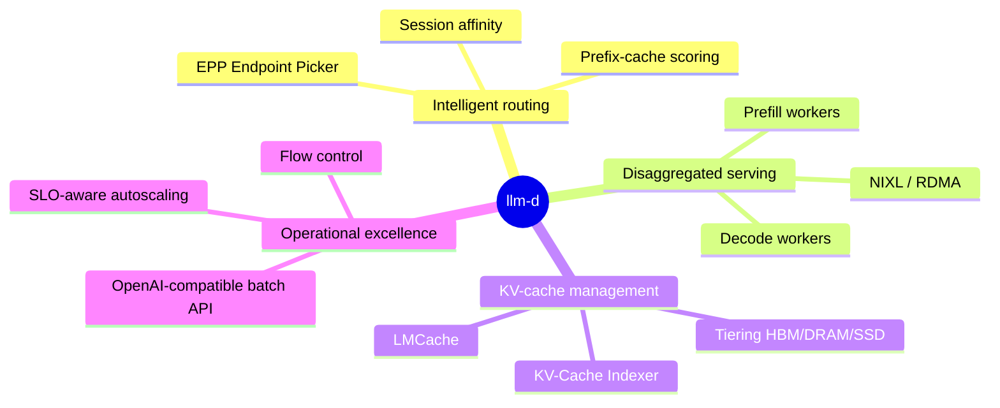

---

## 2. Why llm-d Exists — The Problem Space

LLM inference requests are fundamentally different from stateless HTTP requests, and generic load-balancing patterns handle them poorly.

### 2.1 LLM Requests Carry Hidden State

Every request carries invisible state: the **KV-cache** (the key/value tensors produced by attention layers while processing the prompt). If a subsequent request reuses part of a previously seen prompt (a system prompt, a long RAG context, a multi-turn conversation) and it is routed to a replica that already holds the corresponding cache blocks, the engine can **skip the recalculation entirely**. If it is routed to a "cold" replica, the same tokens must be reprocessed from scratch.

### 2.2 Requests Are Expensive and Highly Variable

A single request can occupy a GPU for several seconds and consume thousands of tokens. The input-token to output-token ratio varies enormously: a short chat turn and an 8K-token RAG query impose radically different loads on the accelerator.

### 2.3 Prefill and Decode Have Opposite Performance Profiles

- **Prefill** (processing the prompt): *compute-bound* — saturates the GPU's FLOPs.
- **Decode** (generating tokens one by one): *memory-bandwidth-bound* — limited by the transfer speed between HBM and compute cores.

Running both phases on the same GPU means neither is used optimally, and a long prefill for one user can block the decode latency of all other concurrent users on that pod.

### 2.4 Round-Robin and Sticky Routing Are Cache-Blind

Kubernetes Service load balancing and classic L7 sticky-session routing have no notion of KV-cache locality, per-replica queue depth, or per-request cost. They cannot answer the question that matters most for inference efficiency: *"which replica already has the relevant cache?"*

### 2.5 llm-d's Answer

llm-d's stated goal is to provide a **"well-lit path"** — a proven, benchmarked, reproducible plan — so that any organization can adopt cutting-edge distributed inference optimizations (cache-aware routing, disaggregation, wide expert parallelism) on their existing Kubernetes infrastructure, across NVIDIA, AMD, Intel, and TPU accelerators, without having to invent that infrastructure themselves.

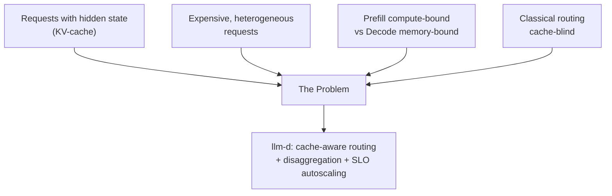

---

## 3. Project Identity, Governance, and Timeline

| Fact | Detail |
|---|---|
| Founding organization | Red Hat (initial announcement, Red Hat Summit, May 2025) |
| Founding contributors | Red Hat, Google Cloud, IBM Research, CoreWeave, NVIDIA |
| Later partners | AMD, Cisco, Hugging Face, Intel, Lambda, Mistral AI |
| Academic backers | UC Berkeley, University of Chicago |
| CNCF status | Sandbox, accepted March 2026 at KubeCon Europe (Amsterdam) |
| License | Apache 2.0 |
| Repositories | `github.com/llm-d/llm-d` (core), plus separate repos: `llm-d-router`, `llm-d-inference-scheduler`, `llm-d-kv-cache-manager`, `llm-d-benchmark`, `llm-d-deployer`, etc. |
| Adjacent CNCF projects | KServe, Gateway API Inference Extension (GAIE), Volcano (via its Kthena subproject), KAITO |

**Important planning nuance**: CNCF Sandbox is the earliest of the three CNCF maturity levels (Sandbox → Incubating → Graduated). This signals legitimacy and vendor-neutral governance, but **explicitly does not guarantee** production stability. The project's documentation consistently recommends validating performance and correctness in staging before deploying llm-d to production, and breaking API changes between releases should be expected while it remains in Sandbox.

**Terminology note**: The component called "Inference Scheduler" in the founding proposal is now called the **llm-d Router**, composed of a **Proxy** and an **Endpoint Picker (EPP)**.

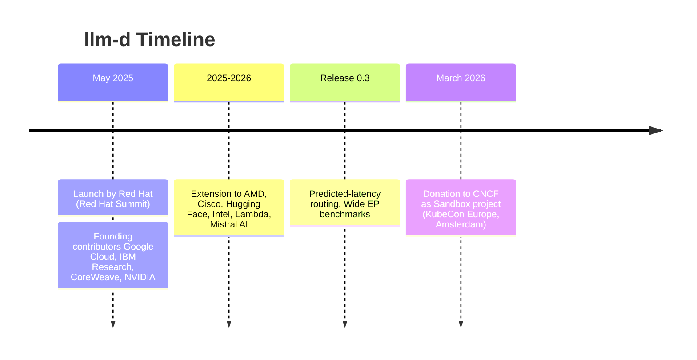

---

## 4. Architecture Overview

At the highest level, llm-d transforms a Kubernetes cluster into a coordinated inference factory with three architectural building blocks:

1. **The Router** (Proxy + Endpoint Picker) — the intelligent entry point.
2. **The InferencePool** — a Kubernetes Custom Resource representing a logical, discoverable group of model-serving pods serving the same model.
3. **The Model Servers** — the actual inference engines (primarily vLLM, also SGLang), which expose the metrics and KV-cache events the Router depends on.

```mermaid
flowchart TB
<<<<<<< Updated upstream
    Client([Client request]) --> GW[Gateway<br/>Envoy / Istio / GKE Gateway]
=======
    Client([Client Request]) --> GW[Gateway<br/>data-plane proxy]
>>>>>>> Stashed changes
    GW -->|ext-proc callback| EPP[Endpoint Picker EPP<br/>scheduling brain]
    EPP -->|queries| Indexer[KV-Cache Indexer<br/>global cache block map]
    EPP -->|reads metrics| Pool[InferencePool CRD<br/>discovers replicas]

    subgraph Pool_Members["Model server replicas"]
        V1[Pod vLLM A<br/>+ LMCache]
        V2[Pod vLLM B<br/>+ LMCache]
        V3[Pod vLLM C<br/>+ LMCache]
    end

    Pool --> Pool_Members
    Indexer -.KV events / metrics.-> Pool_Members
    EPP -->|selects best pod| GW
    GW -->|forwards request| V1
    V1 -->|token stream| GW
    GW --> Client
```

The system is designed for **incremental adoption**: a team can start by deploying only the Router with cache-aware routing on their existing vLLM pool (no network prerequisite beyond normal cluster networking), and only later layer on prefill/decode disaggregation (which requires a high-performance interconnect) and wide expert parallelism.

---

## 5. The llm-d Router: Proxy + Endpoint Picker (EPP)

### 5.1 Role of the Proxy

<<<<<<< Updated upstream
The **Proxy** is the data-plane component (typically Envoy, or an Envoy-based gateway like Istio or the GKE Inference Gateway). It terminates client connections and, for each inference request, calls the Endpoint Picker via Envoy's *external processing* (ext-proc) protocol before deciding where to forward the request.
=======
The **Proxy** is the data-plane component (an HTTP gateway or reverse proxy). It terminates client connections and, for every inference request, calls out to the Endpoint Picker via the **external processing (ext-proc)** protocol before deciding where to forward the request.
>>>>>>> Stashed changes

### 5.2 Role of the Endpoint Picker (EPP)

The EPP is the actual decision-making "brain." It implements the **Endpoint Picker Protocol**, which is part of the **Gateway API Inference Extension (GAIE)**, a Kubernetes SIG-Network effort for which llm-d is a primary reference implementation. The EPP evaluates the current state of the InferencePool and runs a fully pluggable four-step scheduling pipeline:

```mermaid
flowchart LR
<<<<<<< Updated upstream
    A["1. Discover<br/>Enumerate InferencePool pods,<br/>collect queue depth,<br/>loaded model, KV-cache contents<br/>via Prometheus + KV-Events"] --> B["2. Filter<br/>Eliminate overloaded pods,<br/>out of memory,<br/>wrong model variant"]
    B --> C["3. Score<br/>Run scorers in parallel:<br/>prefix-cache hit score,<br/>session affinity score,<br/>load score"]
    C --> D["4. Select<br/>max-score-picker chooses<br/>the pod with the best score"]
=======
    A[1. Discover<br/>Enumerate InferencePool pods,<br/>collect queue depth, loaded model,<br/>KV-cache contents via KV-Events] --> B[2. Filter<br/>Drop overloaded pods,<br/>pods lacking memory,<br/>wrong model variant]
    B --> C[3. Score<br/>Run pluggable scorers in parallel:<br/>prefix-cache hit score,<br/>session-affinity score,<br/>load score]
    C --> D[4. Select<br/>max-score-picker chooses<br/>the highest-scoring pod]
>>>>>>> Stashed changes
```

### 5.3 Internal Anatomy of the Scheduler and Plugins

The **Scheduler** is a highly modular component within the EPP, built on a plugin architecture. The complete scheduling cycle is as follows:

- **ProfilePicker**: selects which scheduling profiles to run (e.g., `decode-profile`, `prefill-profile`).
- **Filters**: narrow down the list of candidate endpoints.
- **Scorers**: score each remaining candidate endpoint.
- **Picker**: selects the best endpoint based on the scores.

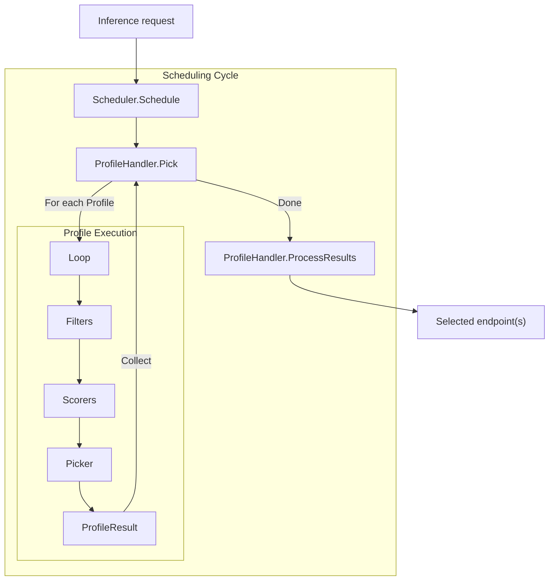

This profile-based architecture is what allows a single EPP to handle both simple routing (one profile) and P/D disaggregation (two profiles, `decode` then conditionally `prefill`, see Section 10).

### 5.4 Key Scheduling Signals

Depending on configuration, the EPP can combine the following signals:

- **Prefix-cache locality** — does this pod already hold the KV-cache blocks for this prompt's prefix?
- **KV-cache utilization** — how much cache headroom remains at each candidate pod?
- **Queue depth / in-flight requests** — how backed up is each pod right now?
- **Prefill vs. decode role** — in disaggregated deployments, filters like `prefill-filter` / `decode-filter` restrict candidates to the correct pool.
- **Session affinity** — useful for multi-turn conversations even without full prefix-cache indexing.
- **Predicted latency** (experimental since release 0.3) — a latency-prediction-based scorer that has shown up to 3x improvement in P90 latency for long-prefill workloads in llm-d's own benchmarks.

### 5.5 Precise vs. Heuristic Prefix-Cache Routing

llm-d supports two levels of cache awareness:

- **Heuristic routing**: approximates cache locality (e.g., via consistent hashing of the prompt prefix and recent routing history) without querying actual cache state. Lower cost, lower fidelity.
- **Precise routing**: queries the KV-Cache Indexer for a near-real-time view of which blocks are on which pod, enabling exact decisions that maximize cache hits. Higher fidelity, more infrastructure to operate.

### 5.6 InferencePool and Associated CRDs

The **InferencePool** is a Gateway API Inference Extension custom resource that groups replicas serving the same model and connects them to an EPP:

```yaml
apiVersion: inference.networking.x-k8s.io/v1alpha2
kind: InferencePool
metadata:
  name: llm-pool
  namespace: llm-serving
spec:
  targetPortNumber: 8000
  selector:
    app: vllm-llm-d
  endpointPickerConfig:
    extensionRef:
      name: llm-d-epp
```

Two companion resources refine the EPP's behavior:

- **InferenceObjective** — configures scheduling objectives for a class of requests (priority level, performance target).
- **InferenceModelRewrite** — enables model name aliasing/rewriting at the routing layer.

---

## 6. The KV-Cache Indexer — Internal Anatomy

### 6.1 Why Cache Is the Most Powerful Lever

A cache hit lets the engine skip the entire recalculation of attention over the shared prefix. A miss means a full recalculation. This is why cache-aware routing is consistently cited by the project and its adopters as **the most mature and highest-leverage capability** of llm-d — it requires no special network hardware and delivers the majority of the achievable latency and throughput gains.

### 6.2 Internal Modules of the Indexer

The **Index** is a Go library that maintains a globally consistent view of cache block residency across the cluster. It is composed of several modules:

| Module | Purpose |
|---|---|
| `kvcache.Indexer` | Global orchestrator |
| `kvblock.TokenProcessor` | Converts tokens to block keys (hashing) |
| `kvblock.Scorer` | Computes per-pod cache hit scores |
| `kvblock.Index` | Block index data structure |
| `kvevents.Pool` | Consumes ZMQ events emitted by pods |

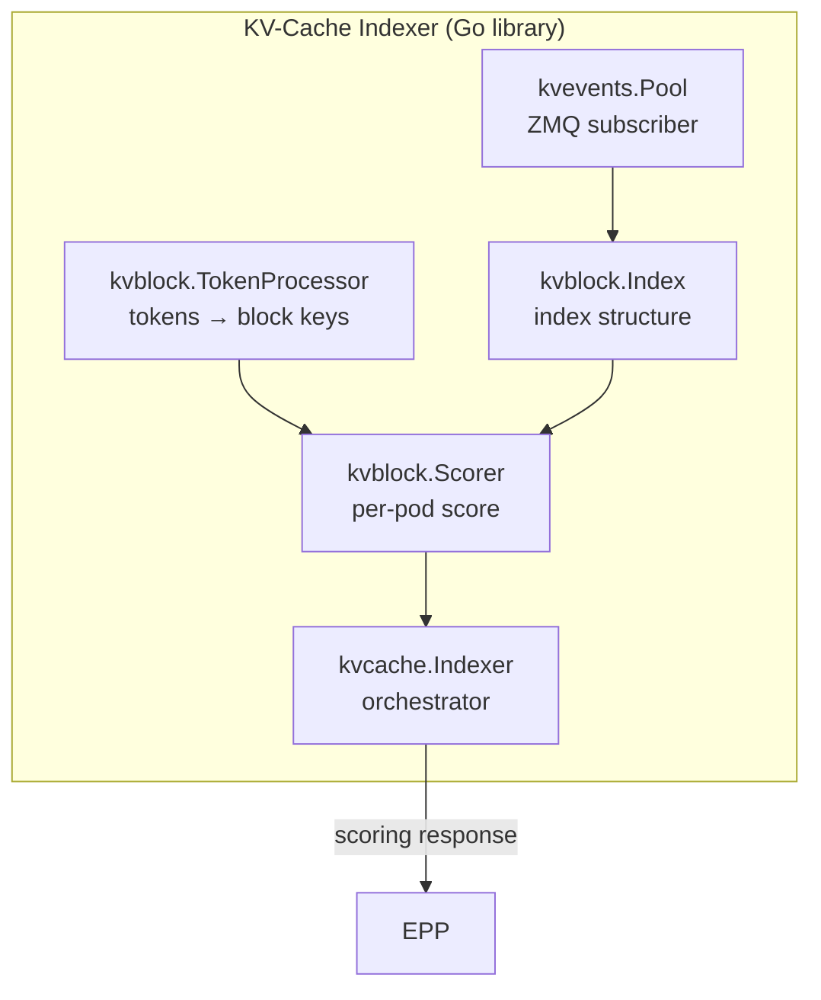

### 6.3 KV Event Types

Model servers publish three types of events to the Indexer:

| Event | Description |
|---|---|
| `BlockStored` | A cache block is created on a specific storage tier |
| `BlockRemoved` | A block is evicted from a tier |
| `AllBlocksCleared` | The pod's entire cache is cleared (full reset) |

### 6.4 Event Delivery Modes

1. **Centralized**: each pod connects to a single endpoint hosted by the EPP.
2. **Pod discovery**: each pod binds its own ZMQ socket; the EPP discovers pods via the Kubernetes API and subscribes to each independently (the most common mode in production, see Section 7).

### 6.5 Hierarchical / Multi-Tier Offloading

GPU HBM is scarce and expensive. llm-d (largely via LMCache, see Section 14) supports a multi-level cache hierarchy:

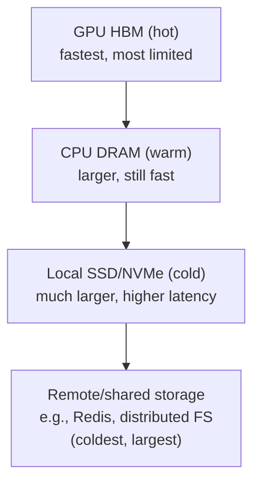

Blocks are automatically promoted and demoted between tiers based on recency and access frequency. Scorers like `precise-prefix-cache-scorer` are tier-aware, so the router can prefer a pod with a block residing in hot HBM over a pod that would need to fetch the same block from CPU RAM or disk.

### 6.6 Impact on the Two Dominant Serving Metrics

- **TTFT (Time-To-First-Token)**: directly reduced by cache hits, since the compute-heavy prefill step for the cached portion is skipped.
- **Throughput (tokens/s)**: improved because GPU cycles are not wasted recalculating identical prefixes across shared-prompt or multi-turn workloads.

---

## 7. How llm-d Actually Communicates: The Two Planes

To truly understand how llm-d operates day to day, you need to see its architecture as **two distinct communication planes**, each with very different roles, protocols, and performance requirements.

| Communication Channel | Direction | Protocol | Purpose |
|---|---|---|---|
| **Event stream (Write Path)** | vLLM → llm-d | **ZMQ** (PUB/SUB) | Publish KV-cache state changes (additions, removals) |
| **Scoring API (Read Path)** | llm-d Router → Indexer | **HTTP** (REST) | Query the index to find which pod has the most cache for a given prompt |

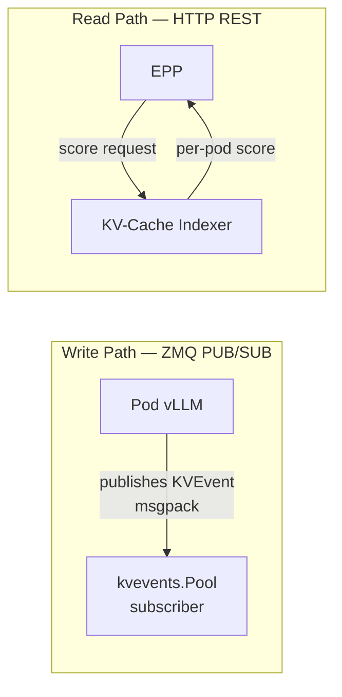

### 7.1 The Orchestration Brain: ZMQ Communication

**ZMQ (ZeroMQ)** is the centerpiece for non-blocking, high-speed communication between model servers (vLLM) and the llm-d control plane. It does not transport the model data itself, but rather the crucial **metadata** about cache state.

- **Pub/Sub architecture**: each vLLM pod acts as a **publisher**, continuously publishing events whenever its local cache changes. The llm-d router, via its `kvevents.Pool` component, acts as a **subscriber**.
- **Discovery mechanism**: for maximum scalability, each vLLM pod **binds its own ZMQ socket**. Each router replica then subscribes to **each pod independently**. This "star" architecture ensures high availability and fault tolerance.
- **Message format**: events are published on structured topics, e.g., `kv@<POD_IP>@<MODEL_NAME>`. The payload is serialized in **msgpack**, a lightweight, fast binary format.

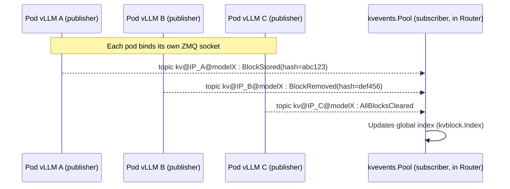

### 7.2 The Performance Engine: HPC Communication (CUDA, RDMA, NIXL)

While ZMQ handles the **strategy** (where the cache is), another, much faster layer handles the **data movement itself**: transferring model weights and KV-cache between GPUs.

- **The challenge**: in a disaggregated architecture, the KV-cache must be transferred from the *prefill* pod to the *decode* pod **before** the first token is generated. The latency of this transfer directly impacts TTFT.
- **The solution: NIXL and a layered stack**. llm-d uses **NIXL (NVIDIA Inference Xfer Library)** as its primary transfer library. NIXL acts as an abstraction layer, allowing vLLM to initiate transfers without knowing the underlying network details. It operates in **pull-based** mode: the *decode* pod directly reads the GPU memory of the *prefill* pod via **one-sided RDMA reads**, reducing CPU overhead and synchronization.

NIXL builds on a modular transport stack:

| Backend | Role |
|---|---|
| **UCX (Unified Communication X)** | Default backend; mature HPC framework, abstracts InfiniBand, RoCE, and TCP. |
| **UCCL (Unified Cloud Communication Library)** | Newer backend, finer control, flow splitting and congestion control tailored to AI traffic patterns. |
| **libfabric** | Used specifically on AWS to support EFA (Elastic Fabric Adapter). |

llm-d also integrates optimized CUDA libraries and kernels such as **NVSHMEM**, **DeepEP**, and **FlashInfer**. The build chain handles these complex dependencies by compiling UCX and NVSHMEM before building the specialized kernels. Support extends to **Intel XPU**, **Google TPU**, and **AMD ROCm** as well.

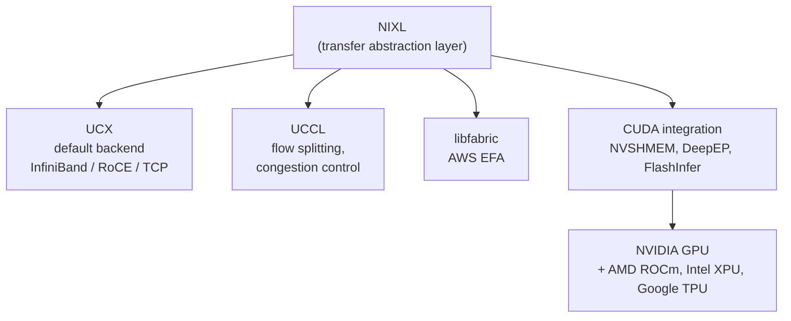

### 7.3 Synthesis: A Two-Speed Communication Architecture

- **ZMQ** is the **nervous system**: it transmits information (metadata about cache state) in a lightweight, asynchronous manner, allowing all vLLM servers to publish their cache state so the router can make near-real-time decisions.
- **NIXL / RDMA / CUDA** is the **muscular system**: it moves massive amounts of actual data (weights, KV-cache) between GPUs, at ultra-high speed.

llm-d orchestrates these two worlds to deliver a distributed inference infrastructure that is both intelligent and extremely performant.

---

## 8. How llm-d "Talks" to vLLM and LMCache — The Control Plane

Think of this as a **three-layer orchestration** that operates continuously: Kubernetes declarations, event streams, and API connectors.

### 8.1 Kubernetes Custom Resources (CRDs) — The "What to Orchestrate"

- **`InferencePool`**: defines a group of model servers (vLLM pods) serving the same model. It specifies which pods to watch (label selector), which port they listen on, and where to find the EPP.

  > *Concrete example*: a YAML file tells llm-d: *"Go find all pods with the label `model: llama3` and `role: prefill` in the `llm-d` namespace; they form my prefill InferencePool."*

- **`HTTPRoute`**: tells the Proxy how to route external traffic to the correct `InferencePool`.

### 8.2 Connectors — The Technical Interface to vLLM

To interact with vLLM and LMCache, llm-d relies on **connectors** — pieces of code that integrate into vLLM's API:

- **`OffloadingConnector`** (native to vLLM): activated by passing launch arguments to vLLM. Allows vLLM to offload its KV-cache to CPU or shared storage — llm-d provides a backend (*llm-d FS backend*) that lets this connector write to a shared filesystem, which can be LMCache.
- **LMCache connector** (external): llm-d configures vLLM to delegate all cache management to LMCache.

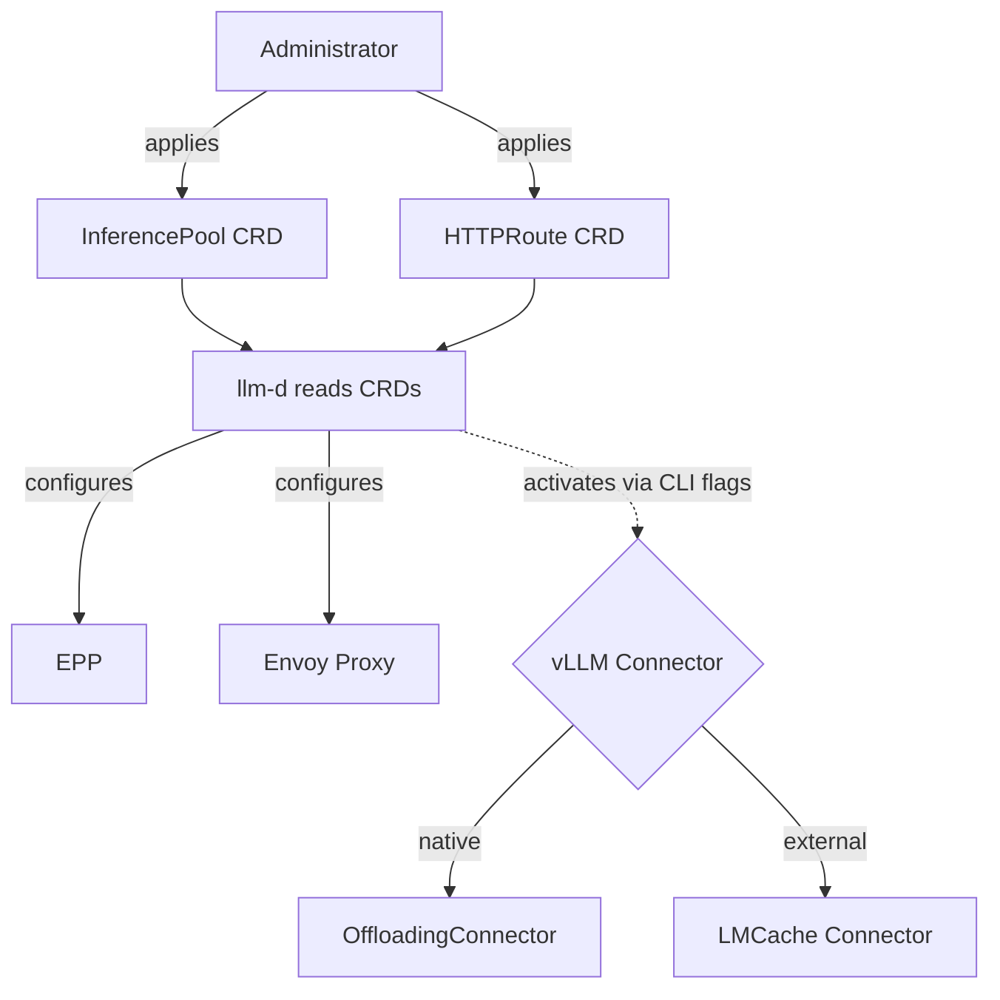

### 8.3 The Two-Phase Dialogue with vLLM

**A. vLLM talks to llm-d — the "Write Path"**

Each vLLM pod publishes `KVEvents` via ZMQ PUB/SUB (see Section 7.1), received by the `kvevents.Pool` of llm-d's KV-Cache Manager.

> *Example*: a user sends a long prompt to `vLLM-Pod-A`. The pod computes the KV-cache, then immediately publishes: *"Cache for hash `abc123` available on me (Pod-A, IP X, GPU memory)."* The KV-Cache Manager updates its global index.

**B. llm-d talks to vLLM — the "Read Path"**

When a new request arrives, the EPP queries the KV-Cache Manager, receives a per-pod "cache hit" score, picks the best one, and instructs the Proxy to route the request to that specific pod.

> *Example*: a new user sends a request with the same prompt `abc123`. The KV-Cache Manager responds: *"vLLM-Pod-A has a score of 1.0 (full cache), all others 0.0."* The EPP instructs the Proxy to route to Pod-A, which generates the response extremely fast, without recalculating the prompt.

### 8.4 LMCache as Shared "Secondary Memory"

LMCache is not a component that "talks" directly to llm-d — it is a **storage system** that llm-d uses via vLLM. When a vLLM pod's GPU memory is saturated (or per a defined policy), the pod can **offload** its least-used cache blocks to LMCache. Once there, those blocks become available to **all other vLLM pods in the cluster**.

> *Example*: `vLLM-Pod-A` offloads the cache for `abc123` to LMCache via the `OffloadingConnector` activated by llm-d, then publishes: *"Cache for `abc123` now available on shared storage."* Later, `vLLM-Pod-B` receives a request for `abc123`: not having the cache locally, it **loads** it from LMCache into its own GPU memory before generating — the heavy computation is again avoided, even though the cache has moved physical servers.

### 8.5 Complete Request Lifecycle Synthesis

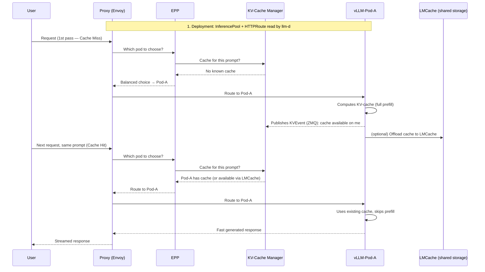

---

## 9. The KV Cache in Three Phases — From Local Memory to a Routable Resource

This conceptual diagram illustrates the neural core of llm-d: the transformation of KV-cache, normally a **local and ephemeral** resource tied to a single GPU, into a **shared, indexed, and routable network resource** at cluster scale.

### Phase 1 — Cache Indexing (The Cluster's "Working Memory")

When vLLM receives a prompt, it computes the attention keys and values (KV-cache), a compute-heavy phase (the *prefill*). Without coordination, another server receiving the same prompt later **would recalculate** those same values — a waste of compute and electricity.

In the system: `vLLM1` receives "Prompt A", runs prefill, stores the cache in local HBM, then **publishes an event** (ZMQ): *"Cache for prefix 'Prompt A' available on me."* The `KV-Cache Manager` subscribes to all these events and updates its global hash table within milliseconds.

### Phase 2 — "Intelligent" Routing (Avoiding Recalculation)

Without cache-aware routing, a classic load-balancer would send "Prompt A" to `vLLM2` with 50% probability, causing an expensive cache miss.

In the system: a new client sends the same "Prompt A" to the Router (EPP). The Router queries the KV-Cache Manager: *"For this prefix, who is the best candidate?"* The index answers: *"vLLM1 is the hottest."* The Router sends **exclusively** to `vLLM1`, which skips prefill and goes directly to decode — this is a **"Cache Hit"**.

### Phase 3 — Cache Sharing and Hierarchy (The Cost Strategy)

GPU memory (HBM) is the most expensive and scarcest component in the cluster. If `vLLM1` accumulates too many rarely-used caches, it saturates its memory.

In the system: `vLLM1` **offloads** cache to **LMCache shared storage** (often fast CPU RAM or NVMe). The cache becomes **persistent and shared**: even if `vLLM1` restarts, is saturated, or the router sends the next request to `vLLM2`, that pod can **load** this cache from LMCache before generating. The prefill is again avoided, even if the cache has moved physical servers.


### Synthesis: How These Three Phases Interact

This is not a simple sequence, but a **continuous lifecycle**:

1. **Phase 1** makes the cache **discoverable** (the orchestrator knows where the knowledge is).
2. **Phase 2** makes the cache **actionable** (the router directs traffic exactly where the knowledge is, for maximum speed gain).
3. **Phase 3** makes the cache **durable and transportable** (frees expensive resources and avoids losing work if a server changes).

In production, this mechanism runs in a loop thousands of times per second. llm-d thus achieves two major objectives:

- **Drastic reduction in cost per token**: fewer prefill recalculations = less GPU consumption.
- **Near-constant latency**: response time depends primarily on generation length, not on the initial prompt length, because the heavy computation is bypassed through precise routing to the cache.

---

## 10. Prefill/Decode Disaggregation (P/D)

### 10.1 The Core Idea

Instead of running prefill and decode for a request on the same GPU/pod, llm-d can route the prompt-processing step to a **prefill worker**, and the token-generation step to a separately scaled **decode worker**, transferring the computed KV-cache between them via a high-performance interconnect.

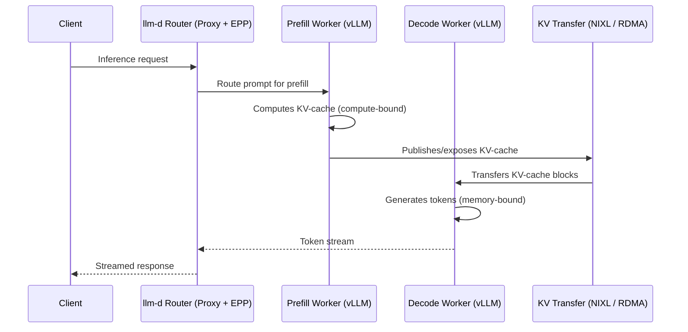

### 10.2 Why It Helps

- Each phase runs on hardware suited to its bottleneck.
- Long prefills no longer block decode for other concurrent users on the same GPU.
- **TPOT** (Time-Per-Output-Token) becomes more stable and predictable — important for SLA commitments.
- Each pool (prefill, decode) can be scaled independently according to its own bottleneck signal.

### 10.3 The Hard Prerequisite: Network Performance

Transferring KV-cache between prefill and decode workers moves multi-gigabyte tensors per request. If the interconnect is slow, the transfer cost can exceed the cost of simply recalculating the cache, negating the entire benefit. Disaggregation in production therefore assumes a **high-performance interconnect**: RDMA-capable NICs, NVLink for intra-node transfer, InfiniBand or RoCE for inter-node transfer. On a classic 1GbE/10GbE cloud network without RDMA, disaggregation will likely not pay off and should generally not be enabled.

### 10.4 The Transport Layer: NIXL

KV-cache transport on this path is handled by **NIXL**, the same layer described in Section 7.2, which is also the one used by vLLM's and LMCache's disaggregated prefill implementations (see Sections 13–14).

### 10.5 The Decider and Routing Sidecar — Fine-Grained Decision Logic

The EPP uses a **`disagg-profile-handler`** that follows these steps:

1. The proxy forwards the request to the EPP.
2. The `disagg-profile-handler` runs the `decode-profile` to select an endpoint **D**.
3. The **Decider** consults the cache state on D to decide whether the request should actually be disaggregated.
4. If **no** (small uncached suffix) → the EPP returns only D.
5. If **yes** (large uncached suffix) → the EPP runs the `prefill-profile` to select an endpoint **P**, and returns both P and D.

### 10.6 Label-Based Filtering

llm-d uses the label **`llm-d.ai/role`** with values:

- `prefill` → workers dedicated to prefilling
- `decode` → workers dedicated to generation

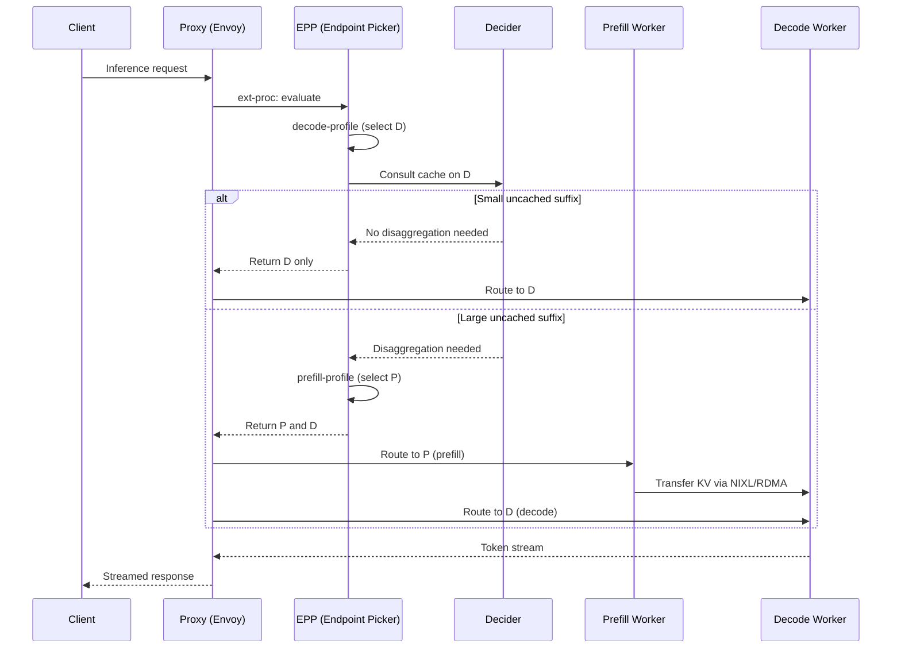

---

## 11. Wide Expert Parallelism (for MoE Models)

For Mixture-of-Experts models (e.g., DeepSeek-R1-class architectures, 500 GB+ of weights), a single GPU cannot economically host all experts. llm-d's **Wide Expert Parallelism (Wide EP)** well-lit path distributes experts across many GPUs.

### 11.1 The Dispatch/Combine Flow

1. Each rank runs attention independently (data parallelism).
2. The MoE router selects the `topk` experts for each token (e.g., 8 out of 256 for DeepSeek).
3. Tokens are **dispatched** to the appropriate expert ranks.
4. Each expert runs independently.
5. Tokens are **combined** back to the original attention rank.

### 11.2 Required Infrastructure

- Dispatch/combine uses the **DeepEP** backend on **NVSHMEM**, with **GPU-initiated RDMA** (`ibgda` transport).
- Requires **full-mesh InfiniBand/RoCE** connectivity.
- Validated guide on **32 NVIDIA H200 or B200 GPUs**.
- Orchestration via **LeaderWorkerSet (LWS)**, a Kubernetes CRD, to coordinate multi-host worker groups (a leader pod coordinating a set of worker pods).

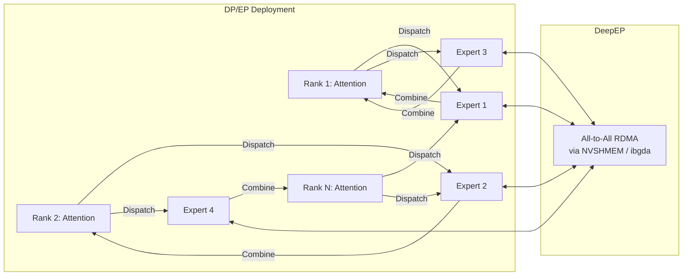

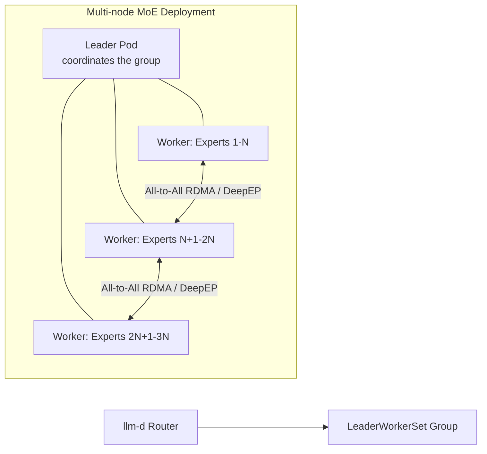

In llm-d's release 0.3 benchmarks, this path scaled expert-parallelism throughput to approximately **2.2k tokens/s per H200 GPU**. As with disaggregation, this feature assumes a fast inter-node interconnect.

---

## 12. SLO-Driven Autoscaling

Generic Kubernetes autoscaling (CPU/memory-based HPA, or simple KEDA rules triggered by queue depth) has no notion of inference-specific service levels. llm-d's "operational excellence" pillar overlays autoscaling logic on real inference signals.

### 12.1 Signals Used

- KV-cache utilization / hit rate
- Queue depth and in-flight request count, per pool (prefill vs. decode)
- Observed TTFT / TPOT, compared to configured SLO targets

### 12.2 Scaling Principle — Proactive and Queue-Model-Based

llm-d's autoscaling is **proactive** and relies on:

- A **queueing model**: SLO-driven analysis based on queueing theory.
- The **SLOMultiplier**: the maximum tolerable ratio between iteration time under load and baseline latency.

The autoscaler compares actual signals against SLO targets:

- If an SLO breach is approaching → **scale out**.
- If headroom is comfortable and cache hit rate is high → **scale in**.

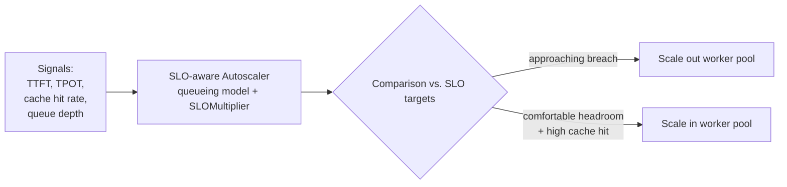

The stated intent is to let clusters run "hotter" — closer to full utilization — before scaling, extracting more useful work per GPU while respecting latency objectives, rather than provisioning conservatively "just in case."

llm-d also includes **flow control** for multi-tenant fairness (so a noisy tenant cannot starve others of GPU time) and **OpenAI-compatible batch APIs** for large-scale asynchronous offline inference, maximizing hardware utilization outside the online serving path.

---

## 13. Integration with vLLM

vLLM is the primary and most deeply supported serving engine in llm-d (SGLang is also supported as an alternative engine in certain well-lit paths — see Section 15).

The separation of responsibilities is clean:

- **vLLM** owns everything that happens **inside** a replica: model loading, PagedAttention, batching, the actual token generation loop — and, crucially, exposing the KV-cache metrics and events the rest of the stack depends on.
- **llm-d** owns everything that happens **across** replicas: which replica gets which request, how phases are distributed across replicas, and how the entire pool scales.

### 13.1 What Each vLLM Pod Must Do

<<<<<<< Updated upstream
1. Expose **Prometheus-compatible metrics** — queue depth, GPU KV-cache utilization percentage, number of running/waiting requests, etc. — consumed by the EPP's scorers.
2. Emit **KV-cache events** (block creation/eviction) that feed the KV-Cache Indexer for precise prefix-cache routing.
=======
1. **Expose metrics** — queue depth, GPU KV-cache usage percentage, running/waiting request counts, etc. — that the EPP's scorers consume.
2. **Emit KV-cache events** (block creation/eviction) that feed the KV-Cache Indexer for precise prefix-cache routing.
>>>>>>> Stashed changes
3. **Register with the InferencePool** so the Router can discover it as a valid candidate.
4. For disaggregated deployments, start with the correct `--kv-transfer-config` to know whether it acts as a KV producer (prefill) or KV consumer (decode), and via which connector (see Section 14).

### 13.2 The KV Connector — The Technical Seam

vLLM's architectural evolution (the "V1" engine rewrite) specifically added a **clean, pluggable KV-connector interface** to the core, so external cache/transfer systems — like LMCache and NIXL-based connectors — can attach **without forking vLLM**. This connector interface is the technical seam that makes llm-d's cache-aware and disaggregated features possible without vLLM itself becoming a distributed system.

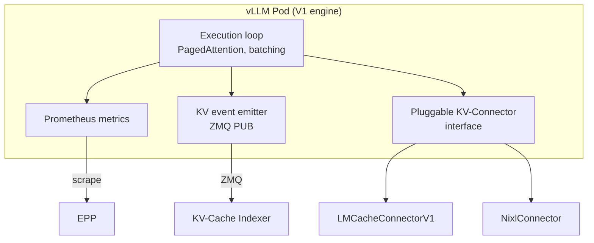

---

## 14. Integration with LMCache

**LMCache** is an independent open-source project that extends inference engines (primarily vLLM) with a high-performance multi-tier KV-cache layer. In the llm-d ecosystem, LMCache is commonly described as the **default KV-cache layer** of llm-d — it is not part of llm-d's own code, but llm-d's well-lit paths and guides integrate it as the recommended way to get hierarchical caching and cross-node cache reuse.

### 14.1 Integration Mode: The Plug-in KV Connector

LMCache attaches to vLLM via vLLM's KV-Connector API. In vLLM's current V1 engine, the relevant connector class is **`LMCacheConnectorV1`**. This is the primary and recommended integration path: it lets LMCache manage its own block indexing and multi-tier memory (GPU HBM → CPU RAM → local SSD → remote/shared storage) while leveraging vLLM's execution loop.

An alternative, lighter path is vLLM's **native offloading connector**, which extends cache to CPU RAM or a shared filesystem without integrating the full LMCache stack — useful when only simple CPU offload is needed, not full multi-tier/shared caching.

### 14.2 Prefill Disaggregation with LMCache — The Concrete Wiring

For P/D disaggregation, each vLLM instance is launched with a `kv-transfer-config` selecting a KV connector and a role:

```bash
# Prefill instance (producer)
vllm serve meta-llama/Llama-3.1-8B-Instruct \
  --port 7100 \
  --kv-transfer-config \
  '{"kv_connector":"LMCacheConnectorV1","kv_role":"kv_producer",
    "kv_connector_extra_config":{"discard_partial_chunks": false,
    "lmcache_rpc_port":"producer1"}}'

# Decode instance (consumer)
UCX_TLS=cuda_ipc,cuda_copy,tcp \
LMCACHE_CONFIG_FILE=lmcache-decoder-config.yaml \
CUDA_VISIBLE_DEVICES=1 \
vllm serve meta-llama/Llama-3.1-8B-Instruct \
  --port 7200 \
  --kv-transfer-config \
  '{"kv_connector":"LMCacheConnectorV1","kv_role":"kv_consumer",
    "kv_connector_extra_config":{"discard_partial_chunks": false,
    "lmcache_rpc_port":"consumer1"}}'
```

Under the hood, LMCache uses **NIXL** as the KV transfer transport (supporting NVLink, RDMA NICs, or TCP as fallback), so the same NIXL layer described in Section 7.2 transports the tensors moved by LMCache's connector.

vLLM also offers a more minimal path, **`NixlConnector`**, for teams wanting fully asynchronous NIXL send/receive without the full LMCache stack (multi-tier storage, cross-request pool-scale cache reuse). Both can even be composed via vLLM's **`MultiConnector`**, e.g., `[NixlConnector (kv_producer), LMCacheMPConnector]`, so live KV transfer and durable multi-tier caching coexist.

Each vLLM instance in this setup typically runs with its own LMCache server process (they should not share one), started independently:

```bash
lmcache server \
  --port 6555 --http-port 8090 \
  --l1-size-gb 100 --eviction-policy LRU --chunk-size 256 \
  --instance-id prefiller
```

A router in front of the prefill/decode pair (in llm-d's case, the Router/EPP described in Section 5) sends each request to a prefill instance then a decode instance in sequence, threading the NIXL handshake between them.

### 14.3 What LMCache Specifically Provides

| Capability | Provided By |
|---|---|
| Multi-tier KV storage (HBM → DRAM → SSD → remote) | LMCache |
| Cross-request, cross-replica cache reuse ("CacheBlend") | LMCache |
| KV-cache transfer for prefill/decode disaggregation | LMCache's NIXL connector, or vLLM's native `NixlConnector` |
| Cluster-wide visibility of cache location | llm-d's KV-Cache Indexer, fed by events emitted by LMCache/vLLM |
| Decision of which pod to route based on that visibility | llm-d's Endpoint Picker |

In summary: **LMCache manages and moves the cache**; **llm-d knows where the cache is and routes accordingly**. Neither replaces the other — they are complementary layers.

---

## 15. Multi-Engine Support: SGLang and TensorRT-LLM

While vLLM is the most deeply integrated engine, llm-d also supports **SGLang** and **TensorRT-LLM** (`trtllm-serve`) as alternative serving engines.

SGLang is supported across all well-lit paths:

- Prefix-aware routing
- Distributed KV-cache management
- P/D disaggregation
- SLO-aware autoscaling and flow control

```mermaid
flowchart TB
    Router6[llm-d Router / EPP] --> Eng{Serving Engine}
    Eng --> VLLM6[vLLM<br/>deepest integration]
    Eng --> SGL6[SGLang<br/>all well-lit paths]
    Eng --> TRT6[TensorRT-LLM<br/>trtllm-serve]
```

---

## 16. The Complete End-to-End Data Path

```mermaid
sequenceDiagram
    participant C as Client
    participant GW as Gateway
    participant EPP as Endpoint Picker
    participant IDX as KV-Cache Indexer
    participant PF as vLLM Prefill Pod (+LMCache)
    participant DC as vLLM Decode Pod (+LMCache)

    C->>GW: POST /v1/chat/completions
    GW->>EPP: ext-proc: evaluate request
    EPP->>IDX: Which pod holds this prefix?
    IDX-->>EPP: Pod PF has 80% of prefix in cache
    EPP-->>GW: Route: prefill → PF, decode → DC
    GW->>PF: Forward prompt
    PF->>PF: Computes remaining 20% of KV-cache
    PF->>DC: Transfers full KV-cache via LMCache/NIXL
    DC->>DC: Generates tokens (streaming)
    DC-->>GW: SSE token stream
    GW-->>C: Streamed response
    PF-->>IDX: Emits KV block events (created/evicted)
    DC-->>IDX: Emits KV block events (created/evicted)
```

This composite view summarizes everything: routing intelligence (Sections 5–6) decides **where**; disaggregation (Section 10) decides **how** work is split; LMCache and NIXL (Section 14) decide **how** the cache physically moves; and the autoscaler (Section 12) decides **how many** pods exist to accomplish all of this.

---

## 17. Relationship with Kubernetes, KServe, Gateway API, and LeaderWorkerSet

llm-d deliberately does not reinvent Kubernetes primitives. It composes with:

- **Gateway API / Gateway API Inference Extension (GAIE)**: llm-d is a primary reference implementation of GAIE, notably the `InferencePool` and the Endpoint Picker Protocol; the GAIE repository holds the `InferencePool` API definition, while the llm-d router repository now holds the EPP implementation and the `InferenceObjective` / `InferenceModelRewrite` APIs.
- **KServe**: handles the **model lifecycle** — deployment, versioning, canary rollout — via its `LLMInferenceService` custom resource, while llm-d handles **routing and cache optimization at inference time**, underneath. The two are explicitly designed to be layered, not competing: *"llm-d complements rather than replaces KServe."* Concretely, KServe uses `LLMInferenceService` to declare the P/D configuration, and llm-d provides LeaderWorkerSet for multi-node orchestration — the combination bringing scalability, performance, and cost control.
- **LeaderWorkerSet (LWS)**: a Kubernetes API (led by Google) for orchestrating multi-node worker groups with a leader/worker topology; llm-d uses it for wide expert parallelism and other multi-node disaggregated topologies.
- **KEDA / HPA**: llm-d's SLO-aware autoscaling logic is designed to overlay on top of standard Kubernetes autoscalers, or to feed them signals, rather than replacing the underlying scaling mechanism.
- **Volcano / Kueue / KAITO**: recognized in llm-d's own CNCF Sandbox application as adjacent projects with partial scope overlap (batch/gang scheduling, model deployment tooling); llm-d remains deliberately agnostic about how model servers are deployed.

```mermaid
flowchart TB
    subgraph ControlPlane["Control Plane"]
        KServe7["KServe<br/>(model lifecycle, rollout)"]
    end
    subgraph DataPlaneRouting["Inference-aware Data Plane"]
        GAIE7["Gateway API +<br/>Inference Extension"]
        LLMD7["llm-d Router (EPP)"]
    end
    subgraph Compute["Compute Layer"]
        VLLM7["vLLM / SGLang Pods"]
        LWS7["LeaderWorkerSet<br/>(multi-node groups)"]
    end
    KServe7 --> GAIE7
    GAIE7 --> LLMD7
    LLMD7 --> VLLM7
    LLMD7 --> LWS7
```

---

## 18. Concrete Implementation: Prerequisites and Cluster Preparation

Before deploying any llm-d well-lit path, the documented prerequisites are:

### 18.1 Client Tooling (on the operator's machine)

```bash
kubectl version --client   # v1.30+ recommended
helm version                # v3.12+
yq --version
kustomize version
helmfile --version
nvidia-smi                  # confirm GPU driver / visibility
```

### 18.2 Cluster-Side CRDs — Gateway API and Inference Extension

```bash
# 1. Gateway API CRDs
kubectl apply -f https://github.com/kubernetes-sigs/gateway-api/releases/download/v1.2.1/standard-install.yaml

# 2. Gateway API Inference Extension (GAIE) CRDs
kubectl apply -f https://github.com/kubernetes-sigs/gateway-api-inference-extension/releases/download/v0.3.0/manifests.yaml
```

### 18.3 Secrets

Most model-serving guides expect a Kubernetes secret containing a Hugging Face token, conventionally named `llm-d-hf-token`, used to pull gated model weights.

### 18.4 Hardware Labeling

Cluster nodes must be labeled and prepared for the specific accelerator backend used (CUDA for NVIDIA, ROCm for AMD, XPU for Intel, or specific TPU node pools on GKE).

### 18.5 Network Prerequisites — Only for Disaggregation / Wide EP

RDMA-capable interconnect (InfiniBand or RoCE) between nodes that will exchange KV-cache or expert-parallel traffic. **Not required** for the basic cache-aware routing path.

> ⚠️ Always confirm exact version numbers (Gateway API and GAIE release tags) on the current llm-d and gateway-api-inference-extension GitHub releases pages before deploying, as these evolve quickly while the project is in CNCF Sandbox.

---

## 19. Concrete Implementation: Deploying the "Well-Lit Paths"

llm-d delivers its production patterns as **"well-lit paths"** — benchmarked, reproducible blueprints based on Helm charts — rather than a single monolithic installer.

### 19.1 Complete Well-Lit Path Catalog

1. **Intelligent Inference Scheduling** — the baseline cache-aware routing path (vLLM or SGLang, single-phase serving).
2. **Precise Prefix-Cache Routing** — adds the KV-Cache Indexer for exact (non-heuristic) cache-hit routing.
3. **Wide EP / LWS** — multi-node MoE serving.
4. **Flow Control** — multi-tenant fairness and request prioritization.
5. **Predicted-Latency Routing** — the experimental predicted-latency scorer.
6. **Batch Gateway** — OpenAI-compatible asynchronous batch inference.

```mermaid
flowchart TB
    Base[1. Intelligent Inference Scheduling<br/>baseline routing] --> Precise[2. Precise Prefix-Cache Routing<br/>KV-Cache Indexer]
    Precise --> Flow[4. Flow Control<br/>multi-tenant fairness]
    Precise --> Pred[5. Predicted-Latency Routing<br/>experimental]
    Precise --> Wide[3. Wide EP / LWS<br/>multi-node MoE]
    Base --> Batch[6. Batch Gateway<br/>async inference]
```

### 19.2 Representative Baseline Routing Path Installation

```bash
helm repo add llm-d https://llm-d.github.io/llm-d-deployer
helm repo update

helm install llm-d llm-d/llm-d \
  --namespace llm-serving \
  --create-namespace \
  --set model.name=Qwen/Qwen3-32B \
  --set prefill.replicas=2 \
  --set decode.replicas=4 \
  --set gpu.type=nvidia-h100 \
  --set autoscaling.enabled=true \
  --set autoscaling.scaleToZero=true

# Verification
kubectl get pods -n llm-serving -w
kubectl get inferencepool -n llm-serving
```

> ⚠️ Treat the `--set` flags above as illustrative. Since llm-d is a fast-evolving CNCF Sandbox project with per-repository Helm charts (router, indexer, well-lit-path guides), always pull the exact `values.yaml` schema from the specific well-lit-path guide being followed in the current llm-d/llm-d documentation (`guides/README.md` and the `guides/<path>/README.md` files) rather than assuming flag names are stable between releases.

### 19.3 Common First-Deployment Pitfall

The default choice to make explicitly after installation is the `HTTPRoute` wiring: this resource references the Gateway and InferencePool by name, and if release names are customized (e.g., via a `RELEASE_NAME_POSTFIX`), the `HTTPRoute` must be updated accordingly before applying — a common first-deployment failure mode.

---

## 20. Concrete Implementation: Configuring the Disaggregated Service with LMCache + NIXL

Here is the mechanics to wire up to enable P/D disaggregation with LMCache under an llm-d-routed pool (single-node example, generalizable to multi-node with routable IPs).

### Step 1 — Install dependencies in the model server image

```bash
pip install lmcache
# NIXL (pulled automatically via the lmcache[nixl] extra, requires nixl>=1.3.0)
pip install "lmcache[nixl]"
```

### Step 2 — Start one LMCache server per vLLM instance

```bash
# LMCache server on the prefill side
lmcache server \
  --port 6555 --http-port 8090 \
  --l1-size-gb 100 --eviction-policy LRU --chunk-size 256 \
  --instance-id prefiller

# LMCache server on the decode side (different port / instance-id)
lmcache server \
  --port 6655 --http-port 8091 \
  --l1-size-gb 100 --eviction-policy LRU --chunk-size 256 \
  --instance-id decoder
```

### Step 3 — Start both vLLM instances with the corresponding connector roles

Key environment variables for the NIXL handshake:

```bash
export VLLM_NIXL_SIDE_CHANNEL_HOST=<routable-host>
export VLLM_NIXL_SIDE_CHANNEL_PORT=5600   # must differ per instance on the same host
export UCX_NET_DEVICES=all
export NCCL_CUMEM_ENABLE=1
```

### Step 4 — Put a P/D-aware router in front of both instances

In a standalone LMCache deployment, this role is played by the `vllm-router --vllm-pd-disaggregation` helper. In llm-d, this role is played by the Router/EPP described in Section 5, using the `prefill-filter` / `decode-filter` scoring plugins to send each request to the correct pool member in sequence.

### Step 5 (optional) — Cross-pool cache reuse

To share prefix-cache hits between prefill and decode pools (not just within a single request's P/D pair), give both LMCache servers access to a peer-to-peer cache sharing configuration, so identical prompt prefixes seen by either pool can be reused, not just within a single request's P/D pair.

### Kubernetes Packaging Notes

- Prefill and decode pods are typically **separate Deployments** (or **LeaderWorkerSet** groups for multi-node prefill/decode), each with its own InferencePool membership and pod labels (`role: prefill` / `role: decode`) that the EPP's filters rely on.
- RDMA/RoCE networking, if used, generally requires `hostNetwork: true` or SR-IOV/Multus-based secondary network interface configuration, plus the appropriate NIC device plugin for passthrough — cluster- and cloud-provider-specific, to validate against your own infrastructure provider's RDMA-on-Kubernetes documentation.

---

<<<<<<< Updated upstream
## 21. Observability: Metrics and Dashboards

llm-d and its dependencies expose Prometheus-compatible metrics at multiple levels.

### 21.1 Essential vLLM Metrics

| Metric | What It Measures | Why It Matters |
|---|---|---|
| `vllm:num_requests_running` | Active in-progress requests | GPU saturation |
| `vllm:num_requests_waiting` | Queued requests | Primary signal for autoscaling |
| `vllm:gpu_cache_usage_perc` / `vllm:kv_cache_usage_perc` | KV-cache utilization | > 0.9 = strong GPU memory pressure |
| `vllm:time_to_first_token_seconds` (TTFT, histogram) | Latency to 1st token | Direct impact on user experience |
| `vllm:inter_token_latency_seconds` (ITL, histogram) | Latency between successive tokens | Streaming smoothness |
| `vllm:prefix_cache_hits_total` | Prefix cache hits | Cache-aware routing effectiveness |
| `vllm:prefix_cache_queries_total` | Total cache queries | Enables hit-rate calculation |

### 21.2 Essential SGLang Metrics

| Metric | What It Measures |
|---|---|
| `sglang:num_running_reqs` | Active in-progress requests |

### 21.3 Router / Indexer / Autoscaler-Level Metrics

| Layer | Metric | Why It Matters |
|---|---|---|
| EPP / Router | Cache hit rate (prefix-cache scorer) | Cache-aware routing effectiveness |
| EPP / Router | Routing decision latency | Overhead added by the router itself |
| KV-Cache Indexer | Index freshness / sync interval | Freshness of routing decisions |
| Disaggregated path | KV transfer duration, transfer failures | Health of the NIXL/RDMA path |
| Autoscaler | Scale-out/scale-in events vs. SLO breaches | Whether autoscaling actually protects SLOs |

```mermaid
flowchart TB
    subgraph Sources["Metric Sources"]
        M1[vLLM/SGLang Engine<br/>Prometheus]
        M2[EPP / Router]
        M3[KV-Cache Indexer]
        M4[Disaggregated NIXL/RDMA path]
        M5[Autoscaler]
    end
    Sources --> Prom[Prometheus Server]
    Prom --> Dash[Grafana Dashboards]
    Dash --> Bench[llm-d-benchmark<br/>Open Benchmarking Framework]
```

The project also provides an **Open Benchmarking** framework (`llm-d-benchmark`) specifically so adopters can quantitatively compare TTFT, TPOT, throughput, and KV-cache utilization before and after enabling each llm-d capability, rather than relying solely on vendor-reported figures — a step every third-party guide explicitly recommends given the project's Sandbox maturity level.

---

## 22. Operational Considerations, Limitations, and Risks
=======
## 17. Operational Considerations, Limitations, and Risks
>>>>>>> Stashed changes

Presented in a balanced way, as this is a genuine architectural trade-off:

<<<<<<< Updated upstream
- **Complexity cost.** Moving from "Envoy + vLLM" to "Envoy + EPP + KV-Cache Indexer + separate prefill/decode pools + NIXL networking" is a real increase in the number of components to monitor, upgrade, and debug. Expect to invest in new runbooks and increased on-call familiarity.
=======
**Complexity cost.** Moving from "vLLM" to "EPP + KV-Cache Indexer + separate prefill/decode pools + NIXL networking" is a real increase in the number of components to manage, upgrade, and debug. Teams should expect to invest in new runbooks and on-call familiarity.
>>>>>>> Stashed changes

- **Network is a hard barrier for disaggregation and Wide EP.** Without an RDMA-class interconnect (InfiniBand/RoCE), transferring KV-cache between prefill and decode pods — or expert-parallel All-to-All traffic — can be slower than simply recalculating locally, negating the benefit. On a classic cloud network (1/10GbE, no RDMA), stick to the cache-aware routing path only.

- **Maturity.** As a CNCF Sandbox project (the earliest of the three maturity levels), llm-d should be considered to have evolving APIs, potential breaking changes between minor releases, and edge-case robustness gaps compared to CNCF Incubating/Graduated projects. Multiple independent guides converge on the same recommendation: validate in staging with the Open Benchmarking framework before any production deployment.

- **The Indexer as a new dependency.** The KV-Cache Indexer must itself be sized and monitored; if it becomes stale or unavailable, the EPP typically degrades to a less precise routing mode (heuristic or near-round-robin), silently forfeiting some cache-hit benefit until it recovers.

- **Not a replacement for model lifecycle tooling.** llm-d does not handle model rollout, versioning, or canarying — that remains the job of KServe (or your own tooling). Treat llm-d strictly as the routing/cache/scaling layer at inference time, beneath your existing control plane.

---

<<<<<<< Updated upstream
## 23. Decision Framework: When to Adopt llm-d
=======
## 18. Decision Framework: When to Adopt llm-d
>>>>>>> Stashed changes

| Signal | Favors Adopting llm-d | Favors a Simpler Stack |
|---|---|---|
| Traffic volume | Sustained volume, high concurrency, with GPU cost pressure | Low/occasional traffic, GPUs rarely saturated |
| Prompt structure | Frequently shared prefixes: system prompts, RAG, multi-turn chat | Short, highly heterogeneous prompts, little prefix overlap |
| Model size | Large dense models or MoE (70B+) | Small models fitting comfortably and running fast on a single GPU |
| Network | RDMA/InfiniBand/RoCE available | Standard cloud network only, no RDMA |
| Team | Dedicated MLOps/platform team capable of owning new components | Small team wanting minimum moving parts |
| SLA rigor | Contractual latency/throughput guarantees to clients | Internal "best-effort" tooling |

### Recommended Incremental Path

In line with the project's own design philosophy:

1. Start with the **Router (EPP)** alone, cache-aware routing on the existing pool — no RDMA required, delivers the majority of the latency gain.
2. Add the **Precise Cache Indexer** once exact (non-heuristic) routing is desired.
3. Layer on **SLO-driven autoscaling**.
4. Only once GPUs are demonstrably saturated on the decode side and an RDMA-class network is available, evaluate **prefill/decode disaggregation**.
5. Resort to **Wide Expert Parallelism** only if large MoE models are actually served across multiple nodes.

```mermaid
flowchart TD
    S1["1. Router EPP alone<br/>cache-aware routing"] --> S2["2. Precise Cache Indexer"]
    S2 --> S3["3. SLO-aware autoscaling"]
    S3 --> S4{"GPUs saturated on decode<br/>AND RDMA network available?"}
    S4 -->|Yes| S5["4. P/D disaggregation"]
    S4 -->|No| Stop1[Stay on current path]
    S5 --> S6{"Large MoE model<br/>multi-node?"}
    S6 -->|Yes| S7["5. Wide Expert Parallelism"]
    S6 -->|No| Stop2[Stay on P/D only]
```

---

<<<<<<< Updated upstream
## 24. Glossary
=======
## 19. Glossary
>>>>>>> Stashed changes

| Term | Definition |
|---|---|
| **TTFT** | Time-To-First-Token: latency between receiving the request and the first generated token. |
| **TPOT / ITL** | Time-Per-Output-Token / Inter-Token Latency: steady-state latency between successive generated tokens. |
| **KV cache** | The attention key/value tensors computed while processing a prompt, reusable for subsequent generation or for shared prefixes. |
| **Prefill** | The compute-bound phase where the model processes the entire input prompt. |
| **Decode** | The memory-bandwidth-bound phase where the model generates output tokens one by one. |
| **P/D disaggregation** | Running prefill and decode on separate workers, scaled independently. |
| **EPP** | Endpoint Picker — the scheduling brain of the llm-d Router. |
| **InferencePool** | Gateway API Inference Extension CRD grouping model server replicas for a given model. |
| **GAIE** | Gateway API Inference Extension — the Kubernetes SIG-Network project defining InferencePool and the Endpoint Picker Protocol. |
| **LWS** | LeaderWorkerSet — Kubernetes CRD for multi-node leader/worker pod groups. |
| **NIXL** | NVIDIA Inference Xfer Library — transport abstraction for KV-cache transfer over NVLink/RDMA/GPUDirect Storage. |
| **LMCache** | Open-source multi-tier KV-cache library that integrates with vLLM's KV-connector interface. |
| **KVConnectorV1 / LMCacheConnectorV1 / NixlConnector** | vLLM's pluggable KV-connector interface and its concrete implementations. |
| **Wide EP** | Wide Expert Parallelism — distributing MoE experts across many GPUs/nodes. |
| **Well-lit path** | llm-d's term for a benchmarked, reproducible, documented deployment blueprint. |
| **CNCF Sandbox** | The earliest of the three CNCF project maturity stages (Sandbox → Incubating → Graduated). |
| **ZMQ** | ZeroMQ, the PUB/SUB message bus used for the Write Path (cache metadata). |
| **Decider** | Logic component within the EPP that decides whether a request should actually be disaggregated into P/D. |
| **SLOMultiplier** | Maximum tolerable ratio between iteration time under load and baseline latency, used by the autoscaler. |

---

<<<<<<< Updated upstream
## 25. Primary Sources
=======
## 20. Primary Sources
>>>>>>> Stashed changes

- llm-d project website and documentation — `https://llm-d.ai`
- llm-d main repository — `https://github.com/llm-d/llm-d`
- llm-d Router repository (EPP, terminology, architecture) — `https://github.com/llm-d/llm-d-router`
- CNCF Sandbox application — `https://github.com/cncf/sandbox/issues/462`
- CNCF announcement, March 2026 — `https://www.cncf.io/blog/2026/03/24/welcome-llm-d-to-the-cncf-evolving-kubernetes-into-sota-ai-infrastructure/`
- Red Hat announcement — `https://www.redhat.com/en/blog/why-were-contributing-llm-d-cncf-standardizing-future-ai`
- IBM Research announcement — `https://research.ibm.com/blog/donating-llm-d-to-the-cloud-native-computing-foundation`
- Google Cloud announcement (GKE Inference Gateway, EPP) — `https://cloud.google.com/blog/products/containers-kubernetes/llm-d-officially-a-cncf-sandbox-project`
- llm-d release 0.3 notes (predicted-latency routing, Wide EP throughput figures) — `https://llm-d.ai/blog/llm-d-v0.3-expanded-hardware-faster-perf-and-igw-ga`
- vLLM disaggregated prefill documentation — `https://docs.vllm.ai/en/stable/features/disagg_prefill/`
- LMCache documentation, disaggregated prefill guide — `https://docs.lmcache.ai/getting_started/quickstart/disaggregated_prefill.html` and `https://docs.lmcache.ai/mp/disaggregated_prefill.html`
- LMCache blog: NIXL-based P/D disaggregation in vLLM V1 — `https://blog.lmcache.ai/en/2025/04/11/shaping-nixl-based-pd-disaggregation-in-vllm-v1/`

> ⚠️ **Maturity disclaimer**: As llm-d is an actively evolving CNCF Sandbox project, exact CLI flags, Helm chart schemas, release version numbers, and benchmark figures should always be re-verified against the live llm-d/llm-d GitHub repository and `llm-d.ai/docs` before being used in a production runbook — several details in this document (Helm values, chart names, precise throughput figures) illustrate the general pattern and were accurate as of mid-2026, but are exactly the kind of detail this project evolves rapidly.