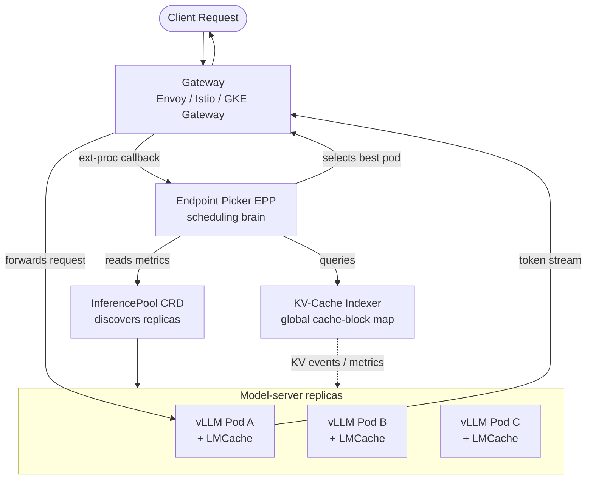
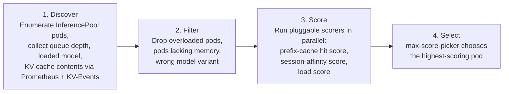
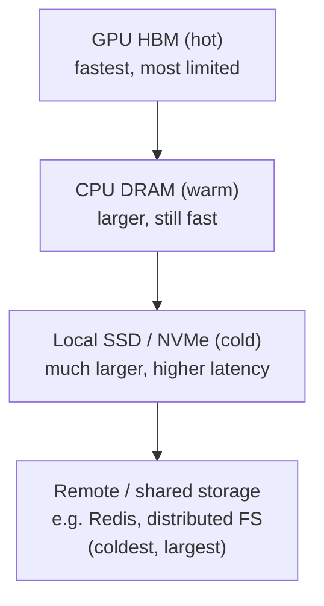
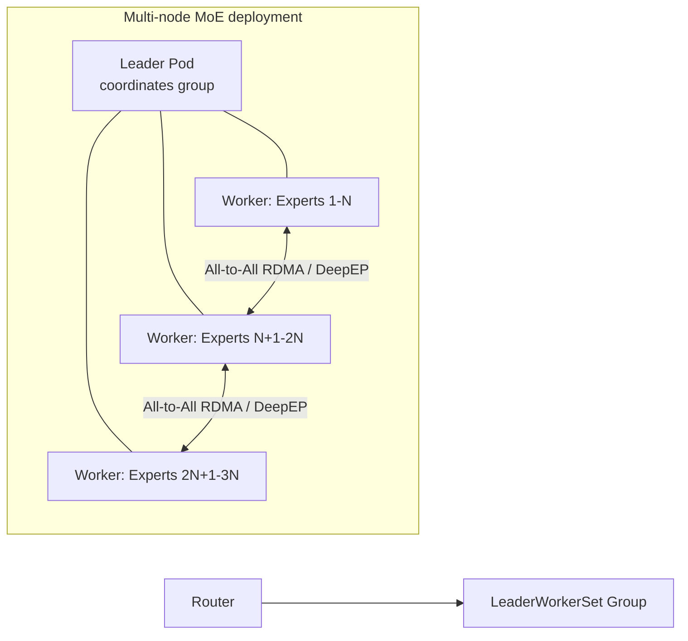
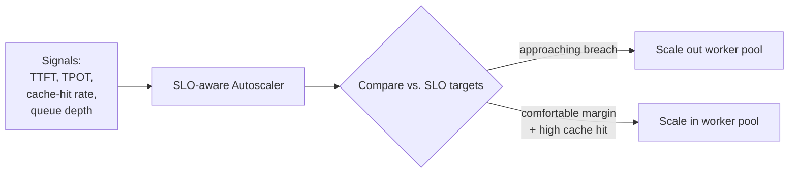
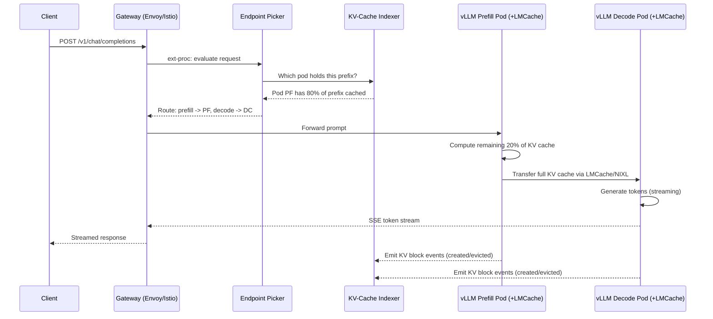
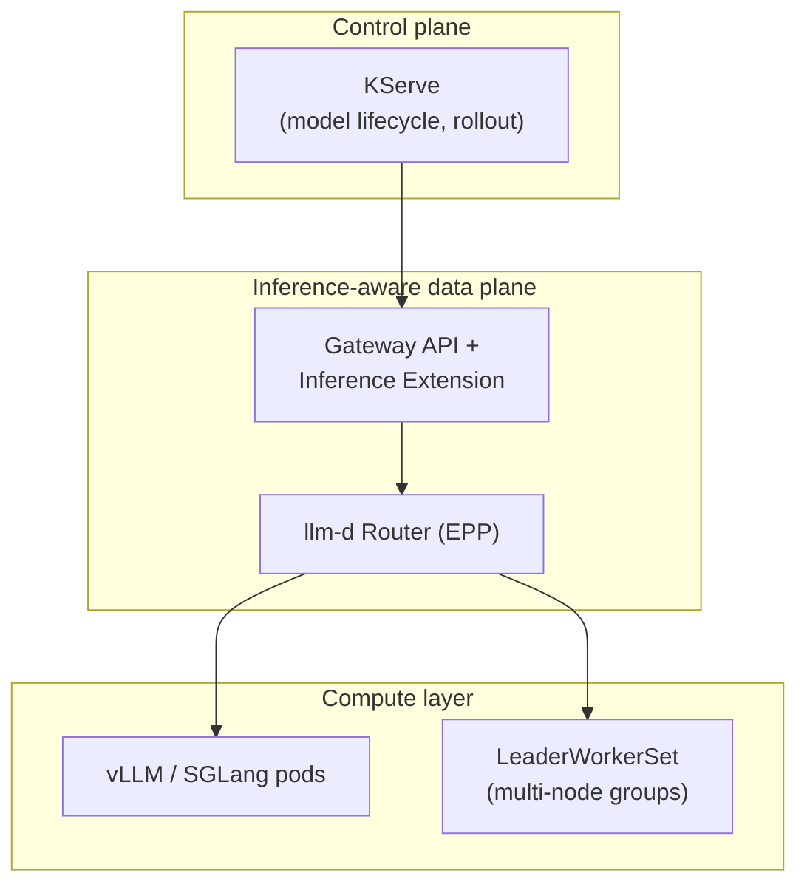

# llm-d: The Complete Reference

### Kubernetes-Native Distributed Inference for Large Language Models — Theory and Production Implementation

*A rigorous, end-to-end guide covering the architecture, the router, KV-cache management, disaggregated prefill/decode, autoscaling, and the concrete integration with vLLM and LMCache.*

---

## Table of Contents

1. [Executive Summary](#1-executive-summary)
2. [Why llm-d Exists — The Problem Space](#2-why-llm-d-exists--the-problem-space)
3. [Project Identity, Governance, and Timeline](#3-project-identity-governance-and-timeline)
4. [Architecture Overview](#4-architecture-overview)
5. [The llm-d Router: Proxy + Endpoint Picker (EPP)](#5-the-llm-d-router-proxy--endpoint-picker-epp)
6. [KV-Cache Management and Prefix-Cache-Aware Routing](#6-kv-cache-management-and-prefix-cache-aware-routing)
7. [Disaggregated Prefill/Decode (P/D Disaggregation)](#7-disaggregated-prefilldecode-pd-disaggregation)
8. [Wide Expert Parallelism (for MoE models)](#8-wide-expert-parallelism-for-moe-models)
9. [SLO-Aware Autoscaling](#9-slo-aware-autoscaling)
10. [How llm-d Integrates With vLLM](#10-how-llm-d-integrates-with-vllm)
11. [How llm-d Integrates With LMCache](#11-how-llm-d-integrates-with-lmcache)
12. [The Full Data Path, End to End](#12-the-full-data-path-end-to-end)
13. [Relationship to Kubernetes, KServe, Gateway API, and LeaderWorkerSet](#13-relationship-to-kubernetes-kserve-gateway-api-and-leaderworkerset)
14. [Concrete Implementation: Prerequisites and Cluster Preparation](#14-concrete-implementation-prerequisites-and-cluster-preparation)
15. [Concrete Implementation: Deploying the "Well-Lit Paths"](#15-concrete-implementation-deploying-the-well-lit-paths)
16. [Concrete Implementation: Configuring Disaggregated Serving with LMCache + NIXL](#16-concrete-implementation-configuring-disaggregated-serving-with-lmcache--nixl)
17. [Observability: Metrics, Dashboards, and What to Watch](#17-observability-metrics-dashboards-and-what-to-watch)
18. [Operational Considerations, Limitations, and Risks](#18-operational-considerations-limitations-and-risks)
19. [Decision Framework: When to Adopt llm-d](#19-decision-framework-when-to-adopt-llm-d)
20. [Glossary](#20-glossary)
21. [Primary Sources](#21-primary-sources)

---

## 1. Executive Summary

**llm-d** is a **Kubernetes-native, high-performance distributed inference stack** for serving large language models in production. It is **not** a model-serving engine — it does not replace vLLM or SGLang — and it is **not** a full MLOps platform — it does not replace KServe. Instead, llm-d is a **middleware orchestration layer** that sits between a Kubernetes-native control plane (KServe, or a raw Gateway) and one or more model-server engines (primarily vLLM), and makes those engines behave as a single, cache-aware, SLO-driven distributed system.

Concretely, llm-d provides four capability pillars:

| Pillar | What it does |
|---|---|
| **Intelligent routing** | Routes each request to the replica most likely to already hold the relevant KV-cache blocks, instead of blind round-robin or session-sticky routing. |
| **Disaggregated serving** | Splits the compute-bound *prefill* phase from the memory-bandwidth-bound *decode* phase onto independently scalable pods. |
| **KV-cache management** | Maintains a near-real-time index of which cache blocks live on which pod, and can tier cache storage across GPU HBM, CPU RAM, and local/remote storage. |
| **Operational excellence** | SLO-aware autoscaling, flow control for multi-tenant fairness, and OpenAI-compatible batch processing. |

llm-d was launched by **Red Hat** in May 2025, with founding contributors **Google Cloud, IBM Research, CoreWeave, and NVIDIA**, and joined by **AMD, Cisco, Hugging Face, Intel, Lambda, and Mistral AI**, plus academic supporters at UC Berkeley and the University of Chicago. In March 2026, at KubeCon Europe (Amsterdam), the project was **donated to the Cloud Native Computing Foundation (CNCF) as a Sandbox project** — an early-stage, actively-evolving governance status, not yet Incubating or Graduated.

---

## 2. Why llm-d Exists — The Problem Space

LLM inference requests are fundamentally different from ordinary stateless HTTP requests, and generic load-balancing patterns handle them poorly.

### 2.1 LLM requests are stateful

Every request carries an invisible piece of state: the **KV cache** (the key/value tensors produced by attention layers while processing the prompt). If a subsequent request reuses part of a previously-seen prompt (a system prompt, a long RAG context, a multi-turn conversation), and it is routed to a replica that already holds the matching cache blocks, the engine can skip recomputation entirely. If it is routed to a "cold" replica, the same tokens must be reprocessed from scratch.

### 2.2 Requests are expensive and highly variable

A single request can occupy a GPU for seconds and consume thousands of tokens. The ratio of input tokens to output tokens varies enormously — a short chat turn and an 8K-token RAG query place completely different loads on the accelerator.

### 2.3 Prefill and decode have opposite performance profiles

- **Prefill** (processing the prompt) is **compute-bound**: it saturates GPU FLOPs.
- **Decode** (generating tokens one at a time) is **memory-bandwidth-bound**: it is limited by how fast data can move between HBM and compute cores.

Running both phases on the same GPU means neither is optimally utilized, and a long prefill for one user can stall decode latency for every other concurrent user on that pod.

### 2.4 Round-robin and sticky routing are cache-blind

Kubernetes `Service` load balancing and typical L7 sticky-session routing have no concept of KV-cache locality, queue depth per replica, or per-request cost. They cannot answer the one question that matters most for inference efficiency: *"which replica already has the relevant cache?"*

### 2.5 The llm-d answer

llm-d's stated goal is to provide a **"well-lit path"** — a proven, benchmarked, replicable blueprint — so that any organization can adopt state-of-the-art distributed-inference optimizations (cache-aware routing, disaggregation, wide expert parallelism) on their existing Kubernetes infrastructure, across NVIDIA, AMD, Intel, and TPU accelerators, without having to invent this infrastructure themselves.

---

## 3. Project Identity, Governance, and Timeline

| Fact | Detail |
|---|---|
| Founding organization | Red Hat (initial announcement, Red Hat Summit, May 2025) |
| Founding contributors | Red Hat, Google Cloud, IBM Research, CoreWeave, NVIDIA |
| Later joining partners | AMD, Cisco, Hugging Face, Intel, Lambda, Mistral AI |
| Academic supporters | UC Berkeley, University of Chicago |
| CNCF status | **Sandbox project**, accepted March 2026 at KubeCon Europe (Amsterdam) |
| License | Apache 2.0 (standard CNCF project licensing) |
| Repositories | `github.com/llm-d/llm-d` (core), plus split repos: `llm-d-router`, `llm-d-inference-scheduler`, `llm-d-kv-cache-manager`, `llm-d-benchmark`, `llm-d-deployer`, etc. |
| Overlapping/related CNCF projects | KServe, Gateway API Inference Extension (GAIE), Volcano (via its Kthena sub-project), KAITO |

**Important nuance for planning purposes:** CNCF *Sandbox* is the earliest of the three CNCF maturity levels (Sandbox → Incubating → Graduated). It signals legitimacy and vendor-neutral governance, but it explicitly does **not** signal production stability guarantees. The project documentation and third-party guides consistently recommend validating performance and correctness in staging before rolling llm-d into production, and expect breaking API changes between releases while it remains in Sandbox.

A terminology note that matters when reading llm-d documentation of different vintages: the component originally called the **"Inference Scheduler"** in the founding proposal is now called the **llm-d Router**, composed of a **Proxy** and an **Endpoint Picker (EPP)**.

---

## 4. Architecture Overview

At the highest level, llm-d turns a Kubernetes cluster into a coordinated inference fabric with three architectural building blocks:

1. **The Router** (Proxy + Endpoint Picker) — the intelligent entry point.
2. **The InferencePool** — a Kubernetes Custom Resource representing a logical, discoverable group of model-server pods serving the same model.
3. **The Model Servers** — the actual inference engines (primarily vLLM, also SGLang), which expose the metrics and KV-cache events the Router depends on.



The system is designed for **incremental adoption**: a team can start by deploying only the Router with cache-aware routing on their existing vLLM pool (no network prerequisites beyond a normal cluster network), and only later layer on disaggregated prefill/decode (which does require a high-performance interconnect) and wide expert parallelism.

---

## 5. The llm-d Router: Proxy + Endpoint Picker (EPP)

### 5.1 Role of the Proxy

The **Proxy** is the data-plane component (commonly Envoy, or an Envoy-based gateway such as Istio or the GKE Inference Gateway). It terminates client connections and, for every inference request, calls out to the Endpoint Picker via Envoy's **external processing (ext-proc)** protocol before deciding where to forward the request.

### 5.2 Role of the Endpoint Picker (EPP)

The EPP is the actual decision-making "brain." It implements the **Endpoint Picker Protocol**, part of the **Gateway API Inference Extension (GAIE)**, a Kubernetes SIG-Network effort that llm-d is a primary reference implementation of. The EPP evaluates the current state of the **InferencePool** and runs a pluggable, four-stage scheduling pipeline:



Key scheduling signals the EPP can combine, depending on configuration:

- **Prefix-cache locality** — does this pod already hold the KV-cache blocks for this prompt's prefix?
- **KV-cache utilization** — how much cache headroom does each candidate pod have?
- **Queue depth / in-flight requests** — how backed up is each pod right now?
- **Prefill vs. decode role** — in disaggregated deployments, filters such as `prefill-filter` / `decode-filter` restrict candidates to the correct pool.
- **Session affinity** — useful for multi-turn conversations even without full prefix-cache indexing.
- **Predicted latency** (experimental, since the 0.3 release) — a latency-prediction-based scorer that has shown up to 3x improvement in P90 latency for long-prefill workloads in llm-d's own benchmarks.

### 5.3 Precise vs. heuristic prefix-cache routing

llm-d supports two levels of cache-awareness:

- **Heuristic routing**: approximates cache locality (e.g., via consistent hashing of the prompt prefix and recent routing history) without querying live cache state. Cheaper, lower fidelity.
- **Precise routing**: queries the KV-Cache Indexer for a near-real-time view of which blocks are on which pod, enabling exact cache-hit-maximizing decisions. Higher fidelity, more infrastructure to run.

### 5.4 InferencePool and related CRDs

The `InferencePool` is a Gateway API Inference Extension custom resource that groups replicas serving one model and wires them to an EPP:

```yaml
apiVersion: inference.networking.x-k8s.io/v1alpha2
kind: InferencePool
metadata:
  name: llm-pool
  namespace: llm-serving
spec:
  targetPortNumber: 8000
  selector:
    app: vllm-llm-d
  endpointPickerConfig:
    extensionRef:
      name: llm-d-epp
```

Two companion resources refine EPP behavior:

- **`InferenceObjective`** — configures scheduling goals for a class of requests (priority level, performance target).
- **`InferenceModelRewrite`** — allows model-name aliasing/rewriting at the routing layer.

---

## 6. KV-Cache Management and Prefix-Cache-Aware Routing

### 6.1 Why the cache is the single biggest lever

A cache hit lets the engine skip recomputing attention over the shared prefix entirely. A cache miss means full recomputation. This is why cache-aware routing is consistently cited by the project and its adopters as the single most mature and highest-leverage capability in llm-d — it requires no special network hardware and delivers the majority of the achievable latency and throughput gains.

### 6.2 The KV-Cache Indexer

The **KV-Cache Indexer** consumes KV-cache events (block creation, eviction, promotion/demotion) emitted by each model-server pod, and maintains a cluster-wide, near-real-time map of "which token-block hashes live on which replica, and in which storage tier." The EPP queries this index to make precise routing decisions instead of guessing.

### 6.3 Tiered / hierarchical cache offloading

GPU HBM is scarce and expensive. llm-d (largely via LMCache, see Section 11) supports a **tiered cache hierarchy**:



Blocks are automatically promoted and demoted between tiers based on access recency and frequency. Scorers such as `precise-prefix-cache-scorer` are tier-aware, so the router can prefer a pod with a hot HBM-resident block over one that would need to pull the same block back from CPU RAM or disk.

### 6.4 Effect on the two dominant serving metrics

- **TTFT (Time-To-First-Token):** directly reduced by cache hits, since the compute-heavy prefill step for the cached portion is skipped.
- **Throughput (tokens/s):** improved because GPU cycles are not wasted recomputing identical prefixes across a shared-prompt or multi-turn workload.

---

## 7. Disaggregated Prefill/Decode (P/D Disaggregation)

### 7.1 The core idea

Instead of running prefill and decode for a request on the same GPU/pod, llm-d can route the prompt-processing step to a **prefill worker** and the token-generation step to a separately-scaled **decode worker**, transferring the computed KV cache between them over a high-performance interconnect.


### 7.2 Why this helps

- Each phase runs on hardware matched to its bottleneck (e.g., compute-dense accelerators for prefill, memory-bandwidth-favorable accelerators for decode).
- Long prefills no longer stall decode for other concurrent users sharing the same GPU.
- TPOT (Time-Per-Output-Token) becomes more stable and predictable, which matters for SLA commitments.
- Each pool (prefill, decode) can be scaled independently based on its own bottleneck signal.

### 7.3 The hard prerequisite: network performance

KV-cache transfer between prefill and decode workers moves multi-gigabyte tensors per request. If the interconnect is slow, the transfer cost can exceed the cost of simply recomputing the cache, erasing the benefit entirely. Production-grade disaggregation therefore expects a **high-performance interconnect**: RDMA-capable NICs, NVLink for intra-node transfer, InfiniBand or RoCE for inter-node transfer. On a plain 1GbE/10GbE cloud network without RDMA, disaggregated serving is unlikely to pay off and should generally not be enabled.

### 7.4 The transport layer: NIXL

KV-cache transport in this path is handled by **NIXL** (NVIDIA Inference Xfer Library, originally developed in the NVIDIA Dynamo project), a communication abstraction supporting NVLink, RDMA-capable NICs, and GPUDirect Storage across heterogeneous hardware. This is the same transport layer used by vLLM's and LMCache's disaggregated-prefill implementations (see Sections 10–11).

---

## 8. Wide Expert Parallelism (for MoE models)

For **Mixture-of-Experts** models (e.g., DeepSeek-R1-class architectures), a single GPU cannot economically hold every expert. llm-d's **Wide Expert Parallelism (Wide EP)** well-lit path distributes experts across many GPUs, using:

- The **DeepEP** backend for All-to-All RDMA communication between experts.
- **Data Parallelism** layered on top for throughput.
- **LeaderWorkerSet (LWS)**, a Kubernetes CRD, to orchestrate the multi-host worker groups (a leader pod coordinating a set of worker pods) required for this kind of multi-node inference.



In llm-d's own 0.3-release benchmarks, this path scaled expert-parallel throughput up to roughly **2.2k tokens/s per H200 GPU**. As with disaggregation, this feature assumes a fast interconnect between nodes.

---

## 9. SLO-Aware Autoscaling

Generic Kubernetes autoscaling (CPU/memory-based HPA, or simple queue-depth-triggered KEDA rules) has no notion of inference-specific service levels. llm-d's operational-excellence pillar layers autoscaling logic on real inference signals:

- KV-cache utilization / hit rate
- Queue depth and in-flight request counts, per pool (prefill vs. decode)
- Observed TTFT / TPOT against configured SLO targets



The stated intent is to let clusters run **hotter** — i.e., closer to full utilization — before scaling out, extracting more useful work per GPU while still respecting latency objectives, rather than provisioning conservatively "just in case."

llm-d also includes **flow control** for multi-tenant fairness (so that one noisy tenant cannot starve others of GPU time) and **OpenAI-compatible batch APIs** for asynchronous, large-scale offline inference that maximizes hardware utilization outside the online serving path.

---

## 10. How llm-d Integrates With vLLM

vLLM is llm-d's primary, most deeply-supported model server (SGLang is also supported as an alternative engine in some well-lit paths).

**The division of responsibility is clean:**

- **vLLM** owns everything *inside* a single replica: model loading, PagedAttention, batching, the actual token-generation loop, and — critically — exposing the metrics and KV-cache events that the rest of the stack depends on.
- **llm-d** owns everything *across* replicas: which replica gets which request, how phases are split across replicas, and how the whole pool scales.

For this to work, each vLLM pod must:

1. **Expose Prometheus-compatible metrics** — queue depth, GPU KV-cache usage percentage, running/waiting request counts, etc. — that the EPP's scorers consume.
2. **Emit KV-cache events** (block creation/eviction) that feed the KV-Cache Indexer for precise prefix-cache routing.
3. **Register with the InferencePool** so the Router can discover it as a valid candidate.
4. For disaggregated deployments, be started with the correct **`--kv-transfer-config`** so it knows whether it is acting as a KV producer (prefill) or KV consumer (decode), and via which connector (see Section 11).

vLLM's own architecture evolution (the "V1" engine rewrite) specifically added a clean, pluggable **KV-connector interface** in the core so that external cache/transfer systems — like LMCache and NIXL-based connectors — can be attached without forking vLLM. This connector interface is the technical seam that makes llm-d's cache-aware and disaggregated features possible without vLLM itself becoming a distributed system.

---

## 11. How llm-d Integrates With LMCache

**LMCache** is an independent open-source project that extends inference engines (primarily vLLM) with a high-performance, multi-tier KV-cache layer. Inside the llm-d ecosystem, LMCache is commonly described as llm-d's **default KV-cache layer** — it is not part of the llm-d codebase itself, but llm-d's well-lit paths and guides integrate it as the recommended way to get tiered caching and cross-node cache reuse.

### 11.1 Integration mode: the KV-connector plug-in

LMCache attaches to vLLM through vLLM's KV-connector API. In vLLM's current (V1) engine, the relevant connector class is **`LMCacheConnectorV1`**. This is the primary, recommended integration path: it lets LMCache manage its own block indexing and multi-tier memory (GPU HBM → CPU DRAM → local SSD → remote/shared storage) while riding on top of vLLM's execution loop.

An alternative, lighter-weight path is vLLM's **native offloading connector**, which extends the cache to CPU RAM or a shared filesystem without pulling in the full LMCache stack — useful when only simple CPU offload is needed, not full tiered/shared caching.

### 11.2 Disaggregated prefill with LMCache: the concrete wiring

For P/D disaggregation, each vLLM instance is launched with a `kv-transfer-config` selecting a KV connector and a role:

```bash
# Prefill (producer) instance
vllm serve meta-llama/Llama-3.1-8B-Instruct \
  --port 7100 \
  --kv-transfer-config \
  '{"kv_connector":"LMCacheConnectorV1","kv_role":"kv_producer",
    "kv_connector_extra_config":{"discard_partial_chunks": false,
    "lmcache_rpc_port":"producer1"}}'

# Decode (consumer) instance
UCX_TLS=cuda_ipc,cuda_copy,tcp \
LMCACHE_CONFIG_FILE=lmcache-decoder-config.yaml \
CUDA_VISIBLE_DEVICES=1 \
vllm serve meta-llama/Llama-3.1-8B-Instruct \
  --port 7200 \
  --kv-transfer-config \
  '{"kv_connector":"LMCacheConnectorV1","kv_role":"kv_consumer",
    "kv_connector_extra_config":{"discard_partial_chunks": false,
    "lmcache_rpc_port":"consumer1"}}'
```

Under the hood, LMCache uses **NIXL** as its KV-transfer transport (supporting NVLink, RDMA NICs, or plain TCP as a fallback), so the *same* NIXL layer described in Section 7.4 carries the tensors moved by LMCache's connector. vLLM also ships a more minimal, connector-only path — **`NixlConnector`** — for teams who want fully async NIXL-based send/receive without the broader LMCache feature set (multi-tier storage, cross-request cache reuse across the whole pool). The two can even be composed via vLLM's `MultiConnector`, e.g. `[NixlConnector (kv_producer), LMCacheMPConnector]`, so that live KV transfer and durable multi-tier caching coexist.

Each vLLM instance in this setup typically runs alongside its own **LMCache server process** (they must not share one), started independently, e.g.:

```bash
lmcache server \
  --port 6555 --http-port 8090 \
  --l1-size-gb 100 --eviction-policy LRU --chunk-size 256 \
  --instance-id prefiller
```

A **router** in front of the prefill/decode pair (in llm-d's case, the Router/EPP described in Section 5) sends each request to a prefill instance and then a decode instance in sequence, threading the NIXL handshake between them.

### 11.3 What LMCache adds specifically

| Capability | Delivered by |
|---|---|
| Multi-tier KV storage (HBM → DRAM → SSD → remote) | LMCache |
| Cross-request, cross-replica cache reuse ("CacheBlend"-style prefix sharing) | LMCache |
| KV-cache transfer for disaggregated prefill/decode | LMCache's NIXL-based connector, or vLLM's native `NixlConnector` |
| Cluster-wide visibility of *where* cached blocks live | llm-d's KV-Cache Indexer, fed by events LMCache/vLLM emit |
| Deciding *which pod* to route to based on that visibility | llm-d's Endpoint Picker |

In short: **LMCache manages and moves the cache; llm-d knows where the cache is and routes accordingly.** Neither subsumes the other — they are complementary layers, and llm-d's own guides explicitly document LMCache as the recommended path to tiered caching in production deployments.

---

## 12. The Full Data Path, End to End



This is the composite picture: routing intelligence (Section 5–6) decides *where*; disaggregation (Section 7) decides *how the work is split*; LMCache and NIXL (Section 11) decide *how the cache physically moves*; and the autoscaler (Section 9) decides *how many pods exist* to do all of this.

---

## 13. Relationship to Kubernetes, KServe, Gateway API, and LeaderWorkerSet

llm-d deliberately does not reinvent Kubernetes primitives. It composes with:

- **Gateway API / Gateway API Inference Extension (GAIE):** llm-d is a primary implementation of GAIE's `InferencePool` and Endpoint Picker Protocol; the GAIE repository owns the `InferencePool` API definition while llm-d's own router repository now owns the EPP implementation and related `InferenceObjective` / `InferenceModelRewrite` APIs.
- **KServe:** KServe handles the model *lifecycle* — deployment, versioning, canary rollout — via its `LLMInferenceService` custom resource, while llm-d handles *inference-time* routing and cache optimization underneath it. The two are explicitly designed to be layered, not to compete: "llm-d complements rather than replaces KServe."
- **LeaderWorkerSet (LWS):** a Kubernetes API (led by Google) for orchestrating multi-node worker groups with a leader/worker topology, used by llm-d for wide expert parallelism and other multi-node disaggregated topologies.
- **KEDA / HPA:** llm-d's SLO-aware autoscaling logic is designed to layer on top of, or feed signals into, standard Kubernetes autoscalers rather than replace the underlying scaling mechanism.
- **Volcano / Kueue / KAITO:** acknowledged in llm-d's own CNCF Sandbox application as adjacent projects with partial scope overlap (batch/gang scheduling, model-deployment toolchains); llm-d deliberately stays agnostic about *how* model servers are deployed and instead documents configuration patterns.



---

## 14. Concrete Implementation: Prerequisites and Cluster Preparation

Before deploying any llm-d well-lit path, the documented baseline requirements are:

**Client tooling** (on the operator's machine):
```bash
kubectl version --client   # v1.30+ recommended
helm version                # v3.12+
yq --version
kustomize version
helmfile --version
nvidia-smi                  # confirm GPU driver / visibility
```

**Cluster-side CRDs — Gateway API and the Inference Extension:**
```bash
# 1. Gateway API CRDs
kubectl apply -f https://github.com/kubernetes-sigs/gateway-api/releases/download/v1.2.1/standard-install.yaml

# 2. Gateway API Inference Extension (GAIE) CRDs
kubectl apply -f https://github.com/kubernetes-sigs/gateway-api-inference-extension/releases/download/v0.3.0/manifests.yaml
```

**Secrets:** most model-serving guides expect a Kubernetes secret carrying a Hugging Face token, conventionally named `llm-d-hf-token`, used to pull gated model weights.

**Hardware labeling:** cluster nodes must be labeled and prepared for the specific accelerator backend in use (CUDA for NVIDIA GPUs, ROCm for AMD, XPU for Intel, or TPU-specific node pools on GKE).

**Network prerequisite for disaggregated/wide-EP paths only:** RDMA-capable interconnect (InfiniBand or RoCE) between nodes that will exchange KV cache or expert-parallel traffic. This is *not* required for the basic cache-aware routing path.

*(Always confirm exact version numbers — Gateway API and GAIE release tags — against the current `llm-d` and `gateway-api-inference-extension` GitHub release pages before deploying, since these move quickly while the project is in CNCF Sandbox.)*

---

## 15. Concrete Implementation: Deploying the "Well-Lit Paths"

llm-d ships its production patterns as **"well-lit paths"** — benchmarked, reproducible Helm-chart-based blueprints, rather than a single monolithic installer. Representative paths documented by the project include:

- **Intelligent Inference Scheduling** — the baseline cache-aware routing path (vLLM or SGLang, single-phase serving).
- **Precise Prefix-Cache Routing** — adds the KV-Cache Indexer for exact (not heuristic) cache-hit routing.
- **Wide EP / LWS** — multi-node Mixture-of-Experts serving.
- **Flow Control** — multi-tenant fairness and request prioritization.
- **Predicted-Latency Routing** — the experimental latency-prediction scorer.
- **Batch Gateway** — OpenAI-compatible asynchronous batch inference.

A representative install of the baseline routing path via the community Helm repo:

```bash
helm repo add llm-d https://llm-d.github.io/llm-d-deployer
helm repo update

helm install llm-d llm-d/llm-d \
  --namespace llm-serving \
  --create-namespace \
  --set model.name=Qwen/Qwen3-32B \
  --set prefill.replicas=2 \
  --set decode.replicas=4 \
  --set gpu.type=nvidia-h100 \
  --set autoscaling.enabled=true \
  --set autoscaling.scaleToZero=true

# Verify
kubectl get pods -n llm-serving -w
kubectl get inferencepool -n llm-serving
```

> Treat any `--set` flags above as illustrative. Because llm-d is a fast-moving CNCF Sandbox project with per-repository Helm charts (router, indexer, well-lit-path guides), always pull the exact `values.yaml` schema from the specific well-lit-path guide you are following in the current `llm-d/llm-d` documentation (`guides/README.md` and the per-path `guides/<path>/README.md` files) rather than assuming flag names are stable across releases.

Following installation, the default choice you must make explicitly is **HTTPRoute wiring**: the `HTTPRoute` resource references the Gateway and `InferencePool` by name, and if you customize release names (e.g., via a `RELEASE_NAME_POSTFIX`), the `HTTPRoute` must be updated to match before applying it — a common first-deployment failure mode.

---

## 16. Concrete Implementation: Configuring Disaggregated Serving with LMCache + NIXL

This section shows the mechanics you would actually wire up if enabling P/D disaggregation with LMCache underneath an llm-d-routed pool (single-node example, generalizes to multi-node with routable IPs).

**Step 1 — install dependencies inside the model-server image:**
```bash
pip install lmcache
# NIXL (pulled automatically via the lmcache[nixl] extra, requires nixl>=1.3.0)
pip install "lmcache[nixl]"
```

**Step 2 — start an LMCache server per vLLM instance** (prefill and decode each need their own; they must not share one process):
```bash
# Prefill-side LMCache server
lmcache server \
  --port 6555 --http-port 8090 \
  --l1-size-gb 100 --eviction-policy LRU --chunk-size 256 \
  --instance-id prefiller

# Decode-side LMCache server (different port / instance-id)
lmcache server \
  --port 6655 --http-port 8091 \
  --l1-size-gb 100 --eviction-policy LRU --chunk-size 256 \
  --instance-id decoder
```

**Step 3 — start the two vLLM instances with matching connector roles** (as shown fully in Section 11.2). Key environment variables to set for the NIXL side-channel handshake:
```bash
export VLLM_NIXL_SIDE_CHANNEL_HOST=<routable-host>
export VLLM_NIXL_SIDE_CHANNEL_PORT=5600   # must differ per instance on the same host
export UCX_NET_DEVICES=all
export NCCL_CUMEM_ENABLE=1
```

**Step 4 — front both instances with a P/D-aware router.** In a standalone LMCache deployment this is the `vllm-router --vllm-pd-disaggregation` helper; inside llm-d, this role is played by the **Router/EPP** described in Section 5, using `prefill-filter` / `decode-filter` scoring plugins to send each request to the correct pool member in sequence.

**Step 5 — (optional) layer cross-pool cache reuse.** To share prefix-cache hits *between* the prefill and decode pools too (not just within one disaggregated request), give both LMCache servers access to a shared peer-to-peer cache-sharing configuration, so identical prompt prefixes seen by either pool can be reused rather than only reused within a single request's own P/D pair.

**Kubernetes packaging notes:**
- Prefill and decode pods are typically distinct `Deployments` (or `LeaderWorkerSet` groups for multi-node prefill/decode), each with its own `InferencePool` membership and pod labels (`role: prefill` / `role: decode`) that the EPP's filters key on.
- RDMA/RoCE networking, if used, generally requires a `hostNetwork: true` or SR-IOV/Multus-based secondary network interface configuration, plus the appropriate device plugin for NIC passthrough — this is cluster- and cloud-provider-specific and should be validated against your infrastructure provider's own RDMA-on-Kubernetes documentation.

---

## 17. Observability: Metrics, Dashboards, and What to Watch

llm-d and its dependencies expose Prometheus-compatible metrics at multiple layers. At minimum, a production dashboard should track:

| Layer | Metric | Why it matters |
|---|---|---|
| vLLM engine | `vllm:num_requests_waiting` | Queue backpressure signal |
| vLLM engine | `vllm:gpu_cache_usage_perc` | KV-cache memory pressure |
| vLLM engine | TTFT / ITL (inter-token latency) histograms | Core latency SLOs |
| EPP / Router | Cache-hit rate (prefix-cache scorer) | Effectiveness of cache-aware routing |
| EPP / Router | Routing decision latency | Overhead the router itself adds |
| KV-Cache Indexer | Index staleness / sync interval | Freshness of routing decisions |
| Disaggregated path | KV-transfer duration, transfer failures | Health of the NIXL/RDMA path |
| Autoscaler | Scale-out/scale-in events vs. SLO breaches | Whether autoscaling is actually protecting SLOs |

The project also provides an **Open Benchmarking** framework (`llm-d-benchmark`) specifically so that adopters can quantitatively compare TTFT, TPOT, throughput, and KV-cache utilization *before and after* enabling each llm-d capability, rather than relying on vendor-reported numbers alone — a step every third-party guide explicitly recommends given the project's Sandbox maturity level.

---

## 18. Operational Considerations, Limitations, and Risks

Presented even-handedly, since this is a genuine architectural trade-off:

**Complexity cost.** Moving from "Envoy + vLLM" to "Envoy + EPP + KV-Cache Indexer + separate prefill/decode pools + NIXL networking" is a real increase in the number of components to monitor, upgrade, and debug. Teams should expect to invest in new runbooks and on-call familiarity.

**Network is a hard gate for disaggregation and Wide EP.** Without RDMA-class interconnect (InfiniBand/RoCE), KV-cache transfer between prefill and decode pods — or expert-parallel All-to-All traffic — can be slower than simply recomputing locally, negating the benefit. On plain cloud networking (1/10GbE, no RDMA), stick to the cache-aware-routing-only path.

**Maturity.** As a CNCF **Sandbox** project (the earliest of three maturity tiers), llm-d should be expected to have evolving APIs, potential breaking changes between minor releases, and gaps in edge-case hardening relative to Incubating/Graduated CNCF projects. Multiple independent write-ups converge on the same recommendation: validate in staging with the Open Benchmarking framework before production rollout.

**Indexer as a new dependency.** The KV-Cache Indexer must itself be sized and monitored; if it becomes stale or unavailable, the EPP typically degrades to a less precise (heuristic or round-robin-like) routing mode, silently giving up part of the cache-hit benefit until it recovers.

**Not a replacement for model-lifecycle tooling.** llm-d does not manage model rollout, versioning, or canarying — that remains KServe's (or your own tooling's) job. Treat llm-d strictly as the inference-time routing/caching/scaling layer beneath your existing control plane.

---

## 19. Decision Framework: When to Adopt llm-d

| Signal | Favors adopting llm-d | Favors staying with a simpler stack |
|---|---|---|
| Traffic volume | Sustained, high concurrent request volume with GPU cost pressure | Low/occasional traffic, GPUs rarely saturated |
| Prompt structure | Frequent shared prefixes: system prompts, RAG, multi-turn chat | Short, highly heterogeneous prompts with little prefix overlap |
| Model size | Large dense models or MoE models (70B+) | Small models that comfortably fit and run fast on one GPU |
| Network | RDMA/InfiniBand/RoCE available | Standard cloud networking only, no RDMA |
| Team | Dedicated MLOps/platform team able to own new components | Small team wanting minimal moving parts |
| SLA strictness | Contractual latency/throughput guarantees to customers | Best-effort internal tooling |

**Recommended incremental path**, consistent with the project's own design philosophy:

1. Start with the **Router (EPP) alone**, cache-aware routing on your existing pool — no RDMA required, delivers the majority of the latency win.
2. Add the **precise Cache Indexer** once you want exact (not heuristic) routing.
3. Layer in **SLO-aware autoscaling**.
4. Only once your GPUs are demonstrably saturated on the decode side *and* you have RDMA-class networking, evaluate **disaggregated prefill/decode**.
5. Reach for **Wide Expert Parallelism** only if you are actually serving large MoE models across multiple nodes.

---

## 20. Glossary

| Term | Definition |
|---|---|
| **TTFT** | Time-To-First-Token: latency from request receipt to the first generated token. |
| **TPOT / ITL** | Time-Per-Output-Token / Inter-Token Latency: steady-state latency between successive generated tokens. |
| **KV cache** | The key/value attention tensors computed while processing a prompt, reusable for subsequent generation or shared prefixes. |
| **Prefill** | The compute-bound phase where the model processes the full input prompt. |
| **Decode** | The memory-bandwidth-bound phase where the model generates output tokens one at a time. |
| **P/D disaggregation** | Running prefill and decode on separate, independently-scaled workers. |
| **EPP** | Endpoint Picker — the scheduling brain of the llm-d Router. |
| **InferencePool** | Gateway API Inference Extension CRD grouping model-server replicas for a given model. |
| **GAIE** | Gateway API Inference Extension — the Kubernetes SIG-Network project defining `InferencePool` and the Endpoint Picker Protocol. |
| **LWS** | LeaderWorkerSet — Kubernetes CRD for multi-node leader/worker pod groups. |
| **NIXL** | NVIDIA Inference Xfer Library — transport abstraction for KV-cache transfer over NVLink/RDMA/GPUDirect Storage. |
| **LMCache** | Open-source multi-tier KV-cache library that plugs into vLLM's KV-connector interface. |
| **KVConnectorV1 / LMCacheConnectorV1 / NixlConnector** | vLLM's pluggable KV-transfer connector interface and its concrete implementations. |
| **Wide EP** | Wide Expert Parallelism — distributing MoE experts across many GPUs/nodes. |
| **Well-lit path** | llm-d's term for a benchmarked, reproducible, documented deployment blueprint. |
| **CNCF Sandbox** | The earliest of three CNCF project maturity stages (Sandbox → Incubating → Graduated). |

---

## 21. Primary Sources

- llm-d project site and documentation — `https://llm-d.ai`
- llm-d core repository — `https://github.com/llm-d/llm-d`
- llm-d Router repository (EPP, terminology, architecture) — `https://github.com/llm-d/llm-d-router`
- CNCF Sandbox application — `https://github.com/cncf/sandbox/issues/462`
- CNCF announcement, March 2026 — `https://www.cncf.io/blog/2026/03/24/welcome-llm-d-to-the-cncf-evolving-kubernetes-into-sota-ai-infrastructure/`
- Red Hat announcement — `https://www.redhat.com/en/blog/why-were-contributing-llm-d-cncf-standardizing-future-ai`
- IBM Research announcement — `https://research.ibm.com/blog/donating-llm-d-to-the-cloud-native-computing-foundation`
- Google Cloud announcement (GKE Inference Gateway, EPP) — `https://cloud.google.com/blog/products/containers-kubernetes/llm-d-officially-a-cncf-sandbox-project`
- llm-d 0.3 release notes (predicted-latency routing, Wide EP throughput figures) — `https://llm-d.ai/blog/llm-d-v0.3-expanded-hardware-faster-perf-and-igw-ga`
- vLLM disaggregated-prefill documentation — `https://docs.vllm.ai/en/stable/features/disagg_prefill/`
- LMCache documentation, disaggregated prefill guide — `https://docs.lmcache.ai/getting_started/quickstart/disaggregated_prefill.html` and `https://docs.lmcache.ai/mp/disaggregated_prefill.html`
- LMCache blog: NIXL-based PD disaggregation in vLLM V1 — `https://blog.lmcache.ai/en/2025/04/11/shaping-nixl-based-pd-disaggregation-in-vllm-v1/`

**Caveat on maturity:** because llm-d is an actively-evolving CNCF Sandbox project, exact CLI flags, Helm chart schemas, release versions, and benchmark figures should always be re-verified against the live `llm-d/llm-d` GitHub repository and `llm-d.ai/docs` before being used in a production runbook — several of the specifics in this document (Helm values, chart names, precise throughput numbers) are illustrative of the pattern and were accurate as of mid-2026, but are exactly the kind of detail this project changes quickly.