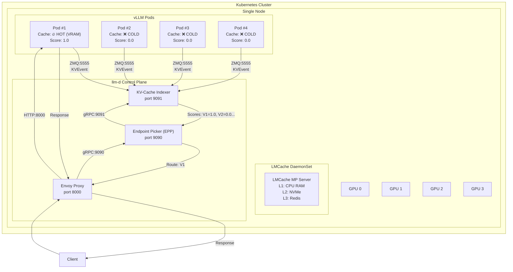
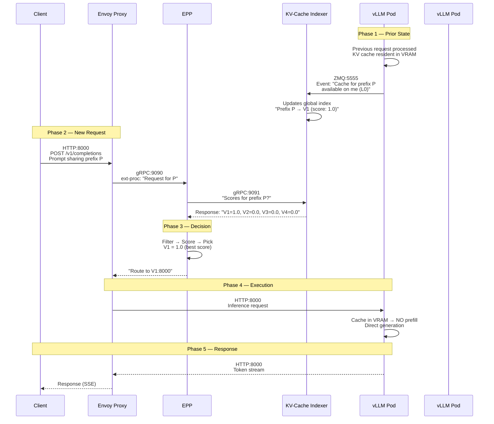
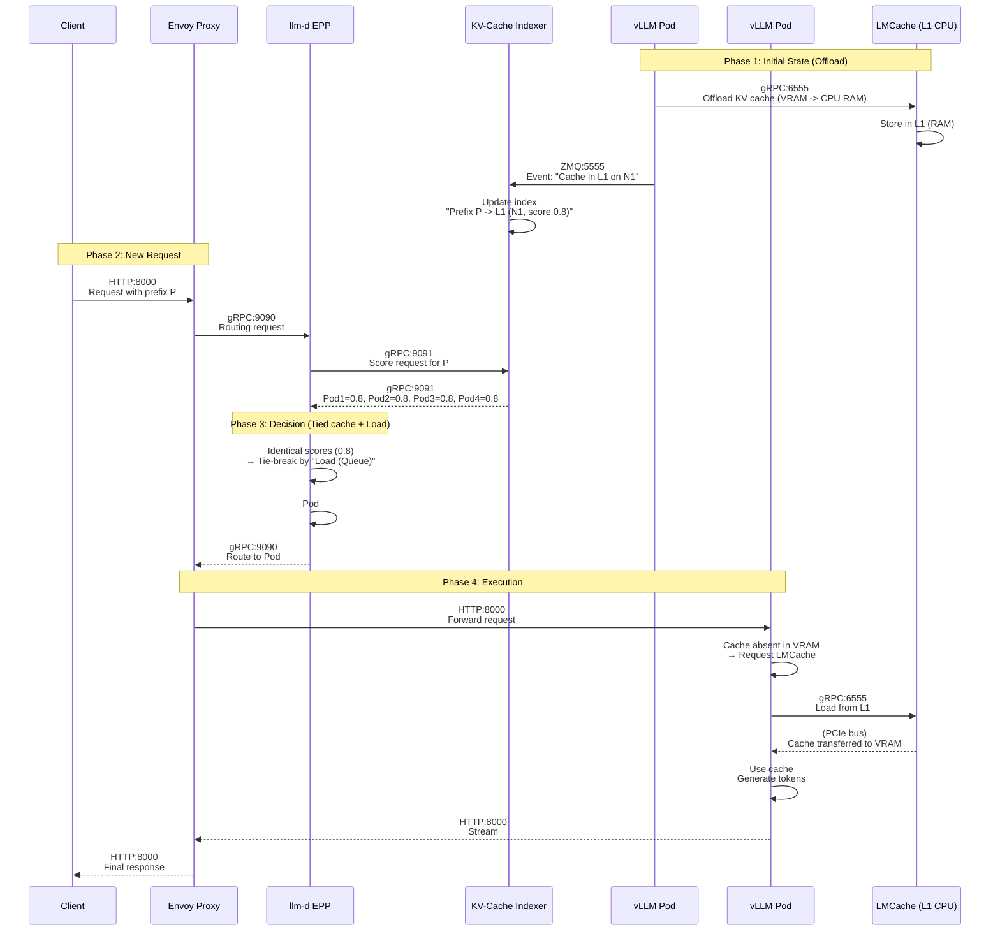
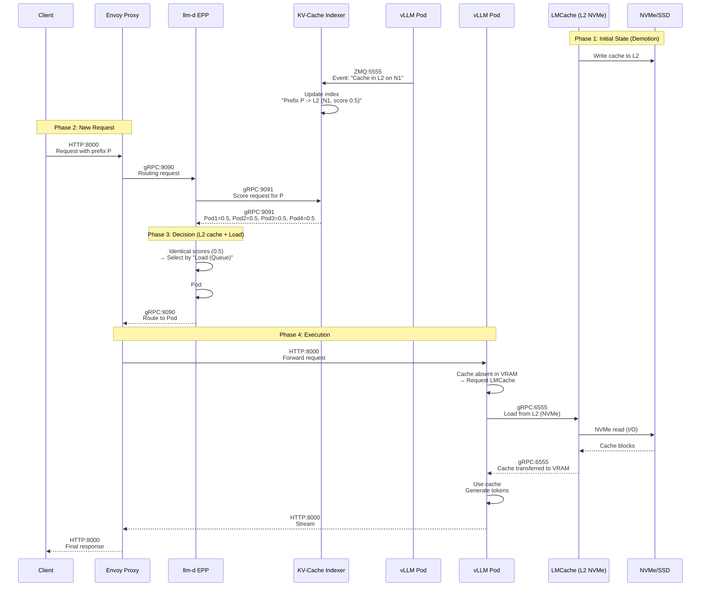
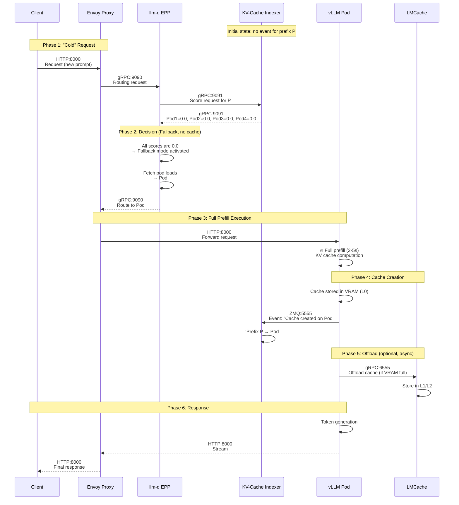
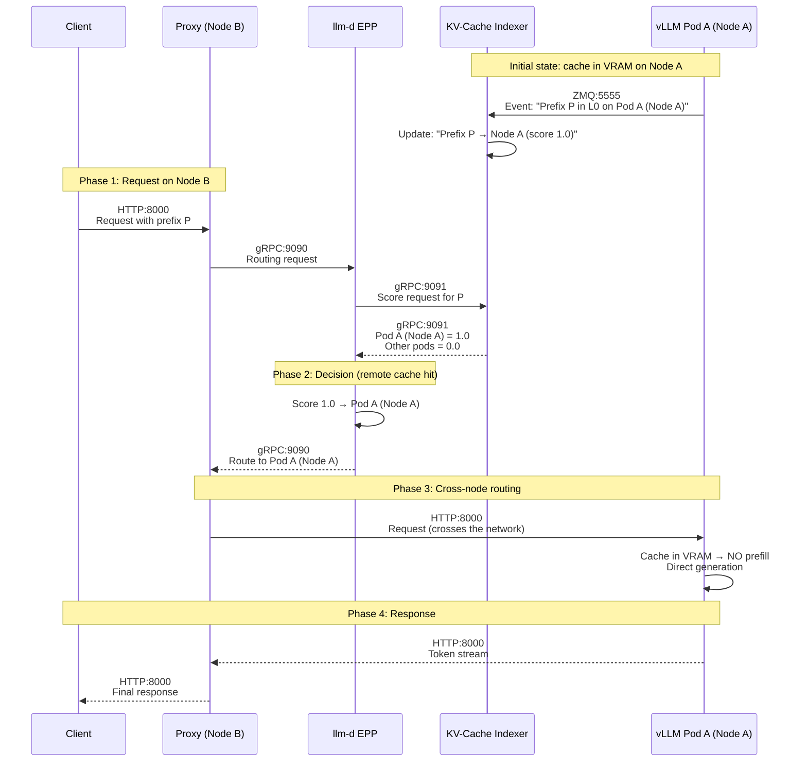
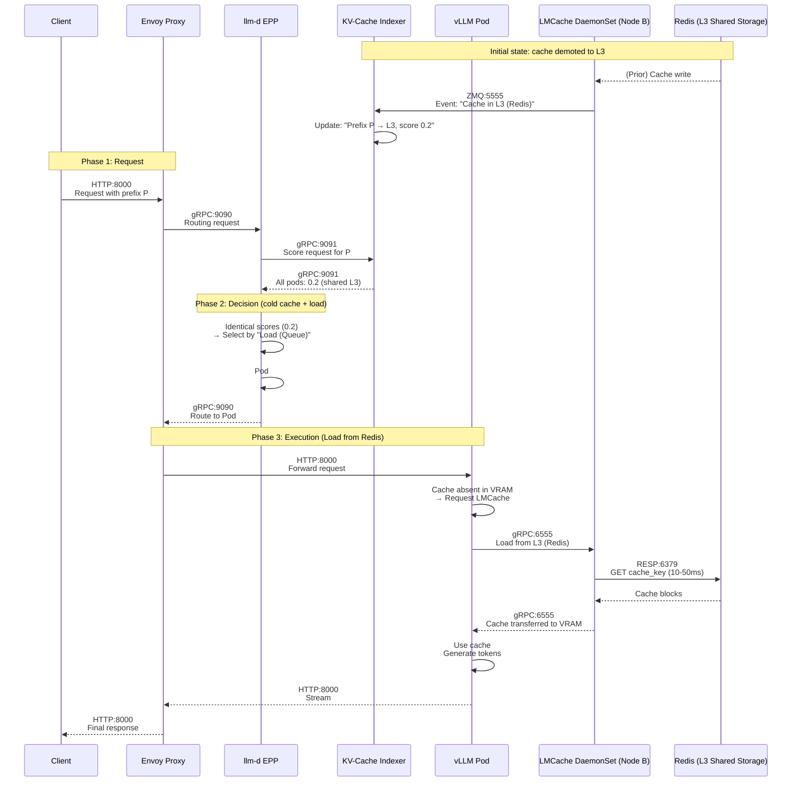
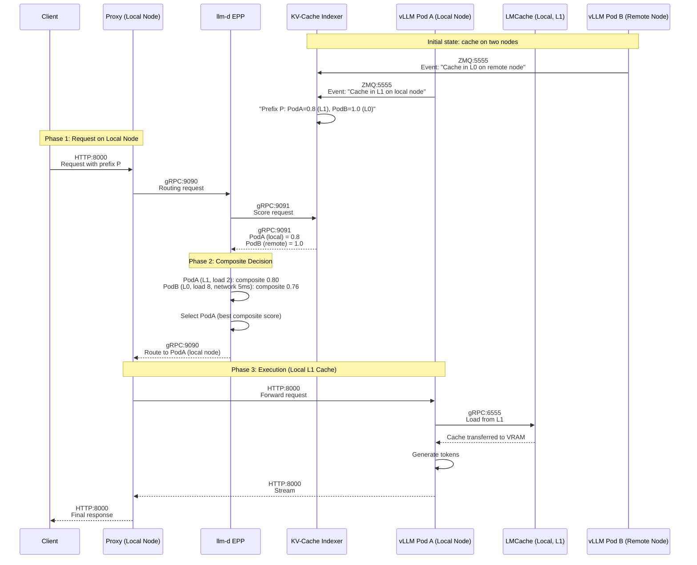
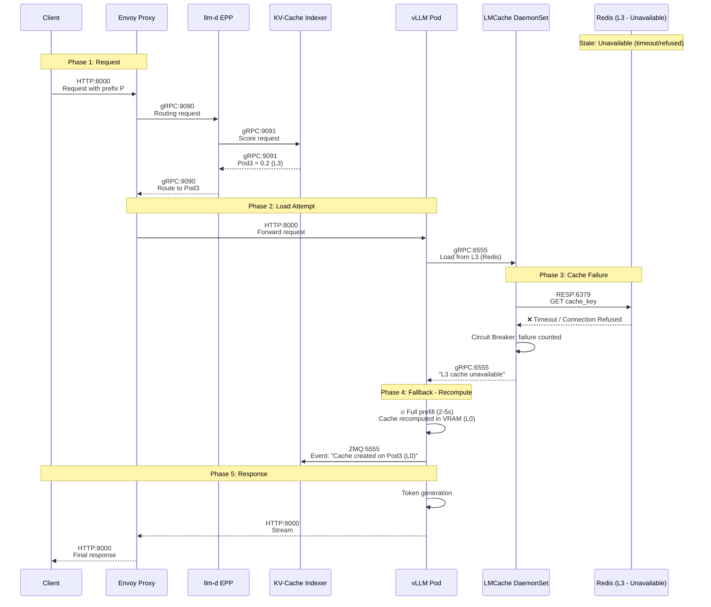
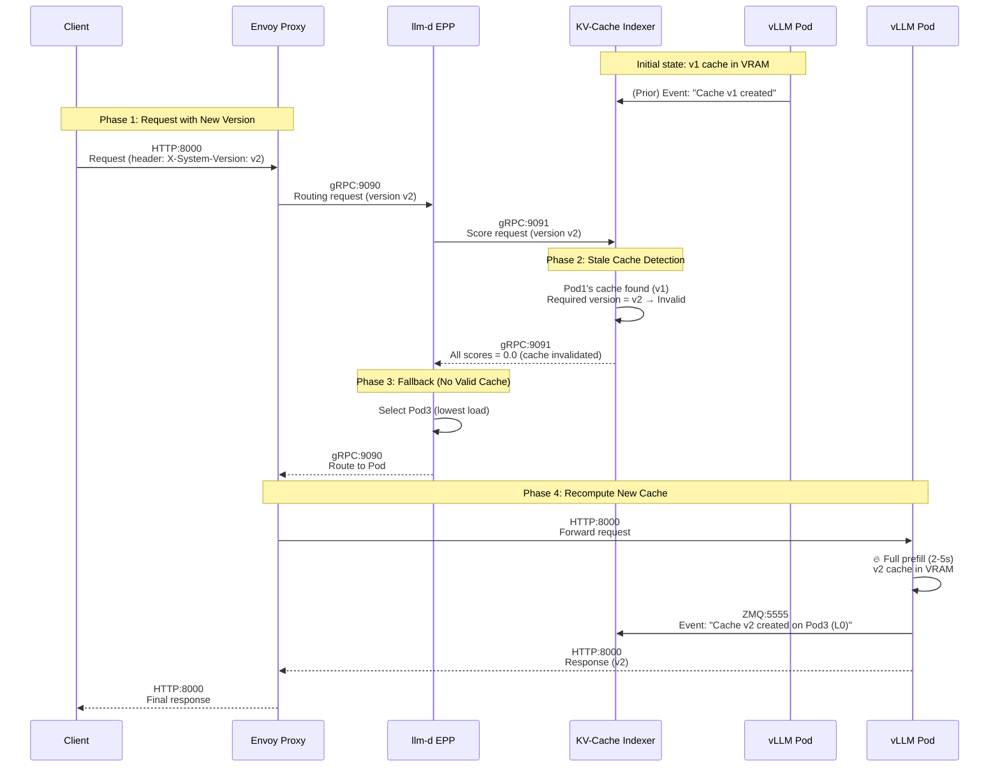

# LMCache + vLLM + llm-d — Complete Reference Guide
### A comprehensive, scenario-based reference for cache-aware LLM inference at scale

---

## Table of Contents

1. [Introduction](#introduction)
2. [Reference Architecture](#reference-architecture)
3. [Communication Channels — Master Reference](#communication-channels--master-reference)
4. [Scenario 1 — Cache Hit in VRAM, Same Node](#scenario-1--cache-hit-in-vram-same-node)
5. [Scenario 2 — Cache Hit in LMCache L1 (CPU RAM), Same Node](#scenario-2--cache-hit-in-lmcache-l1-cpu-ram-same-node)
6. [Scenario 3 — Cache Hit in LMCache L2 (NVMe), Same Node](#scenario-3--cache-hit-in-lmcache-l2-nvme-same-node)
7. [Scenario 4 — Total Cache Miss (First Request)](#scenario-4--total-cache-miss-first-request)
8. [Scenario 5 — Cache Hit in VRAM, Multi-Node](#scenario-5--cache-hit-in-vram-multi-node)
9. [Scenario 6 — Cache Hit in LMCache L3 (Redis), Multi-Node](#scenario-6--cache-hit-in-lmcache-l3-redis-multi-node)
10. [Scenario 7 — Prefill/Decode Disaggregation, Same Node](#scenario-7--prefilldecode-disaggregation-same-node)
11. [Scenario 8 — Prefill/Decode Disaggregation, Different Nodes](#scenario-8--prefilldecode-disaggregation-different-nodes)
12. [Scenario 9 — Local L1 vs Remote VRAM: A Composite Routing Decision](#scenario-9--local-l1-vs-remote-vram-a-composite-routing-decision)
13. [Scenario 10 — L3 (Redis) Failure and Circuit-Breaker Fallback](#scenario-10--l3-redis-failure-and-circuit-breaker-fallback)
14. [Scenario 11 — Stale Cache and Invalidation](#scenario-11--stale-cache-and-invalidation)
15. [Master Synthesis — All 11 Scenarios](#master-synthesis--all-11-scenarios)
16. [Final Conclusion](#final-conclusion)

---

## Introduction

This document is the complete technical reference for understanding how **vLLM**, **LMCache**, and **llm-d** work together to serve Large Language Model (LLM) inference at production scale, with a specific focus on **KV-cache locality and reuse**.

Each of the three components plays a distinct role:

- **vLLM** is the inference engine. It executes the model, manages GPU memory through PagedAttention, and produces/consumes the KV cache (the "memory" of previously processed tokens).
- **LMCache** is the distributed, hierarchical, and persistent cache system. It extends the KV cache beyond the GPU's VRAM into CPU RAM, local NVMe storage, and shared network storage (Redis, S3, etc.), following a tiered "hot → cold" hierarchy.
- **llm-d** is the intelligent orchestration layer built on top of Kubernetes. It is a **cache-aware router**: instead of blindly load-balancing requests (round-robin), it tracks where each piece of KV cache physically lives across the entire cluster and routes each request to the pod most likely to reuse that cache — dramatically reducing latency and wasted compute.

This document walks through **11 concrete, real-world scenarios**, ordered from the simplest (a perfect cache hit in VRAM) to the most advanced (disaggregated multi-node serving, failure handling, and cache correctness). Each scenario is explained with the same rigorous structure:

- **General description** — what is happening and why it matters
- **Topology** — the physical/logical layout of the cluster
- **Step-by-step pipeline** — every single hop, message, and protocol involved
- **Communication channel table** — a compact reference of who talks to whom
- **Complete Mermaid diagram** — a sequence diagram of the full request lifecycle
- **The role of llm-d** — what changes with vs. without llm-d (round-robin baseline)
- **Performance impact table** — quantified comparison
- **Key takeaways**

By the end of this document, you should have a complete mental model of how a KV-cache-aware inference cluster behaves under every realistic condition: hot cache, warm cache, cold cache, cross-node cache, disaggregated serving, infrastructure failure, and cache correctness.

---

## Reference Architecture

Before diving into the scenarios, let's establish the architectural vocabulary shared across all of them.

### Core Components

| Component | Role |
|---|---|
| **Client** | Sends the inference request (e.g., a chat completion) |
| **Envoy Proxy** | The cluster's ingress gateway; forwards traffic to the selected vLLM pod |
| **EPP (Endpoint Picker)** | The "brain" of llm-d; decides which pod(s) should serve the request, based on a `Filter → Score → Pick` pipeline |
| **KV-Cache Indexer** | Maintains a real-time, cluster-wide index of where every KV-cache block currently lives (which pod, which tier) |
| **vLLM Pod(s)** | The inference engine; runs PagedAttention, executes prefill and decode |
| **LMCache (DaemonSet)** | The tiered cache manager running per node; offloads/loads KV cache blocks across L1/L2/L3 |
| **Redis (L3)** | Shared, persistent, cluster-wide cache storage |

### The Cache Hierarchy

| Tier | Physical Location | Typical Latency | llm-d Score |
|---|---|---|---|
| **L0** | GPU VRAM | ~nanoseconds | **1.0** |
| **L1** | CPU RAM (node-local) | ~microseconds | **0.8** |
| **L2** | Local NVMe/SSD | ~milliseconds | **0.5** |
| **L3** | Redis / shared storage | **~6 ms** (validated) | **0.2** |
| **Miss** | Nowhere — cache does not exist | 2–5 seconds (full recompute) | **0.0** |

The **score** is the numeric signal that the KV-Cache Indexer reports to the EPP for every candidate pod. It reflects how "hot" (fast to access) a given cache location is. The EPP uses this score, together with secondary criteria such as pod load (queue depth) and network cost, to make its final routing decision.

---

## Communication Channels — Master Reference

| Channel | Protocol | Port | Description |
|---|---|---|---|
| Client → Envoy | HTTP | 8000 | Inbound inference request |
| Envoy → EPP | gRPC | 9090 | Routing decision request (`ext-proc`) |
| EPP → KV-Cache Indexer | gRPC | 9091 | Cache-scoring request |
| vLLM → KV-Cache Indexer | ZMQ | 5555 | Cache lifecycle events (PUB/SUB) |
| vLLM → LMCache | gRPC | 6555 | Offload / load of KV-cache blocks |
| vLLM → vLLM | NIXL/RDMA | 5600 | Direct GPU-to-GPU cache transfer (P/D disaggregation) |
| LMCache → Redis | RESP | 6379 | L3 tier access |
| LMCache → NVMe | Local file I/O | — | L2 tier access |
| Envoy → vLLM | HTTP | 8000 | Forwarded inference request |

This table is the backbone of every scenario below — each one is essentially a different combination of these same nine channels.

---

## Scenario 1 — Cache Hit in VRAM, Same Node

### 📌 Description

A client sends a prompt that shares a common prefix with a previous request (e.g., a system prompt: *"You are an AI assistant..."*). The KV cache for that prefix is **still resident in VRAM** on one of the vLLM pods.

**Context**: A single-node Kubernetes cluster with 4 GPUs, 4 vLLM pods, and 1 LMCache DaemonSet.

### 🎯 Why It Matters

This is the **best-case, most frequent scenario** in production environments with shared system prompts. It represents the ideal outcome that every other scenario is, in some sense, trying to approximate.

### 🏗️ Topology



### 🔄 Full Pipeline



### 📊 Interaction Table

| Step | Sender | Receiver | Channel | Content |
|---|---|---|---|---|
| 1 | V1 | Indexer | ZMQ:5555 | `KVEvent { prefix: "P", pod: "V1", tier: "L0" }` |
| 2 | Client | Proxy | HTTP:8000 | `/v1/completions` request |
| 3 | Proxy | EPP | gRPC:9090 | `ext-proc` with request metadata |
| 4 | EPP | Indexer | gRPC:9091 | Scoring request |
| 5 | Indexer | EPP | gRPC:9091 | Scores `{ V1:1.0, V2:0.0, ... }` |
| 6 | EPP | Proxy | gRPC:9090 | Decision: `V1:8000` |
| 7 | Proxy | V1 | HTTP:8000 | Inference request |
| 8 | V1 | Proxy | HTTP:8000 | Token stream |
| 9 | Proxy | Client | HTTP:8000 | SSE response |

### 🧠 The Role of llm-d

**Without llm-d** (plain round-robin), the request would have a **75% chance** (3 out of 4 pods) of landing on a cold pod. It would then suffer a **full prefill** (2–5 seconds of latency), and the cache already computed on Pod #1 would sit unused.

**With llm-d**:
- The request is guaranteed to land on **Pod #1**, 100% of the time.
- TTFT drops from **~3 seconds** to **under 50 ms**.
- GPU cycles on the other pods are preserved for other requests.

This is exactly why llm-d is called a **"cache-aware router"**: it turns the KV cache — normally a local, random resource — into a **cluster-wide, fully exploitable asset**.

### ⚡ Performance

| Metric | Without llm-d (round-robin) | With llm-d (cache-aware) |
|---|---|---|
| Target pod | 75% chance of landing cold | **100%** on Pod #1 (hot) |
| TTFT | ~2,500 ms (recompute) | **< 50 ms** (reuse) |
| VRAM cache utilization | 25% (1 pod out of 4) | **100%** (correct pod) |
| LMCache involvement | No (miss → recompute) | **No** (hit directly in VRAM) |
| CPU/GPU load | High (wasted recompute) | Minimal (decode only) |

### 💡 Key Takeaways

- **No LMCache communication at all**: the cache is already in VRAM.
- **Decision made in < 50 ms**: EPP + Indexer are extremely fast.
- **Minimal latency**: no prefill, straight to generation.
- **llm-d's contribution**: identifying the correct pod and routing to it deterministically.

---

## Scenario 2 — Cache Hit in LMCache L1 (CPU RAM), Same Node

### 📌 Description

The KV cache for the prompt is **no longer in VRAM** (it was evicted to free GPU memory), but it is still available in **L1 (CPU RAM)** via the node-local LMCache DaemonSet.

**Context**: VRAM is under pressure; the cache was offloaded to LMCache to make room for other requests.

**The essential nuance**: unlike Scenario 1, where the cache belonged to one specific pod (L0/VRAM), here the cache lives in the **node's shared RAM**. This means **every vLLM pod on that node** can access it over the PCIe bus.

### 🧠 The Role of llm-d

The KV-Cache Indexer knows the cache is in **L1 on Node N1**. Because CPU RAM access is shared across all pods on that node, the Indexer assigns an **identical score (e.g., 0.8) to every pod on N1**.

Since the scores are tied, the EPP falls back to its secondary criterion: **load**. It routes the request to whichever pod on that node currently has the **shortest queue**, minimizing wait time while still benefiting from the warm L1 cache.

### ⚙️ Step-by-Step Pipeline

#### Phase 1 — Initial State (Prerequisite)

1. **Pod #1** processed this prompt 10 minutes ago.
2. Pod #1's VRAM became saturated (95% utilized).
3. Pod #1 performs an **offload**: via its connector, it sends the KV cache to the local LMCache server.
   - Channel: `gRPC (port 6555)`
4. LMCache stores the data in **L1 (CPU RAM)**.
5. Pod #1 publishes a `KVEvent` informing llm-d's Indexer.
   - Channel: `ZMQ (port 5555)`
   - Message: *"The cache block for the 'System' prefix is now available in Tier L1 on Node N1."*
6. The Indexer updates its table: `Prefix P → L1 on Node N1 (potential score: 0.8)`.

#### Phase 2 — New Request

1. **Client → Proxy**: `HTTP/8000` — client sends the same (or prefix-matching) prompt.
2. **Proxy → EPP**: `gRPC/9090` — routing decision request.
3. **EPP → Indexer**: `gRPC/9091` — score request for the prefix.
4. **Indexer → EPP**: `gRPC/9091` — response:
   - Pod #1: `0.8` (L1, on-node)
   - Pod #2: `0.8` (L1, on-node)
   - Pod #3: `0.8` (L1, on-node)
   - Pod #4: `0.8` (L1, on-node)
   - *All pods share the same access to node RAM.*
5. **EPP → Final Decision (Score + Load)**:
   - Scores are tied across all 4 pods.
   - EPP evaluates the **Load Score** (queue depth) for each.
   - **Pod #3** has the shortest queue.
   - **Decision**: route to **Pod #3**.
6. **EPP → Proxy**: `gRPC/9090` — order: *"Route to Pod #3."*

#### Phase 3 — Execution

1. **Proxy → Pod #3**: `HTTP/8000` — forward the request.
2. **Pod #3 → LMCache**: `gRPC/6555` — cache not found in VRAM; request a **load**.
3. **LMCache → Pod #3**: reads the blocks from CPU RAM (L1) and transfers them into Pod #3's VRAM over the PCIe bus. Transfer time: microseconds.
4. **Pod #3 → Model Execution**: the cache is now in VRAM. Pod #3 **skips** recomputation of the shared prefix and only computes the request-specific suffix, then generates tokens immediately.
5. **Pod #3 → Proxy → Client**: token stream returned.

### 📡 Communication Channel Summary

| From | To | Protocol/Port | Role |
|---|---|---|---|
| Pod #1 | LMCache | gRPC/6555 | **Offload** VRAM → CPU RAM (initial state) |
| Pod #1 | Indexer | ZMQ/5555 | Event: "Cache in L1 on N1" |
| Client | Envoy Proxy | HTTP/8000 | Request |
| Proxy | EPP | gRPC/9090 | Routing request |
| EPP | Indexer | gRPC/9091 | Score request |
| Indexer | EPP | gRPC/9091 | Response: 0.8 for all pods on N1 |
| EPP | Proxy | gRPC/9090 | Decision: route to Pod #3 (least loaded) |
| Proxy | Pod #3 | HTTP/8000 | Forwarded request |
| Pod #3 | LMCache | gRPC/6555 | **Load** from CPU RAM |
| LMCache | Pod #3 | PCIe bus | Block transfer to VRAM |
| Pod #3 | Proxy | HTTP/8000 | Response stream |

### 🏗️ Complete Mermaid Diagram



### 🧠 The Role of llm-d

**Without llm-d** (round-robin): the request has a 25% chance of landing on any given pod. If it lands on a busy pod (e.g., 8 requests already queued), it is delayed regardless of cache availability. LMCache is accessible to all pods, but round-robin ignores load entirely.

**With llm-d**:
- Scores are **normalized** to 0.8 across the node (equal RAM access).
- The EPP applies its **second criterion: load**.
- It routes to the **least-loaded pod** (Pod #3), ensuring the L1 cache is exploited optimally and latency stays minimal.

### ⚡ Performance

| Metric | Without llm-d (round-robin) | With llm-d (cache-aware + load-aware) |
|---|---|---|
| Target pod | Random (25% chance of the light pod) | **100%** on the least-loaded pod |
| Cache access | Yes (if loaded from L1) | Yes (loaded from L1) |
| Queue latency | 50% chance of being high | **Minimal** (shortest-queue pod chosen) |
| Global TTFT | 50–150 ms (variable) | **30–60 ms** (stable) |
| Quality of Service (QoS) | Unstable | **Stable and predictable** |

---

## Scenario 3 — Cache Hit in LMCache L2 (NVMe), Same Node

### 📌 Description

The KV cache has been fully evicted from VRAM (L0) and is no longer in CPU RAM (L1). It has been **demoted to local NVMe/SSD storage (L2)** by the LMCache DaemonSet.

**The essential nuance**: the cache is physically written to disk. Access is slower (a few milliseconds) than CPU RAM, but remains **hugely cost-effective** compared to a full prefill recompute (which takes several seconds). L2 acts as an "archive tier" for infrequently used but recurring prefixes.

### 🧠 The Role of llm-d

The KV-Cache Indexer knows the cache is in L2 on Node N1. It assigns a **score of 0.5** (medium) to all pods on that node, since disk access is shared. The EPP picks the least-loaded pod among those with a score of 0.5. If the node is overloaded (all queues full), the EPP may decide to route elsewhere (a different node with an L3 copy, or accept a miss) rather than saturate the system further.

### ⚙️ Step-by-Step Pipeline

#### Phase 1 — Initial State (Cache Demotion)

1. Pod #1 processed the prompt hours ago.
2. The cache had already moved from VRAM to L1 (CPU RAM) some time ago.
3. **Demotion**: CPU RAM (L1) fills up. LMCache evicts the least-recently-used cache to local disk (L2).
   - Channel: NVMe disk I/O.
4. A monitoring mechanism publishes a `KVEvent`.
   - Channel: `ZMQ (port 5555)`.
   - Message: *"The cache block for the 'System' prefix has been demoted to Tier L2 (NVMe) on Node N1."*
5. The Indexer updates: `Prefix P → L2 on Node N1 (potential score: 0.5)`.

#### Phase 2 — New Request

1. **Client → Proxy**: `HTTP/8000` — request sent.
2. **Proxy → EPP**: `gRPC/9090` — routing request.
3. **EPP → Indexer**: `gRPC/9091` — score request for the prefix.
4. **Indexer → EPP**: `gRPC/9091` — response:
   - Pod #1 (N1): `0.5`
   - Pod #2 (N1): `0.5`
   - Pod #3 (N1): `0.5`
   - Pod #4 (N1): `0.5`
   - Pods elsewhere: `0.0` (no cache).
5. **EPP → Final Decision (Score + Load)**:
   - All local pods tie at 0.5.
   - EPP analyzes load (queue depth).
   - **Pod #2** has the lowest load (2 requests queued).
   - It also checks that the SLO for latency is respected (score 0.5 implies ~30–50 ms disk read, which is acceptable).
   - **Decision**: route to **Pod #2**.
6. **EPP → Proxy**: `gRPC/9090` — order: *"Route to Pod #2."*

#### Phase 3 — Execution (Disk Read)

1. **Proxy → Pod #2**: `HTTP/8000` — forward the request.
2. **Pod #2 → LMCache**: `gRPC/6555` — request a load; the vLLM connector specifically asks for the L2 tier.
3. **LMCache → NVMe**: `System I/O (NVMe)` — reads the cache blocks from local disk.
4. **LMCache → Pod #2**: `gRPC/6555` — the cache is loaded into Pod #2's VRAM.
5. **Pod #2 → Model Execution**: cache now in VRAM; the pod skips recomputing the shared prefix and generates the response.
6. **Pod #2 → Proxy → Client**: final response.

### 📡 Communication Channel Summary

| From | To | Protocol/Port | Role |
|---|---|---|---|
| LMCache | NVMe (Disk) | System I/O | Cache write during demotion (initial state) |
| Pod #1 | KV-Cache Indexer | ZMQ/5555 | Event: "Cache in L2 on N1" |
| Client | Envoy Proxy | HTTP/8000 | Request |
| Proxy | EPP | gRPC/9090 | Routing request |
| EPP | Indexer | gRPC/9091 | Score request |
| Indexer | EPP | gRPC/9091 | Response: 0.5 for all pods on N1 |
| EPP | Proxy | gRPC/9090 | Decision: route to Pod #2 (least loaded) |
| Proxy | Pod #2 | HTTP/8000 | Forwarded request |
| Pod #2 | LMCache | gRPC/6555 | **Load** from L2 |
| LMCache | NVMe | I/O | Disk read |
| LMCache | Pod #2 | gRPC/6555 | Transfer to VRAM |
| Pod #2 | Proxy | HTTP/8000 | Response stream |

### 🏗️ Complete Mermaid Diagram



### 🧠 The Role of llm-d

**Without llm-d** (round-robin): the request has a 25% chance of landing on a cold pod. Even landing on the right pod is luck-based, and worse, if the target pod is already overloaded, the request waits **behind the disk read**, doubling the effective latency.

**With llm-d**:
- **Precise scoring**: llm-d recognizes an L2 cache (score 0.5) and treats it differently than L1 (0.8) or a miss (0.0).
- **Saturation avoidance**: on top of the score, load is checked, so the disk-read latency is never compounded by an overloaded queue.
- **SLO stability**: NVMe read latency is predictable (~30–80 ms); intelligent routing guarantees this does not spike due to software congestion.

### ⚡ Performance

| Metric | Without llm-d (round-robin) | With llm-d (cache-aware + load-aware) |
|---|---|---|
| Cache hit | 25% on the right pod | **100%** on the local cluster (L2 access) |
| Disk access | Yes (if lucky) | Yes (loaded from L2) |
| Load awareness | **No** (risk of waiting on a saturated pod) | **Yes** (Pod #2 chosen for its low load) |
| Estimated TTFT | 80–300 ms (variable) | **80–150 ms** (stable and predictable) |
| Recompute avoided | Sometimes (luck-dependent) | **Guaranteed** (systematic routing to the right node) |

### 💡 Key Takeaways

1. **L2 is a capacity compromise**: it stores caches that don't fit in VRAM or CPU RAM, avoiding costly recomputation.
2. **Disk reads are slow in absolute terms, but cheap relative to recompute**: 30–80 ms vs. 2–5 seconds — an enormous win.
3. **llm-d recognizes tier slowness (score 0.5)**: it factors this into scaling and prioritization decisions.
4. **Load is the second criterion**: for an L2 cache, it's crucial not to send the request to an already-saturated pod, or the user suffers both disk latency and queue latency.

---

## Scenario 4 — Total Cache Miss (First Request)

### 📌 Description

The client's prompt has **never been processed before**. No KV cache exists anywhere:

- Not in **VRAM** (L0)
- Not in **CPU RAM** (L1)
- Not on **NVMe** (L2)
- Not in **Redis/S3** (L3)

The request is entirely "cold." Whichever pod handles it must run a **full prefill**, the most computationally expensive operation (2–5 seconds for a 2,000-token prompt).

**The essential nuance**: since there is no cache anywhere, llm-d cannot use its cache-hit criterion at all. It must rely on its **fallback mechanism** to route the request to the least-loaded pod in the cluster.

### 🧠 The Role of llm-d

The KV-Cache Indexer responds to the EPP with a **score of 0.0 for every pod**. The EPP's decision pipeline switches to **"Fallback" mode**:

1. It ignores the (nonexistent) cache entirely.
2. It applies its **second criterion**: load (queue depth).
3. It picks the pod with the **shortest queue**.
4. If several pods are tied, it falls back to **round-robin**.

**Crucial point**: after this request is processed, vLLM will **create** the cache and publish it, so subsequent requests for the same prefix become hits (Scenarios 1, 2, or 3).

### ⚙️ Step-by-Step Pipeline

#### Phase 1 — Initial State (No Cache)

1. No pod has ever seen this prefix.
2. The Indexer has no `KVEvent` for it.
3. Indexer state: `Prefix P → Unknown`.

#### Phase 2 — The Cold Request Arrives

1. **Client → Proxy**: `HTTP/8000` — a brand-new prompt is sent.
2. **Proxy → EPP**: `gRPC/9090` — routing request.
3. **EPP → Indexer**: `gRPC/9091` — score request for the prefix.
4. **Indexer → EPP**: `gRPC/9091` — response:
   - Pod #1: `0.0`
   - Pod #2: `0.0`
   - Pod #3: `0.0`
   - Pod #4: `0.0`
   - *No cache is associated with this prefix.*
5. **EPP → Decision (Fallback Mode)**:
   - All scores are 0.0.
   - EPP executes its **fallback logic**:
     1. Fetches the current queue depth for every pod.
     2. Selects the pod with the lowest load.
   - **Assumption**: Pod #4 has the lowest load (1 request queued).
   - **Decision**: route to **Pod #4**.
6. **EPP → Proxy**: `gRPC/9090` — order: *"Route to Pod #4."*

#### Phase 3 — Execution (Full Prefill)

1. **Proxy → Pod #4**: `HTTP/8000` — forward the request.
2. **Pod #4 → Full Prefill Execution**: `Internal (GPU)` — Pod #4 has no cache; it runs the full prefill on the prompt. Time: 2–5 seconds. The new KV cache is stored in VRAM (L0).
3. **Pod #4 → LMCache (optional, background)**: `gRPC/6555` — if VRAM becomes saturated, Pod #4 may asynchronously offload part of the cache to LMCache (L1/L2). This does not affect the latency of the current request.
4. **Pod #4 → Indexer (cache publication)**: `ZMQ/5555` — Pod #4 publishes a `KVEvent`: *"Cache for prefix P created on Pod #4 (Tier L0)."* The Indexer updates its table.
5. **Pod #4 → Token Generation**: once prefill completes, Pod #4 generates the response tokens.
6. **Pod #4 → Proxy → Client**: the token stream is returned.

### 📡 Communication Channel Summary

| From | To | Protocol/Port | Role |
|---|---|---|---|
| Client | Envoy Proxy | HTTP/8000 | Request (new prompt) |
| Proxy | EPP | gRPC/9090 | Routing request |
| EPP | Indexer | gRPC/9091 | Score request (cache-hit check) |
| Indexer | EPP | gRPC/9091 | Response: **0.0 for all pods** |
| EPP | EPP (internal) | — | **Fallback**: selection by lowest load |
| EPP | Proxy | gRPC/9090 | Decision: route to Pod #4 (least loaded) |
| Proxy | Pod #4 | HTTP/8000 | Forwarded request |
| Pod #4 | Pod #4 (GPU) | Internal | **Full prefill** (2–5 s) |
| Pod #4 | LMCache | gRPC/6555 | **Offload** (optional, asynchronous) |
| Pod #4 | Indexer | ZMQ/5555 | Publication: "Cache created on Pod #4 (L0)" |
| Pod #4 | Proxy | HTTP/8000 | Response stream |
| Proxy | Client | HTTP/8000 | Final response |

### 🏗️ Complete Mermaid Diagram



### 🧠 The Role of llm-d

**Without llm-d** (round-robin): the request has a 25% chance of landing on a saturated pod. If its queue holds 10 requests, it waits its turn *after* the 2–5 second prefill, adding hundreds of milliseconds of extra latency and creating a domino effect on subsequent requests.

**With llm-d**:
- **Intelligent fallback**: llm-d detects all-zero scores and immediately switches to load-based routing.
- **Saturation avoidance**: routes to the least-loaded pod (Pod #4), reducing queue wait.
- **Preparing the future**: by creating the cache on Pod #4 and registering it in the Indexer, llm-d guarantees that the next similar request becomes a **direct cache hit** (Scenario 1).

### ⚡ Performance

| Metric | Without llm-d (round-robin) | With llm-d (fallback + load-aware) |
|---|---|---|
| Cache hit | 0% (first request) | 0% (first request) |
| Prefill | Yes (2–5 s) | Yes (2–5 s) |
| Queue | 25% chance of being long | **100%** on the least-loaded pod |
| Queue latency | 0–500 ms (random) | **Minimal** (pod with 1 request queued) |
| Total TTFT | 2–5.5 s (variable) | **2–5.1 s** (more stable) |
| Impact on other requests | Random pod overload | **Balanced distribution** |
| Future cache | Created on a random pod | Created on the least-loaded pod → better cache spread |

### 💡 Key Takeaways

1. **A cache miss is unavoidable for every new prefix** — it's the "entry cost" of inference. The goal is to make it as rare as possible.
2. **llm-d's fallback is crucial**: without it, round-robin would randomly overload pods. With llm-d, even without a cache, load stays balanced.
3. **The cache is created and propagated**: llm-d effectively "teaches" the cluster the new prefix. The next request on the same prefix becomes a hit (Scenario 1, 2, or 3).
4. **Choosing the least-loaded pod is strategic**: it preserves cluster balance and prepares the new cache on a pod that isn't already saturated.
5. **The Indexer is updated immediately**: the `KVEvent` informs the whole cluster that the prefix is now cached on Pod #4.

### 📊 Quick Reference — Cache Lifecycle

| Event | Scenario | Tier | llm-d Score |
|---|---|---|---|
| First request | 4 (Cache Miss) | — | 0.0 |
| First cache created | (Transition) | L0 (VRAM) | — |
| Next request (same prefix) | 1 (VRAM) | L0 | 1.0 |
| VRAM full → Offload | 2 (L1) | L1 | 0.8 |
| RAM full → Demotion | 3 (L2) | L2 | 0.5 |

---

## Scenario 5 — Cache Hit in VRAM, Multi-Node

### 📌 Description

The KV cache is **in VRAM (L0)** on a vLLM pod belonging to a **different node** than the one that initially receives the request via the proxy.

**The essential nuance**: the cache is in the most favorable possible state (VRAM), but it is physically located on another node. Total latency now includes **network traversal time** between nodes (typically 1–5 ms in a datacenter network). llm-d must detect this location and route accordingly, even at a small network cost.

### 🧠 The Role of llm-d

The KV-Cache Indexer precisely tracks every cache block's location. It knows prefix "P" is in VRAM on **Pod A** of **Node A**.

The EPP queries the Indexer and receives:

- **Pod A (Node A)**: score = 1.0 (hot cache, L0)
- **All other pods (other nodes)**: score = 0.0

The EPP has no real alternative: it routes to **Pod A**, even though it is remote. The decision is cache-driven, not topology-driven. (If multiple pods happened to have L0 caches on different nodes, the EPP could tie-break by load or network proximity — but that is not the case here.)

### ⚙️ Step-by-Step Pipeline

#### Phase 1 — Initial State (Cache on a Remote Node)

1. **Pod A** (on Node A) processed prefix "P" a few minutes ago.
2. The KV cache is still **in VRAM (L0)** on Pod A.
3. The KV-Cache Indexer received the ZMQ event: *"Prefix P in L0 on Pod A (Node A)."*
4. The Proxy is deployed on **Node B** (or a separate pool of nodes) and receives client traffic.

#### Phase 2 — Request Arrives on Node B

1. **Client → Proxy (on Node B)**: `HTTP/8000` (external network) — prompt with prefix P.
2. **Proxy (Node B) → EPP**: `gRPC/9090` (internal network) — routing request.
3. **EPP → Indexer**: `gRPC/9091` (internal network) — score request for P.
4. **Indexer → EPP**: `gRPC/9091` — response:
   - Pod A (Node A): `1.0`
   - All other pods: `0.0`
5. **EPP → Decision**: selects **Pod A** (max score); no network-proximity criterion applies in this scenario.
6. **EPP → Proxy**: `gRPC/9090` — order: *"Route to Pod A (on Node A, port 8000)."*

#### Phase 3 — Execution (Cross-Node Request)

1. **Proxy (Node B) → Pod A (Node A)**: `HTTP/8000` — the request traverses the cluster network (kube-proxy, service mesh, etc.) to reach Node A.
2. **Pod A → Cache Use**: cache in VRAM; prefill is skipped; tokens are generated directly. *No LMCache communication is needed.*
3. **Pod A → Proxy (Node B)**: `HTTP/8000` — the token stream is returned.
4. **Proxy → Client**: `HTTP/8000` — the client receives the response.

### 📡 Communication Channel Summary

| From | To | Protocol/Port | Role |
|---|---|---|---|
| Client | Proxy (Node B) | HTTP/8000 | Request (external network) |
| Proxy (Node B) | EPP | gRPC/9090 | Routing request (internal network) |
| EPP | Indexer | gRPC/9091 | Score request |
| Indexer | EPP | gRPC/9091 | Response: Pod A = 1.0 (L0) |
| EPP | Proxy (Node B) | gRPC/9090 | Decision: route to Pod A (Node A) |
| Proxy (Node B) | Pod A (Node A) | HTTP/8000 | Cross-node request forwarding |
| Pod A | Internal GPU | — | Uses VRAM cache → generation |
| Pod A | Proxy (Node B) | HTTP/8000 | Response stream (network) |
| Proxy (Node B) | Client | HTTP/8000 | Final response |

### 🏗️ Complete Mermaid Diagram



### 🧠 The Role of llm-d

**Without llm-d** (round-robin): the request has a 25% chance (with 4 pods) of landing on Pod A. In 75% of cases it hits a cold pod, triggering a full recompute (2–5 s) — a disastrous outcome. Even when it does land on the right pod, this happens by chance, so latency remains highly variable.

**With llm-d**:
- **Precise detection**: llm-d knows exactly where the cache is (Pod A, Node A).
- **Guaranteed routing**: the request is always sent to Pod A, **regardless of which node it originated on**.
- **Controlled network cost**: the cross-node network cost (~1–5 ms) is negligible compared to a recompute (2–5 s).
- **LMCache not involved**: since the cache is in VRAM, LMCache plays no role.

### ⚡ Performance

| Metric | Without llm-d (round-robin) | With llm-d (cross-node cache-aware) |
|---|---|---|
| Cache hit | 25% on the right pod | **100%** (guaranteed routing to Pod A) |
| Prefill | 75% chance of running one | **0%** (cache hit guaranteed) |
| Network traversal | Variable (only if right pod) | **Yes, systematic** (1–5 ms) |
| TTFT | 2–5 s (miss) or < 50 ms (hit) | **Stable: 50–100 ms** (VRAM + network) |
| LMCache | Not involved (if hit) | Not involved |
| Predictability | Very low | **Excellent** (SLO guaranteed) |

### 💡 Key Takeaways

1. **llm-d acts as a "global router"**: it is not constrained by network topology — it follows the cache, not the node.
2. **Internal network cost is acceptable**: 1–5 ms of network latency is negligible compared to 2–5 s of recompute.
3. **Cache location takes priority**: llm-d chooses the pod with the cache, even remote, over risking a miss on a local pod.
4. **LMCache is not involved**: since the cache is in VRAM, no load/offload cycle is needed.
5. **Common in multi-node clusters**: caches naturally spread across nodes; llm-d lets you exploit them efficiently, effectively turning the cluster into a single unified cache.

---

## Scenario 6 — Cache Hit in LMCache L3 (Redis), Multi-Node

### 📌 Description

The KV cache is unavailable in **any** local memory (no VRAM L0, no CPU RAM L1, no NVMe L2). It has been demoted all the way to **Tier L3**: a distributed, persistent store (Redis, S3, or a shared filesystem).

**The essential nuance**:

- The cache lives on **external storage, outside any single node** (e.g., a Redis cluster).
- Access is **slower** (~6 ms locally, validated; 10–50 ms over network) but still far faster than a full recompute (2–5 seconds).
- The cache is **shared across the entire Kubernetes cluster** — any pod, on any node, can reach it through LMCache.
- This tier is typically used as an **"archive cache"** for rare-but-recurring prefixes (e.g., very long system prompts, RAG contexts).

### 🧠 The Role of llm-d

The KV-Cache Indexer knows the prefix is in L3 (Redis) on shared storage. It assigns a **score of 0.2** (or 0.3) to **every pod in the cluster**, since Redis access is uniform regardless of node.

The EPP then:

1. **Filters**: keeps every pod (all have L3 access).
2. **Scores**: all pods tie at 0.2.
3. **Picks**: applies the **secondary criterion**: **load** (queue depth) and, if available, **network proximity to Redis**. It selects the pod with the lowest load, ideally on the node with the best connectivity to Redis.

### ⚙️ Step-by-Step Pipeline

#### Phase 1 — Initial State (Cache in L3 / Redis)

1. The cache for prefix "P" was created long ago on some pod.
2. It was successively demoted L0 → L1 → L2 → **L3 (Redis)** to free up local memory.
3. LMCache wrote the cache into Redis (via the RESP protocol).
   - Channel: `RESP (port 6379)`.
4. The KV-Cache Indexer received a `KVEvent` about the new location.
   - Channel: `ZMQ (port 5555)`.
   - Message: *"Prefix P → Tier L3 (Redis) on shared storage."*

#### Phase 2 — New Request

1. **Client → Proxy**: `HTTP/8000` — request sent.
2. **Proxy → EPP**: `gRPC/9090` — routing request.
3. **EPP → Indexer**: `gRPC/9091` — score request for the prefix.
4. **Indexer → EPP**: `gRPC/9091` — response: **all pods** (across all nodes): `0.2` (single score for L3).
5. **EPP → Decision (Score + Load)**:
   - All pods tie on cache score.
   - EPP runs its secondary pipeline:
     1. Fetches each pod's queue depth.
     2. Checks Redis network latency, if available.
     3. Selects the pod with the **lowest load** (e.g., Pod #3 on Node B).
   - **Decision**: route to **Pod #3**.
6. **EPP → Proxy**: `gRPC/9090` — order: *"Route to Pod #3 (Node B)."*

#### Phase 3 — Execution (Loading from Redis)

1. **Proxy → Pod #3**: `HTTP/8000` — forward the request.
2. **Pod #3 → LMCache (local DaemonSet)**: `gRPC/6555` — Pod #3 requests a cache load.
3. **LMCache (DaemonSet) → Redis (L3)**: `RESP (port 6379)` — LMCache sends a `GET` to Redis to retrieve the cache blocks. Response time: ~6 ms (local, validated with Redis 6.0.16, 62,500 ops/s pipeline) to 10–50 ms (over network).
4. **Redis → LMCache**: `RESP/TCP` — the cache blocks are returned to LMCache.
5. **LMCache → Pod #3**: `gRPC/6555` (or shared memory) — LMCache transfers the blocks into Pod #3's VRAM over the PCIe bus.
6. **Pod #3 → Model Execution**: cache now in VRAM; the shared prefix computation is skipped, and the response is generated.
7. **Pod #3 → Proxy → Client**: final response.

### 📡 Communication Channel Summary

| From | To | Protocol/Port | Role |
|---|---|---|---|
| LMCache | Redis | RESP/6379 | Cache write to L3 (initial state) |
| Pod/LMCache | KV-Cache Indexer | ZMQ/5555 | Publication: "Cache in L3 on shared storage" |
| Client | Envoy Proxy | HTTP/8000 | Request |
| Proxy | EPP | gRPC/9090 | Routing request |
| EPP | Indexer | gRPC/9091 | Score request |
| Indexer | EPP | gRPC/9091 | Response: **0.2 for all pods** |
| EPP | Proxy | gRPC/9090 | Decision: route to Pod #3 (low load) |
| Proxy | Pod #3 | HTTP/8000 | Forwarded request |
| Pod #3 | LMCache | gRPC/6555 | Load request |
| LMCache | Redis | RESP/6379 | **Read (~6 ms local, 10–50 ms network)** |
| Redis | LMCache | RESP/TCP | Cache blocks returned |
| LMCache | Pod #3 | gRPC/6555 | Transfer to VRAM |
| Pod #3 | Proxy | HTTP/8000 | Response stream |

### 🏗️ Complete Mermaid Diagram



### 🧠 The Role of llm-d

**Without llm-d** (round-robin): the request has a 25% chance of landing on an already-saturated pod. If so, it must wait in queue **after** the ~6 ms Redis load (validated locally), pushing total latency to 60–200 ms or more. Round-robin ignores load entirely, creating unnecessary bottlenecks.

**With llm-d**:
- **Uniform score (0.2)**: llm-d recognizes L3 and knows it's accessible from anywhere.
- **Load-based optimization**: routes to the least-loaded pod, cutting wait time.
- **Global balancing**: since L3 is shared, llm-d can use load as the primary criterion, spreading traffic across the whole cluster.
- **Stability**: latency stays predictable (~6 ms local / 10–50 ms network for Redis + processing time), keeping SLOs intact.

### ⚡ Performance

| Metric | Without llm-d (round-robin) | With llm-d (cache-aware + load-aware) |
|---|---|---|
| Cache hit | 100% (if the pod loads from L3) | 100% (routed to a capable pod) |
| L3 load latency | ~6 ms (local, validated) / 10–50 ms (network) | ~6 ms (local) / 10–50 ms (network) |
| Queue | 25% chance of being long | **Minimal** (least-loaded pod) |
| TTFT | 60–200 ms (variable) | **60–120 ms** (stable) |
| Recompute avoided | Yes | Yes |
| QoS | Low (variable) | **High** (predictable) |

### 💡 Key Takeaways

1. **L3 is a "cold" but persistent cache**: it stores caches for rare-but-recurring prefixes, avoiding costly recompute (2–5 s) at the cost of ~6 ms (local, validated) to 10–50 ms (network) latency.
2. **llm-d recognizes the L3 tier**: it assigns a low-but-non-zero score (0.2), signaling "cache exists, but is slow."
3. **Load becomes the dominant criterion**: since every pod has Redis access, routing decisions are primarily load-driven, ensuring balanced distribution.
4. **Redis is shared storage**: L3 is reachable from every node, making it an excellent "archive cache" for rare prefixes.
5. **Circuit breaker**: LMCache is typically configured with a circuit breaker for L3. If Redis is slow or unavailable, LMCache can fall back to recompute rather than degrade the user experience (see Scenario 10).

### 📊 Tier Score Quick Reference

| Tier | Location | Latency | llm-d Score | Best For |
|---|---|---|---|---|
| **L0** | VRAM (GPU) | ~ns | **1.0** | Frequent, ultra-fast requests |
| **L1** | CPU RAM | ~µs | **0.8** | Hot cache, fast local access |
| **L2** | Local NVMe | ~ms | **0.5** | Warm cache, rarely used |
| **L3** | Redis/S3 | **~6 ms** (validated) | **0.2** | "Cold" but persistent cache |
| **Miss** | None | 2–5 s | **0.0** | First request |

---

## Scenario 7 — Prefill/Decode Disaggregation, Same Node

### 📌 Description

The client's request is **particularly long** (e.g., a 10,000-token prompt). llm-d activates **Prefill/Decode (P/D) disaggregation**, an advanced feature that splits prefill and decode across two separate vLLM pods.

**The essential nuance**:

- A **Prefill Worker** (dedicated to heavy computation) processes the prompt and produces the KV cache.
- A **Decode Worker** (dedicated to token generation) retrieves the cache from the Prefill Worker and generates the response.
- Both pods are on the **same node**, enabling an **ultra-fast** transfer over **NIXL/RDMA** (direct GPU-to-GPU, bypassing the CPU).
- This architecture allows Prefill and Decode workers to be **scaled independently** and **eliminates head-of-line blocking** caused by long prefills on decode-serving pods.

### 🧠 The Role of llm-d

llm-d is the **decision-maker** for disaggregation. The EPP analyzes the incoming request:

1. **Prompt-length evaluation**: if the prompt exceeds a configured threshold (e.g., 2,000 tokens), the EPP considers disaggregation.
2. **Indexer consultation**: the EPP asks the KV-Cache Indexer whether the cache already exists in VRAM on some decode-capable pod.
   - If found in L0, llm-d can simply route there directly (Scenario 1).
   - If absent, or only in L1/L2/L3, llm-d may activate disaggregation.
3. **Pod selection**: the EPP selects **two pods**:
   - A **Prefill Worker** (labeled `llm-d.ai/role: prefill`) with the lowest load.
   - A **Decode Worker** (labeled `llm-d.ai/role: decode`) with the lowest load.
4. **Two-phase routing**: the EPP returns to the Proxy **two addresses**: the Prefill Worker's and the Decode Worker's.

### ⚙️ Step-by-Step Pipeline

#### Phase 1 — Initial State (Configuration and Labels)

1. The cluster runs **two types of vLLM pods**:
   - **Prefill Workers**: dedicated to prefill (powerful GPUs, often TP=1).
   - **Decode Workers**: dedicated to decode (high-memory GPUs, often TP=4).
2. Each pod carries a role label:
   - `llm-d.ai/role: prefill`
   - `llm-d.ai/role: decode`
3. llm-d's `InferencePool` CRD is configured to discover both pod groups.

#### Phase 2 — Long Request Arrives

1. **Client → Proxy**: `HTTP/8000` — a very long prompt is sent (e.g., 8,000 tokens).
2. **Proxy → EPP**: `gRPC/9090` — routing request.
3. **EPP → Request Analysis**: computes prompt length (via the `x-prompt-length` header or body inspection); it exceeds the disaggregation threshold (> 2,000 tokens). **Decision**: activate P/D disaggregation.
4. **EPP → Indexer (for Prefill)**: `gRPC/9091` — requests scores for Prefill Workers (filtered by role). The Indexer responds with cache scores per Prefill Worker.
5. **EPP → Indexer (for Decode)**: `gRPC/9091` — requests scores for Decode Workers. The Indexer responds similarly.
6. **EPP → Selecting the Two Pods**:
   - **Prefill**: selects the best-scoring Prefill Worker (e.g., Pod P1).
   - **Decode**: selects the best-scoring Decode Worker (e.g., Pod D1).
   - *Tie-break criterion*: if scores are tied, load (queue depth) decides.
7. **EPP → Proxy**: `gRPC/9090` — order: *"Route to Decode Worker D1, with a sidecar that will contact Prefill Worker P1."*

#### Phase 3 — Orchestration (Decode Worker's Sidecar)

1. **Proxy → Decode Worker D1**: `HTTP/8000` — the Proxy forwards the request to D1. D1 runs a **sidecar** (auxiliary container) that orchestrates the rest of the flow.
2. **Sidecar (D1) → Prefill Worker P1**: `HTTP/8000` (or internal gRPC) — the sidecar sends a sub-request to P1, with header `X-Remote-Decode: true`.

#### Phase 4 — Prefill (Prefill Worker)

1. **Prefill Worker P1 → Prefill Execution**: `Internal (GPU)` — P1 runs the full prefill (2–5 seconds) and stores the KV cache in VRAM (L0).
2. **Prefill Worker P1 → Metadata**: `HTTP/gRPC` — P1 returns metadata to the sidecar (D1): the GPU memory address of the cache, its size, etc.

#### Phase 5 — Cache Transfer (NIXL/RDMA)

1. **Decode Worker D1 → NIXL/RDMA**: `NIXL/RDMA (port 5600)` — D1 uses NIXL (NVIDIA Inference Xfer Library) to initiate a **one-sided RDMA transfer**, reading directly from P1's GPU memory (no CPU involvement).
2. **Transfer → KV Cache**: `RDMA (direct GPU-to-GPU)` — the KV cache is transferred from P1's VRAM to D1's VRAM in **microseconds**.
3. **Decode Worker D1 → Cache Received**: the cache is now resident in D1's VRAM.

#### Phase 6 — Decode

1. **Decode Worker D1 → Token Generation**: `Internal (GPU)` — D1 uses the KV cache to generate the response tokens.
2. **Decode Worker D1 → Sidecar**: `Internal` — D1 streams tokens back to the sidecar.
3. **Sidecar → Proxy → Client**: `HTTP/8000` — the sidecar relays the token stream to the Proxy, which forwards it to the client.

### 📡 Communication Channel Summary

| From | To | Protocol/Port | Role |
|---|---|---|---|
| Client | Proxy | HTTP/8000 | Request |
| Proxy | EPP | gRPC/9090 | Routing request |
| EPP | Indexer | gRPC/9091 | Score request for Prefill + Decode |
| Indexer | EPP | gRPC/9091 | Scores: P1 (Prefill), D1 (Decode) |
| EPP | Proxy | gRPC/9090 | Route to D1 (+ sidecar contacts P1) |
| Proxy | D1 (Decode) | HTTP/8000 | Forwarded request |
| Sidecar (D1) | P1 (Prefill) | HTTP/8000 | Prefill sub-request |
| P1 | P1 (GPU) | Internal | Full prefill (2–5 s) |
| P1 | Sidecar (D1) | HTTP/gRPC | Cache metadata |
| D1 | P1 | NIXL/RDMA (5600) | KV-cache transfer (GPU→GPU) |
| D1 | D1 (GPU) | Internal | Decode (token generation) |
| D1 | Sidecar (D1) | Internal | Token stream |
| Sidecar (D1) | Proxy | HTTP/8000 | Token stream |
| Proxy | Client | HTTP/8000 | Final response |

### 🏗️ Complete Mermaid Diagram

```mermaid
sequenceDiagram
    participant Client
    participant Proxy as Envoy Proxy
    participant EPP as llm-d EPP
    participant Indexer as KV-Cache Indexer
    participant P1 as Prefill Worker (Pod P1)
    participant D1 as Decode Worker (Pod D1)
    participant RDMA as NIXL/RDMA

    Note over EPP,Indexer: Initial state: Labels & InferencePool
    Note over P1,D1: P1 labeled 'role: prefill'<br/>D1 labeled 'role: decode'

    Note over Client,Proxy: Phase 1: Long Request
    Client->>Proxy: HTTP:8000<br/>Request (long prompt)
    Proxy->>EPP: gRPC:9090<br/>Routing request
    EPP->>EPP: Prompt > threshold (2k tokens)<br/>→ P/D Disaggregation activated

    Note over EPP,Indexer: Phase 2: Pod Selection
    EPP->>Indexer: gRPC:9091<br/>Scores for Prefill Workers
    Indexer-->>EPP: P1 = 0.8
    EPP->>Indexer: gRPC:9091<br/>Scores for Decode Workers
    Indexer-->>EPP: D1 = 0.7
    EPP->>EPP: Select P1 (Prefill)<br/>and D1 (Decode)
    EPP-->>Proxy: gRPC:9090<br/>Route to D1 (+ P1 as backend)

    Note over Proxy,P1,D1: Phase 3: Orchestration
    Proxy->>D1: HTTP:8000<br/>Forward request
    D1->>P1: HTTP:8000<br/>Sub-request (X-Remote-Decode: true)

    Note over P1: Phase 4: Prefill
    P1->>P1: 🔥 Full prefill (2-5s)<br/>KV cache in VRAM (L0)
    P1-->>D1: Cache metadata

    Note over P1,D1: Phase 5: RDMA Transfer
    D1->>RDMA: NIXL:5600<br/>Initiate one-sided transfer
    RDMA->>P1: Direct VRAM read (GPU→GPU)
    RDMA-->>D1: KV cache transferred (µs)

    Note over D1: Phase 6: Decode
    D1->>D1: Use cache<br/>Generate tokens
    D1-->>Proxy: HTTP:8000<br/>Token stream
    Proxy-->>Client: HTTP:8000<br/>Final response
```

### 🧠 The Role of llm-d

**Without llm-d** (no disaggregation): a single vLLM pod handles both prefill and decode. A long prompt blocks that pod for 2–5 seconds, delaying every other in-flight request (head-of-line blocking). Decode pods cannot be scaled independently of prefill pods. Latency becomes unpredictable.

**With llm-d** (disaggregation active):
- **Phase separation**: prefill is isolated on Prefill Workers, decode on Decode Workers.
- **Independent scalability**: Decode Workers can be scaled up to handle traffic without impacting Prefill Workers.
- **Ultra-fast transfer**: NIXL/RDMA moves the cache in microseconds, making disaggregation practically viable.
- **No head-of-line blocking**: Decode Workers are never stalled by long prefills elsewhere.
- **Intelligent routing**: llm-d selects the best Prefill and Decode Workers based on cache state and load.

### ⚡ Performance

| Metric | Without llm-d (unified) | With llm-d (P/D disaggregation) |
|---|---|---|
| Prefill phase | Same pod as decode | Isolated on a Prefill Worker |
| Decode phase | Waits for prefill to finish | Starts immediately after transfer |
| Blocking of other requests | Yes (head-of-line) | **No** (prefill isolated) |
| Scalability | Fixed (one pod type) | **Independent** (Prefill vs. Decode) |
| Cache transfer | N/A (intra-pod) | **NIXL/RDMA (µs)** |
| TTFT | 2–5 s + queue time | 2–5 s + µs (transfer) + queue time |
| Overall throughput | Limited by heavy prefills | **Increased** (parallelization) |

### 💡 Key Takeaways

1. **P/D disaggregation is an advanced feature**: it requires specific pod configuration (labels, roles) and a performant RDMA network (InfiniBand/RoCE).
2. **llm-d is the "decision-maker"**: it activates disaggregation only when relevant (long prompt, low cache hit) and selects the best workers.
3. **NIXL/RDMA is the "transfer engine"**: without RDMA, the transfer would be far too slow (TCP → ~98 s), making disaggregation pointless.
4. **LMCache is not directly involved** in this scenario: the cache moves GPU-to-GPU directly. LMCache can still serve as an intermediate cache if the direct transfer fails.
5. **Ideal use case**: large document ingestion (RAG), very long system prompts, or workflows with complex prefixes.
6. **Network prerequisite**: RDMA must be available and configured. If both pods share the same rack (intra-node NVLink), the transfer is even faster.

---

## Scenario 8 — Prefill/Decode Disaggregation, Different Nodes

### 📌 Description

The request is very long (> 2,000 tokens). llm-d activates P/D disaggregation, but the two selected workers are on **different physical nodes**:

- **Prefill Worker**: on **Node A** (H100 GPU)
- **Decode Worker**: on **Node B** (H100 GPU)

**The essential nuance**: the KV cache must traverse the **cluster network** (via inter-node RDMA) between Node A and Node B. Transfer latency is higher than in Scenario 7 (intra-node), but remains far below a full recompute.

### 🧠 The Role of llm-d

The EPP faces a more complex decision:

1. **Request evaluation**: long prompt → disaggregation activated.
2. **Worker selection**:
   - Queries the Indexer for cache scores across all Prefill Workers.
   - Queries the Indexer for cache scores across all Decode Workers.
3. **Advanced selection criteria**:
   - **Cache score**: absolute priority (L0 > L1 > L2 > L3).
   - **Load** (queue depth): avoid saturated pods.
   - **Network topology (if configured)**: if several pods have similar scores/loads, the EPP can prefer a Prefill Worker co-located with the Decode Worker to minimize network latency. In this scenario, though, the *best* workers happen to sit on different nodes, so the EPP accepts the network cost.
4. **Two-phase routing**: returns the Prefill Worker's address (Node A) and the Decode Worker's address (Node B) to the Proxy.

### ⚙️ Step-by-Step Pipeline

#### Phase 1 — Initial State (Cache on Node A)

1. **Prefill Worker P1** (on Node A) already has a partial cache for the prefix (e.g., L1 — CPU RAM).
2. The **Decode Workers** (on Nodes B, C, D) have no cache for this prefix.
3. The Indexer knows the cache is on Node A (score 0.8 for P1).

#### Phase 2 — Long Request Arrives (Proxy on Node C)

1. **Client → Proxy (Node C)**: `HTTP/8000` — long prompt sent.
2. **Proxy (Node C) → EPP**: `gRPC/9090` — routing request.
3. **EPP → Analysis**: long prompt → disaggregation activated.
4. **EPP → Indexer (Prefill Workers)**: `gRPC/9091` — score request. Response: P1 (Node A) = 0.8, P2 (Node B) = 0.0, etc.
5. **EPP → Indexer (Decode Workers)**: `gRPC/9091` — score request. Response: D1 (Node B) = 0.1 (distant L3 cache), D2 (Node C) = 0.0, etc.
6. **EPP → Selection**:
   - **Prefill**: chooses P1 (Node A), score 0.8 (highest).
   - **Decode**: chooses D1 (Node B), score 0.1 (highest among decode candidates).
   - *Note*: P1 and D1 are on different nodes. llm-d accepts this trade-off because cache score is the top priority.
7. **EPP → Proxy**: `gRPC/9090` — order: *"Route to Decode Worker D1 (Node B), with a sidecar that will contact Prefill Worker P1 (Node A)."*

#### Phase 3 — Orchestration (Decode Worker on Node B)

1. **Proxy (Node C) → Decode Worker D1 (Node B)**: `HTTP/8000` (crosses internal network) — forwarded request.
2. **Sidecar (D1, Node B) → Prefill Worker P1 (Node A)**: `HTTP/8000` (inter-node network) — sub-request with `X-Remote-Decode: true`.

#### Phase 4 — Prefill (on Node A)

1. **Prefill Worker P1 (Node A) → Prefill Execution**: `Internal (GPU)` — full prefill (2–5 seconds); the KV cache is stored in VRAM (L0).
2. **Prefill Worker P1 (Node A) → Metadata**: `HTTP/gRPC` — P1 returns cache metadata (GPU memory address, size, etc.) to the sidecar on D1 (Node B).

#### Phase 5 — Inter-Node RDMA Transfer

1. **Decode Worker D1 (Node B) → NIXL/RDMA**: `NIXL/RDMA (port 5600)` over InfiniBand/RoCE — D1 initiates a **remote, one-sided RDMA transfer**, reading directly from P1's GPU memory across the network.
2. **Transfer → KV Cache**: `RDMA (high-performance network)` — the KV cache crosses the network switch (e.g., 200 Gbps InfiniBand). Transfer time: 50–200 ms (depending on cache size and bandwidth).
3. **Decode Worker D1 (Node B) → Cache Received**: the cache is now resident in D1's VRAM.

#### Phase 6 — Decode and Response

1. **Decode Worker D1 (Node B) → Token Generation**: `Internal (GPU)` — D1 generates tokens using the cache.
2. **Decode Worker D1 (Node B) → Sidecar → Proxy (Node C) → Client**: `HTTP/8000` (inter-node network) — final response returned.

### 📡 Communication Channel Summary

| From | To | Protocol/Port | Role |
|---|---|---|---|
| Client | Proxy (Node C) | HTTP/8000 | Request |
| Proxy (Node C) | EPP | gRPC/9090 | Routing request |
| EPP | Indexer | gRPC/9091 | Prefill + Decode score requests |
| Indexer | EPP | gRPC/9091 | P1 (Node A) = 0.8, D1 (Node B) = 0.1 |
| EPP | Proxy (Node C) | gRPC/9090 | Route to D1 (Node B) + P1 (Node A) |
| Proxy (Node C) | D1 (Node B) | HTTP/8000 | Forwarded request (inter-node) |
| Sidecar (D1) | P1 (Node A) | HTTP/8000 | Prefill sub-request (inter-node) |
| P1 (Node A) | GPU | Internal | Prefill (2–5 s) |
| P1 (Node A) | Sidecar (D1) | HTTP/gRPC | Cache metadata |
| D1 (Node B) | P1 (Node A) | NIXL/RDMA (5600) | Cache transfer (inter-node, 50–200 ms) |
| D1 (Node B) | GPU | Internal | Decode (generation) |
| D1 (Node B) | Proxy (Node C) | HTTP/8000 | Response stream (inter-node) |
| Proxy (Node C) | Client | HTTP/8000 | Final response |

### 🏗️ Complete Mermaid Diagram

```mermaid
sequenceDiagram
    participant Client
    participant ProxyC as Proxy (Node C)
    participant EPP as llm-d EPP
    participant Indexer as KV-Cache Indexer
    participant P1 as Prefill Worker P1 (Node A)
    participant D1 as Decode Worker D1 (Node B)
    participant RDMA as NIXL/RDMA (Inter-node)

    Note over P1,Indexer: Initial state: cache on Node A
    P1->>Indexer: ZMQ:5555<br/>Event: "Cache in L1 on Node A"

    Note over Client,ProxyC: Phase 1: Request on Node C
    Client->>ProxyC: HTTP:8000<br/>Request (long prompt)
    ProxyC->>EPP: gRPC:9090<br/>Routing request
    EPP->>EPP: Prompt > threshold → Disaggregation activated

    Note over EPP,Indexer: Phase 2: Multi-Node Selection
    EPP->>Indexer: gRPC:9091<br/>Prefill scores
    Indexer-->>EPP: P1 (Node A) = 0.8
    EPP->>Indexer: gRPC:9091<br/>Decode scores
    Indexer-->>EPP: D1 (Node B) = 0.1
    EPP->>EPP: Select P1 (Node A)<br/>and D1 (Node B)
    EPP-->>ProxyC: gRPC:9090<br/>Route to D1 (Node B) + P1 (Node A)

    Note over ProxyC,P1,D1: Phase 3: Cross-Node Orchestration
    ProxyC->>D1: HTTP:8000<br/>Forward request (Node C → B)
    D1->>P1: HTTP:8000<br/>Sub-request (Node B → A)

    Note over P1: Phase 4: Prefill (Node A)
    P1->>P1: 🔥 Full prefill (2-5s)<br/>KV cache in VRAM (L0)
    P1-->>D1: Cache metadata

    Note over P1,D1: Phase 5: Inter-Node RDMA Transfer
    D1->>RDMA: NIXL:5600<br/>Initiate one-sided transfer
    RDMA->>P1: Direct VRAM read (Node B → A)
    RDMA-->>D1: KV cache transferred (50-200ms)

    Note over D1: Phase 6: Decode (Node B)
    D1->>D1: Use cache<br/>Generate tokens
    D1-->>ProxyC: HTTP:8000<br/>Stream (Node B → C)
    ProxyC-->>Client: HTTP:8000<br/>Final response
```

### 🧠 The Role of llm-d

**Without llm-d**: disaggregation across nodes is impossible without an orchestrator. The same pod would perform both prefill and decode, suffering head-of-line blocking, and long prompts would block that pod for several seconds.

**With llm-d**:
- **Inter-node disaggregation**: llm-d orchestrates collaboration between two workers on distinct nodes.
- **Optimal selection**: chooses the best Prefill (Node A) and best Decode (Node B) worker based on cache state and load.
- **Accepting the network cost**: llm-d knows the inter-node RDMA transfer is slower (50–200 ms) but still far preferable to a recompute (2–5 s).
- **Ultimate scalability**: Prefill and Decode Workers can be deployed on entirely separate node pools (e.g., Prefill on compute-optimized nodes, Decode on memory-optimized nodes).

### ⚡ Performance

| Metric | Without llm-d (unified) | With llm-d (inter-node P/D) |
|---|---|---|
| Prefill phase | Same pod as decode | Isolated on Prefill Worker (Node A) |
| Decode phase | Waits for prefill | Starts after RDMA transfer |
| Blocking of other requests | Yes (head-of-line) | **No** (prefill isolated) |
| Cache transfer | N/A (intra-pod) | **Inter-node RDMA (50–200 ms)** |
| TTFT | 2–5 s + queue time | 2–5 s + 50–200 ms + queue time |
| Overall throughput | Limited | **Increased** (parallelization) |
| Scalability | Fixed | **Independent** (Prefill vs. Decode) |
| Network requirement | Standard | **RDMA (InfiniBand/RoCE)** |

### 💡 Key Takeaways

1. **Inter-node RDMA is an absolute prerequisite**: without it, a plain TCP transfer would take ~98 seconds for a large cache, negating any benefit. The network must support InfiniBand, RoCE, or AWS EFA.
2. **llm-d accepts the network trade-off**: it prioritizes cache score over network proximity. If the best Prefill and best Decode worker are on different nodes, it accepts the transfer cost.
3. **Bandwidth matters more than latency once the transfer starts**: bandwidth (e.g., 200 Gbps) determines the actual speed; 50–200 ms is a realistic figure for a multi-GB cache.
4. **Ideal use case**: geographically distributed clusters, or setups where Prefill and Decode pools are separated for cost or hardware-availability reasons.
5. **LMCache is optional here**: the cache moves GPU-to-GPU directly. LMCache can still serve as a **fallback** if the RDMA transfer fails, or as an intermediate cache for subsequent requests.

---

## Scenario 9 — Local L1 vs. Remote VRAM: A Composite Routing Decision

### 📌 Description

A prompt prefix is available in cache at **two distinct locations**:

- **Location A (local node)**: cache in **L1 (CPU RAM)** via LMCache on the same node as the proxy. Potential score: 0.8.
- **Location B (remote node)**: cache in **VRAM (L0)** on a vLLM pod on another node. Potential score: 1.0.

llm-d must make a **strategic decision**: route to the local cache (slower, but no network hop) or the remote cache (faster, but with network cost).

### 🧠 The Role of llm-d

The EPP receives two candidates with different scores:

| Pod | Node | Tier | Cache Score | Load (Queue) | Estimated Network Latency |
|---|---|---|---|---|---|
| **Pod A** | Local | L1 (CPU RAM) | **0.8** | Low (2 req) | 0 ms (local) |
| **Pod B** | Remote | VRAM (L0) | **1.0** | High (8 req) | 5 ms |

llm-d runs its decision pipeline, combining multiple criteria:

1. **Cache score**: Pod B (1.0) > Pod A (0.8).
2. **Load**: Pod A (2 req) < Pod B (8 req).
3. **Estimated network latency**: Pod A (0 ms) < Pod B (5 ms).
4. **Latency SLO**: if the SLO is strict (e.g., TTFT < 100 ms), llm-d may favor the local (L1) cache to avoid a network hop, even though it's technically slower per-byte.
5. **Final decision**: llm-d computes a **composite score** for each candidate and picks the winner.

### ⚙️ Step-by-Step Pipeline

#### Phase 1 — Initial State (Cache on Two Nodes)

1. **Pod A** (local node) has the cache in L1 (CPU RAM) via LMCache.
2. **Pod B** (remote node) has the cache in VRAM (L0).
3. The Indexer has registered both locations:
   - `Prefix P → Pod A (L1, local node)`
   - `Prefix P → Pod B (L0, remote node)`
4. The Proxy receives client traffic on the local node.

#### Phase 2 — Request Arrives (Proxy on Local Node)

1. **Client → Proxy (local node)**: `HTTP/8000` — request sent.
2. **Proxy (local node) → EPP**: `gRPC/9090` — routing request.
3. **EPP → Indexer**: `gRPC/9091` — score request for prefix P.
4. **Indexer → EPP**: `gRPC/9091` — response:
   - Pod A (local): 0.8 (L1)
   - Pod B (remote): 1.0 (L0)
5. **EPP → Decision (Composite Scoring)**:
   - **Pod A (local, L1)**:
     - Cache: 0.8
     - Load: 2 req (low)
     - Network: 0 ms
     - Composite score: 0.8 × 1.0 (load factor) × 1.0 (network factor) = **0.80**
   - **Pod B (remote, L0)**:
     - Cache: 1.0
     - Load: 8 req (high)
     - Network: 5 ms (penalty)
     - Composite score: 1.0 × 0.8 (load factor) × 0.95 (network factor) = **0.76**
   - **Conclusion**: Pod A (local, L1) wins on composite score (0.80 > 0.76).
   - **Decision**: route to **Pod A** (local node, L1).
6. **EPP → Proxy**: `gRPC/9090` — order: *"Route to Pod A (local node)."*

#### Phase 3 — Execution (Local L1 Cache)

1. **Proxy (local node) → Pod A (local node)**: `HTTP/8000` (local) — forward the request.
2. **Pod A → LMCache (local DaemonSet)**: `gRPC/6555` — Pod A loads the cache from L1 (CPU RAM).
3. **LMCache → Pod A**: `gRPC/6555` (or shared memory) — cache transferred into VRAM.
4. **Pod A → Token Generation**: cache loaded → direct generation.
5. **Pod A → Proxy → Client**: final response.

### 📡 Communication Channel Summary

| From | To | Protocol/Port | Role |
|---|---|---|---|
| Pod B | Indexer | ZMQ/5555 | Initial state: "Cache in L0 on remote node" |
| Pod A | Indexer | ZMQ/5555 | Initial state: "Cache in L1 on local node" |
| Client | Proxy (local) | HTTP/8000 | Request |
| Proxy (local) | EPP | gRPC/9090 | Routing request |
| EPP | Indexer | gRPC/9091 | Score request |
| Indexer | EPP | gRPC/9091 | Pod A (local) = 0.8, Pod B (remote) = 1.0 |
| EPP | EPP (internal) | — | Composite score computation + decision |
| EPP | Proxy (local) | gRPC/9090 | Route to Pod A (local) |
| Proxy (local) | Pod A (local) | HTTP/8000 | Forwarded request |
| Pod A | LMCache (local) | gRPC/6555 | Load from L1 |
| LMCache | Pod A | gRPC/6555 | Cache transfer |
| Pod A | Proxy (local) | HTTP/8000 | Response |

### 🏗️ Complete Mermaid Diagram



### 🧠 The Role of llm-d

**Without llm-d** (round-robin): the request has a 50% chance of landing on the right pod (with 2 candidates). If it lands on the wrong one, it risks a slow cache load or a recompute. No account is taken of load or network latency.

**With llm-d**:
- **Composite scoring**: combines cache score, load, and network cost to make the best decision.
- **SLO optimization**: can prefer a slower-but-local cache when the latency SLO is strict.
- **Intelligent balancing**: avoids overloading a remote pod even if it has a better cache.
- **Context-aware decision**: the outcome depends on the actual operating conditions (load, network, SLO), not a fixed rule.

### ⚡ Performance

| Metric | Without llm-d (round-robin) | With llm-d (composite scoring) |
|---|---|---|
| Cache hit | 50% on the right pod | **100%** on the best candidate |
| TTFT | 50–150 ms (random) | **Stable: 50–80 ms** |
| Cluster load | Unbalanced | **Balanced** |
| SLO compliance | Variable | **Stable** |

### 💡 Key Takeaways

1. **llm-d makes intelligent trade-offs**: it doesn't always pick the fastest raw cache (L0); it factors in load and network cost.
2. **Composite scoring**: the final decision is a weighted score reflecting real operating conditions.
3. **Avoids unnecessary network hops**: if the local L1 cache is "good enough" versus the remote L0, llm-d favors the local option.
4. **A common scenario**: this pattern occurs frequently in multi-node clusters with heavily shared prefixes.

---

## Scenario 10 — L3 (Redis) Failure and Circuit-Breaker Fallback

### 📌 Description

A request arrives. The KV-Cache Indexer believes the cache is available in **L3 (Redis)** (score = 0.2). llm-d therefore routes the request to a vLLM pod.

However, **Redis is unavailable** (network outage, saturation, or a crashed Redis pod). LMCache (the DaemonSet) attempts to load the cache from Redis, but the attempt fails.

**The essential nuance**: the failure is **detected and handled gracefully**. LMCache activates its **circuit breaker** and **falls back** to a full prefill recompute. The request is still served — just more slowly — avoiding a total service outage.

### 🧠 The Role of llm-d

llm-d **does not know** that Redis is down. The Indexer has not yet received a failure event. llm-d behaves normally:

1. **Scoring**: it queries the Indexer, which responds with a score of 0.2 for the L3 cache.
2. **Routing**: llm-d routes the request to a vLLM pod (the least-loaded one).
3. **Execution**: the failure is only detected at execution time, by LMCache.

### ⚙️ Step-by-Step Pipeline

#### Phase 1 — Initial State (Cache in L3 / Redis)

1. The cache for prefix "P" lives in **Redis (L3)**.
2. The KV-Cache Indexer has registered: `Prefix P → L3 on shared storage`.
3. **Redis is degrading**: response times are very slow (> 5 s) or connections are being refused.

#### Phase 2 — Request Arrives

1. **Client → Proxy → EPP**: `HTTP/8000`, then `gRPC/9090` — routing request.
2. **EPP → Indexer**: `gRPC/9091` — score request.
3. **Indexer → EPP**: `gRPC/9091` — response: `Pod #3 = 0.2 (L3)`, all others = 0.0.
4. **EPP → Proxy**: decision: *"Route to Pod #3."*

#### Phase 3 — Execution (Attempted L3 Load)

1. **Proxy → Pod #3**: `HTTP/8000` — forwarded request.
2. **Pod #3 → LMCache (load request)**: `gRPC/6555` — Pod #3 asks LMCache to load the cache from L3 (Redis).
3. **LMCache → Redis (read attempt)**: `RESP/6379` — LMCache sends a `GET` to Redis. **Failure**: timeout (5 s) or connection refused.
4. **LMCache → Circuit Breaker**: LMCache increments its Redis failure counter. **Threshold reached** (e.g., 3 failures in 5 minutes). The circuit breaker **opens**: LMCache stops calling Redis for a cooldown period (e.g., 30 seconds).
5. **LMCache → Pod #3 (failure response)**: `gRPC/6555` — LMCache responds: *"Error: L3 cache unavailable. I do not have the cache."*
6. **Pod #3 → Recompute Decision**: Pod #3 recognizes the cache is unavailable and **recomputes** the full prefill (2–5 seconds), storing the new cache in VRAM (L0).
7. **Pod #3 → Publish the New Cache**: `ZMQ/5555` — Pod #3 publishes a `KVEvent`: *"Cache created on Pod #3 (L0)."* The Indexer updates its table.
8. **Pod #3 → Token Generation**: once prefill completes, Pod #3 generates the response.
9. **Pod #3 → Proxy → Client**: final response.

### 📡 Communication Channel Summary

| From | To | Protocol/Port | Role |
|---|---|---|---|
| Client | Proxy | HTTP/8000 | Request |
| Proxy | EPP | gRPC/9090 | Routing request |
| EPP | Indexer | gRPC/9091 | Score request |
| Indexer | EPP | gRPC/9091 | Response: Pod #3 = 0.2 (L3) |
| EPP | Proxy | gRPC/9090 | Route to Pod #3 |
| Proxy | Pod #3 | HTTP/8000 | Forwarded request |
| Pod #3 | LMCache | gRPC/6555 | L3 load request |
| LMCache | Redis | RESP/6379 | **Failure** (timeout/refused) |
| LMCache | LMCache (internal) | — | Circuit breaker: opens |
| LMCache | Pod #3 | gRPC/6555 | "Cache unavailable" |
| Pod #3 | GPU | Internal | **Full recompute** (2–5 s) |
| Pod #3 | Indexer | ZMQ/5555 | Event: "New cache in L0" |
| Pod #3 | Proxy | HTTP/8000 | Response |
| Proxy | Client | HTTP/8000 | Final response |

### 🏗️ Complete Mermaid Diagram



### 🧠 The Role of llm-d

**Without llm-d, and without a circuit breaker**: the request would land on a pod via round-robin, which would attempt to load from L3, and on failure would either crash or hang indefinitely on the timeout. The service would degrade or become unavailable.

**With llm-d + LMCache resilience**:
- **LMCache circuit breaker**: detects the failure, opens the circuit, and stops calling Redis.
- **Fallback to recompute**: vLLM recomputes the cache, guaranteeing the request is still served (albeit more slowly).
- **Indexer update**: the new L0 cache is published, so subsequent requests become hits (Scenario 1).
- **Resilience**: the system does not crash; it degrades gracefully.

### ⚡ Performance

| Metric | No resilience (failure) | Circuit breaker + fallback |
|---|---|---|
| Cache hit | 0% (failure) | 0% (but the request is still served) |
| TTFT | Timeout or error | **2–5 s** (recompute) |
| Availability | **Partial or none** | **100%** (degraded service) |
| Recovery | Manual (restart) | **Automatic** (new L0 cache) |
| Recovery time | Hours/days | **A few seconds** (one prefill) |

### 💡 Key Takeaways

1. **The circuit breaker is critical**: it prevents cascading failures when a cache tier becomes slow or unreachable.
2. **llm-d is "blind" to the outage**: it makes its decision based on the Indexer's last known state. LMCache is the one that handles the fallback.
3. **Fallback to recompute**: the system falls back to its slowest-but-most-robust mode — recomputing the cache from scratch.
4. **Self-healing**: as soon as the new L0 cache is created, the Indexer is updated, and the next request becomes a hit.
5. **This is the single most important scenario for production**: network failures and slow dependencies are inevitable. A system that doesn't handle them gracefully is fragile.

---

## Scenario 11 — Stale Cache and Invalidation

### 📌 Description

The system has a VRAM (L0) cache for the prefix *"You are an AI assistant specialized in finance..."*. However, the **system prompt has since been updated** (e.g., new financial regulation, a bias correction, a new model version). The VRAM cache still holds **the old version** of the prefix, but llm-d's Indexer still believes it's the "correct" cache (score = 1.0).

**The essential nuance**: the cache is physically present and extremely fast (L0), but **its content is incorrect** (stale). If llm-d routes the request to this cache, the generated response will be **wrong** (based on the outdated system prompt) — unacceptable in production settings such as finance, healthcare, or RAG.

### 🧠 The Role of llm-d

llm-d **does not inherently know** the cache is stale. The Indexer, by default, only stores location metadata (tier, node) — not version or expiration information. Solving this requires a combination of:

1. **Invalidation policy**: LMCache or vLLM must be configured with a **TTL (Time-To-Live)** or a **versioning mechanism**.
2. **Version-aware routing**: the EPP must receive a **header** or **metadata** indicating the current system-prompt version, and only route to caches matching that version.

### ⚙️ Step-by-Step Pipeline (With Invalidation)

#### Phase 1 — Initial State (Stale Cache)

1. **Pod #1** has the cache for prefix "P" in VRAM (L0).
2. The Indexer has registered `Prefix P → Pod #1 (L0)`, with no version information.
3. The system prompt has changed: the new prefix is *"You are an AI assistant specialized in finance and ESG..."*.

#### Phase 2 — New Request Arrives

1. **Client → Proxy**: `HTTP/8000` — the client sends a request using the **new** system prompt.
2. **Proxy → EPP**: `gRPC/9090` — the Proxy includes a **custom header**: `X-System-Version: v2`.
3. **EPP → Indexer**: `gRPC/9091` — the EPP forwards the version header to the Indexer.
4. **Indexer → Version Check**:
   - The Indexer looks up its cache table.
   - It finds `Prefix P → Pod #1 (L0)`, but notices this cache was created **before** version `v2` (its creation timestamp predates it).
   - **Decision**: the Indexer **discards** this cache (score = 0.0) because it is not valid for version `v2`.
5. **Indexer → EPP**: `gRPC/9091` — response: `All pods = 0.0` (cache invalidated).
6. **EPP → Proxy**: EPP activates the **fallback path** (Scenario 4): it selects the least-loaded pod (e.g., Pod #3).
7. **Proxy → Pod #3**: `HTTP/8000` — forwarded request.
8. **Pod #3 → Full Prefill**: Pod #3 recomputes the cache for the **new** system prompt (2–5 seconds), storing the new cache in VRAM (L0) with a **version metadata tag** `v2`.
9. **Pod #3 → Indexer (Update)**: `ZMQ/5555` — Pod #3 publishes a `KVEvent`: *"Cache for prefix P (version v2) created on Pod #3 (L0)."*
10. **Pod #3 → Proxy → Client**: response based on the new system prompt.

### 📡 Communication Channel Summary

| From | To | Protocol/Port | Role |
|---|---|---|---|
| Client | Proxy | HTTP/8000 | Request (with header `X-System-Version: v2`) |
| Proxy | EPP | gRPC/9090 | Routing request (header propagated) |
| EPP | Indexer | gRPC/9091 | Score request (with version constraint) |
| Indexer | Indexer (internal) | — | Verification: Pod #1's cache predates v2 → invalid |
| Indexer | EPP | gRPC/9091 | All scores = 0.0 (cache invalidated) |
| EPP | Proxy | gRPC/9090 | Fallback: route to Pod #3 (low load) |
| Proxy | Pod #3 | HTTP/8000 | Forwarded request |
| Pod #3 | GPU | Internal | **Full prefill** (new v2 cache) |
| Pod #3 | Indexer | ZMQ/5555 | Event: "Cache v2 created on Pod #3 (L0)" |
| Pod #3 | Proxy | HTTP/8000 | Response |
| Proxy | Client | HTTP/8000 | Final response |

### 🏗️ Complete Mermaid Diagram



### 🧠 The Role of llm-d

**Without llm-d (no invalidation)**: the request would land on Pod #1 (via round-robin or sticky sessions). Pod #1 would serve a response based on the **old** system prompt. The user would receive an **incorrect** or **outdated** answer, with no mechanism to detect the version mismatch.

**With llm-d (version-aware)**:
- **Header propagation**: llm-d propagates version metadata through to the Indexer.
- **Semantic invalidation**: the Indexer can check cache version and mark it invalid.
- **Intelligent fallback**: in the absence of a valid cache, llm-d falls back to the least-loaded pod.
- **Cache re-creation**: the new cache is created with the correct version tag, guaranteeing correctness for future requests.
- **Business correctness**: llm-d ensures **accuracy** takes priority over **raw performance**.

### ⚡ Performance

| Metric | Without llm-d (no invalidation) | With llm-d (version-aware) |
|---|---|---|
| Correctness | **Incorrect** (stale cache) | **Correct** (invalidated + recomputed) |
| TTFT (first request after update) | < 50 ms (but wrong) | **2–5 s** (recompute) |
| TTFT (subsequent requests) | < 50 ms (still wrong) | < 50 ms (new v2 cache) |
| Business risk | **High** (finance, healthcare, RAG) | **None** (freshness guaranteed) |

### 💡 Key Takeaways

1. **Speed means nothing without correctness**: an ultra-fast but stale cache hit is worse than a slow cache miss.
2. **llm-d must be "version-aware"**: the EPP must propagate version metadata, and the Indexer must use it for invalidation.
3. **Invalidation is a policy decision**: it can be based on a TTL, a version number, or a manual invalidation trigger (e.g., a webhook).
4. **Fallback to recompute is the only safe option**: when a cache is stale, the system must recompute to guarantee correctness.
5. **LMCache must support versioning**: cache blocks need to carry a version identifier to enable granular invalidation.

---

## Master Synthesis — All 11 Scenarios

| # | Scenario | Cache | Nodes | Main Challenge | Solution | TTFT / Correctness |
|---|---|---|---|---|---|---|
| 1 | VRAM Cache Hit | L0 | Same | Performance | Cache-aware routing | < 50 ms (✅) |
| 2 | L1 Cache Hit | L1 | Same | VRAM saturation | Routing + load-awareness | 5–50 ms (✅) |
| 3 | L2 Cache Hit | L2 | Same | Rare cache | Routing + load-awareness | 10–100 ms (✅) |
| 4 | Cache Miss | — | — | First access | Fallback + load-awareness | 2–5 s (✅) |
| 5 | VRAM Cache Hit (Remote) | L0 | Different | Network latency | Global cache-aware routing | 50–100 ms (✅) |
| 6 | L3 Cache Hit (Redis) | L3 | Different | Very cold cache | Routing + load-awareness | **~6 ms** local (✅) / 10–50 ms network (✅) |
| 7 | P/D Disaggregation (intra-node) | P/D | Same | Pod blocking | Disaggregation + RDMA | 2–5 s + µs (✅) |
| 8 | P/D Disaggregation (inter-node) | P/D | Different | Inter-node network | Disaggregation + RDMA | 2–5 s + 50–200 ms (✅) |
| 9 | L1 (Local) vs. L0 (Remote) | Mixed | Local/Remote | Trade-off decision | Composite scoring | 50–80 ms (✅) |
| 10 | L3 (Redis) Failure | L3 | Different | Redis outage | Circuit breaker + fallback | 2–5 s (⚠️) |
| 11 | Stale Cache | L0/L1/L2 | Same/Different | Incorrect cache content | Invalidation + recompute | 2–5 s (first) — ✅ correctness restored |

### 📡 Communication Channel Cross-Reference

| Channel | Protocol | Port | Used in Scenarios |
|---|---|---|---|
| Client → Envoy | HTTP | 8000 | All |
| Envoy → EPP | gRPC | 9090 | All |
| EPP → Indexer | gRPC | 9091 | All |
| vLLM → Indexer | ZMQ | 5555 | All |
| vLLM → LMCache | gRPC | 6555 | 2, 3, 6, 9, 10 |
| vLLM → vLLM | NIXL/RDMA | 5600 | 7, 8 |
| LMCache → Redis | RESP | 6379 | 6, 10 |
| LMCache → NVMe | Local file I/O | — | 3 |

### 🎯 Scenario Categorization

- **Pure performance scenarios** (1, 2, 3, 5, 6): different tiers of cache hit, same underlying pattern — locate the cache, route to it, skip the prefill.
- **The baseline / worst case** (4): no cache exists yet; llm-d's fallback logic (load-based routing) still adds value even without any cache signal.
- **Scaling scenarios** (7, 8): disaggregating prefill and decode to handle long prompts without head-of-line blocking, with the added complexity of intra- vs. inter-node RDMA transfer.
- **Optimization scenario** (9): what happens when multiple valid cache candidates exist simultaneously — llm-d must reason about trade-offs, not just pick the highest raw score.
- **Resilience scenario** (10): what happens when a dependency (Redis) fails — the system must degrade gracefully rather than break.
- **Correctness scenario** (11): the most business-critical case — a fast, wrong answer is worse than a slow, correct one; llm-d and LMCache must cooperate on cache freshness, not just cache locality.

---

## Final Conclusion

LMCache, vLLM, and llm-d together form a **complete ecosystem** for production-scale LLM inference:

- **vLLM** is the compute engine — optimized for memory efficiency and raw performance via PagedAttention.
- **LMCache** is the distributed, hierarchical, persistent caching system — extending VRAM outward into CPU RAM, local disk, and shared network storage.
- **llm-d** is the intelligent orchestrator — making real-time routing decisions based on cache location, pod load, network topology, and (when properly configured) cache correctness.

Together, across the 11 scenarios covered in this document, they enable:

- **Latency reduction**: TTFT improvements of 60–90% versus naive round-robin routing, whenever a valid cache exists.
- **Throughput gains**: avoiding redundant recomputation across the cluster.
- **Independent scalability**: Prefill and Decode workloads can be scaled separately to match their very different resource profiles.
- **Resilience**: graceful degradation and automatic recovery when cache tiers fail (Scenario 10).
- **Correctness**: guarantees that speed is never achieved at the expense of serving outdated or wrong content (Scenario 11).
- **Cost optimization**: maximizing GPU utilization by minimizing wasted prefill computation across the entire cluster.

The unifying idea across all 11 scenarios is simple: **a KV cache is a cluster-wide resource, not a pod-local accident.** Without an orchestrator like llm-d, that resource is squandered by blind load balancing. With it, the cluster behaves as a single, coherent, self-optimizing cache — fast when it can be, resilient when it must be, and correct always.