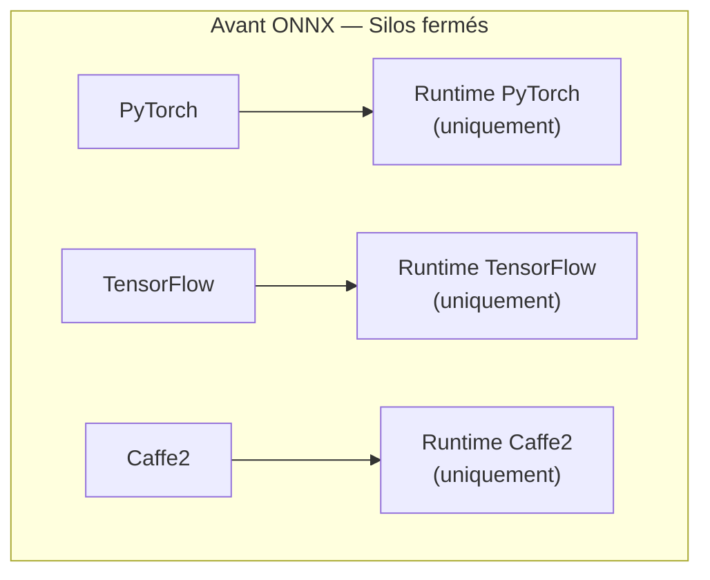
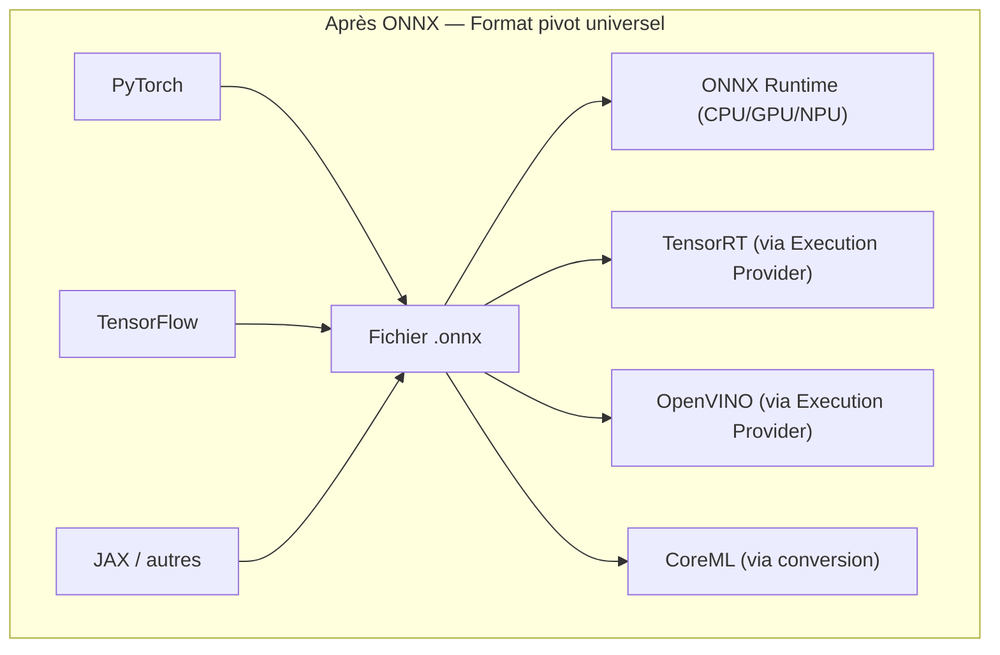
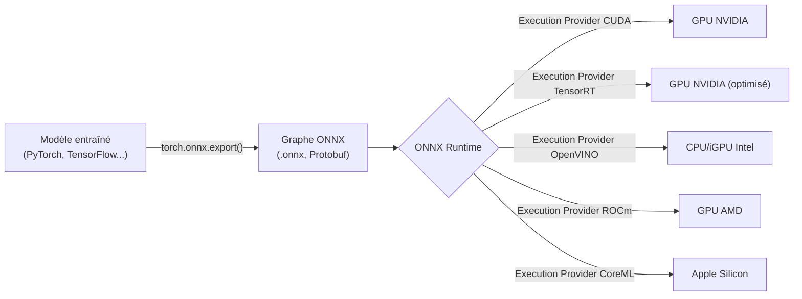
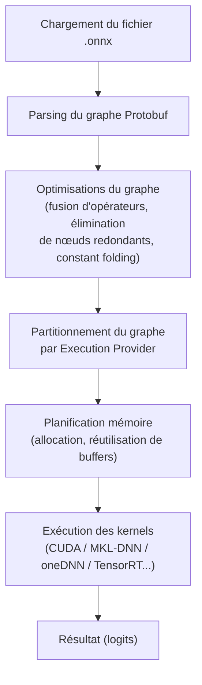
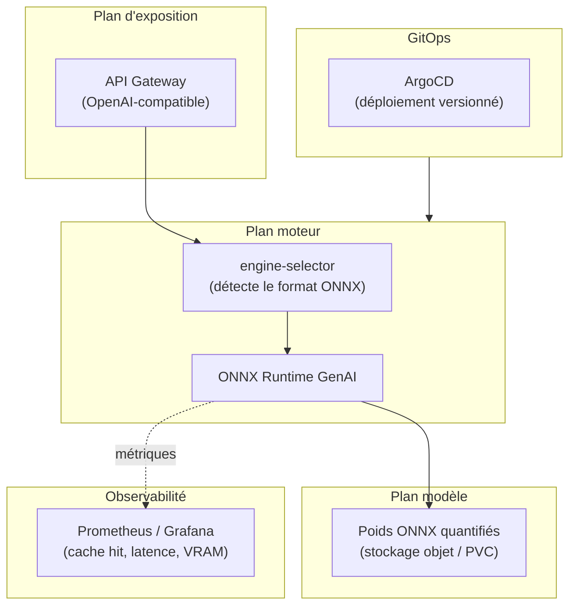

# ONNX : Le Document de Référence Complet
### Origines, mathématiques, gestion du cache, comparatif agressif avec tous les formats concurrents, consommation énergétique et déploiement à l'échelle de millions d'utilisateurs

---

## Sommaire

1. [Pourquoi ONNX a été créé : le problème des silos](#1)
2. [Comment ONNX fonctionne : les trois piliers](#2)
3. [Le stockage mathématique des poids et des biais](#3)
4. [Comment ONNX gère l'inférence : anatomie du pipeline d'exécution](#4)
5. [Comment ONNX gère le cache KV](#5)
6. [Comparatif agressif : ONNX contre chaque format concurrent](#6)
7. [L'équation mathématique complète : ONNX face à l'attention et au cache](#7)
8. [Consommation énergétique : la vérité chiffrée](#8)
9. [Avantages et inconvénients : le bilan sans concession](#9)
10. [ONNX dans un pipeline de production (MLOps / Cloud)](#10)
11. [Qui utilise ONNX en production, et comment](#11)
12. [Gérer ONNX pour des millions d'utilisateurs](#12)
13. [Bilan financier complet](#13)
14. [Verdict final : quand choisir ONNX, quand ne pas le choisir](#14)
15. [Glossaire](#15)

---

## 1. Pourquoi ONNX a été créé : le problème des silos

Avant 2017, chaque framework d'apprentissage profond — PyTorch, TensorFlow, Caffe2, CNTK — constituait une **pile verticale fermée**, de l'API d'entraînement jusqu'au runtime d'inférence. Cette fragmentation posait trois problèmes concrets :

1. **L'enfermement technologique (vendor lock-in logiciel)** : un modèle entraîné avec un framework ne pouvait pas être exécuté nativement par un autre. Migrer signifiait réécrire.
2. **Le fossé recherche → production** : les chercheurs utilisaient des frameworks flexibles (PyTorch), tandis que les équipes de production avaient besoin de moteurs optimisés différents. La conversion manuelle était lente et source d'erreurs.
3. **La duplication du travail matériel** : chaque fabricant de puce (NVIDIA, Intel, Qualcomm...) devait optimiser ses pilotes framework par framework, un travail redondant à l'échelle de toute l'industrie.

**ONNX (Open Neural Network Exchange)** a été créé en septembre 2017 par **Microsoft et Facebook (Meta)**, avec un objectif clair : établir un **format intermédiaire universel** capable de représenter n'importe quel modèle, indépendamment du framework qui l'a produit ou du moteur qui l'exécutera.

**ONNX n'est ni un framework d'entraînement, ni un moteur d'inférence.** C'est une **couche intermédiaire standard** — un contrat entre les deux mondes.

---

## 2. Comment ONNX fonctionne : les trois piliers

### 2.1 Une représentation intermédiaire (IR) commune

ONNX décrit un modèle comme un **graphe de calcul (computational graph)** : une suite d'opérateurs mathématiques (`MatMul`, `Add`, `LayerNormalization`, `Softmax`, etc.) appliqués à des tenseurs. Ce graphe est **statique** : toutes les opérations et — dans la version classique — toutes les formes de tenseurs sont figées à l'export.

### 2.2 Un format de sérialisation par Protocol Buffers

Le graphe, les poids et les métadonnées sont sérialisés en **Protobuf** (Protocol Buffers, développé par Google) : un format binaire compact, rapide à parser, avec un schéma fortement typé.

### 2.3 Un écosystème d'exécution : ONNX Runtime

Le fichier `.onnx` seul ne fait rien. C'est **ONNX Runtime** — le moteur de référence — qui charge le graphe, l'optimise, et l'exécute sur le matériel cible via un système d'**Execution Providers** (CUDA, TensorRT, OpenVINO, ROCm, DirectML, CoreML, CPU...).

Ce découpage **format / moteur / matériel** est la clé de voûte de toute la philosophie ONNX : on entraîne une fois, on exporte une fois, et on peut ensuite ré-optimiser indéfiniment sans toucher au modèle.

---

## 3. Le stockage mathématique des poids et des biais

### 3.1 La structure `TensorProto`

Chaque paramètre entraîné (poids, biais) est représenté dans le graphe comme un **initialiseur (initializer)** : un message `TensorProto` contenant :

- le **nom** du tenseur (référencé par les nœuds du graphe qui l'utilisent),
- son **type** (`FLOAT`, `FLOAT16`, `INT8`, `UINT8`...),
- ses **dimensions** (`dims`, ex. `[768, 3072]` pour une matrice de projection),
- ses **données brutes** (`raw_data`, un buffer d'octets contigu représentant le tenseur en mémoire).

Mathématiquement, un tenseur de poids $W$ de dimensions $(m, n)$ en précision `dtype` occupe :

$$
\text{Taille}(W) = m \times n \times \text{sizeof(dtype)}
$$

Pour une couche linéaire de type $ y = Wx + b $, ONNX stocke $W$ (matrice $m \times n$) et $b$ (vecteur $m$) comme deux `TensorProto` distincts, référencés par le nœud `Gemm` ou `MatMul` + `Add` correspondant dans le graphe.

### 3.2 Stockage intégré vs stockage externe

- **Intégré (inline)** : les données du tenseur sont écrites directement dans le fichier `.onnx` via `raw_data`. Adapté aux petits modèles.
- **Externe (external data)** : pour les modèles volumineux (au-delà de la limite de 2 Go imposée par Protobuf), les données sont stockées dans des fichiers séparés (`.onnx.data`), le fichier `.onnx` ne conservant que le graphe et des pointeurs (offset, longueur) vers ces données externes.

### 3.3 Différence fondamentale avec un "sac de tenseurs"

C'est ici que se joue l'opposition structurelle avec des formats comme SafeTensors ou l'état PyTorch (`state_dict`) :

| | Contenu du fichier | Nature |
|---|---|---|
| **ONNX** | Graphe de calcul **+** poids **+** métadonnées | Modèle **auto-suffisant et exécutable** |
| **SafeTensors** | Tenseurs seuls, mappables en mémoire (mmap) | Conteneur de données — nécessite une architecture de modèle définie ailleurs (code) pour être réutilisable |
| **PyTorch (`.pt`)** | `state_dict` sérialisé via `pickle` | Sauvegarde de checkpoint — dépend du code source de la classe du modèle |

**ONNX = le modèle entier, prêt à s'exécuter.** SafeTensors et PyTorch = **seulement les poids**, qui doivent être injectés dans une architecture déjà définie en code.

---

## 4. Comment ONNX gère l'inférence : anatomie du pipeline d'exécution

### 4.1 Les étapes internes d'ONNX Runtime

### 4.2 La fusion d'opérateurs (Kernel Fusion)

ONNX Runtime détecte des motifs récurrents dans le graphe (par exemple `LayerNorm → MatMul → BiasAdd → GeLU`) et les fusionne en un **unique noyau CUDA**, réduisant le nombre d'aller-retours vers la mémoire globale du GPU. Chaque lancement de noyau ayant un coût fixe (quelques microsecondes d'overhead), fusionner N opérations en une seule élimine (N-1) lancements.

### 4.3 Le partitionnement par Execution Provider

Un même graphe peut être exécuté par **plusieurs moteurs simultanément** : les opérateurs supportés par TensorRT sont délégués à TensorRT, ceux non supportés retombent sur l'Execution Provider CUDA générique, garantissant que le modèle s'exécute intégralement même si un backend spécialisé ne couvre pas 100% des opérateurs.

### 4.4 Les deux phases de l'inférence autorégressive

Pour un LLM, ONNX Runtime — via l'extension **ONNX Runtime GenAI** — orchestre les deux phases classiques :

- **Prefill** : traite tous les tokens du prompt en un seul passage, produit les logits du premier token à générer **et** initialise le cache KV.
- **Decode** : génère un token à la fois, en réinjectant le cache KV à chaque itération via la boucle `generate()`.

---

## 5. Comment ONNX gère le cache KV

### 5.1 Le principe : le cache comme entrée/sortie explicite du graphe

Contrairement à un moteur comme vLLM où le cache KV est une structure interne opaque gérée par le runtime, ONNX **expose le cache comme une entrée et une sortie explicites du graphe** : `past_key_values` en entrée, `present_key_values` en sortie. Cette contrainte découle directement de la nature statique du graphe ONNX — un graphe ne peut pas contenir de "mémoire cachée" implicite, tout doit être un tenseur nommé, déclaré, typé.

### 5.2 L'optimisation phare : le Past-Present Share Buffer

C'est l'optimisation mémoire la plus significative d'ONNX Runtime pour le cache KV, contrôlée par le paramètre `past_present_share_buffer`.

**Sans l'optimisation (`false`)** : à chaque itération, un nouveau buffer "présent" est alloué puis recopié dans le buffer "passé". Deux buffers coexistent brièvement :

$$
M_{\text{sans}} = M_{\text{past}} + M_{\text{present}} \approx 2P
$$

**Avec l'optimisation (`true`)** : les buffers "passé" et "présent" pointent vers **la même adresse mémoire physique**, en pré-allouant un buffer de taille `max_length` dès le départ :

$$
M_{\text{avec}} = \max(M_{\text{past}}, M_{\text{present}}) \approx P
$$

**Gain mathématique : facteur ×2 sur la mémoire du cache**, et suppression du coût de copie ($O(P)$ évité à chaque token généré).

| | `past_present_share_buffer = true` | `= false` |
|---|---|---|
| Taille cache "passé" | `batch × heads × max_length × head_size` | `batch × heads × past_seq_len × head_size` |
| Taille cache "présent" | Identique (buffer partagé) | `batch × heads × (past_seq_len+1) × head_size` |
| Exemple (Phi-4-mini, batch=1, max_length=4k) | **4 Go** | ~8 Go (4 Go passé + 4 Go présent) |

### 5.3 Les optimisations complémentaires

- **`TensorScatter`** (en développement dans la communauté ONNX) : viserait une mise à jour du cache **en place (in-place)**, sans même créer de nouveau tenseur "présent" à chaque étape — poussant encore plus loin la logique du buffer partagé.
- **Continuous Decoding (Chat Mode)** : ONNX Runtime GenAI permet de conserver le cache KV **entre les tours d'une conversation multi-tours**. Un nouveau message utilisateur n'entraîne le traitement que des nouveaux tokens ; l'historique reste dans le cache. AMD exploite cette fonctionnalité sur ses processeurs Ryzen AI pour une latence quasi constante indépendamment de la longueur de la conversation.

### 5.4 Le défi de l'export : rendre le dynamique statique

L'exportation d'un modèle Transformer avec cache vers ONNX est l'étape la plus délicate du pipeline :

1. **Modification du modèle source** pour accepter `past_key_values` en entrée et produire `present_key_values` en sortie, en plus des logits.
2. **Export via `torch.onnx.export`** avec des entrées factices (input_ids, attention_mask, cache initial) pour tracer le graphe.
3. **Déclaration de dimensions dynamiques** (`dynamic_shapes` / `dynamic_axes`) pour que le graphe s'adapte aux différentes longueurs de séquence, tailles de batch, et tailles de cache — sans cela le graphe serait figé sur les dimensions des entrées factices utilisées au moment de l'export.
4. **Aplatissement des structures** : ONNX ne peut pas accepter de tuples ou de structures de données Python complexes comme entrées ; le cache (souvent une liste de tuples par couche en PyTorch) doit être aplati en une liste de tenseurs individuels nommés.
5. **Cas de la fenêtre glissante** : certaines implémentations (Esperanto Technologies notamment) exportent un graphe qui ne traite qu'une fenêtre récente de tokens, le cache complet étant maintenu à l'extérieur du graphe par le runtime.

---

## 6. Comparatif agressif : ONNX contre chaque format concurrent

### 6.1 ONNX vs PyTorch natif (Eager / TorchScript)

| Critère | ONNX Runtime | PyTorch Eager |
|---|---|---|
| Type de graphe | Statique, optimisé à l'avance | Dynamique, interprété opération par opération |
| Overhead de lancement | Faible (fusions de kernels) | Élevé — 30 à 50 % du temps total sur petits batchs (LLM) |
| Mémoire cache KV | ~P (buffer partagé) | ~2P (double buffer natif) |
| Portabilité | Totale (CPU/GPU/NPU, tout fournisseur) | Limitée hors écosystème Python/CUDA |
| Flexibilité de développement | Faible (nécessite export) | Maximale (itération immédiate) |
| Verdict | **Gagne en production** : latence -20 à -40 % mesurée sur des modèles génératifs | **Gagne en recherche** : cycle de développement plus rapide |

**ONNX écrase PyTorch Eager sur tous les critères de production** — latence, mémoire, portabilité — au prix d'une étape d'export qui rigidifie le graphe.

### 6.2 ONNX vs TensorRT (NVIDIA)

| Critère | ONNX Runtime | TensorRT |
|---|---|---|
| Nature | Graphe interprété/compilé partiellement | Moteur **entièrement compilé** (`.engine`) pour une architecture GPU précise |
| Performance brute GPU NVIDIA | Très bonne | **Supérieure de 30 à 50 %** |
| Quantification | FP16/INT8 génériques | INT8/FP4 **ultra-optimisés** via Tensor Cores |
| Overhead de lancement | Faible | **Quasi nul** (CUDA Graphs capturent toute la boucle de décodage) |
| Flexibilité des dimensions | Dynamique à l'exécution | **Figée à la compilation** — gaspille de la mémoire si la longueur réelle est inférieure au maximum compilé |
| Portabilité matérielle | **Totale** | **Nulle** — exclusivement GPU NVIDIA |
| Coût de migration | Nul | Réécriture complète nécessaire en cas de changement de fournisseur GPU |
| Verdict | **Perd en performance pure**, mais peut utiliser TensorRT *comme backend* via son Execution Provider — le meilleur des deux mondes | **Gagne en vitesse brute**, mais impose un verrouillage total |

### 6.3 ONNX vs OpenVINO (Intel)

| Critère | ONNX Runtime | OpenVINO |
|---|---|---|
| Optimisation matérielle | Générique, bonne sur CPU x86 | **Spécialisée** AVX-512 / VNNI pour puces Intel |
| Gestion du cache | Past-Present Share Buffer | "Stateful Model" — état conservé entre appels, exploite la hiérarchie L1/L2/L3 du cache CPU |
| Portabilité | Totale | Écosystème Intel principalement |
| Intégration | OpenVINO peut être backend d'ONNX Runtime (Execution Provider) | — |
| Verdict | ONNX peut **absorber** les gains d'OpenVINO sans perdre la portabilité, en l'utilisant comme Execution Provider plutôt que comme solution isolée |

### 6.4 ONNX vs GGUF (llama.cpp)

| Critère | ONNX Runtime | GGUF |
|---|---|---|
| Cible principale | Cloud, edge, multi-hardware | **CPU local**, ressources limitées |
| Chargement des poids | Chargement classique (ou external data) | **Memory-mapping (mmap)** — chargement en $O(1)$, RAM physique = données réellement lues |
| Performance GPU | Bonne à excellente selon Execution Provider | **Faible** — conçu pour CPU |
| Quantification | FP16/INT8 génériques | **Quantification par blocs** ultra-spécialisée (Q4_K, Q8_0...) |
| Verdict | **Supérieur sur GPU et en environnement cloud** ; GGUF **gagne sur l'edge et le CPU pur** grâce au mmap et à sa quantification dédiée |

### 6.5 ONNX vs SafeTensors

Cette comparaison n'est **pas symétrique** : ce ne sont pas des concurrents directs.

- **SafeTensors** : conteneur de tenseurs uniquement, mappable en mémoire, sécurisé (pas d'exécution de code arbitraire contrairement à `pickle`), gain de vitesse de chargement d'un facteur 10x par rapport à `pickle`. Il ne fait **aucune inférence**.
- **ONNX** : un **plan d'exécution complet** — graphe + poids + métadonnées.

En pratique, les deux se combinent : on stocke les poids en SafeTensors pour leur sécurité et leur rapidité de chargement, on les charge en mémoire, puis on exporte le graphe vers ONNX pour l'inférence optimisée.

### 6.6 Tableau de synthèse globale (vue d'ensemble agressive)

| Format | Portabilité | Perf. GPU NVIDIA | Perf. CPU | Perf. Edge/Mobile | Gestion cache KV | Verrouillage |
|---|---|---|---|---|---|---|
| **ONNX** | ★★★★★ | ★★★★ | ★★★★ | ★★★★ | ★★★★ (explicite, partagé) | Aucun |
| **PyTorch Eager** | ★★ | ★★★ | ★★ | ★★ | ★★ (double buffer) | Écosystème Python/CUDA |
| **TensorRT** | ★ | ★★★★★ | — | — | ★★★★★ (paginé, poolé) | Total (NVIDIA) |
| **OpenVINO** | ★★ | — | ★★★★★ | ★★★ | ★★★★ (stateful) | Écosystème Intel |
| **GGUF** | ★★★ | ★★ | ★★★★ | ★★★★★ | ★★★ (géré par llama.cpp) | Écosystème llama.cpp |
| **SafeTensors** | ★★★★ (conteneur seul) | — | — | — | Aucune (pas un moteur) | Aucun |

---

## 7. L'équation mathématique complète : ONNX face à l'attention et au cache

### 7.1 Le socle commun à tous les formats

Pour une séquence de longueur $L$, l'attention multi-têtes se décompose en deux phases :

- **Prefill** : coût $O(L^2)$ (produit matriciel $Q \times K^T$ sur toute la séquence en parallèle).
- **Decode** : coût $O(L)$ par token grâce au cache KV (un seul nouveau vecteur Query comparé à l'historique stocké).

La taille du cache KV suit :

$$
\text{Taille}_{\text{cache}} = 2 \times B \times L \times H \times D_h \times \text{sizeof(dtype)}
$$

### 7.2 Application numérique : Llama-7B

Pour `num_layers=32`, `head_dim=128`, `seq_len=4096`, en FP16 (2 octets), batch=1 :

$$
\text{Taille brute} = 2 \times 1 \times 4096 \times 32 \times 128 \times 2 = 67\,\text{Mo}
$$

| Format/Moteur | Mémoire réelle nécessaire | Explication |
|---|---|---|
| **PyTorch Eager** | ~134 Mo (+fragmentation) | Double buffer passé/présent, allocateur CUDA non optimisé pour ce cas |
| **ONNX Runtime** | ~67 Mo | Past-Present Share Buffer, fragmentation < 5 % |
| **TensorRT** | ~67 Mo, contigu et prédictible | Memory Pool compilé, latence déterministe |
| **GGUF** | ~67 Mo, mais en RAM CPU | Moins cher, mais ~10x plus lent à accéder que la VRAM |

### 7.3 L'équation de synthèse

$$
\text{Performance}_{\text{ONNX}} = \text{Performance}_{\text{Max théorique}} - \alpha(\text{Spécificité matérielle})
$$

Où $\alpha$ est **faible** sur CPU générique ou GPU non-NVIDIA (ONNX y est quasiment optimal), mais **plus élevé** face à un moteur compilé pour un matériel unique (TensorRT sur NVIDIA). En contrepartie, la **portabilité** d'ONNX — sa capacité à absorber de nouveaux accélérateurs sans réécriture — n'a pas d'équivalent chez les formats spécialisés.

---

## 8. Consommation énergétique : la vérité chiffrée

C'est un angle rarement traité avec rigueur, et les résultats sont nuancés — ONNX Runtime n'est **pas systématiquement le plus économe**, le classement dépend fortement du matériel et de la charge.

### 8.1 Sur serveur CPU (architecture RISC-V, étude comparative)

Sur un serveur RISC-V 64 cœurs, une étude comparative montre que TensorFlow Lite consomme le moins d'énergie (baseline), tandis qu'ONNX Runtime consomme **1,2 à 1,39 fois plus d'énergie**, et PyTorch natif **2,0 à 2,42 fois plus** que TensorFlow Lite sur les mêmes charges (ResNet, VGG-16).

### 8.2 Sur edge GPU (NVIDIA Jetson AGX Orin)

Une comparaison de cinq moteurs (PyTorch, ONNX Runtime, TensorRT, Apache TVM, JAX) sur Jetson AGX Orin montre qu'ONNX Runtime et JAX affichent la **plus faible consommation moyenne** (sous 15 W même sur de gros réseaux — 14,17 W sur ResNet152, 13,96 W sur EfficientNet). Ce résultat traduit un **engagement GPU modeste** : ONNX Runtime sollicite moins intensément le GPU, ce qui réduit la puissance instantanée consommée, **mais au prix d'une latence plus élevée et d'un débit plus faible** que des moteurs plus agressifs comme TensorRT.

### 8.3 Le compromis fondamental puissance/débit

Ce constat révèle un principe important, souvent ignoré dans les argumentaires marketing : **une puissance instantanée plus faible ne signifie pas une énergie totale par requête plus faible**, car l'énergie est le produit de la puissance par le temps :

$$
E = \bar{P}_{\text{actif}} \times T_{\text{inférence}}
$$

Si ONNX Runtime consomme moins de watts mais met plus de temps à traiter une requête, l'énergie totale consommée par requête peut in fine dépasser celle d'un moteur plus puissant mais plus rapide, comme TensorRT. Une étude sur un compilateur de graphe dédié montre par exemple qu'à configuration comparable, ONNX Runtime affiche une puissance active moyenne d'environ 12,1 W contre 11,8 W pour OpenVINO — un écart faible en watts, mais qui se traduit par un écart de **37 à 46 % d'énergie totale par inférence** une fois la durée d'exécution prise en compte, en défaveur d'ONNX Runtime dans ce scénario précis.

### 8.4 GPU vs CPU : l'écart fondamental reste dominant

Indépendamment du format, la décision GPU vs CPU pèse bien plus lourd que le choix du runtime : sur des charges d'inférence, l'exécution CPU-only peut nécessiter jusqu'à **4,5 fois plus d'énergie totale** que l'exécution GPU pour un même travail, malgré une puissance instantanée par watt plus faible côté CPU — car le temps d'exécution CPU est disproportionnellement plus long.

### 8.5 Recommandations pratiques pour l'efficience énergétique avec ONNX

- **Activer les Execution Providers spécialisés** (TensorRT, OpenVINO) plutôt que le provider CPU/CUDA générique : ils réduisent le temps d'exécution, ce qui réduit l'énergie totale malgré une puissance instantanée parfois supérieure.
- **Quantifier agressivement** (FP16, INT8) : réduit à la fois la mémoire et le nombre de cycles de calcul, donc l'énergie par token.
- **Maximiser le taux d'utilisation du cache** (past-present share buffer, prefix caching côté application) : moins de recalcul = moins d'énergie, indépendamment du moteur.
- **Éviter les transitions fréquentes CPU ↔ accélérateur** : chaque transition de device a un coût énergétique de mouvement de données non négligeable, documenté comme un facteur significatif de surconsommation dans les architectures hétérogènes CPU+NPU.
- **Ne pas se fier uniquement à la puissance instantanée (W)** publiée dans les benchmarks marketing : toujours ramener à l'**énergie par requête ou par token** ($E = P \times T$) pour comparer équitablement les runtimes.

---

## 9. Avantages et inconvénients : le bilan sans concession

### 9.1 Avantages

| Avantage | Détail |
|---|---|
| **Portabilité totale** | Un seul fichier `.onnx` s'exécute sur CUDA, TensorRT, ROCm, OpenVINO, DirectML, CoreML, CPU |
| **Absence de vendor lock-in** | Changement de fournisseur cloud ou de GPU sans réécriture de pipeline |
| **Performance solide et généraliste** | Gains mesurés de latence et de débit par rapport à PyTorch Eager sur de nombreux LLM |
| **Gestion mémoire du cache optimisée** | Past-Present Share Buffer, réduction jusqu'à 2x de l'empreinte du cache KV |
| **Écosystème mature** | Soutenu par Microsoft, Meta, AWS, NVIDIA, Intel, AMD ; standard ouvert (Linux Foundation) |
| **Architecture "future-proof"** | De nouveaux accélérateurs matériels s'intègrent via de nouveaux Execution Providers, sans toucher au modèle |
| **Interopérabilité multi-framework** | Un modèle entraîné dans n'importe quel framework peut converger vers un seul format de déploiement |

### 9.2 Inconvénients

| Inconvénient | Détail |
|---|---|
| **Performance LLM pure inférieure aux moteurs spécialisés** | vLLM (PagedAttention) et TensorRT-LLM dépassent ONNX Runtime sur l'inférence LLM à très haut débit |
| **Complexité d'export** | Modèles avec contrôle de flux dynamique complexe à exporter proprement ; gestion des dimensions dynamiques délicate |
| **Consommation énergétique non systématiquement optimale** | Une puissance instantanée faible peut masquer une énergie totale par requête plus élevée si la latence augmente |
| **Historique de gestion du cache sous-optimale** | Les anciennes versions d'ONNX Runtime imposaient des copies mémoire CPU↔GPU inutiles pour les modèles autorégressifs — corrigé par ONNX Runtime GenAI, mais la maturité de cette extension reste plus récente |
| **Couche d'abstraction supplémentaire** | Ajoute un maillon de dépendance (le Runtime) entre le modèle et le matériel, avec ses propres bugs et versions à gérer |
| **Rigidité du graphe statique** | Les dimensions dynamiques nécessitent une déclaration explicite ; certains motifs de calcul très dynamiques restent difficiles à représenter |

---

## 10. ONNX dans un pipeline de production (MLOps / Cloud)

### 10.1 Position dans une architecture en couches

### 10.2 Le cycle de vie typique d'un modèle ONNX en production

1. **Entraînement** avec le framework de choix (PyTorch, TensorFlow).
2. **Export** vers ONNX (`torch.onnx.export`, avec gestion explicite du cache KV et des dimensions dynamiques).
3. **Optimisation du graphe** (fusion d'opérateurs, quantification FP16/INT8).
4. **Sélection automatique du moteur** par un composant de routage (`engine-selector`) qui détecte le format et choisit ONNX Runtime GenAI avec un score de confiance.
5. **Déploiement versionné** via Helm + ArgoCD, avec calcul préalable du budget VRAM nécessaire (incluant le cache KV).
6. **Observabilité continue** : métriques de latence, taux d'erreur, utilisation mémoire et cache, exposées via ServiceMonitor / Prometheus / Grafana.
7. **Autoscaling** piloté par la profondeur de file d'attente et la pression du cache (KEDA), au même titre que pour un moteur comme vLLM.

### 10.3 Pourquoi cette architecture "triple couche" convient particulièrement à ONNX

La séparation Exposition / Moteur / Modèle est **naturellement servie** par la philosophie ONNX : le format est interchangeable (plan modèle), le moteur est dédié et remplaçable (plan moteur), et l'API reste uniforme côté client (plan exposition). ONNX agit comme le **langage commun** qui rend cette séparation possible sans compromis technique.

---

## 11. Qui utilise ONNX en production, et comment

| Organisation | Usage |
|---|---|
| **Microsoft** (Bing, Office 365, Azure Cognitive Services) | Accélération moyenne mesurée de 2,9x par rapport aux runtimes non optimisés |
| **Ant Group (Alipay)** | Inférence de modèles de vision par ordinateur et de NLP en production |
| **Adobe** | Déploiement de modèles à grande échelle pour des expériences personnalisées en temps réel |
| **CERN** | Intégration dans le framework `Athena` pour la reconstruction de particules |
| **Hugging Face** | Accélération de milliers de modèles sur son API d'inférence |
| **AMD (Ryzen AI)** | Réutilisation du cache KV via ONNX Runtime GenAI pour les conversations multi-tours sur NPU embarqué |

Ces usages couvrent un spectre large : cloud hyperscale (Microsoft), fintech (Ant Group), création de contenu (Adobe), recherche fondamentale (CERN), et plateformes de modèles (Hugging Face) — un signal fort de maturité transversale, indépendant d'un seul secteur.

---

## 12. Gérer ONNX pour des millions d'utilisateurs

### 12.1 Les leviers spécifiques à ONNX à cette échelle

- **Quantification systématique** : INT8 pour les poids, FP16 ou INT8 pour le cache KV selon le budget de précision toléré — impact direct sur le nombre de GPU nécessaires.
- **Choix stratégique des Execution Providers** : TensorRT en backend sur les nœuds NVIDIA, OpenVINO sur les nœuds Intel — sans multiplier les formats de modèles à maintenir.
- **Past-Present Share Buffer activé par défaut** : c'est le levier mémoire le plus direct pour maximiser la densité de requêtes concurrentes par GPU.
- **Continuous Decoding** pour les cas d'usage conversationnels à fort volume (support client, assistants), où la réutilisation du cache entre tours réduit fortement la charge de calcul cumulée.

### 12.2 Ce qu'ONNX ne résout pas nativement à cette échelle

ONNX Runtime, contrairement à vLLM, ne propose pas nativement de **PagedAttention** ni d'**Automatic Prefix Caching** inter-requêtes au niveau du cluster. Pour des volumes massifs avec beaucoup de préfixes partagés (RAG, prompt système commun), il est recommandé de :

- Combiner ONNX avec une couche de cache distribuée externe si la charge de travail le justifie, ou
- Réserver ONNX aux modèles où la **portabilité matérielle** prime sur le débit brut, et utiliser un moteur spécialisé (vLLM/TensorRT-LLM) pour les LLM conversationnels à très haut volume.

### 12.3 Exemple de dimensionnement chiffré

Pour 1 million de requêtes/jour sur un modèle 7B en FP16 :

- **Sans optimisation ONNX** (PyTorch natif) : de l'ordre de 4 GPU A100 (40 Go) nécessaires pour absorber la charge et le cache.
- **Avec ONNX** (quantification INT8 + Past-Present Share Buffer) : de l'ordre de 2 GPU A100 suffisent — soit une réduction de l'ordre de **50 % du parc GPU nécessaire** pour ce modèle.

---

## 13. Bilan financier complet

| Levier | Impact mesuré |
|---|---|
| Réduction de latence vs PyTorch natif | Jusqu'à -27,6 % (mesuré sur Gemma-7B, Phi-3, Llama-3.1-8B) |
| Augmentation du débit calculatoire | Jusqu'à +48,3 % (GFLOP/s) |
| Réduction mémoire cache KV | Jusqu'à -50 % (Past-Present Share Buffer) |
| Réduction de taille de modèle (quantification INT8) | Jusqu'à -74,9 % |
| Rapport performance/prix (ARM Neoverse vs x86) | Jusqu'à 2,8x meilleur |
| Coût de migration entre fournisseurs matériels | Nul (portabilité native) |

**Exemple chiffré à 5 ans** : pour un modèle servant un volume important de requêtes quotidiennes, une réduction du parc GPU de 4 à 2 unités A100 (à ~3 $/heure) représente une économie de l'ordre de **50 000 $ par an**, soit environ **250 000 $ cumulés sur 5 ans**, pour ce seul modèle — sans compter l'évitement des coûts de réécriture en cas de changement de fournisseur matériel ou cloud.

**Le coût caché du verrouillage évité** : un pipeline entièrement optimisé pour TensorRT ou pour un cloud spécifique implique un coût de migration potentiellement prohibitif si les prix du matériel évoluent défavorablement. ONNX transforme ce risque en **option stratégique** — la capacité de renégocier ou de migrer sans coût de réécriture est elle-même une forme de valeur financière, assimilable à une prime d'assurance.

---

## 14. Verdict final : quand choisir ONNX, quand ne pas le choisir

### Choisir ONNX quand :

- L'infrastructure est **multi-cloud ou multi-matériel** (mix NVIDIA/AMD/Intel/ARM).
- La **pérennité et l'absence de lock-in** sont des critères stratégiques prioritaires.
- Le cas d'usage est **polyvalent** (vision, NLP classique, modèles hybrides) et pas exclusivement du LLM conversationnel à très haut débit.
- Le déploiement doit couvrir du **cloud jusqu'à l'edge/mobile** avec un seul artefact de modèle.
- L'organisation utilise déjà **plusieurs frameworks d'entraînement** et veut unifier son pipeline de déploiement.

### Ne pas choisir ONNX seul quand :

- Le cas d'usage est **exclusivement du LLM conversationnel à très haut débit sur GPU NVIDIA homogène** : vLLM ou TensorRT-LLM offriront un débit supérieur grâce à PagedAttention et aux optimisations bare-metal.
- L'infrastructure est **100 % engagée et figée sur un seul fournisseur GPU** sans intention de diversifier : TensorRT seul peut alors surperformer.
- Le déploiement cible exclusivement des **appareils CPU très contraints** (mobile bas de gamme, IoT) : GGUF avec mmap peut être plus adapté.

### La stratégie gagnante : la complémentarité

Dans une architecture de production mature, ONNX n'est **pas un remplaçant** de vLLM ou TensorRT — c'est un **complément stratégique** qui unifie la partie du parc de modèles où la portabilité prime, tandis que des moteurs spécialisés prennent en charge les LLM conversationnels à très haut volume. C'est cette **approche hybride**, plutôt qu'un choix exclusif, qui capture le meilleur des deux mondes.

---

## 15. Glossaire

| Terme | Définition courte |
|---|---|
| **IR (Intermediate Representation)** | Représentation intermédiaire d'un modèle, indépendante du framework d'origine |
| **Protobuf** | Format de sérialisation binaire compact utilisé par ONNX |
| **Execution Provider** | Backend d'exécution spécifique (CUDA, TensorRT, OpenVINO...) branché à ONNX Runtime |
| **Initializer** | Représentation ONNX d'un poids ou d'un biais entraîné (`TensorProto`) |
| **Past-Present Share Buffer** | Optimisation mémoire partageant le buffer du cache KV entre l'état passé et présent |
| **Kernel Fusion** | Fusion de plusieurs opérations en un seul noyau de calcul pour réduire l'overhead |
| **External Data** | Mécanisme de stockage des poids dans un fichier séparé pour les gros modèles ONNX |
| **Continuous Decoding** | Réutilisation du cache KV entre les tours d'une conversation multi-tours |
| **Vendor Lock-in** | Dépendance technique et financière à un fournisseur matériel ou logiciel unique |

---

*Document de référence complet sur ONNX — origines, mathématiques, gestion du cache, comparatif agressif avec les formats concurrents, consommation énergétique et déploiement en production à grande échelle.*