# ONNX: The Definitive Reference Document
### Origins, mathematics, production operation, complete KV cache management, rigorous comparison with all competing formats and systems

---

## Table of Contents

1. [Why ONNX Was Created: The Silo Problem](#1)
2. [How ONNX Works: The Three Pillars](#2)
3. [The Mathematical Storage of Weights and Biases](#3)
4. [How ONNX Handles Inference: Anatomy of the Execution Pipeline](#4)
5. [How ONNX Handles the KV Cache: The Complete Mechanism](#5)
6. [The Four KV Cache Types of ONNX Runtime GenAI](#6)
7. [Aggressive Comparison: ONNX vs Every Competing Format](#7)
8. [ONNX Runtime GenAI vs LMCache: Two Cache Philosophies](#8)
9. [External Cache Management Tools for ONNX](#9)
10. [The Complete Mathematical Equation: ONNX vs Attention and Cache](#10)
11. [Energy Consumption: The Hard Numbers](#11)
12. [Advantages and Disadvantages: The No-Compromise Assessment](#12)
13. [ONNX in a Production Pipeline (MLOps / Cloud)](#13)
14. [Who Uses ONNX in Production, and How](#14)
15. [The Long Context Challenge: ONNX vs vLLM](#15)
16. [Managing ONNX for Millions of Users](#16)
17. [Complete Financial Assessment](#17)
18. [Final Verdict: When to Choose ONNX, When Not To](#18)
19. [Glossary](#19)

---

<a id="1"></a>
## 1. Why ONNX Was Created: The Silo Problem

### 1.1 The World Before ONNX: Closed Silos

Before 2017, each deep learning framework — PyTorch, TensorFlow, Caffe2, CNTK — constituted a **closed vertical stack**, from the training API down to the inference runtime. This fragmentation posed three concrete problems:

1. **The research-to-production gap**: a researcher trained a model with a flexible framework (PyTorch), but the production team often had to manually rewrite it in another framework optimized for inference — a slow and error-prone process.
2. **Software vendor lock-in**: choosing a framework meant locking yourself into its entire ecosystem. A model trained with one framework could not be natively executed by another.
3. **Duplicated hardware work**: each chip manufacturer (NVIDIA, Intel, AMD, ARM, Qualcomm) had to optimize its drivers framework by framework — redundant work at the scale of the entire industry.

### 1.2 The Response: An Open Standard

In **September 2017**, **Microsoft and Facebook (Meta)** jointly announced the creation of **ONNX (Open Neural Network Exchange)**, with a clear goal: create an open ecosystem giving developers the freedom to combine tools and easily transfer models from one framework to another.

The initiative immediately rallied broad industry support: AMD, ARM, IBM, Intel, Huawei, NVIDIA, and Qualcomm announced their adherence within the first months. Today, ONNX is a **Linux Foundation AI & Data** project — an open standard, not a proprietary product.

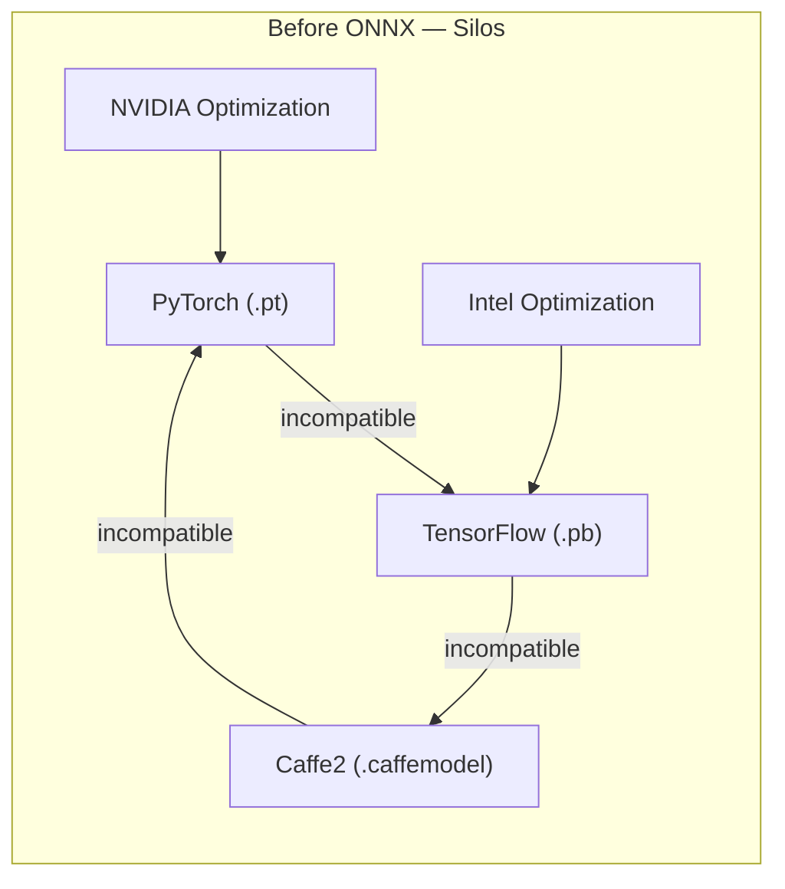

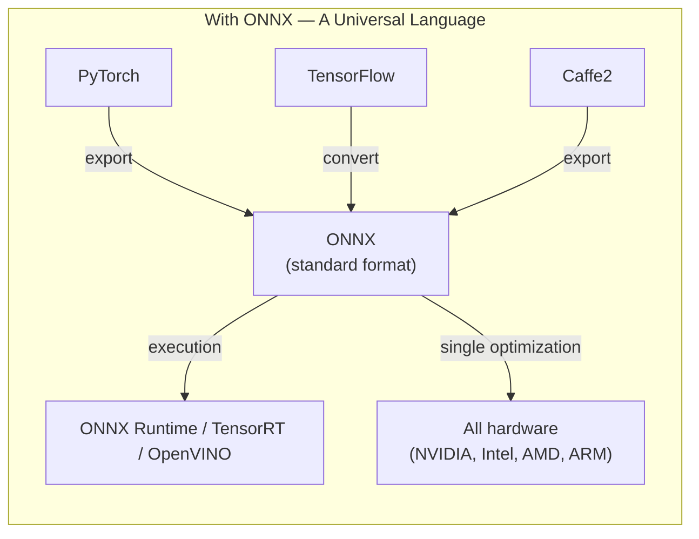

### 1.3 What ONNX Brings, Problem by Problem

| Initial Problem | ONNX Solution |
|---|---|
| Framework silos | A single format that all frameworks can read/write |
| Costly research-to-production rewriting | Direct export of trained model to ONNX, immediate deployment |
| Fragmented hardware optimizations | A single optimization target for all hardware |
| Vendor lock-in | An open standard, independent of any single vendor |

**ONNX is neither a training framework nor an inference engine.** It is a **standard intermediate layer** — a contract between the two worlds, allowing each tool to do what it does best while guaranteeing the final model can be deployed everywhere.

---

<a id="2"></a>
## 2. How ONNX Works: The Three Pillars

### 2.1 A Common Intermediate Representation (IR)

ONNX describes a model as a **computational graph**: a sequence of mathematical operators (`MatMul`, `Add`, `LayerNormalization`, `Softmax`, etc.) applied to tensors. This graph is **static**: all operations and — in the classic version — all tensor shapes are frozen at export time.

### 2.2 A Serialization Format via Protocol Buffers

The graph, weights, and metadata are serialized in **Protobuf** (Protocol Buffers, developed by Google): a compact binary format, fast to parse, with a strongly typed schema.

### 2.3 An Execution Ecosystem: ONNX Runtime

The `.onnx` file alone does nothing. It is **ONNX Runtime** — the reference engine — that loads the graph, optimizes it, and executes it on the target hardware via a system of **Execution Providers** (CUDA, TensorRT, OpenVINO, ROCm, DirectML, CoreML, CPU...).

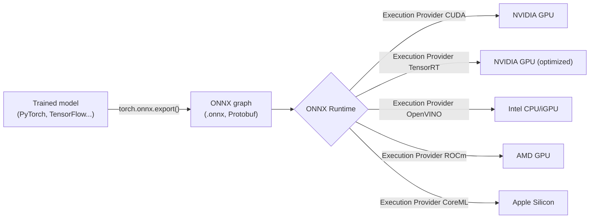

This **format / engine / hardware** separation is the keystone of the entire ONNX philosophy: train once, export once, and then re-optimize indefinitely without touching the model. Before ONNX, each manufacturer had to optimize its chips for each framework individually; with ONNX, it suffices to optimize **a single representation**, which immediately benefits all frameworks that export to it.

### 2.4 What an ONNX File Actually Contains

Unlike a format like SafeTensors (tensors only) or PyTorch `.pt` (model state), **ONNX contains the complete computational graph**: model structure, operators, weights, and metadata, in a single self-sufficient and executable artifact.

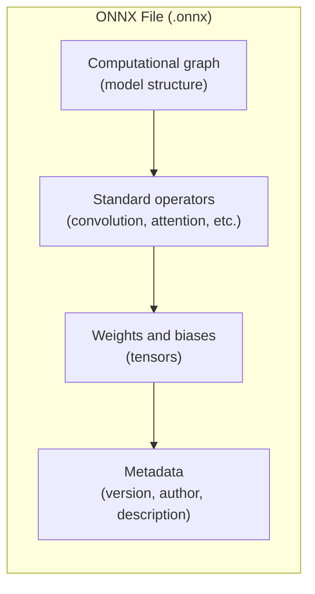

---

<a id="3"></a>
## 3. The Mathematical Storage of Weights and Biases

### 3.1 The `TensorProto` Structure

Each trained parameter (weight, bias) is represented in the graph as an **initializer**: a `TensorProto` message containing:

- the tensor **name** (referenced by the graph nodes that use it),
- its **type** (`FLOAT`, `FLOAT16`, `INT8`, `UINT8`...),
- its **dimensions** (`dims`, e.g. `[768, 3072]` for a projection matrix),
- its **raw data** (`raw_data`, a contiguous byte buffer representing the tensor in memory).

Mathematically, a weight tensor $W$ of dimensions $(m, n)$ in precision `dtype` occupies:

$$
\text{Size}(W) = m \times n \times \text{sizeof(dtype)}
$$

For a linear layer of the form $y = Wx + b$, ONNX stores $W$ (matrix $m \times n$) and $b$ (vector $m$) as two distinct `TensorProto`, referenced by the corresponding `Gemm` or `MatMul` + `Add` node in the graph.

### 3.2 Inline Storage vs External Storage

- **Inline**: tensor data is written directly into the `.onnx` file via `raw_data`. Suitable for small models.
- **External data**: for large models (beyond the 2 GB limit imposed by Protobuf), data is stored in separate files (`.onnx.data`), with the `.onnx` file retaining only the graph and pointers (offset, length) to this external data.

### 3.3 Fundamental Difference from a "Bag of Tensors"

This is where the structural opposition with formats like SafeTensors or PyTorch state (`state_dict`) plays out:

| Format | File Contents | Nature |
|---|---|---|
| **ONNX** | Computational graph **+** weights **+** metadata | **Self-sufficient and executable** model |
| **SafeTensors** | Tensors only, memory-mappable (mmap) | Data container — requires a model architecture defined elsewhere (code) to be reusable |
| **PyTorch (`.pt`)** | `state_dict` serialized via `pickle` | Checkpoint save — depends on the model class source code |
| **GGUF** | Weights + metadata | Binary format optimized for local inference |

**ONNX = the entire model, ready to execute.** SafeTensors, PyTorch, and GGUF = **only the weights** (and their metadata), which must be injected into an architecture already defined in code or in a dedicated engine.

---

<a id="4"></a>
## 4. How ONNX Handles Inference: Anatomy of the Execution Pipeline

### 4.1 Internal Steps of ONNX Runtime

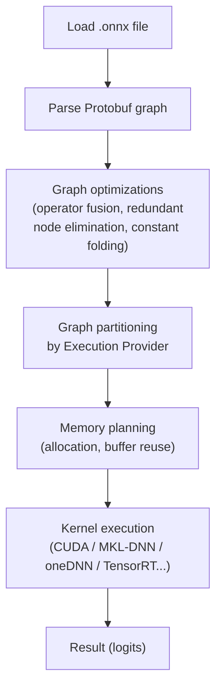

### 4.2 Operator Fusion (Kernel Fusion)

ONNX Runtime detects recurring patterns in the graph (e.g. `LayerNorm -> MatMul -> BiasAdd -> GeLU`) and fuses them into a **single CUDA kernel**, reducing the number of round-trips to GPU global memory. Since each kernel launch has a fixed cost (a few microseconds of overhead), fusing N operations into one eliminates (N-1) launches.

### 4.3 Partitioning by Execution Provider

A single graph can be executed by **multiple engines simultaneously**: operators supported by TensorRT are delegated to TensorRT, unsupported ones fall back to the generic CUDA Execution Provider, ensuring the model executes entirely even if a specialized backend does not cover 100% of the operators.

### 4.4 The Two Phases of Autoregressive Inference

For an LLM, ONNX Runtime — via the **ONNX Runtime GenAI** extension — orchestrates the two classic phases:

- **Prefill**: processes all prompt tokens in a single pass, produces the logits of the first token to generate **and** initializes the KV cache.
- **Decode**: generates one token at a time, reinjecting the KV cache at each iteration via the `generate()` loop.

---

<a id="5"></a>
## 5. How ONNX Handles the KV Cache: The Complete Mechanism

### 5.1 The Fundamental Problem

In an LLM, the most expensive phase is **prefill**, where the model processes the entire prompt to create its internal state — the **K** (Key) and **V** (Value) matrices of attention. Without a cache, this state would be recomputed at each new token, which is prohibitively expensive. The **KV cache** stores these matrices once computed, so that only new tokens are processed in subsequent steps.

### 5.2 The Principle: Cache as Explicit Graph Input/Output

Unlike an engine like vLLM where the KV cache is an opaque internal structure managed by the runtime, ONNX **exposes the cache as an explicit input and output of the graph**: `past_key_values` as input, `present_key_values` as output. This constraint stems directly from the static nature of the ONNX graph — a graph cannot contain implicit "hidden memory," everything must be a named, declared, typed tensor.

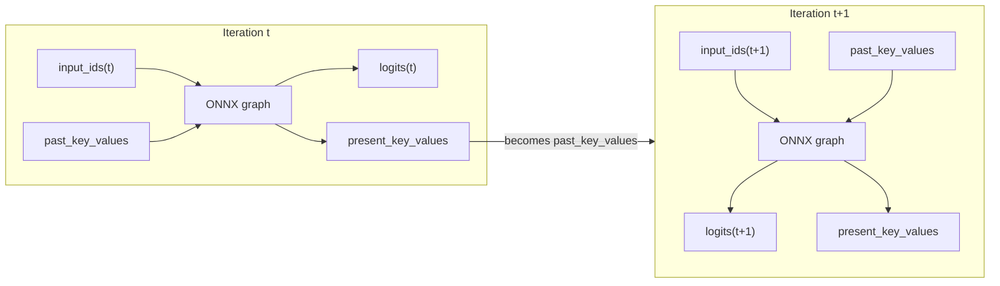

### 5.3 The Flagship Optimization: Past-Present Share Buffer

This is the most significant memory optimization in ONNX Runtime for the KV cache, controlled by the `past_present_share_buffer` parameter.

**Without the optimization (`false`)** — naive approach: at each iteration, a new "present" buffer is allocated, the content of the "past" buffer is copied into it, then the new token is added. Two buffers briefly coexist:

$$
M_{\text{without}} = M_{\text{past}} + M_{\text{present}} \approx 2P
$$

**With the optimization (`true`)**: the "past" and "present" buffers point to **the same physical memory address**, by pre-allocating a single block of size `max_length` from the start. There is no new allocation and no copy at each iteration — only a direct write of the new token:

$$
M_{\text{with}} = \max(M_{\text{past}}, M_{\text{present}}) \approx P
$$

**Mathematical gain: 2x factor on cache memory**, and elimination of the copy cost ($O(P)$ avoided per generated token).

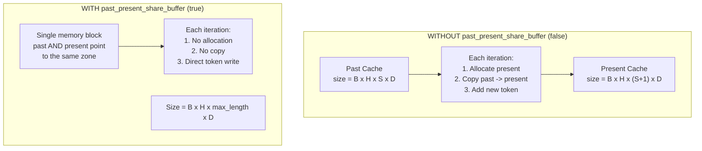

| | `past_present_share_buffer = true` | `= false` |
|---|---|---|
| "Past" cache size | `batch x heads x max_length x head_size` | `batch x heads x past_seq_len x head_size` |
| "Present" cache size | Identical (shared buffer) | `batch x heads x (past_seq_len+1) x head_size` |
| Example (Phi-4-mini, batch=1, max_length=4k) | **4 GB** | ~8 GB (4 GB past + 4 GB present) |

### 5.4 Complementary Optimizations

- **`TensorScatter`** (under development in the ONNX community): would enable **in-place** cache updates, without even creating a new "present" tensor at each step — pushing the shared buffer logic even further.
- **Continuous Decoding (Chat Mode)**: ONNX Runtime GenAI allows retaining the KV cache **between turns of a multi-turn conversation**. A new user message only requires processing new tokens; the history remains in the cache. AMD exploits this feature on its Ryzen AI processors for near-constant latency regardless of conversation length. Continuous Decoding is supported on CPU, NVIDIA GPU (CUDA Execution Provider), and WebGPU, but **not** on NPU or DirectML Execution Provider.

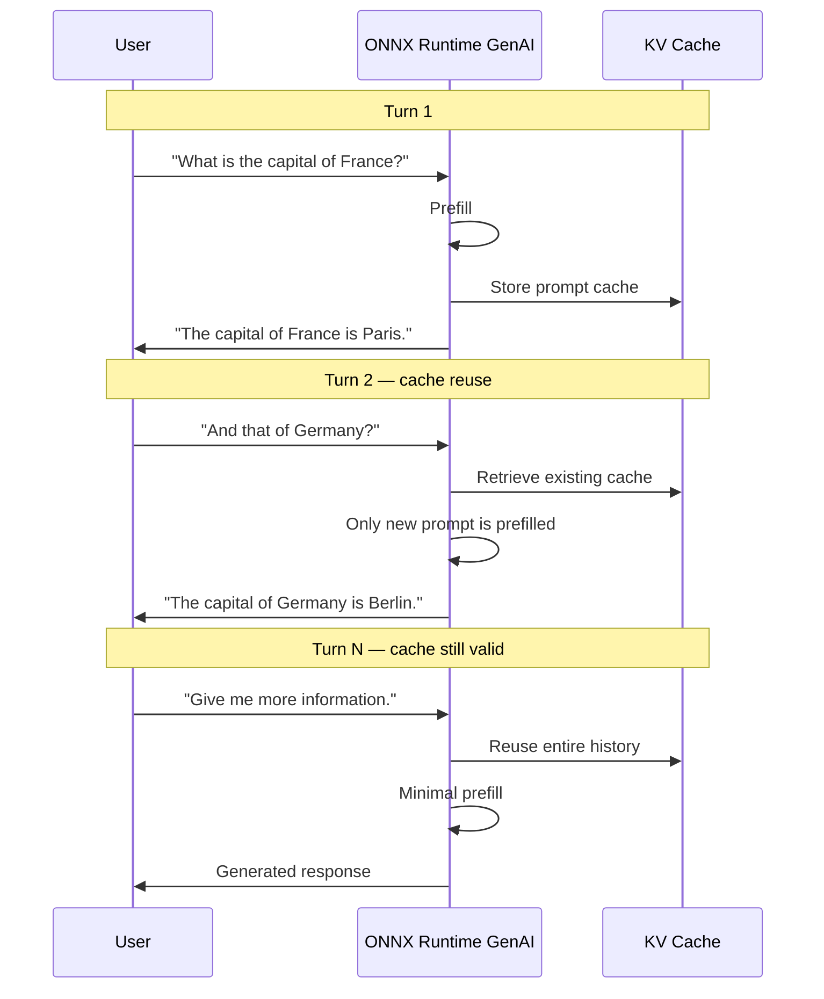

Example implementation with the high-level API:

```python
generator = Generator(model, params)

# System prompt: cached once
system_tokens = tokenizer.encode("You are a helpful assistant.")
generator.append_tokens(system_tokens)

while True:
    user_input = input("You: ")
    input_tokens = tokenizer.encode(user_input)
    generator.append_tokens(input_tokens)  # only new tokens

    while not generator.is_done():
        generator.generate_next_token()
```

### 5.5 The Export Challenge: Making Dynamic Static

Exporting a Transformer model with cache to ONNX is the most delicate step in the pipeline:

1. **Modify the source model** to accept `past_key_values` as input and produce `present_key_values` as output, in addition to logits.
2. **Export via `torch.onnx.export`** with dummy inputs (input_ids, attention_mask, initial cache) to trace the graph.
3. **Declare dynamic dimensions** (`dynamic_shapes` / `dynamic_axes`) so the graph adapts to different sequence lengths, batch sizes, and cache sizes.
4. **Flatten structures**: ONNX cannot accept Python tuples or complex data structures as inputs; the cache (often a list of tuples per layer in PyTorch) must be flattened into a list of individual named tensors.
5. **Sliding window case**: some implementations (notably Esperanto Technologies) export a graph that only processes a recent window of tokens, with the full cache maintained outside the graph by the runtime.

---

<a id="6"></a>
## 6. The Four KV Cache Types of ONNX Runtime GenAI

ONNX Runtime GenAI does not offer a single cache implementation, but **four**, each adapted to a different architecture or deployment context.

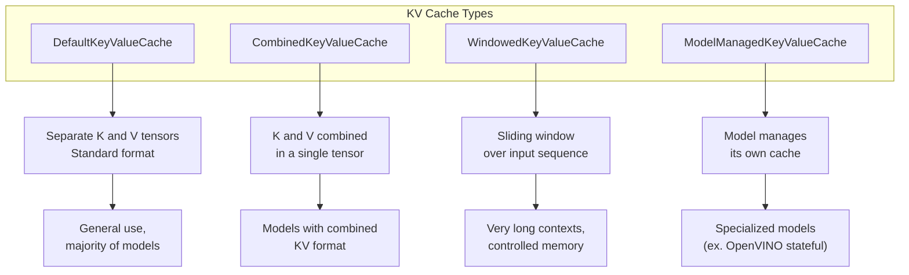

| Type | Principle | Use Case |
|---|---|---|
| **`DefaultKeyValueCache`** | Separate K and V tensors, standard format | General use, majority of models |
| **`CombinedKeyValueCache`** | K and V combined in a single tensor | Models whose native format combines K and V |
| **`WindowedKeyValueCache`** | Sliding window over input sequence | Very long contexts where memory must remain controlled |
| **`ModelManagedKeyValueCache`** | The model itself manages its cache internally | Specialized models, e.g. "stateful" backends like OpenVINO |

This multiple choice reflects an adaptability philosophy: rather than imposing a single cache structure on all models, ONNX Runtime GenAI lets the model format and target backend determine the most suitable implementation.

### 6.1 Cache Position in the Overall ONNX Runtime GenAI Architecture

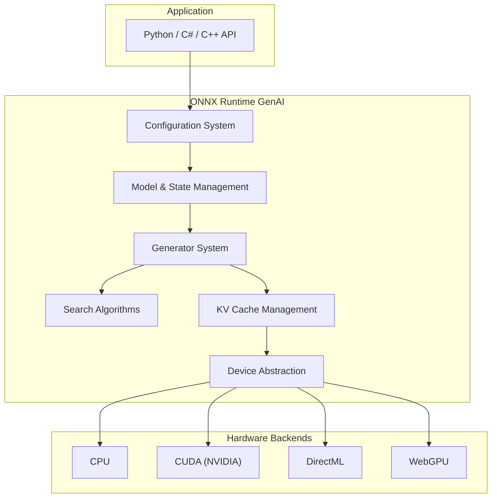

The **KV Cache Management** is a central component of the architecture, on the same level as the decoding search engine (`Search Algorithms`) or the configuration system — not a secondary implementation detail.

### 6.2 Summary Table of ONNX Cache Optimizations

| Optimization | Role | Measured Benefit |
|---|---|---|
| **`past_present_share_buffer`** | Shares the same memory block for past and present | Up to -50% memory |
| **Continuous Decoding** | Cache reuse between conversation turns | Reduced latency, no history re-prefill |
| **System Prompt Caching** | Cache system prompt once for all | Substantial savings on long system prompts |
| **`WindowedKeyValueCache`** | Sliding window for long contexts | Controlled memory independent of total length |
| **`CombinedKeyValueCache`** | K and V in a single tensor | Less management memory overhead |

---

<a id="7"></a>
## 7. Aggressive Comparison: ONNX vs Every Competing Format

### 7.1 ONNX vs Native PyTorch (Eager / TorchScript)

| Criterion | ONNX Runtime | PyTorch Eager |
|---|---|---|
| Graph type | Static, optimized in advance | Dynamic, interpreted operation by operation |
| Launch overhead | Low (kernel fusions) | High — 30 to 50% of total time on small batches (LLM) |
| KV cache memory | ~P (shared buffer) | ~2P (native double buffer) |
| Portability | Total (CPU/GPU/NPU, any vendor) | Limited outside Python/CUDA ecosystem |
| Development flexibility | Low (requires export) | Maximum (immediate iteration) |
| Verdict | **Wins in production**: latency -20 to -40% measured on generative models | **Wins in research**: faster development cycle |

### 7.2 ONNX vs TensorRT (NVIDIA)

| Criterion | ONNX Runtime | TensorRT |
|---|---|---|
| Nature | Partially interpreted/compiled graph | **Fully compiled** engine (`.engine`) for a specific GPU architecture |
| Raw NVIDIA GPU performance | Very good | **30 to 50% superior** |
| Quantization | Generic FP16/INT8 | **Ultra-optimized** INT8/FP4 via Tensor Cores |
| Launch overhead | Low | **Near zero** (CUDA Graphs capture the entire decode loop) |
| Dimension flexibility | Dynamic at runtime | **Frozen at compile time** — wastes memory if actual length is below compiled maximum |
| Hardware portability | **Total** | **None** — exclusively NVIDIA GPUs |
| Migration cost | None | Complete rewrite required when changing GPU vendor |
| Verdict | **Loses on raw performance**, but can use TensorRT *as a backend* via its Execution Provider — best of both worlds | **Wins on raw speed**, but imposes total lock-in |

### 7.3 ONNX vs OpenVINO (Intel)

| Criterion | ONNX Runtime | OpenVINO |
|---|---|---|
| Hardware optimization | Generic, good on x86 CPU | **Specialized** AVX-512 / VNNI for Intel chips |
| Cache management | Past-Present Share Buffer | "Stateful Model" — state preserved between calls, exploits CPU cache L1/L2/L3 hierarchy |
| Portability | Total | Intel ecosystem primarily |
| Integration | OpenVINO can be an ONNX Runtime backend (Execution Provider) | — |
| Verdict | ONNX can **absorb** OpenVINO's gains without losing portability, by using it as an Execution Provider rather than as a standalone solution |

### 7.4 ONNX vs GGUF (llama.cpp)

| Criterion | ONNX Runtime | GGUF |
|---|---|---|
| Primary target | Cloud, edge, multi-hardware | **Local CPU**, limited resources |
| Weight loading | Classic loading (or external data) | **Memory-mapping (mmap)** — loading in $O(1)$, physical RAM = data actually read |
| GPU performance | Good to excellent depending on Execution Provider | **Low** — designed for CPU |
| Quantization | Generic FP16/INT8 | **Ultra-specialized block quantization** (Q4_K, Q8_0...) |
| Verdict | **Superior on GPU and in cloud environments**; GGUF **wins on edge and pure CPU** thanks to mmap and its dedicated quantization |

### 7.5 ONNX vs SafeTensors

This comparison is **not symmetric**: they are not direct competitors.

- **SafeTensors**: tensor-only container, memory-mappable, secure (no arbitrary code execution unlike `pickle`), 10x loading speed gain over `pickle`. It does **no inference**.
- **ONNX**: a **complete execution plan** — graph + weights + metadata.

In practice, the two combine: weights are stored in SafeTensors for their security and loading speed, loaded into memory, then the graph is exported to ONNX for optimized inference.

### 7.6 ONNX vs vLLM (PagedAttention)

This is the most critical comparison for high-throughput LLM use cases — covered in detail in section 15.

### 7.7 Global Summary Table

| Format | Portability | NVIDIA GPU Perf | CPU Perf | Edge/Mobile Perf | KV Cache Management | Lock-in |
|---|---|---|---|---|---|---|
| **ONNX** | 5 stars | 4 stars | 4 stars | 4 stars | 4 stars (explicit, shared, 4 implementations) | None |
| **PyTorch Eager** | 2 stars | 3 stars | 2 stars | 2 stars | 2 stars (double buffer) | Python/CUDA ecosystem |
| **TensorRT** | 1 star | 5 stars | — | — | 5 stars (paged, pooled) | Total (NVIDIA) |
| **OpenVINO** | 2 stars | — | 5 stars | 3 stars | 4 stars (stateful) | Intel ecosystem |
| **GGUF** | 3 stars | 2 stars | 4 stars | 5 stars | 3 stars (managed by llama.cpp) | llama.cpp ecosystem |
| **SafeTensors** | 4 stars (container only) | — | — | — | None (not an engine) | None |
| **vLLM (engine)** | 2 stars (mostly NVIDIA) | 5 stars (pure LLM) | 2 stars | 1 star | 5 stars (PagedAttention, native LLM) | GPU ecosystem |

---

<a id="8"></a>
## 8. ONNX Runtime GenAI vs LMCache: Two Cache Philosophies

Comparing ONNX Runtime GenAI and LMCache is like comparing a sports car engine to a fleet management system: both aim for performance, but their scope and philosophy are radically different.

- **ONNX Runtime GenAI** is an **integrated optimization layer** within the inference engine, designed to make the engine's **internal** cache more efficient on a **single node**. Philosophy: make the native cache as fast and economical as possible.
- **LMCache** is an **external and distributed cache system**, an independent middleware layer between the inference engine and storage. Philosophy: transform the volatile, local cache into a persistent, shared, addressable resource at the datacenter scale.

### 8.1 Detailed Point-by-Point Comparison

| Comparison Point | ONNX Runtime GenAI | LMCache |
|---|---|---|
| **System nature** | Optimization integrated into the inference engine (`generate()` API or custom loop) | Independent external middleware, running as a separate server (daemon) |
| **Cache scope** | Local to the process, tied to the lifecycle of a single instance on a single node | Distributed and shared between multiple engine instances (vLLM, SGLang), across multiple nodes |
| **Storage architecture** | Monolithic and flat (or windowed for long contexts) | Multi-level hierarchical (L1 CPU RAM, L2 disk, L3 object storage like S3) |
| **Management mechanism** | `past_present_share_buffer` — shares a memory block for past and present | `Transfer Context` — abstraction of tensor movement between processes (CUDA IPC or not) |
| **Cache persistence** | Volatile — lost if the instance restarts | Persistent — saveable to disk, Redis, S3; survives engine restart |
| **Inter-request sharing** | Limited to consecutive requests in the same session (continuous decoding) | Massive and flexible — reusable between requests, sessions, even different engines, via content addressing |
| **Key optimization** | 2x memory footprint reduction | CacheBlend and non-prefix reuse — essential for RAG |
| **Target performance** | Cache efficiency on a single node | Maximize cache hit rate at cluster scale |
| **Typical use case** | Monolithic or edge deployment, simple load on a single machine | Large-scale production, distributed architectures (RAG, multi-turn assistants, agents) |
| **Integration** | Via `generate()` API or libraries like `Microsoft.SemanticKernel` | Native plugin for vLLM, SGLang, TensorRT-LLM via their connector API |

### 8.2 The Choice Is Not Binary — Complementarity

- **ONNX Runtime GenAI** is the tool for **internal optimization**: use it if you want the ONNX engine to run at maximum capacity on a given machine.
- **LMCache** is the tool for **system architecture**: adopt it if you manage a fleet of servers with shared contexts (system prompts, documents, conversations) and want to avoid redundant recomputation at the infrastructure scale.

In a modern production architecture, strength comes from their complementarity: ONNX Runtime GenAI optimizes the **local** engine, while LMCache mutualizes the cache at the **global** scale. One does not replace the other.

---

<a id="9"></a>
## 9. External Cache Management Tools for ONNX

### 9.1 A Notable Absence: LMCache Does Not Support ONNX Natively

LMCache is designed to integrate with modern inference engines like vLLM and SGLang, via their connector API. **The official LMCache documentation does not mention ONNX as a supported engine** — this integration does not exist natively for ONNX Runtime to date.

### 9.2 Existing Alternatives

| Tool | Type | ONNX Support | Objective |
|---|---|---|---|
| **LMCache** | Cache middleware | Not supported | Distributed cache for vLLM, SGLang |
| **ONNX Runtime GenAI** | Inference engine | Native | Integrated KV cache management (4 implementations) |
| **EdgeSync-LLM** | Cache system | Via dedicated adapter | Engine-agnostic KV fragment cache, for embedded devices but portable |
| **KVSWAP** | Cache framework | Not specified | Full cache storage on disk, for local devices |
| **TurboQuant** | Quantization (Rust library) | Via ONNX Runtime | Vector quantization of cache in the decode loop, reconstruction before returning to runtime |
| **Dynamo KVBM (NVIDIA)** | KV block manager | Not specified for ONNX | Distributed cache designed for TensorRT-LLM and vLLM, potentially adaptable |
| **`onnx-tool`** | Analysis and optimization | Native | Analyzes cache structure without managing it externally |

### 9.3 How to Reliably Manage Cache with ONNX Today

In the absence of a direct equivalent to LMCache, the reliable production strategy relies on:

1. **Rely on ONNX Runtime GenAI**: use the `generate()` API or the manual loop with `past_key_values`, with `past_present_share_buffer` systematically enabled.
2. **Add an application-level cache** on top (e.g. with Redis), to cache complete responses or conversation segments at the application level, independently of the engine's internal cache.
3. **Explore EdgeSync-LLM** if the use case tolerates its architecture initially designed for embedded, via its dedicated `past_key_values` adapter.
4. **Monitor ecosystem evolution**: LMCache plans support for TensorRT-LLM, which could eventually open the path to ONNX integration.

**Conclusion on this point**: cache management with ONNX today relies primarily on the **integrated** capabilities of ONNX Runtime GenAI, complemented by analysis and quantization tools, rather than on a mature distributed cache ecosystem like the one vLLM benefits from.

---

<a id="10"></a>
## 10. The Complete Mathematical Equation: ONNX vs Attention and Cache

### 10.1 The Common Foundation Across All Formats

For a sequence of length $L$, multi-head attention decomposes into two phases:

- **Prefill**: cost $O(L^2)$ (matrix product $Q \times K^T$ over the entire sequence in parallel).
- **Decode**: cost $O(L)$ per token thanks to the KV cache (a single new Query vector compared to the stored history).

The KV cache size follows:

$$
\text{Size}_{\text{cache}} = 2 \times B \times L \times H \times D_h \times \text{sizeof(dtype)}
$$

### 10.2 Numerical Application: Llama-7B

For `num_layers=32`, `head_dim=128`, `seq_len=4096`, in FP16 (2 bytes), batch=1:

$$
\text{Raw size} = 2 \times 1 \times 4096 \times 32 \times 128 \times 2 = 67\,\text{MB}
$$

| Format/Engine | Actual memory required | Explanation |
|---|---|---|
| **PyTorch Eager** | ~134 MB (+fragmentation) | Past/present double buffer, CUDA allocator not optimized for this case |
| **ONNX Runtime** | ~67 MB | Past-Present Share Buffer, fragmentation < 5% |
| **TensorRT** | ~67 MB, contiguous and predictable | Compiled Memory Pool, deterministic latency |
| **GGUF** | ~67 MB, but in CPU RAM | Cheaper, but ~10x slower to access than VRAM |

### 10.3 The Synthesis Equation

$$
\text{Performance}_{\text{ONNX}} = \text{Performance}_{\text{Theoretical max}} - \alpha(\text{Hardware specificity})
$$

Where $\alpha$ is **low** on generic CPU or non-NVIDIA GPU (ONNX is nearly optimal there), but **higher** against an engine compiled for a single hardware (TensorRT on NVIDIA). In return, ONNX's **portability** — its ability to absorb new accelerators without rewriting — has no equivalent among specialized formats.

---

<a id="11"></a>
## 11. Energy Consumption: The Hard Numbers

This is an angle rarely addressed with rigor, and the results are nuanced — ONNX Runtime is **not systematically the most economical**, the ranking depends heavily on hardware and workload.

### 11.1 On CPU Server (RISC-V Architecture, Comparative Study)

On a 64-core RISC-V server, a comparative study shows that TensorFlow Lite consumes the least energy (baseline), while ONNX Runtime consumes **1.2 to 1.39 times more energy**, and native PyTorch **2.0 to 2.42 times more** than TensorFlow Lite on the same workloads (ResNet, VGG-16).

### 11.2 On Edge GPU (NVIDIA Jetson AGX Orin)

A comparison of five engines (PyTorch, ONNX Runtime, TensorRT, Apache TVM, JAX) on Jetson AGX Orin shows that ONNX Runtime and JAX display the **lowest average consumption** (under 15 W even on large networks — 14.17 W on ResNet152, 13.96 W on EfficientNet). This result reflects a **modest GPU engagement**: ONNX Runtime solicits the GPU less intensively, which reduces instantaneous power consumed, **but at the cost of higher latency and lower throughput** than more aggressive engines like TensorRT.

### 11.3 The Fundamental Power/Throughput Trade-off

This observation reveals an important principle, often ignored in marketing pitches: **lower instantaneous power does not mean lower total energy per request**, because energy is the product of power by time:

$$
E = \bar{P}_{\text{active}} \times T_{\text{inference}}
$$

If ONNX Runtime consumes fewer watts but takes longer to process a request, the total energy consumed per request can ultimately exceed that of a more powerful but faster engine, like TensorRT. A study on a dedicated graph compiler shows for example that at comparable configuration, ONNX Runtime displays an average active power of about 12.1 W versus 11.8 W for OpenVINO — a small difference in watts, but which translates into a **37 to 46% difference in total energy per inference** once execution duration is factored in, to ONNX Runtime's disadvantage in this specific scenario.

### 11.4 GPU vs CPU: The Fundamental Gap Remains Dominant

Regardless of format, the GPU vs CPU decision weighs far more than the runtime choice: on inference workloads, CPU-only execution can require up to **4.5 times more total energy** than GPU execution for the same work, despite lower instantaneous power per watt on the CPU side — because CPU execution time is disproportionately longer.

### 11.5 Practical Recommendations for Energy Efficiency with ONNX

- **Enable specialized Execution Providers** (TensorRT, OpenVINO) rather than the generic CPU/CUDA provider: they reduce execution time, which reduces total energy despite sometimes higher instantaneous power.
- **Quantize aggressively** (FP16, INT8): reduces both memory and the number of compute cycles, hence energy per token.
- **Maximize cache utilization** (past-present share buffer, prefix caching on the application side): less recomputation = less energy, regardless of the engine.
- **Avoid frequent CPU-accelerator transitions**: each device transition has a non-negligible energy cost from data movement.
- **Do not rely solely on instantaneous power (W)** published in marketing benchmarks: always reduce to **energy per request or per token** ($E = P \times T$) to fairly compare runtimes.

---

<a id="12"></a>
## 12. Advantages and Disadvantages: The No-Compromise Assessment

### 12.1 Advantages

| Advantage | Detail |
|---|---|
| **Total portability** | A single `.onnx` file runs on CUDA, TensorRT, ROCm, OpenVINO, DirectML, CoreML, CPU |
| **No vendor lock-in** | Change cloud provider or GPU without rewriting the pipeline |
| **Solid generalist performance** | Measured latency and throughput gains over PyTorch Eager on many LLMs |
| **Optimized cache memory management** | Past-Present Share Buffer, up to 2x reduction in KV cache footprint, 4 implementations adapted to model architecture |
| **Mature ecosystem** | Backed by Microsoft, Meta, AWS, NVIDIA, Intel, AMD; open standard (Linux Foundation) |
| **Future-proof architecture** | New hardware accelerators integrate via new Execution Providers, without touching the model |
| **Multi-framework interoperability** | A model trained in any framework can converge to a single deployment format |

### 12.2 Disadvantages

| Disadvantage | Detail |
|---|---|
| **Pure LLM performance below specialized engines** | vLLM (PagedAttention) and TensorRT-LLM outperform ONNX Runtime on very high-throughput LLM inference |
| **Export complexity** | Models with complex dynamic control flow are hard to export cleanly; managing dynamic dimensions is delicate |
| **Energy consumption not systematically optimal** | Low instantaneous power can mask higher total energy per request if latency increases |
| **No mature distributed cache ecosystem** | Unlike vLLM (LMCache), ONNX has no direct equivalent for inter-instance cache sharing at the datacenter scale |
| **Limitations on very long contexts** | Beyond 4k-8k tokens, OOM memory errors have been reported; "prefill chunking" in development shows promising results (-33% GPU memory for 20k tokens) but remains a work in progress |
| **Additional abstraction layer** | Adds a dependency link (the Runtime) between the model and hardware, with its own bugs and versions to manage |
| **Static graph rigidity** | Dynamic dimensions require explicit declaration; some highly dynamic computation patterns remain difficult to represent |

---

<a id="13"></a>
## 13. ONNX in a Production Pipeline (MLOps / Cloud)

### 13.1 Position in a Layered Architecture

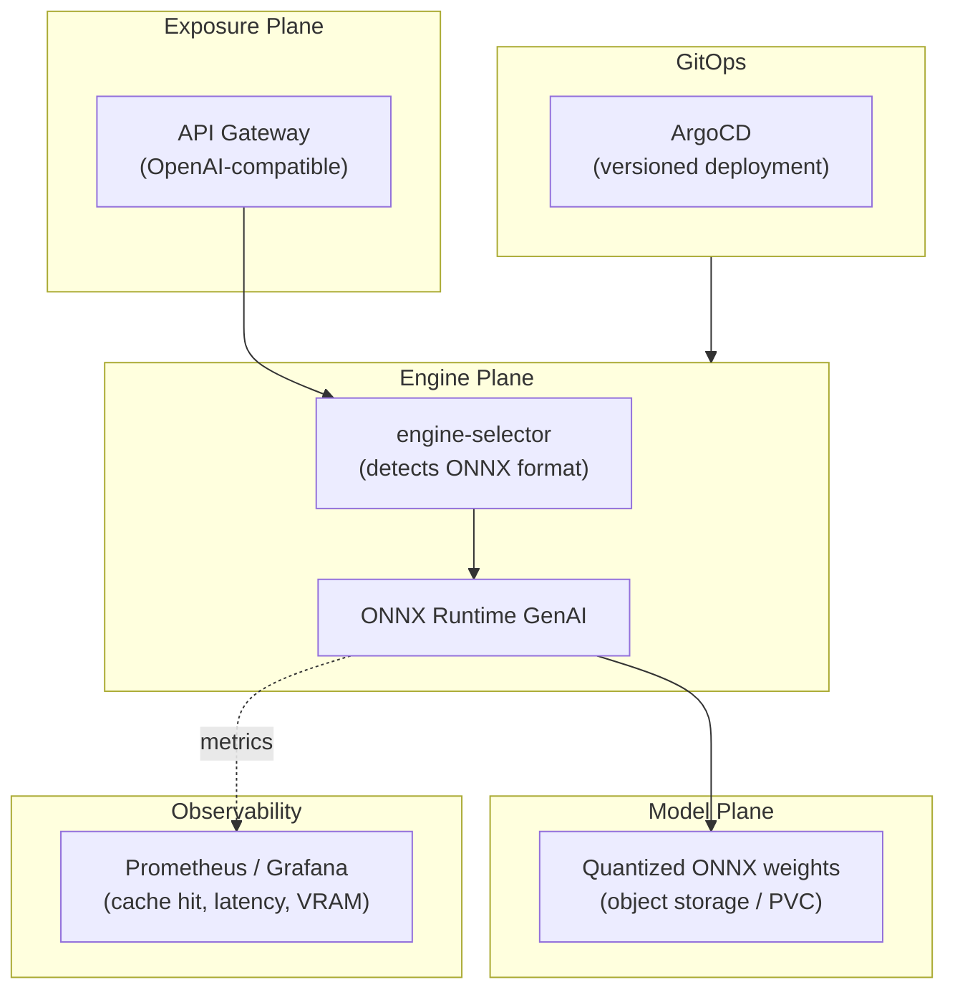

### 13.2 The Typical Lifecycle of an ONNX Model in Production

1. **Training** with the framework of choice (PyTorch, TensorFlow).
2. **Export** to ONNX (`torch.onnx.export`, with explicit KV cache and dynamic dimension management).
3. **Graph optimization** (operator fusion, FP16/INT8 quantization).
4. **Automatic engine selection** by a routing component (`engine-selector`) that detects the format and chooses ONNX Runtime GenAI with a confidence score.
5. **Versioned deployment** via Helm + ArgoCD, with prior calculation of the required VRAM budget (including KV cache).
6. **Continuous observability**: latency metrics, error rate, memory and cache utilization, exposed via ServiceMonitor / Prometheus / Grafana.
7. **Autoscaling** driven by queue depth and cache pressure (KEDA), on the same basis as for an engine like vLLM.

### 13.3 Why This "Triple-Layer" Architecture Suits ONNX Particularly Well

The Exposure / Engine / Model separation is **naturally served** by the ONNX philosophy: the format is interchangeable (model plane), the engine is dedicated and replaceable (engine plane), and the API remains uniform on the client side (exposure plane). ONNX acts as the **common language** that makes this separation possible without technical compromise.

---

<a id="14"></a>
## 14. Who Uses ONNX in Production, and How

| Organization | Usage |
|---|---|
| **Microsoft** (Bing, Office 365, Azure Cognitive Services) | Average measured acceleration of 2.9x over non-optimized runtimes |
| **Ant Group (Alipay)** | Inference of computer vision and NLP models in production |
| **Adobe** | Large-scale model deployment for real-time personalized experiences |
| **CERN** | Integration into the `Athena` framework for particle reconstruction |
| **Hugging Face** | Acceleration of thousands of models on its inference API |
| **AMD (Ryzen AI)** | KV cache reuse via ONNX Runtime GenAI for multi-turn conversations on embedded NPU |

These uses cover a broad spectrum: hyperscale cloud (Microsoft), fintech (Ant Group), content creation (Adobe), fundamental research (CERN), and model platforms (Hugging Face) — a strong signal of transversal maturity, independent of any single sector.

---

<a id="15"></a>
## 15. The Long Context Challenge: ONNX vs vLLM

### 15.1 ONNX's Positioning: The Inference "Chameleon"

ONNX is not a single engine like vLLM; it is an **ecosystem**. Its primary strength is converting models from any framework into a standard format, then executing them via ONNX Runtime on a multitude of hardware. This is ideal for flexibility, absence of lock-in, and cost reduction through quantification — but it is on long contexts that the comparison with vLLM becomes crucial.

### 15.2 The Direct Match

| Criterion | ONNX Runtime GenAI | vLLM |
|---|---|---|
| **KV cache** | More complex management, less efficient on very long contexts, risk of OOM beyond 4k-8k tokens without specific tuning | **Native and ultra-optimized** via PagedAttention, designed for long contexts |
| **Performance** | Good, generally inferior to vLLM in pure throughput; can reach 80-95% of TensorRT throughput depending on benchmarks | Excellent throughput, very low latency (TTFT) |
| **Hardware flexibility** | Exceptional — CPU, NVIDIA GPU, AMD, etc. | Designed for GPUs, primarily NVIDIA |
| **Cost** | Potentially lower thanks to quantization and cheaper hardware | Optimized for GPUs, cost tied to this hardware |
| **Ease of use** | Ecosystem can be complex (conversion, configuration) | Simple interface, nearly "plug-and-play" for LLMs |

Prefill chunking, a technique under development at Microsoft that splits the long context into chunks to save memory, shows promising early results (33% GPU memory reduction for a 20k token context) — a sign that the ONNX community is actively working on this weak point, without the problem being fully resolved yet.

### 15.3 Strategic Recommendation by Model and Context Size

1. **Small/medium models (7B-13B) with contexts < 8k tokens**: ONNX is an excellent choice — good performance/cost/flexibility compromise for classification, simple Q&A, or code generation on short contexts.
2. **Giant models (70B+) or very long contexts (32k-128k tokens)**: ONNX in its current state is risky. **vLLM is the safest and most performant choice** for these use cases.
3. **The winning strategy: multi-engine architecture** — deploy vLLM for demanding models (core activity), deploy ONNX for smaller models or routing tasks where flexibility matters, and use a unified cache layer (like LMCache for the vLLM part) to mutualize what can be mutualized.

**In short: ONNX is not a replacement for vLLM for the heaviest workloads, but a strategic complement** that optimizes costs and flexibility where it is relevant.

---

<a id="16"></a>
## 16. Managing ONNX for Millions of Users

### 16.1 ONNX-Specific Levers at This Scale

- **Systematic quantization**: INT8 for weights, FP16 or INT8 for the KV cache depending on the tolerated precision budget.
- **Strategic choice of Execution Providers**: TensorRT as backend on NVIDIA nodes, OpenVINO on Intel nodes — without multiplying model formats to maintain.
- **Past-Present Share Buffer enabled by default**.
- **Continuous Decoding** for high-volume conversational use cases.

### 16.2 What ONNX Does Not Solve Natively at This Scale

ONNX Runtime, unlike vLLM, does not natively offer **PagedAttention** or **Automatic Prefix Caching** across requests at the cluster level, and does not have a mature equivalent of LMCache. For massive volumes with many shared prefixes, it is recommended to reserve ONNX for models where hardware portability matters most, and use a specialized engine for very high-volume conversational LLMs.

### 16.3 Quantified Sizing Example

For 1 million requests/day on a 7B model in FP16:

- **Without ONNX optimization** (native PyTorch): on the order of 4 A100 GPUs (40 GB) needed.
- **With ONNX** (INT8 quantization + Past-Present Share Buffer): on the order of 2 A100 GPUs suffice — a reduction of approximately **50%** of the required GPU fleet for this model.

---

<a id="17"></a>
## 17. Complete Financial Assessment

| Lever | Measured Impact |
|---|---|
| Latency reduction vs native PyTorch | Up to -27.6% (measured on Gemma-7B, Phi-3, Llama-3.1-8B) |
| Computational throughput increase | Up to +48.3% (GFLOP/s) |
| KV cache memory reduction | Up to -50% (Past-Present Share Buffer) |
| Model size reduction (INT8 quantization) | Up to -74.9% |
| Price/performance ratio (ARM Neoverse vs x86) | Up to 2.8x better |
| Migration cost between hardware vendors | None (native portability) |

**Quantified 5-year example**: for a model serving a high volume of daily requests, reducing the GPU fleet from 4 to 2 A100 units (at ~$3/hour) represents savings on the order of **$50,000 per year**, or approximately **$250,000 cumulative over 5 years**, for this single model.

**The hidden cost of avoided lock-in**: a pipeline entirely optimized for TensorRT or for a specific cloud implies a potentially prohibitive migration cost if hardware prices evolve unfavorably. ONNX transforms this risk into a **strategic option** — the ability to renegotiate or migrate without rewriting cost is itself a form of financial value, akin to an insurance premium.

---

<a id="18"></a>
## 18. Final Verdict: When to Choose ONNX, When Not To

### Choose ONNX when:

- The infrastructure is **multi-cloud or multi-hardware** (NVIDIA/AMD/Intel/ARM mix).
- **Longevity and absence of lock-in** are strategic priority criteria.
- The use case is **versatile** (vision, classic NLP, hybrid models) and not exclusively very high-throughput conversational LLM.
- The deployment must cover **cloud down to edge/mobile** with a single model artifact.
- Models are **small to medium (7B-13B) with short contexts (< 8k tokens)**.
- The organization already uses **multiple training frameworks** and wants to unify its deployment pipeline.

### Do not choose ONNX alone when:

- The use case is **exclusively very high-throughput conversational LLM on homogeneous NVIDIA GPU**: vLLM or TensorRT-LLM will offer superior throughput thanks to PagedAttention and bare-metal optimizations.
- Models are **giant (70B+) or contexts very long (32k-128k tokens)**: OOM risks and the absence of a mature distributed cache make ONNX risky in the current state of the ecosystem.
- The infrastructure is **100% committed and frozen on a single GPU vendor** with no intention to diversify: TensorRT alone can then outperform.
- The deployment targets exclusively **very constrained CPU devices** (low-end mobile, IoT): GGUF with mmap may be more suitable.

### The Winning Strategy: Multi-Engine Complementarity

In a mature production architecture, ONNX is **not a replacement** for vLLM or TensorRT — it is a **strategic complement**. The most robust approach consists of:

1. **Deploy vLLM** for the most demanding models (long context, high performance), with LMCache as the distributed cache layer.
2. **Deploy ONNX** for smaller models, routing tasks, or less critical workloads, where portability and cost matter most.
3. **Unify observability and GitOps** across both engine families, rather than seeking a single universal tool.

It is this **hybrid approach**, rather than an exclusive choice, that captures the best of both worlds.

---

<a id="19"></a>
## 19. Glossary

| Term | Short Definition |
|---|---|
| **IR (Intermediate Representation)** | Intermediate representation of a model, independent of the source framework |
| **Protobuf** | Compact binary serialization format used by ONNX |
| **Execution Provider** | Execution-specific backend (CUDA, TensorRT, OpenVINO...) plugged into ONNX Runtime |
| **Initializer** | ONNX representation of a trained weight or bias (`TensorProto`) |
| **Past-Present Share Buffer** | Memory optimization sharing the KV cache buffer between past and present state |
| **Kernel Fusion** | Fusing multiple operations into a single compute kernel to reduce overhead |
| **External Data** | Mechanism for storing weights in a separate file for large ONNX models |
| **Continuous Decoding** | Reusing the KV cache between turns of a multi-turn conversation |
| **DefaultKeyValueCache** | Standard cache implementation, K and V in separate tensors |
| **CombinedKeyValueCache** | Implementation combining K and V in a single tensor |
| **WindowedKeyValueCache** | Sliding window implementation for very long contexts |
| **ModelManagedKeyValueCache** | Implementation where the model manages its own cache (e.g. OpenVINO stateful) |
| **Prefill Chunking** | Technique under development that splits prefill into chunks to save memory |
| **Vendor Lock-in** | Technical and financial dependence on a single hardware or software vendor |

---