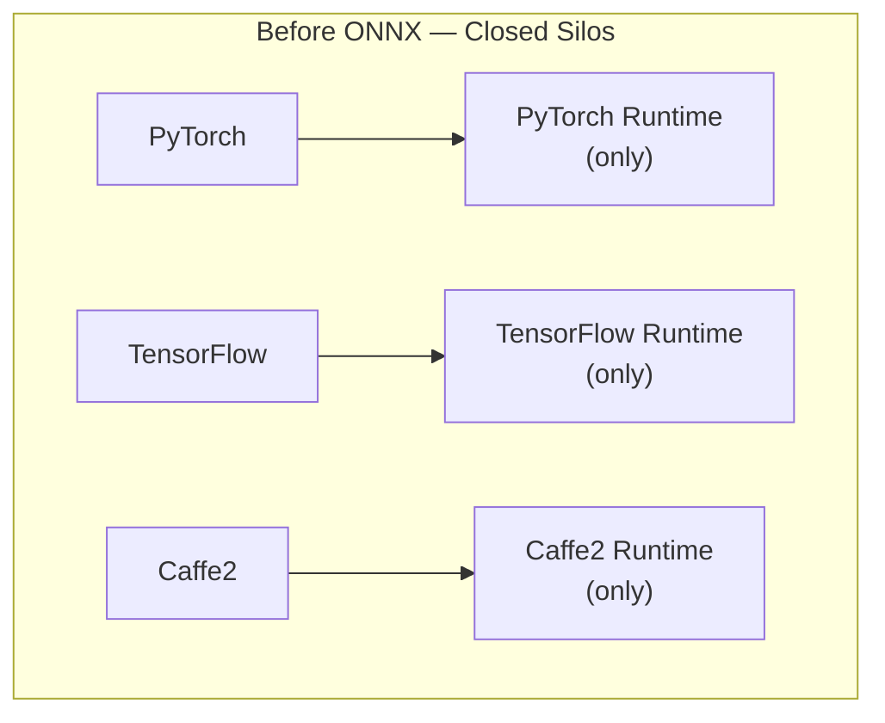
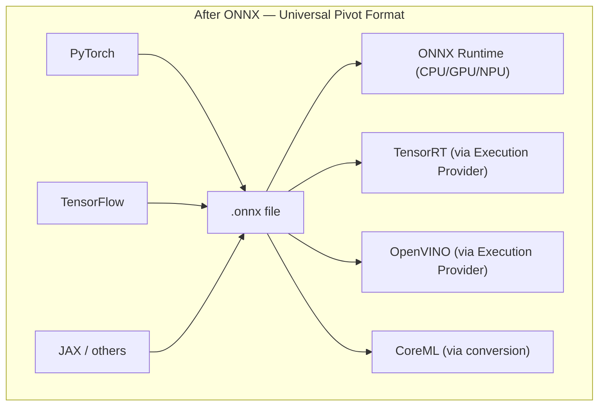
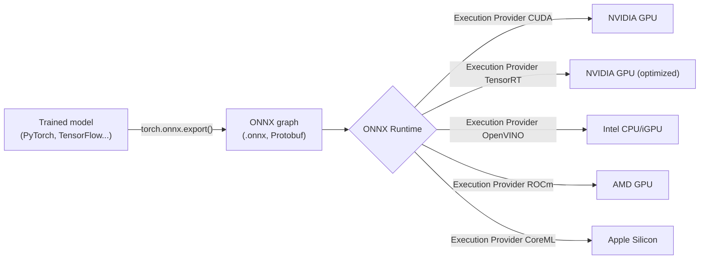
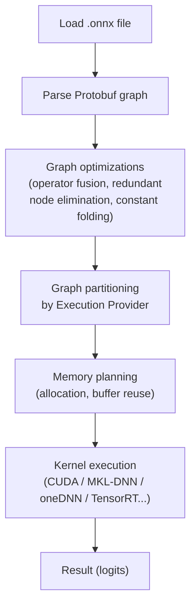
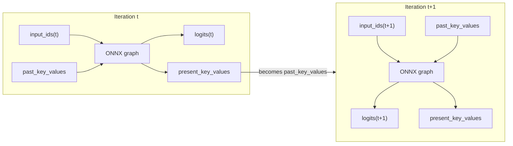
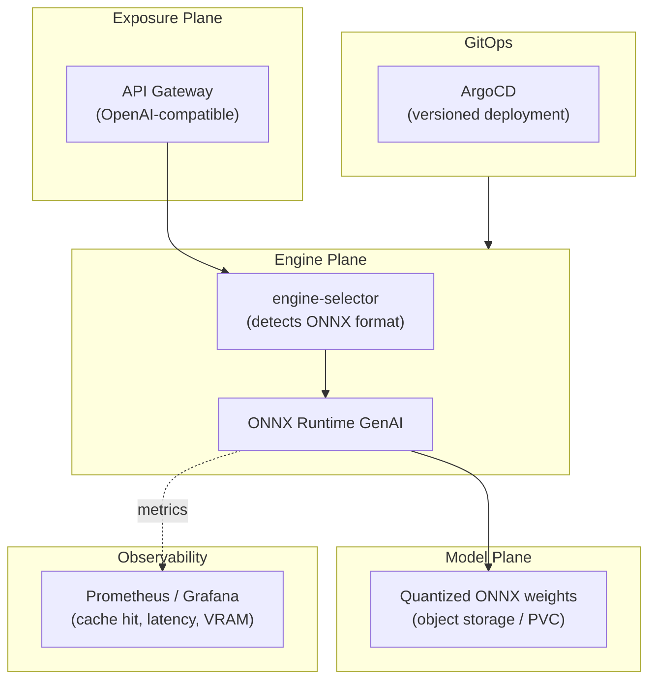

# ONNX: The Complete Reference Document
### Origins, mathematics, cache management, aggressive comparison with all competing formats, energy consumption, and deployment at the scale of millions of users

---

## Table of Contents

1. [Why ONNX Was Created: The Silo Problem](#1)
2. [How ONNX Works: The Three Pillars](#2)
3. [The Mathematical Storage of Weights and Biases](#3)
4. [How ONNX Handles Inference: Anatomy of the Execution Pipeline](#4)
5. [How ONNX Handles the KV Cache](#5)
6. [Aggressive Comparison: ONNX vs Every Competing Format](#6)
7. [The Complete Mathematical Equation: ONNX vs Attention and Cache](#7)
8. [Energy Consumption: The Hard Numbers](#8)
9. [Advantages and Disadvantages: The No-Compromise Assessment](#9)
10. [ONNX in a Production Pipeline (MLOps / Cloud)](#10)
11. [Who Uses ONNX in Production, and How](#11)
12. [Managing ONNX for Millions of Users](#12)
13. [Complete Financial Assessment](#13)
14. [Final Verdict: When to Choose ONNX, When Not To](#14)
15. [Glossary](#15)

---

## 1. Why ONNX Was Created: The Silo Problem

Before 2017, each deep learning framework — PyTorch, TensorFlow, Caffe2, CNTK — constituted a **closed vertical stack**, from the training API down to the inference runtime. This fragmentation posed three concrete problems:

1. **Software vendor lock-in**: a model trained with one framework could not be natively executed by another. Migration meant rewriting.
2. **The research-to-production gap**: researchers used flexible frameworks (PyTorch), while production teams needed different optimized engines. Manual conversion was slow and error-prone.
3. **Duplicated hardware work**: each chip manufacturer (NVIDIA, Intel, Qualcomm...) had to optimize its drivers framework by framework, a redundant effort at the scale of the entire industry.

**ONNX (Open Neural Network Exchange)** was created in September 2017 by **Microsoft and Facebook (Meta)**, with a clear goal: establish a **universal intermediate format** capable of representing any model, regardless of the framework that produced it or the engine that would execute it.

**ONNX is neither a training framework nor an inference engine.** It is a **standard intermediate layer** — a contract between the two worlds.

---

## 2. How ONNX Works: The Three Pillars

### 2.1 A Common Intermediate Representation (IR)

ONNX describes a model as a **computational graph**: a sequence of mathematical operators (`MatMul`, `Add`, `LayerNormalization`, `Softmax`, etc.) applied to tensors. This graph is **static**: all operations and — in the classic version — all tensor shapes are frozen at export time.

### 2.2 A Serialization Format via Protocol Buffers

The graph, weights, and metadata are serialized in **Protobuf** (Protocol Buffers, developed by Google): a compact binary format, fast to parse, with a strongly typed schema.

### 2.3 An Execution Ecosystem: ONNX Runtime

The `.onnx` file alone does nothing. It is **ONNX Runtime** — the reference engine — that loads the graph, optimizes it, and executes it on the target hardware via a system of **Execution Providers** (CUDA, TensorRT, OpenVINO, ROCm, DirectML, CoreML, CPU...).

This **format / engine / hardware** separation is the keystone of the entire ONNX philosophy: train once, export once, and then re-optimize indefinitely without touching the model.

---

## 3. The Mathematical Storage of Weights and Biases

### 3.1 The `TensorProto` Structure

Each trained parameter (weight, bias) is represented in the graph as an **initializer**: a `TensorProto` message containing:

- the tensor **name** (referenced by the graph nodes that use it),
- its **type** (`FLOAT`, `FLOAT16`, `INT8`, `UINT8`...),
- its **dimensions** (`dims`, e.g. `[768, 3072]` for a projection matrix),
- its **raw data** (`raw_data`, a contiguous byte buffer representing the tensor in memory).

Mathematically, a weight tensor $W$ of dimensions $(m, n)$ in precision `dtype` occupies:

$$
\text{Size}(W) = m \times n \times \text{sizeof(dtype)}
$$

For a linear layer of the form $ y = Wx + b $, ONNX stores $W$ (matrix $m \times n$) and $b$ (vector $m$) as two distinct `TensorProto`, referenced by the corresponding `Gemm` or `MatMul` + `Add` node in the graph.

### 3.2 Inline Storage vs External Storage

- **Inline**: tensor data is written directly into the `.onnx` file via `raw_data`. Suitable for small models.
- **External data**: for large models (beyond the 2 GB limit imposed by Protobuf), data is stored in separate files (`.onnx.data`), with the `.onnx` file retaining only the graph and pointers (offset, length) to this external data.

### 3.3 Fundamental Difference from a "Bag of Tensors"

This is where the structural opposition with formats like SafeTensors or the PyTorch state (`state_dict`) plays out:

| | File Contents | Nature |
|---|---|---|
| **ONNX** | Computational graph **+** weights **+** metadata | **Self-sufficient and executable** model |
| **SafeTensors** | Tensors only, memory-mappable (mmap) | Data container — requires a model architecture defined elsewhere (code) to be reusable |
| **PyTorch (`.pt`)** | `state_dict` serialized via `pickle` | Checkpoint save — depends on the model class source code |

**ONNX = the entire model, ready to execute.** SafeTensors and PyTorch = **only the weights**, which must be injected into an architecture already defined in code.

---

## 4. How ONNX Handles Inference: Anatomy of the Execution Pipeline

### 4.1 Internal Steps of ONNX Runtime

### 4.2 Operator Fusion (Kernel Fusion)

ONNX Runtime detects recurring patterns in the graph (e.g. `LayerNorm → MatMul → BiasAdd → GeLU`) and fuses them into a **single CUDA kernel**, reducing the number of round-trips to GPU global memory. Since each kernel launch has a fixed cost (a few microseconds of overhead), fusing N operations into one eliminates (N-1) launches.

### 4.3 Partitioning by Execution Provider

A single graph can be executed by **multiple engines simultaneously**: operators supported by TensorRT are delegated to TensorRT, unsupported ones fall back to the generic CUDA Execution Provider, ensuring the model executes entirely even if a specialized backend does not cover 100% of the operators.

### 4.4 The Two Phases of Autoregressive Inference

For an LLM, ONNX Runtime — via the **ONNX Runtime GenAI** extension — orchestrates the two classic phases:

- **Prefill**: processes all prompt tokens in a single pass, produces the logits of the first token to generate **and** initializes the KV cache.
- **Decode**: generates one token at a time, reinjecting the KV cache at each iteration via the `generate()` loop.

---

## 5. How ONNX Handles the KV Cache

### 5.1 The Principle: Cache as Explicit Graph Input/Output

Unlike an engine like vLLM where the KV cache is an opaque internal structure managed by the runtime, ONNX **exposes the cache as an explicit input and output of the graph**: `past_key_values` as input, `present_key_values` as output. This constraint stems directly from the static nature of the ONNX graph — a graph cannot contain implicit "hidden memory," everything must be a named, declared, typed tensor.

### 5.2 The Flagship Optimization: Past-Present Share Buffer

This is the most significant memory optimization in ONNX Runtime for the KV cache, controlled by the `past_present_share_buffer` parameter.

**Without the optimization (`false`)**: at each iteration, a new "present" buffer is allocated then copied into the "past" buffer. Two buffers briefly coexist:

$$
M_{\text{without}} = M_{\text{past}} + M_{\text{present}} \approx 2P
$$

**With the optimization (`true`)**: the "past" and "present" buffers point to **the same physical memory address**, by pre-allocating a buffer of size `max_length` from the start:

$$
M_{\text{with}} = \max(M_{\text{past}}, M_{\text{present}}) \approx P
$$

**Mathematical gain: 2x factor on cache memory**, and elimination of the copy cost ($O(P)$ avoided per generated token).

| | `past_present_share_buffer = true` | `= false` |
|---|---|---|
| "Past" cache size | `batch × heads × max_length × head_size` | `batch × heads × past_seq_len × head_size` |
| "Present" cache size | Identical (shared buffer) | `batch × heads × (past_seq_len+1) × head_size` |
| Example (Phi-4-mini, batch=1, max_length=4k) | **4 GB** | ~8 GB (4 GB past + 4 GB present) |

### 5.3 Complementary Optimizations

- **`TensorScatter`** (under development in the ONNX community): would enable **in-place** cache updates, without even creating a new "present" tensor at each step — pushing the shared buffer logic even further.
- **Continuous Decoding (Chat Mode)**: ONNX Runtime GenAI allows retaining the KV cache **between turns of a multi-turn conversation**. A new user message only requires processing new tokens; the history remains in the cache. AMD exploits this feature on its Ryzen AI processors for near-constant latency regardless of conversation length.

### 5.4 The Export Challenge: Making Dynamic Static

Exporting a Transformer model with cache to ONNX is the most delicate step in the pipeline:

1. **Modify the source model** to accept `past_key_values` as input and produce `present_key_values` as output, in addition to logits.
2. **Export via `torch.onnx.export`** with dummy inputs (input_ids, attention_mask, initial cache) to trace the graph.
3. **Declare dynamic dimensions** (`dynamic_shapes` / `dynamic_axes`) so the graph adapts to different sequence lengths, batch sizes, and cache sizes — without this the graph would be frozen on the dimensions of the dummy inputs used at export time.
4. **Flatten structures**: ONNX cannot accept Python tuples or complex data structures as inputs; the cache (often a list of tuples per layer in PyTorch) must be flattened into a list of individual named tensors.
5. **Sliding window case**: some implementations (notably Esperanto Technologies) export a graph that only processes a recent window of tokens, with the full cache maintained outside the graph by the runtime.

---

## 6. Aggressive Comparison: ONNX vs Every Competing Format

### 6.1 ONNX vs Native PyTorch (Eager / TorchScript)

| Criterion | ONNX Runtime | PyTorch Eager |
|---|---|---|
| Graph type | Static, optimized in advance | Dynamic, interpreted operation by operation |
| Launch overhead | Low (kernel fusions) | High — 30 to 50% of total time on small batches (LLM) |
| KV cache memory | ~P (shared buffer) | ~2P (native double buffer) |
| Portability | Total (CPU/GPU/NPU, any vendor) | Limited outside Python/CUDA ecosystem |
| Development flexibility | Low (requires export) | Maximum (immediate iteration) |
| Verdict | **Wins in production**: latency -20 to -40% measured on generative models | **Wins in research**: faster development cycle |

**ONNX crushes PyTorch Eager on all production criteria** — latency, memory, portability — at the cost of an export step that rigidifies the graph.

### 6.2 ONNX vs TensorRT (NVIDIA)

| Criterion | ONNX Runtime | TensorRT |
|---|---|---|
| Nature | Partially interpreted/compiled graph | **Fully compiled** engine (`.engine`) for a specific GPU architecture |
| Raw NVIDIA GPU performance | Very good | **30 to 50% superior** |
| Quantization | Generic FP16/INT8 | **Ultra-optimized** INT8/FP4 via Tensor Cores |
| Launch overhead | Low | **Near zero** (CUDA Graphs capture the entire decode loop) |
| Dimension flexibility | Dynamic at runtime | **Frozen at compile time** — wastes memory if actual length is below compiled maximum |
| Hardware portability | **Total** | **None** — exclusively NVIDIA GPUs |
| Migration cost | None | Complete rewrite required when changing GPU vendor |
| Verdict | **Loses on raw performance**, but can use TensorRT *as a backend* via its Execution Provider — best of both worlds | **Wins on raw speed**, but imposes total lock-in |

### 6.3 ONNX vs OpenVINO (Intel)

| Criterion | ONNX Runtime | OpenVINO |
|---|---|---|
| Hardware optimization | Generic, good on x86 CPU | **Specialized** AVX-512 / VNNI for Intel chips |
| Cache management | Past-Present Share Buffer | "Stateful Model" — state preserved between calls, exploits CPU cache L1/L2/L3 hierarchy |
| Portability | Total | Intel ecosystem primarily |
| Integration | OpenVINO can be an ONNX Runtime backend (Execution Provider) | — |
| Verdict | ONNX can **absorb** OpenVINO's gains without losing portability, by using it as an Execution Provider rather than as a standalone solution |

### 6.4 ONNX vs GGUF (llama.cpp)

| Criterion | ONNX Runtime | GGUF |
|---|---|---|
| Primary target | Cloud, edge, multi-hardware | **Local CPU**, limited resources |
| Weight loading | Classic loading (or external data) | **Memory-mapping (mmap)** — loading in $O(1)$, physical RAM = data actually read |
| GPU performance | Good to excellent depending on Execution Provider | **Low** — designed for CPU |
| Quantization | Generic FP16/INT8 | **Ultra-specialized block quantization** (Q4_K, Q8_0...) |
| Verdict | **Superior on GPU and in cloud environments**; GGUF **wins on edge and pure CPU** thanks to mmap and its dedicated quantization |

### 6.5 ONNX vs SafeTensors

This comparison is **not symmetric**: they are not direct competitors.

- **SafeTensors**: tensor-only container, memory-mappable, secure (no arbitrary code execution unlike `pickle`), 10x loading speed gain over `pickle`. It does **no inference**.
- **ONNX**: a **complete execution plan** — graph + weights + metadata.

In practice, the two combine: weights are stored in SafeTensors for their security and loading speed, loaded into memory, then the graph is exported to ONNX for optimized inference.

### 6.6 Global Summary Table (Aggressive Overview)

| Format | Portability | NVIDIA GPU Perf | CPU Perf | Edge/Mobile Perf | KV Cache Management | Lock-in |
|---|---|---|---|---|---|---|
| **ONNX** | ★★★★★ | ★★★★ | ★★★★ | ★★★★ | ★★★★ (explicit, shared) | None |
| **PyTorch Eager** | ★★ | ★★★ | ★★ | ★★ | ★★ (double buffer) | Python/CUDA ecosystem |
| **TensorRT** | ★ | ★★★★★ | — | — | ★★★★★ (paged, pooled) | Total (NVIDIA) |
| **OpenVINO** | ★★ | — | ★★★★★ | ★★★ | ★★★★ (stateful) | Intel ecosystem |
| **GGUF** | ★★★ | ★★ | ★★★★ | ★★★★★ | ★★★ (managed by llama.cpp) | llama.cpp ecosystem |
| **SafeTensors** | ★★★★ (container only) | — | — | — | None (not an engine) | None |

---

## 7. The Complete Mathematical Equation: ONNX vs Attention and Cache

### 7.1 The Common Foundation Across All Formats

For a sequence of length $L$, multi-head attention decomposes into two phases:

- **Prefill**: cost $O(L^2)$ (matrix product $Q \times K^T$ over the entire sequence in parallel).
- **Decode**: cost $O(L)$ per token thanks to the KV cache (a single new Query vector compared to the stored history).

The KV cache size follows:

$$
\text{Size}_{\text{cache}} = 2 \times B \times L \times H \times D_h \times \text{sizeof(dtype)}
$$

### 7.2 Numerical Application: Llama-7B

For `num_layers=32`, `head_dim=128`, `seq_len=4096`, in FP16 (2 bytes), batch=1:

$$
\text{Raw size} = 2 \times 1 \times 4096 \times 32 \times 128 \times 2 = 67\,\text{MB}
$$

| Format/Engine | Actual memory required | Explanation |
|---|---|---|
| **PyTorch Eager** | ~134 MB (+fragmentation) | Past/present double buffer, CUDA allocator not optimized for this case |
| **ONNX Runtime** | ~67 MB | Past-Present Share Buffer, fragmentation < 5% |
| **TensorRT** | ~67 MB, contiguous and predictable | Compiled Memory Pool, deterministic latency |
| **GGUF** | ~67 MB, but in CPU RAM | Cheaper, but ~10x slower to access than VRAM |

### 7.3 The Synthesis Equation

$$
\text{Performance}_{\text{ONNX}} = \text{Performance}_{\text{Theoretical max}} - \alpha(\text{Hardware specificity})
$$

Where $\alpha$ is **low** on generic CPU or non-NVIDIA GPU (ONNX is nearly optimal there), but **higher** against an engine compiled for a single hardware (TensorRT on NVIDIA). In return, ONNX's **portability** — its ability to absorb new accelerators without rewriting — has no equivalent among specialized formats.

---

## 8. Energy Consumption: The Hard Numbers

This is an angle rarely addressed with rigor, and the results are nuanced — ONNX Runtime is **not systematically the most economical**, the ranking depends heavily on hardware and workload.

### 8.1 On CPU Server (RISC-V Architecture, Comparative Study)

On a 64-core RISC-V server, a comparative study shows that TensorFlow Lite consumes the least energy (baseline), while ONNX Runtime consumes **1.2 to 1.39 times more energy**, and native PyTorch **2.0 to 2.42 times more** than TensorFlow Lite on the same workloads (ResNet, VGG-16).

### 8.2 On Edge GPU (NVIDIA Jetson AGX Orin)

A comparison of five engines (PyTorch, ONNX Runtime, TensorRT, Apache TVM, JAX) on Jetson AGX Orin shows that ONNX Runtime and JAX display the **lowest average consumption** (under 15 W even on large networks — 14.17 W on ResNet152, 13.96 W on EfficientNet). This result reflects a **modest GPU engagement**: ONNX Runtime solicits the GPU less intensively, which reduces instantaneous power consumed, **but at the cost of higher latency and lower throughput** than more aggressive engines like TensorRT.

### 8.3 The Fundamental Power/Throughput Trade-off

This observation reveals an important principle, often ignored in marketing pitches: **lower instantaneous power does not mean lower total energy per request**, because energy is the product of power by time:

$$
E = \bar{P}_{\text{active}} \times T_{\text{inference}}
$$

If ONNX Runtime consumes fewer watts but takes longer to process a request, the total energy consumed per request can ultimately exceed that of a more powerful but faster engine, like TensorRT. A study on a dedicated graph compiler shows for example that at comparable configuration, ONNX Runtime displays an average active power of about 12.1 W versus 11.8 W for OpenVINO — a small difference in watts, but which translates into a **37 to 46% difference in total energy per inference** once execution duration is factored in, to ONNX Runtime's disadvantage in this specific scenario.

### 8.4 GPU vs CPU: The Fundamental Gap Remains Dominant

Regardless of format, the GPU vs CPU decision weighs far more than the runtime choice: on inference workloads, CPU-only execution can require up to **4.5 times more total energy** than GPU execution for the same work, despite lower instantaneous power per watt on the CPU side — because CPU execution time is disproportionately longer.

### 8.5 Practical Recommendations for Energy Efficiency with ONNX

- **Enable specialized Execution Providers** (TensorRT, OpenVINO) rather than the generic CPU/CUDA provider: they reduce execution time, which reduces total energy despite sometimes higher instantaneous power.
- **Quantize aggressively** (FP16, INT8): reduces both memory and the number of compute cycles, hence energy per token.
- **Maximize cache utilization** (past-present share buffer, prefix caching on the application side): less recomputation = less energy, regardless of the engine.
- **Avoid frequent CPU ↔ accelerator transitions**: each device transition has a non-negligible energy cost from data movement, documented as a significant factor in overconsumption in heterogeneous CPU+NPU architectures.
- **Do not rely solely on instantaneous power (W)** published in marketing benchmarks: always reduce to **energy per request or per token** ($E = P \times T$) to fairly compare runtimes.

---

## 9. Advantages and Disadvantages: The No-Compromise Assessment

### 9.1 Advantages

| Advantage | Detail |
|---|---|
| **Total portability** | A single `.onnx` file runs on CUDA, TensorRT, ROCm, OpenVINO, DirectML, CoreML, CPU |
| **No vendor lock-in** | Change cloud provider or GPU without rewriting the pipeline |
| **Solid generalist performance** | Measured latency and throughput gains over PyTorch Eager on many LLMs |
| **Optimized cache memory management** | Past-Present Share Buffer, up to 2x reduction in KV cache footprint |
| **Mature ecosystem** | Backed by Microsoft, Meta, AWS, NVIDIA, Intel, AMD; open standard (Linux Foundation) |
| **Future-proof architecture** | New hardware accelerators integrate via new Execution Providers, without touching the model |
| **Multi-framework interoperability** | A model trained in any framework can converge to a single deployment format |

### 9.2 Disadvantages

| Disadvantage | Detail |
|---|---|
| **Pure LLM performance below specialized engines** | vLLM (PagedAttention) and TensorRT-LLM outperform ONNX Runtime on very high-throughput LLM inference |
| **Export complexity** | Models with complex dynamic control flow are hard to export cleanly; managing dynamic dimensions is delicate |
| **Energy consumption not systematically optimal** | Low instantaneous power can mask higher total energy per request if latency increases |
| **History of suboptimal cache management** | Older versions of ONNX Runtime imposed unnecessary CPU↔GPU memory copies for autoregressive models — fixed by ONNX Runtime GenAI, but this extension's maturity remains more recent |
| **Additional abstraction layer** | Adds a dependency link (the Runtime) between the model and hardware, with its own bugs and versions to manage |
| **Static graph rigidity** | Dynamic dimensions require explicit declaration; some highly dynamic computation patterns remain difficult to represent |

---

## 10. ONNX in a Production Pipeline (MLOps / Cloud)

### 10.1 Position in a Layered Architecture

### 10.2 The Typical Lifecycle of an ONNX Model in Production

1. **Training** with the framework of choice (PyTorch, TensorFlow).
2. **Export** to ONNX (`torch.onnx.export`, with explicit KV cache and dynamic dimension management).
3. **Graph optimization** (operator fusion, FP16/INT8 quantization).
4. **Automatic engine selection** by a routing component (`engine-selector`) that detects the format and chooses ONNX Runtime GenAI with a confidence score.
5. **Versioned deployment** via Helm + ArgoCD, with prior calculation of the required VRAM budget (including KV cache).
6. **Continuous observability**: latency metrics, error rate, memory and cache utilization, exposed via ServiceMonitor / Prometheus / Grafana.
7. **Autoscaling** driven by queue depth and cache pressure (KEDA), on the same basis as for an engine like vLLM.

### 10.3 Why This "Triple-Layer" Architecture Suits ONNX Particularly Well

The Exposure / Engine / Model separation is **naturally served** by the ONNX philosophy: the format is interchangeable (model plane), the engine is dedicated and replaceable (engine plane), and the API remains uniform on the client side (exposure plane). ONNX acts as the **common language** that makes this separation possible without technical compromise.

---

## 11. Who Uses ONNX in Production, and How

| Organization | Usage |
|---|---|
| **Microsoft** (Bing, Office 365, Azure Cognitive Services) | Average measured acceleration of 2.9x over non-optimized runtimes |
| **Ant Group (Alipay)** | Inference of computer vision and NLP models in production |
| **Adobe** | Large-scale model deployment for real-time personalized experiences |
| **CERN** | Integration into the `Athena` framework for particle reconstruction |
| **Hugging Face** | Acceleration of thousands of models on its inference API |
| **AMD (Ryzen AI)** | KV cache reuse via ONNX Runtime GenAI for multi-turn conversations on embedded NPU |

These uses cover a broad spectrum: hyperscale cloud (Microsoft), fintech (Ant Group), content creation (Adobe), fundamental research (CERN), and model platforms (Hugging Face) — a strong signal of transversal maturity, independent of any single sector.

---

## 12. Managing ONNX for Millions of Users

### 12.1 ONNX-Specific Levers at This Scale

- **Systematic quantization**: INT8 for weights, FP16 or INT8 for the KV cache depending on the tolerated precision budget — direct impact on the number of GPUs needed.
- **Strategic choice of Execution Providers**: TensorRT as backend on NVIDIA nodes, OpenVINO on Intel nodes — without multiplying model formats to maintain.
- **Past-Present Share Buffer enabled by default**: this is the most direct memory lever to maximize concurrent request density per GPU.
- **Continuous Decoding** for high-volume conversational use cases (customer support, assistants), where cache reuse between turns strongly reduces cumulative compute load.

### 12.2 What ONNX Does Not Solve Natively at This Scale

ONNX Runtime, unlike vLLM, does not natively offer **PagedAttention** or **Automatic Prefix Caching** across requests at the cluster level. For massive volumes with many shared prefixes (RAG, common system prompt), it is recommended to:

- Combine ONNX with an external distributed cache layer if the workload justifies it, or
- Reserve ONNX for models where **hardware portability** takes priority over raw throughput, and use a specialized engine (vLLM/TensorRT-LLM) for very high-volume conversational LLMs.

### 12.3 Quantified Sizing Example

For 1 million requests/day on a 7B model in FP16:

- **Without ONNX optimization** (native PyTorch): on the order of 4 A100 GPUs (40 GB) needed to absorb the load and cache.
- **With ONNX** (INT8 quantization + Past-Present Share Buffer): on the order of 2 A100 GPUs suffice — a reduction of approximately **50% of the required GPU fleet** for this model.

---

## 13. Complete Financial Assessment

| Lever | Measured Impact |
|---|---|
| Latency reduction vs native PyTorch | Up to -27.6% (measured on Gemma-7B, Phi-3, Llama-3.1-8B) |
| Computational throughput increase | Up to +48.3% (GFLOP/s) |
| KV cache memory reduction | Up to -50% (Past-Present Share Buffer) |
| Model size reduction (INT8 quantization) | Up to -74.9% |
| Price/performance ratio (ARM Neoverse vs x86) | Up to 2.8x better |
| Migration cost between hardware vendors | None (native portability) |

**Quantified 5-year example**: for a model serving a high volume of daily requests, reducing the GPU fleet from 4 to 2 A100 units (at ~$3/hour) represents savings on the order of **$50,000 per year**, or approximately **$250,000 cumulative over 5 years**, for this single model — not counting the avoidance of rewriting costs in case of hardware or cloud vendor change.

**The hidden cost of avoided lock-in**: a pipeline entirely optimized for TensorRT or for a specific cloud implies a potentially prohibitive migration cost if hardware prices evolve unfavorably. ONNX transforms this risk into a **strategic option** — the ability to renegotiate or migrate without rewriting cost is itself a form of financial value, akin to an insurance premium.

---

## 14. Final Verdict: When to Choose ONNX, When Not To

### Choose ONNX when:

- The infrastructure is **multi-cloud or multi-hardware** (NVIDIA/AMD/Intel/ARM mix).
- **Longevity and absence of lock-in** are strategic priority criteria.
- The use case is **versatile** (vision, classic NLP, hybrid models) and not exclusively very high-throughput conversational LLM.
- The deployment must cover **cloud down to edge/mobile** with a single model artifact.
- The organization already uses **multiple training frameworks** and wants to unify its deployment pipeline.

### Do not choose ONNX alone when:

- The use case is **exclusively very high-throughput conversational LLM on homogeneous NVIDIA GPU**: vLLM or TensorRT-LLM will offer superior throughput thanks to PagedAttention and bare-metal optimizations.
- The infrastructure is **100% committed and frozen on a single GPU vendor** with no intention to diversify: TensorRT alone can then outperform.
- The deployment targets exclusively **very constrained CPU devices** (low-end mobile, IoT): GGUF with mmap may be more suitable.

### The Winning Strategy: Complementarity

In a mature production architecture, ONNX is **not a replacement** for vLLM or TensorRT — it is a **strategic complement** that unifies the part of the model fleet where portability matters most, while specialized engines handle very high-volume conversational LLMs. It is this **hybrid approach**, rather than an exclusive choice, that captures the best of both worlds.

---

## 15. Glossary

| Term | Short Definition |
|---|---|
| **IR (Intermediate Representation)** | Intermediate representation of a model, independent of the source framework |
| **Protobuf** | Compact binary serialization format used by ONNX |
| **Execution Provider** | Execution-specific backend (CUDA, TensorRT, OpenVINO...) plugged into ONNX Runtime |
| **Initializer** | ONNX representation of a trained weight or bias (`TensorProto`) |
| **Past-Present Share Buffer** | Memory optimization sharing the KV cache buffer between past and present state |
| **Kernel Fusion** | Fusing multiple operations into a single compute kernel to reduce overhead |
| **External Data** | Mechanism for storing weights in a separate file for large ONNX models |
| **Continuous Decoding** | Reusing the KV cache between turns of a multi-turn conversation |
| **Vendor Lock-in** | Technical and financial dependence on a single hardware or software vendor |

---

*Complete reference document on ONNX — origins, mathematics, cache management, aggressive comparison with competing formats, energy consumption, and large-scale production deployment.*