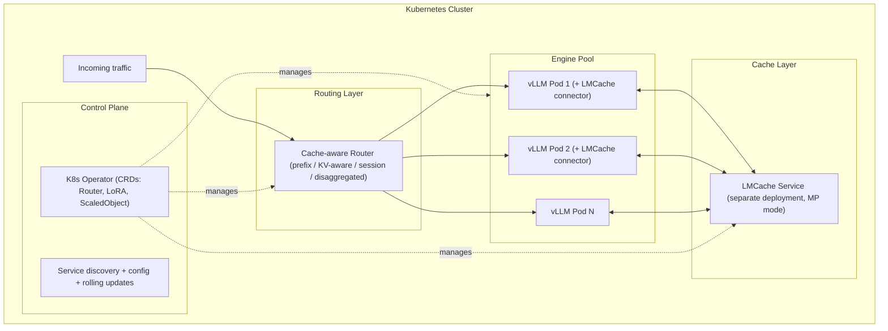

# vLLM + LMCache — Practical Guide
### Kubernetes integration, configuration reference, local testing, production deployment, and troubleshooting

*Practical guide consolidated from all available sources, completed and verified through technical research (official vLLM documentation, LMCache documentation, vLLM Production Stack repository) — July 2026.*

> **This is the practice file.** For theory, architecture, and concepts, see [`vllm+lmcache-theory.md`](vllm+lmcache-theory.md).

---

## Table of Contents

1. [Kubernetes Integration: vLLM Production Stack](#1-kubernetes-integration)
2. [Complete Configuration Reference](#2-configuration-reference)
3. [Practical Guide: Setting Up a Local Test Environment](#3-local-guide)
4. [Practical Guide: Production Kubernetes Deployment](#4-kubernetes-guide)
5. [Troubleshooting](#5-troubleshooting)
6. [Optimal Deployment Checklist](#6-checklist)

---

<a id="1-kubernetes-integration"></a>
## 1. Kubernetes Integration: vLLM Production Stack

### 1.1 Overview

**vLLM Production Stack** is the official, Kubernetes-native reference deployment, natively integrating LMCache. This is not a simple demo example: it is the open-source reference implementation for operating vLLM at full cluster scale, packaged as a **Helm chart + Kubernetes operator (CRDs)**. It is not part of vLLM's core per se, but constitutes a dedicated sub-project for enterprise deployments, maintained jointly with LMCache.

Unlike solutions that run "bare" vLLM (KServe, KubeAI, AIBrix in their basic configuration), the Production Stack is the most advanced official implementation in terms of LMCache-powered KV offloading — one of its most important performance features.



### 1.2 Key Operator Components

- **Router CRD**: custom Kubernetes resource defining routing policy (round-robin, session-based, prefix-aware, KV-aware, disaggregated-prefill).
- **LoRA management via CRD**: LoRA adapters can be declared and managed as first-class Kubernetes resources, dynamically loaded without redeploying the full pod.
- **Kubernetes-native autoscaling**: the number of vLLM replicas adjusts based on real load metrics (queue depth, cache pressure), not just CPU/RAM. The project's 2026 roadmap explicitly plans integration of **KEDA**-driven scaling in the operator CRD.
- **Request migration**: if a vLLM instance dies during processing, the session can be migrated to a new instance with its KV cache intact, thanks to the external persistence provided by LMCache — a direct benefit of the multiprocess connector's "no fate-sharing" mode.
- **Request-rewrite / security**: PII detection before the request reaches the model, security and rate limiting policies configurable at the router level.

### 1.3 How Kubernetes Concretely Orchestrates Cache Sharing

1. **Separate deployment**: LMCache (in MP mode) is deployed as its own Kubernetes service, with its own resources (RAM sized for L1, PVC or network access for L2), independent of the vLLM pod lifecycle.
2. **Service discovery**: each vLLM pod connects to the LMCache service via its internal Kubernetes DNS name, without static IP configuration. In Kubernetes, the LMCache operator can create a **ConfigMap** (`<name>-connection`) containing the server address, mounted by vLLM pods.
3. **Independent scaling**: the number of LMCache replicas (for P2P mode) and the number of vLLM replicas evolve independently according to their respective bottlenecks (cache memory vs GPU compute).
4. **`hostIPC: true`**: when CUDA IPC transport is used between pods (manual DaemonSet deployment without the operator), this parameter is **mandatory** on LMCache and vLLM pods to enable CUDA IPC communication. The LMCache operator handles this automatically when used.

### 1.4 Helm Deployment — Values File

```yaml
servingEngineSpec:
  runtimeClassName: ""
  modelSpec:
    - name: "my-model"
      repository: "lmcache/vllm-openai"     # Docker image with vLLM + LMCache
      tag: "latest"                          # Prefer a versioned tag in production
      modelURL: "meta-llama/Llama-3.1-8B-Instruct"
      replicaCount: 2
      requestCPU: 10
      requestMemory: "40Gi"
      requestGPU: 1
      pvcStorage: "50Gi"
      vllmConfig:
        enableChunkedPrefill: false          # Disabled for LMCache
        enablePrefixCaching: false           # Disabled to avoid conflicts
        maxModelLen: 16384
        v1: 1                                 # Required with lmcache/vllm-openai images
      lmcacheConfig:
        enabled: true
        cpuOffloadingBufferSize: "20"        # L1 cache size in GB
        hf_token: "<YOUR_HF_TOKEN>"

  cacheserverSpec:
    replicaCount: 1
    containerPort: 8080
    servicePort: 81
    repository: "lmcache/vllm-openai"
    tag: "latest"
    resources:
      requests:
        cpu: "4"
        memory: "8G"
      limits:
        cpu: "4"
        memory: "10G"
```

**Deployment:**

```bash
helm repo add vllm https://vllm-project.github.io/production-stack/
helm install vllm vllm/vllm-stack -f my-values.yaml
```

**Verification:**

```bash
kubectl get pods
kubectl logs -f <vllm-pod-name>
# Look for: "Initializing LMCacheConfig under kv_transfer_config"
```

### 1.5 Advanced Configurations

**Local disk offload (L2):**

```yaml
lmcacheConfig:
  enabled: true
  cpuOffloadingBufferSize: "20"
  localDisk:
    enabled: true
    size: "100Gi"
```

**Prefill-Decode disaggregation via Helm:**

```yaml
servingEngineSpec:
  modelSpec:
    - name: "llama-prefill"
      vllmConfig:
        lmcacheConfig:
          kvRole: "kv_producer"
          enablePD: true
    - name: "llama-decode"
      vllmConfig:
        lmcacheConfig:
          kvRole: "kv_consumer"
          enablePD: true
```

### 1.6 Production Tuning Table

| Parameter | Recommendation | Impact |
|---|---|---|
| `lmcacheConfig.cpuOffloadingBufferSize` | Adjust based on available node RAM | Too small = frequent evictions; too large = waste |
| `LMCACHE_CHUNK_SIZE` | 256 tokens (default). 128-256 for highly varied prefixes | Influences cache sharing granularity |
| `vllmConfig.gpuMemoryUtilization` | 0.80 - 0.90 | GPU memory headroom for cache growth |
| `vllmConfig.enablePrefixCaching` | **Disabled** when LMCache is active | Avoids conflicts between the two cache systems |
| `vllmConfig.enableChunkedPrefill` | **Disabled** | Not compatible with LMCache |
| `replicaCount` | Adjusted to load, driven by HPA/KEDA on queue depth metrics (`vllm:num_requests_waiting`) | Horizontal scalability |

### 1.7 Key Production Considerations

1. **`hostIPC: true`** mandatory for CUDA IPC communication in manual deployment (handled automatically by the operator).
2. **Versioned Docker tags** (e.g. `lmcache/vllm-openai:2026-01-XX-vN`) rather than `latest`, to avoid regressions.
3. **Secret management** via `ExternalSecrets` for HF tokens and remote storage credentials.
4. **Careful resource sizing** of CPU/RAM for vLLM workers and the LMCache server.
5. **Canary updates** (`rollingUpdate`) for vLLM workers, natively supported by the Production Stack.

---

<a id="2-configuration-reference"></a>
## 2. Complete Configuration Reference

### 2.1 vLLM Parameters for LMCache

| Parameter | Recommended Value | Reason |
|---|---|---|
| `--enable-prefix-caching` | `false` | Avoids conflicts with LMCache |
| `--enable-chunked-prefill` | `false` | Not compatible with LMCache |
| `--max-model-len` | Per workload | Limits context length |
| `--kv-cache-dtype` | `fp8` or `fp16`, identical across all workers | Consistency essential (see section 12) |
| `--gpu-memory-utilization` | 0.80-0.90 | Headroom for cache growth |
| `--disable-hybrid-kv-cache-manager` | Enabled when needed (hybrid models, or `--kv-offloading-backend` shortcut) | Disables vLLM's internal hybrid cache |

### 2.2 Key LMCache Environment Variables

| Variable | Role | Typical Default |
|---|---|---|
| `LMCACHE_CONFIG_FILE` | Path to a complete YAML configuration file | — |
| `LMCACHE_CHUNK_SIZE` | Cache chunk size (in tokens) | 256 |
| `LMCACHE_ENABLE_BLENDING` | Enables CacheBlend | `False` |
| `LMCACHE_BLEND_SPECIAL_STR` | Separator between chunks for CacheBlend | — |
| `LMCACHE_USE_LAYERWISE` | Layerwise mode (required for blending) | `False` |
| `LMCACHE_BLEND_CHECK_LAYERS` | Blending verification layer | 1 |
| `LMCACHE_BLEND_RECOMPUTE_RATIOS` | Fraction of tokens recomputed in blending | 0.15 |
| `NO_GPU_EXT` | Disables GPU dependencies (useful in CPU-only environments, e.g. Apple Silicon) | — |
| `PYTHONHASHSEED` | Set to `0` to ensure deterministic hashes across processes | — |

### 2.3 `lmcache server` Options (MP Mode)

| Option | Role |
|---|---|
| `--port` | ZMQ port for vLLM communication (default 5555) |
| `--http-port` | HTTP port for health checks and metrics (default 8080) |
| `--l1-size-gb` | L1 cache (RAM) size in GB |
| `--eviction-policy` | Eviction policy (LRU by default) |
| `--chunk-size` | Chunk size (use a small value like 16 only for demo) |

### 2.4 `kv_transfer_config` — Key Fields

| Field | Possible Values | Role |
|---|---|---|
| `kv_connector` | `LMCacheConnectorV1`, `LMCacheConnectorV1Dynamic`, `LMCacheMPConnector` | Connector implementation choice |
| `kv_role` | `kv_both`, `kv_producer` (`kv_sender`), `kv_consumer` (`kv_retriever`) | Instance's role regarding the cache |
| `kv_connector_module_path` | Python module path | Required for dynamic loading |
| `kv_connector_extra_config.lmcache.mp.host` / `.port` | LMCache server address | Required in MP mode with non-local host |
| `kv_connector_extra_config.lmcache.mp.mp_transfer_mode` | `lmcache_driven` (recommended) or `cpu` | Who drives block transfer |

### 2.5 Roles (`kv_role`) — Detailed Table

| Role | Description |
|---|---|
| `kv_both` | The instance can both **store** (send) and **retrieve** cache. Standard mode. |
| `kv_retriever` / `kv_consumer` | The instance only retrieves cache (read-only). Used for decode workers in PD. |
| `kv_sender` / `kv_producer` | The instance only sends cache (write-only). Used for a pure prefill node in PD. |

---

<a id="3-local-guide"></a>
## 3. Practical Guide: Setting Up a Local Test Environment

This guide helps understand the mechanism on a development machine, **even without a GPU** (CPU mode), before a production deployment.

### 3.1 Prerequisites

| Item | Specification |
|---|---|
| System | macOS (Apple Silicon) or Ubuntu |
| Python | ≥ 3.11 (tested with 3.12) |
| cmake | Installed (`brew install cmake` on macOS) |
| Disk space | ~5 GB for sources and model |

### 3.2 Installation

```bash
mkdir -p ~/projects-test && cd ~/projects-test
python3 -m venv .venv-lmcache
source .venv-lmcache/bin/activate
pip install -U pip wheel setuptools

git clone https://github.com/vllm-project/vllm.git
git clone https://github.com/LMCache/LMCache.git
```

**vLLM (CPU version)** — option to compile from source:

```bash
cd ~/projects-test/vllm
pip install uv
VIRTUAL_ENV=~/projects-test/.venv-lmcache \
  uv pip install -r requirements/cpu.txt --index-strategy unsafe-best-match

pip install setuptools_scm setuptools_rust
VIRTUAL_ENV=~/projects-test/.venv-lmcache VLLM_TARGET_DEVICE=cpu \
  uv pip install -e . --no-build-isolation

python -c 'import vllm; print(vllm.__version__); from vllm.distributed.kv_transfer.kv_connector.v1.base import KVConnectorBase_V1; print("v1 OK")'
```

Faster alternative option (pre-compiled wheel):

```bash
bash ~/projects-test/LMCache/.github/scripts/install_vllm_cpu.sh
```

**LMCache** (without GPU dependencies, essential off-CUDA machine):

```bash
cd ~/projects-test/LMCache
NO_GPU_EXT=1 pip install -e .
```

### 3.3 Start the LMCache Server (Terminal A)

```bash
cd ~/projects-test
source .venv-lmcache/bin/activate
lmcache server --port 5555 --http-port 8080 --l1-size-gb 1 --eviction-policy LRU
```

Verification:

```bash
curl http://localhost:8080/healthcheck
```

### 3.4 Start vLLM with LMCache (Terminal B)

```bash
cd ~/projects-test
source .venv-lmcache/bin/activate

# macOS Apple Silicon: avoids OpenMP deadlock
export VLLM_CPU_OMP_THREADS_BIND=nobind
export OMP_NUM_THREADS=1
export KMP_BLOCKTIME=0

export VLLM_DEVICE=cpu
export VLLM_CPU_KVCACHE_SPACE=1
export VLLM_HOST_IP=127.0.0.1
export GLOO_SOCKET_IFNAME=lo0

vllm serve facebook/opt-125m \
  --port 18000 \
  --dtype bfloat16 \
  --disable-hybrid-kv-cache-manager \
  --no-enable-prefix-caching \
  --max-model-len 2048 \
  --max-num-seqs 1 \
  --kv-transfer-config '{
    "kv_connector": "LMCacheMPConnector",
    "kv_role": "kv_both",
    "kv_connector_module_path": "lmcache.integration.vllm.lmcache_mp_connector",
    "kv_connector_extra_config": {
      "lmcache.mp.host": "tcp://localhost",
      "lmcache.mp.port": 5555,
      "lmcache.mp.mp_transfer_mode": "lmcache_driven"
    }
  }'
```

### 3.5 Test the Cache

**First request (populates the cache)**:

```bash
curl http://localhost:18000/v1/completions \
  -H "Content-Type: application/json" \
  -d '{"model": "facebook/opt-125m", "prompt": "The future of artificial intelligence is", "max_tokens": 50}'
```

This request computes the KV cache for the prefix, stores it in LMCache (L1), then generates the response. Note the TTFT.

**Second identical request (reuses the cache)**:

```bash
curl http://localhost:18000/v1/completions \
  -H "Content-Type: application/json" \
  -d '{"model": "facebook/opt-125m", "prompt": "The future of artificial intelligence is", "max_tokens": 50}'
```

vLLM queries LMCache, which finds the cache in L1 and returns it; the prefill phase is completely skipped; generation starts immediately. The TTFT should be noticeably lower (up to 67% reduction on this example).

**Metrics verification:**

```bash
curl http://localhost:8080/healthcheck
curl http://localhost:8080/metrics
```

### 3.6 Integrated Benchmark

```bash
lmcache bench server \
  --rpc-url tcp://127.0.0.1:5555 \
  --url http://127.0.0.1:8080 \
  --mode cpu \
  --transfer-mode lmcache_driven \
  --num-tokens 512 \
  --end 3
```

A success displays `CHECKSUM MATCH OK` × 3.

### 3.7 Docker Version for GPU (Optional)

```bash
git clone https://github.com/LMCache/LMCache-Examples.git
cd LMCache-Examples/demo-rag-blending
export HF_TOKEN="your_token"
./run-server-blend.sh
```

This demo launches two vLLM instances side by side: one with LMCache + CacheBlend, one without LMCache, with a Streamlit interface to compare performance in real time.

---

<a id="4-kubernetes-guide"></a>
## 4. Practical Guide: Production Kubernetes Deployment

See section 13 for the architecture and detailed `values.yaml` files. Summary of essential commands:

| Action | Command / File |
|---|---|
| **Deploy the stack** | `helm install vllm vllm/vllm-stack -f my-values.yaml` |
| **Basic LMCache config** | `lmcacheConfig.enabled: true` and `cpuOffloadingBufferSize: "20"` |
| **Remote cache config** | `cacheserverSpec` section in `values.yaml` |
| **Verification logs** | `kubectl logs -f <vllm-pod>` (search for `LMCacheConfig`) |
| **Metrics endpoint** | `/metrics` endpoint on vLLM pods |
| **KServe alternative** | Dedicated manifests for HuggingFace vLLM backend with LMCache mounted as config volume (support added via KServe PR #4320) |

---

<a id="5-troubleshooting"></a>
## 5. Troubleshooting

| Problem | Cause | Solution |
|---|---|---|
| `cudaErrorMapBufferObjectFailed` | Missing `hostIPC: true` in Kubernetes | Add `hostIPC: true` on LMCache and vLLM pods |
| vLLM crashes on startup on macOS | OpenMP deadlock | `export VLLM_CPU_OMP_THREADS_BIND=nobind`, `OMP_NUM_THREADS=1`, `KMP_BLOCKTIME=0` |
| Insufficient memory | Overly generous allocations | Reduce `VLLM_CPU_KVCACHE_SPACE`, `--l1-size-gb`, `--max-model-len`, `--max-num-seqs` |
| `RuntimeError: Cannot re-initialize CUDA in forked subprocess` | Multiprocessing method incompatible with CUDA | `export VLLM_WORKER_MULTIPROC_METHOD=spawn` |
| Cache never reused, no visible error | `--kv-cache-dtype` inconsistency between workers | Strictly align KV dtype across all cluster workers |
| Inconsistent results / unexplained hallucinations | Misalignment between `vllm_cached_tokens` and `chunk_size`, or APC/LMCache race condition | Verify block size alignment, update to latest coherence fixes |
| Cache hit rate dilution at scale | Absence of KV-aware routing | Enable KV-aware or prefix-aware routing in the Production Stack router |
| Total service outage if LMCache goes down | Absence of circuit breaker | Use `SafeLMCacheConnectorV1` |

---

<a id="6-checklist"></a>
## 6. Optimal Deployment Checklist

- [ ] Connector choice (in-process vs multiprocess) aligned with actual cluster topology
- [ ] `--kv-cache-dtype` strictly identical across all workers
- [ ] L1 (RAM) sizing based on actual working set of hot contexts
- [ ] L2/L3 backend chosen per need (Redis/Mooncake for speed, S3 for persistence and cost)
- [ ] CacheBlend enabled and calibrated (`LMCACHE_BLEND_RECOMPUTE_RATIOS`) if workload is RAG-type with reordered chunks
- [ ] Prefill/decode disaggregation considered if load ratio justifies it
- [ ] `SafeLMCacheConnectorV1` enabled for fault tolerance
- [ ] Deployment via vLLM Production Stack operator rather than manual deployment
- [ ] KV-aware routing enabled beyond a handful of replicas
- [ ] Request migration configured to tolerate instance crashes
- [ ] `hostIPC: true` configured if CUDA IPC is used between pods (handled automatically by operator)
- [ ] Tracking of per-token hit rate, per storage level, and overall HBM pressure
- [ ] Net benefit validation via A/B test before/after LMCache activation on real workload (gain is significant only if GPU memory pressure is real — rule of thumb: ≥ 50% of tokens in shared prefixes)
- [ ] Versioned Docker tags (not `latest`) in production

---

