# vLLM + LMCache — The Complete Reference Document
### Communication, information flow, cache sharing, behavior across all generation scenarios, and Kubernetes integration


---

## Table of Contents

1. [Overview: Why Combine vLLM and LMCache](#1-overview)
2. [The Technical Foundation: vLLM's Connector API (KVConnectorV1)](#2-technical-foundation)
3. [Integration Modes: In-Process vs Multiprocess](#3-integration-modes)
4. [Communication in Depth: The Two Channels](#4-communication-in-depth)
5. [The Complete Request Lifecycle](#5-request-lifecycle)
6. [Behavior Across All Generation Scenarios](#6-all-scenarios)
7. [Chunking and Content-Addressing](#7-chunking-and-addressing)
8. [The Cache Hierarchy (L0 to L3)](#8-cache-hierarchy)
9. [CacheBlend: Non-Prefix Reuse](#9-cacheblend)
10. [Prefill/Decode Disaggregation (PD)](#10-pd-disaggregation)
11. [Fault Tolerance and Resilience](#11-fault-tolerance)
12. [Cache Coherence: The Critical Watchpoint](#12-cache-coherence)
13. [Kubernetes Integration: vLLM Production Stack](#13-kubernetes-integration)
14. [Cache-Aware Routing (KV-aware routing)](#14-cache-aware-routing)
15. [Observability and Metrics](#15-observability-and-metrics)
16. [Complete Configuration Reference](#16-configuration-reference)
17. [Practical Guide: Setting Up a Local Test Environment](#17-local-guide)
18. [Practical Guide: Production Kubernetes Deployment](#18-kubernetes-guide)
19. [Troubleshooting](#19-troubleshooting)
20. [Optimal Deployment Checklist](#20-checklist)
21. [Technical Glossary](#21-glossary)
22. [Sources](#22-sources)

---

<a id="1-overview"></a>
## 1. Overview: Why Combine vLLM and LMCache

**vLLM** manages the KV (Key-Value) cache in a single instance's GPU memory, using its **PagedAttention** engine. This cache is fast, but it forms a **silo**: if the instance restarts, it is lost; if an equivalent request arrives on another replica, it does not benefit from the work already done elsewhere; and its capacity is strictly bounded by available VRAM.

**LMCache** is a cache management layer independent of the inference engine. Its function is to transform the KV cache — normally a volatile, process-local state — into a **persistent, shareable, content-addressable resource** across an entire cluster: CPU RAM, local disk, object storage (S3), or distributed key-value stores (Redis/Valkey, Mooncake).

By combining the two systems, the KV cache ceases to belong to a single vLLM instance: it becomes a shared resource that any instance in the cluster can query, feed, or recover, regardless of who originally produced it.

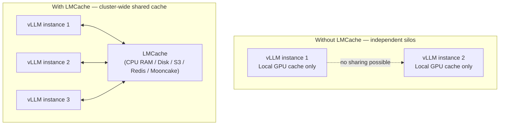

### 1.1 The Concrete Benefit

The central mechanism exploited is as follows: when a prompt prefix (or a text chunk, with CacheBlend) has already been computed once anywhere in the cluster, any subsequent request containing the same content can **skip the prefill phase entirely** for that portion — the most computationally expensive part of inference, with quadratic complexity in context length. The gain is measured primarily on **TTFT** (Time To First Token), with commonly observed reductions of 3x to 10x on RAG-type or multi-turn conversation workloads, and up to -70% latency on favorable cases.

An important point of discipline: **LMCache is not systematically beneficial**. The generally accepted rule of thumb is to enable LMCache when **50% or more of request tokens correspond to shared prefixes**. Under low GPU memory pressure (when the KV cache fits comfortably in VRAM), the additional layer can instead represent a net cost of a few percent without compensating benefit — hence the importance of A/B testing before enabling in production.

### 1.2 A Now Mature Project

LMCache reached **production** status in January 2026 and is used, among others, by Google Cloud GKE Inference, CoreWeave, and Cohere. In parallel, vLLM **0.11.0** (January 2026) introduced a native **asynchronous offload path** in the Connector API, making cache offload to an external connector non-blocking in the common case.

---

<a id="2-technical-foundation"></a>
## 2. The Technical Foundation: vLLM's Connector API (KVConnectorV1)

Communication between vLLM and LMCache **does not rely on a hack or ad hoc integration**: it builds on an official vLLM API, the **Connector API** (`KVConnectorV1`), introduced starting from vLLM version 0.9.0.

### 2.1 The Connector Principle

The Connector is a **pluggable interface** inserted between vLLM's execution engine (scheduler + GPU workers) and any KV cache storage backend. vLLM does not know LMCache's internal details: it only knows the interface contract, whose key methods include:

- **`get_num_new_matched_tokens`**: queries the connector to determine how many additional tokens (beyond what vLLM has already computed locally) can be loaded from the external cache.
- **`update_state_after_alloc`**: updates the connector state once GPU blocks have been allocated to receive external data.
- **`start_load_kv`** / **`wait_for_layer_load`**: trigger the actual KV cache loading and allow fine-grained, layer-by-layer synchronization, useful for pipelining.
- **`save_kv_layer`** / **`wait_for_save`**: trigger asynchronous saving of a newly computed KV block to the external backend, and ensure this save is complete before the paged buffer is reused.
- **`request_finished`**: notifies the connector that a request is finished, before releasing its blocks.

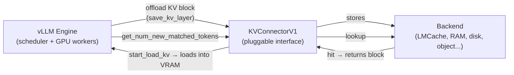

This abstraction is what allows LMCache to integrate **without modifying vLLM's core**: LMCache is just one possible Connector implementation, alongside other KV backends (raw RAM, NIXL, etc.). An important technical detail: LMCache requires **CUDA graph PIECEWISE** mode whenever layerwise operations are enabled, because `wait_for_layer_load` and `save_kv_layer` perform real asynchronous synchronization that cannot be captured in a full CUDA graph.

### 2.2 History of Official Integration

| Date | Milestone |
|---|---|
| **Early February 2025** | Official integration of LMCache into the upstream vLLM repository (before this, LMCache required a vLLM fork). |
| **vLLM 0.9.0** | Formal introduction of Connector API v1 (`KVConnectorV1`). |
| **June 2025** | Support for **dynamic** connector loading: vLLM can load a connector directly from a Python module path (`kv_connector_module_path`), without the connector code being frozen in vLLM itself. |
| **vLLM 0.11.0 (January 2026)** | Introduction of a native **asynchronous** offload path: offloading a block to the connector can happen in the background without blocking the engine. |
| **January 2026** | LMCache reaches *production-ready* status, adopted by several major cloud providers. |

### 2.3 The Two Concrete LMCache Connector Implementations

| Connector | Mode | Use Case |
|---|---|---|
| **`LMCacheConnectorV1`** | In-process | LMCache runs **in the same process** as vLLM, configured via environment variables or YAML file (`LMCACHE_CONFIG_FILE`). |
| **`LMCacheMPConnector`** | Multiprocess (MP) | LMCache runs as an **independent daemon** (`lmcache server`), to which one or more vLLM instances connect. **Recommended mode** for production. |

vLLM imports the connector directly from the `lmcache` package (`from lmcache.integration.vllm.vllm_v1_adapter import LMCacheConnectorV1Impl`), meaning any connector update on the LMCache side must remain synchronized with the vLLM version used — a compatibility watchpoint for production.

---

<a id="3-integration-modes"></a>
## 3. Integration Modes: In-Process vs Multiprocess

### 3.1 In-Process Mode — `LMCacheConnectorV1`

LMCache executes **within the vLLM process itself**. This is the simplest mode to set up: ideal for CPU/disk offload on a single node, without inter-instance sharing.

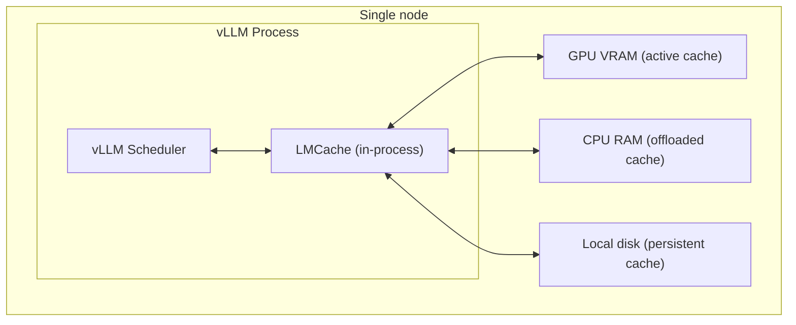

**Typical startup**:

```bash
LMCACHE_CHUNK_SIZE=256 \
vllm serve Qwen/Qwen3-8B \
  --port 8000 \
  --kv-transfer-config \
  '{"kv_connector":"LMCacheConnectorV1", "kv_role":"kv_both"}'
```

A shortcut was also introduced directly in vLLM for this simple use case, without manually constructing the `kv-transfer-config` JSON:

```bash
vllm serve <MODEL_NAME> \
  --kv-offloading-backend lmcache \
  --kv-offloading-size <SIZE_IN_GB> \
  --disable-hybrid-kv-cache-manager
```

**Limitation**: the cache remains **local to the node**. If the vLLM process terminates, or if another instance on a different node needs the same cache, there is no automatic sharing — unless this mode is combined with a remote backend (S3, Redis) that LMCache queries internally.

### 3.2 Multiprocess Mode — `LMCacheMPConnector` (Recommended)

This is the recommended mode for **distributed KV storage** and **cache sharing across multiple vLLM instances**. LMCache runs as an **autonomous server process**, with which one or more vLLM instances communicate via a dedicated RPC/ZMQ channel.

**Key architectural advantage: lifecycle independence ("no fate-sharing")**. The KV cache managed by the LMCache server **survives an inference engine crash**, because it shares neither the same process nor the same memory space as vLLM.

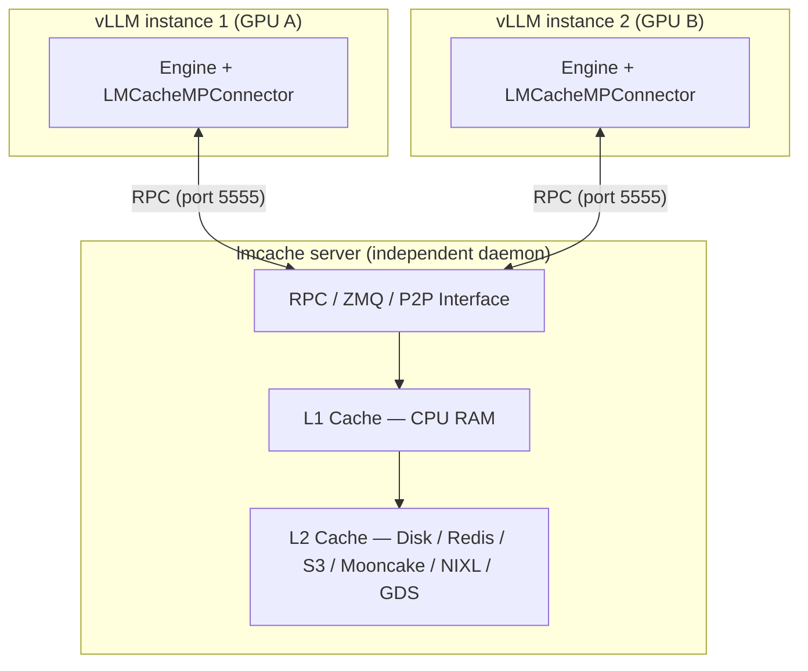

**Starting the LMCache server** (dedicated terminal):

```bash
lmcache server \
  --port 5555 \
  --http-port 8080 \
  --l1-size-gb 20 \
  --eviction-policy LRU
```

- Port **5555** (ZMQ): control channel, listens for incoming vLLM connections.
- Port **8080** (HTTP): health checks, Prometheus metrics, management endpoints.

**Starting vLLM connected to the server**:

```bash
vllm serve Qwen/Qwen3-8B \
  --port 8000 \
  --kv-transfer-config \
  '{"kv_connector":"LMCacheMPConnector", "kv_role":"kv_both"}'
```

For a custom host/port (the connector connects to `localhost:5555` by default), the extended configuration is:

```json
{
  "kv_connector": "LMCacheMPConnector",
  "kv_role": "kv_both",
  "kv_connector_module_path": "lmcache.integration.vllm.lmcache_mp_connector",
  "kv_connector_extra_config": {
    "lmcache.mp.host": "tcp://<HOST>",
    "lmcache.mp.port": 5555,
    "lmcache.mp.mp_transfer_mode": "lmcache_driven"
  }
}
```

### 3.3 The P2P (Peer-to-Peer) Mechanism

A notable evolution of the multiprocess mode is **full P2P support**, which enables **direct** KV cache search and transfer between LMCache instances, without necessarily transiting through a single central server. This relies on:

- A dedicated **P2P adapter** that manages peer discovery.
- A **transfer channel abstraction** that unifies transport regardless of the physical medium.
- A dedicated RPC interface for **lookup** and **locking** of blocks in P2P mode, avoiding concurrent access conflicts on the same block.

### 3.4 Dynamic Connector — `LMCacheConnectorV1Dynamic`

Since June 2025, vLLM can dynamically load a connector implementation directly from the installed LMCache package (without going through a version frozen in vLLM code):

```bash
vllm serve "YOUR_MODEL" \
  --kv-transfer-config \
  '{"kv_connector":"LMCacheConnectorV1Dynamic","kv_role":"kv_both","kv_connector_module_path":"lmcache.integration.vllm.lmcache_connector_v1"}'
```

**Advantage**: LMCache can be updated independently of vLLM, without waiting for a new vLLM release integrating the latest connector.

### 3.5 Summary Table of the Three Connectors

| Connector | Topology | Crash Resilience | Primary Use Case |
|---|---|---|---|
| `LMCacheConnectorV1` | In-process | Cache lost if vLLM crashes | Local experimentation, simple CPU/disk offload, single node |
| `LMCacheConnectorV1Dynamic` | In-process, dynamic loading | Same | Same usage, with update cycle decoupled from vLLM |
| `LMCacheMPConnector` | Multiprocess (separate daemon) | Cache **survives** vLLM crash | Production, multi-instance sharing, Kubernetes |

---

<a id="4-communication-in-depth"></a>
## 4. Communication in Depth: The Two Channels

Communication between vLLM and LMCache is split into **two distinct channels**, for performance and decoupling reasons.

| Channel | Protocol | Role | Volume | Latency |
|---|---|---|---|---|
| **Control channel** (metadata) | **ZMQ** (ZeroMQ) | Negotiate, plan, exchange descriptors and commands | Very small (a few hundred bytes) | < 1 ms |
| **Data channel** | **CUDA IPC**, **POSIX SHM**, **TCP**, **NIXL/UCX**, **GDS** depending on topology | Transfer the KV cache blocks themselves | High (can reach several GB for long contexts) | Depends on physical bandwidth (PCIe, NVLink, RDMA, network) |

### 4.1 The Control Channel (ZMQ) — the "Brain" of the Operation

**What it concretely transports:**
- The **command type**: `retrieve`, `store`, `lookup`, `delete`.
- The **prefix hash** (or chunk hash): unique cache identifier, computed via a deterministic algorithm (`PYTHONHASHSEED=0` ensures consistency across processes).
- The **prefix length** concerned.
- **Tensor metadata**: shape (`[num_layers, num_heads, seq_len, head_dim]`), dtype (`float16`, `bfloat16`, `int8`, `fp8`).
- The **IPC handle** (for CUDA) or shared memory descriptor (for SHM).
- The **offset and size** of blocks, to precisely locate data.
- The **response status**: success, failure, partial.

### 4.2 The Data Channel — Zero-Copy Transfer

**What it transports:** the arrays of numbers representing keys (K) and values (V) for each layer and each attention head — potentially several hundred megabytes, even several gigabytes for long contexts.

**Mechanism (GPU case, CUDA IPC):**
1. The LMCache server exposes a buffer containing the KV cache.
2. It sends an IPC handle (`cudaIpcMemHandle_t`) to vLLM via ZMQ.
3. vLLM calls `cudaIpcOpenMemHandle` to "open" this handle: it obtains a direct pointer to the LMCache server's memory.
4. vLLM reads (or writes, in case of store) data directly, without intermediate CPU-side copy.

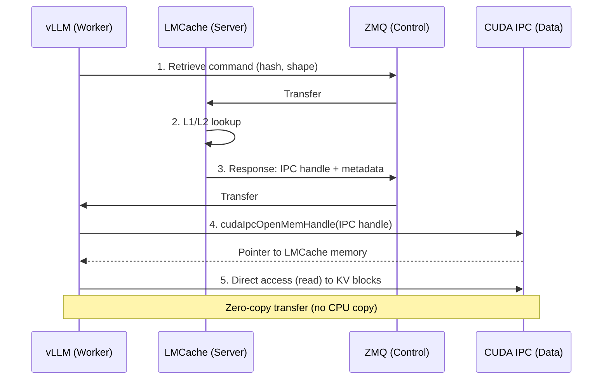

### 4.3 Complete Table of Transport Mechanisms

Depending on the actual physical topology between the two communication endpoints, a different transport mechanism is selected:

| Mechanism | Usage Context | Principle |
|---|---|---|
| **CUDA IPC** (`cuda_ipc`) | GPU to GPU, same node | Direct sharing of CUDA memory handles between processes, without going through CPU |
| **CUDA copy** (`cuda_copy`) | GPU to/from CPU, same node | Explicit copy via CUDA API; slower than IPC but universal |
| **POSIX SHM** | CPU to/from CPU, same node | Classic shared memory, used when no GPU is involved |
| **TCP** | Inter-node, standard network | Generic fallback, highest latency |
| **NIXL** | High-performance KV transfers, inter-node | Transport library dedicated to inference, supports RDMA |
| **UCX** (Unified Communication X) | Transport layer underlying NIXL | Automatically selects the best available physical medium |
| **GDS** (GPUDirect Storage) | GPU to/from NVMe storage | Direct GPU-to-disk transfer, without detour through CPU RAM |

In practice, a disaggregated deployment configuration explicitly declares available transports, e.g. `UCX_TLS=cuda_ipc,cuda_copy,tcp`, letting UCX dynamically choose the fastest path based on actual hardware topology.

### 4.4 Software Transfer Modes

| Mode | Description | Use Case |
|---|---|---|
| **EngineDrivenTransferContext** | vLLM gathers blocks and sends the full payload to the LMCache server | Simplicity, debugging |
| **LMCacheDrivenTransferContext** (`lmcache_driven`) | The LMCache server directly accesses the worker's memory | Optimal performance (recommended in production) |

### 4.5 Why Separate the Two Channels?

1. **Performance** — Metadata is small and changes with every request; routing it through CUDA IPC would be wasteful and complicate handle management.
2. **Flexibility** — The ZMQ channel allows negotiating the transfer (choosing mode, handling errors, timeouts) without blocking the data channel.
3. **Decoupling** — The data protocol (CUDA IPC, SHM, RDMA) can change without touching the control logic.
4. **Maintenance simplicity** — Control logic (state, lookup, eviction) remains separate from raw transfer, facilitating debugging.

### 4.6 Typical KV Cache Volume

For a model with `L` layers, `H` attention heads, `S` context tokens, and `D` head dimension, the total KV cache size is:

```
Size = 2 (K and V) × L × H × S × D × (dtype size in bytes)
```

Example for a LLaMA 3 8B-type model (L=32, H=32, D=128) in FP16 (2 bytes), with a 4096-token context:

```
Size ≈ 2 × 32 × 32 × 4096 × 128 × 2 ≈ 2.1 GB (for a single request)
```

Blocks are split into fixed-size chunks (default 256 tokens) to facilitate transfer and eviction — see section 7.

---

<a id="5-request-lifecycle"></a>
## 5. The Complete Request Lifecycle

### 5.1 Overview in 4 Phases

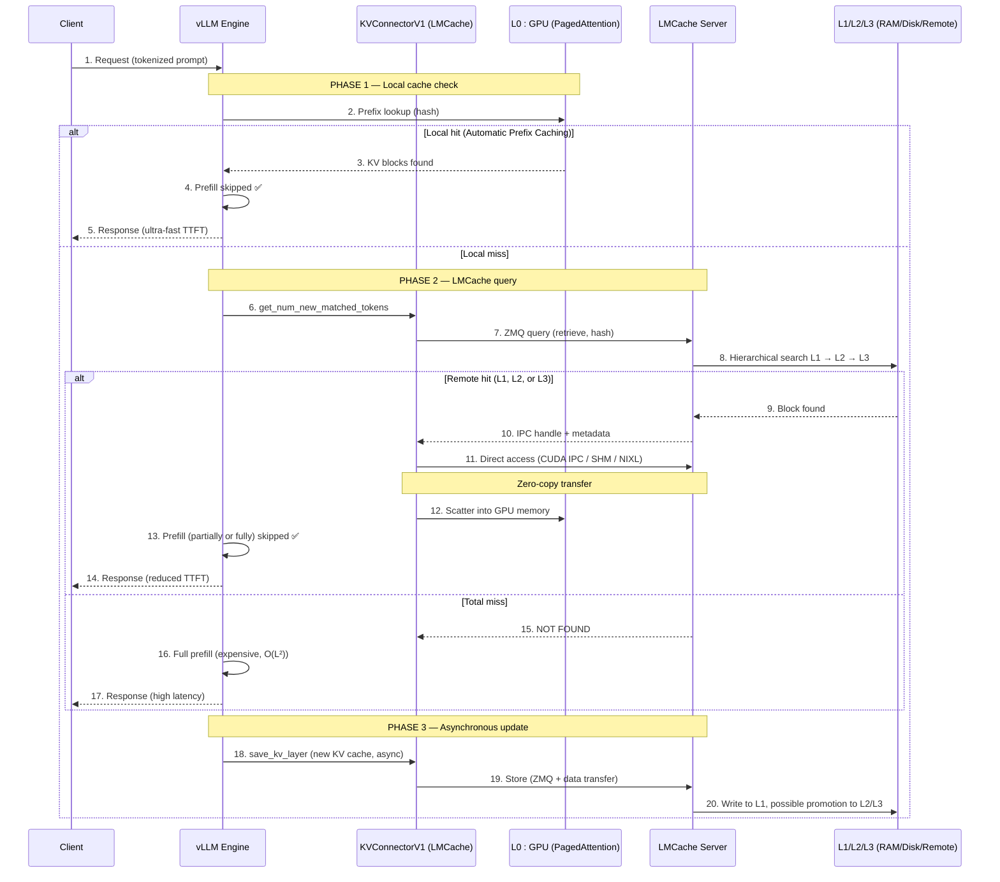

### 5.2 Step Details

**Phase 1 — Local cache check (L0, GPU).** vLLM uses its PagedAttention engine to check if the prompt prefix is already present in its local GPU cache, via **Automatic Prefix Caching (APC)**. On a hit, prefill is skipped immediately — this is the fastest path, with no network communication.

**Phase 2 — Connector query (local miss).** On a miss, vLLM calls `get_num_new_matched_tokens` on the LMCache connector. The connector builds a retrieval request containing the prefix hash, its length, and the expected tensor metadata, then sends it via ZMQ to the LMCache server.

**LMCache-side search.** The server queries its cache levels in order L1 (CPU RAM) → L2 (disk/Redis) → L3 (remote storage/S3). If a matching cache is found, LMCache prepares an IPC handle (or the network equivalent via NIXL) pointing to the memory area where the cache is stored, and returns it to vLLM via ZMQ.

**Transfer and scatter.** vLLM opens the IPC handle and accesses the buffer directly, without copy. The connector then **scatters** the data from this buffer to the corresponding paged GPU blocks, respecting memory alignment to optimize access.

**Generation.** With the prefix KV cache loaded into GPU memory, vLLM skips the expensive prefill phase and proceeds directly to autoregressive generation of new tokens.

**Phase 3 — Asynchronous update.** Once generation is complete (or in parallel, depending on the vLLM 0.11.0+ async offload path), vLLM sends the new KV cache to the LMCache server via `save_kv_layer`, in a **non-blocking** fashion: **the response is sent to the client before the cache update is complete**. The LMCache server then stores the data in L1, with possible promotion to L2/L3 according to its eviction policy (LRU by default).

### 5.3 Real Log Example (Illustrating Observable Behavior)

On a first unprecedented request (total miss), the server logs a complete store:

```
LMCache INFO: Storing KV cache for 31 out of 31 tokens for request cmpl-274bcaa8...
```

On a second request sharing a prefix with the first, the partial hit is logged precisely (number of tokens retrieved from cache vs number of tokens to recompute):

```
Reqid: cmpl-4ddf8863..., Total tokens 32, LMCache hit tokens: 24, need to load: 8
LMCache INFO: Retrieved 8 out of 24 required tokens (from 32 total tokens)...
LMCache INFO: Storing KV cache for 8 out of 32 tokens (skip_leading_tokens=24)
```

This level of logging is the most direct way to verify, under real conditions, that cache reuse works as expected.

---

<a id="6-all-scenarios"></a>
## 6. Behavior Across All Generation Scenarios

### 6.1 Case 1 — Total Cache Hit (Fully Known Prefix)

The complete prompt prefix is found (in L0, or in L1/L2/L3 via LMCache). Prefill is entirely skipped; only autoregressive generation of new tokens executes. This is the most favorable case: minimal TTFT, minimal GPU consumption for the input phase.

### 6.2 Case 2 — Partial Cache Hit (Shared Prefix Up to a Point)

Concrete example: request A computes and stores the cache for "France is a European country."; request B, "France is a European country. What is its currency?", reuses the common prefix cache (local or remote hit) and only pre-fills the new portion ("What is its currency?"). This case is **extremely common** in practice (shared system prompts, conversation history, fixed RAG templates) and constitutes the main gain lever of LMCache.

### 6.3 Case 3 — Total Cache Miss ("Cold Start")

When a request exists in **none** of the cache levels (neither L0, L1, L2, nor L3), the system executes the full path:

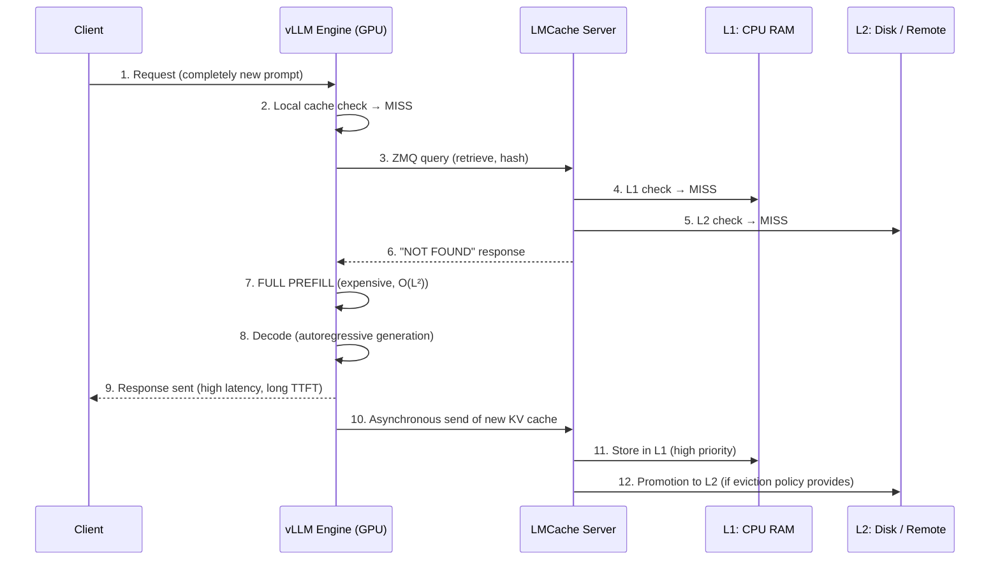

**Measurable consequences of total miss:**

| Aspect | Impact |
|---|---|
| **Latency (TTFT)** | High — full prefill on the entire prompt, potentially several seconds or even tens of seconds for very long contexts |
| **GPU consumption** | Maximum — prefill attention is O(L²), intensively soliciting Tensor Cores |
| **GPU memory** | Peak consumption throughout generation |
| **User experience** | Degraded for this first occurrence only |

The system is **self-learning**: an expensive request once becomes nearly free for all subsequent occurrences of the same prefix. The "cold start" only affects the first occurrence, which is an excellent trade-off as long as prefixes repeat (RAG, assistants, multi-turn conversations).

### 6.4 Case 4 — Concurrent Requests During Cache Population

If a second client sends an identical request **while** the first is still generating, or just after generation ends but before complete L1 indexing:

- **During the first's generation**: the cache is not yet available; the second also experiences a total cache miss and must recompute prefill.
- **Just after generation, before L1 write completion**: very short risk window (on the order of microseconds) where a miss remains possible, while the LMCache server indexes the new cache.

The LMCache server handles writes atomically: as soon as a block is written to L1, it is immediately available for subsequent requests via an updated index.

### 6.5 Case 5 — Non-Prefix Reuse (Reordered Chunks, RAG)

Standard prefix caching fails as soon as chunk order changes (typical RAG case: dynamically retrieved document passages vary from one request to another). **CacheBlend** (see section 9) enables reusing each chunk's cache independently of its position, with selective recomputation of a fraction of tokens (typically 15%) to correct deviations introduced by the new context (positional encoding, cross-attention with neighbors).

### 6.6 Case 6 — LMCache Server Failure During Generation

The `SafeLMCacheConnectorV1` mechanism acts as a **circuit breaker**: after a configurable number of consecutive failures (e.g. 3), vLLM stops querying LMCache and automatically falls back to its native cache (GPU only). The service continues operating in degraded mode, without total outage. See section 11 for full details.

### 6.7 Case 7 — Prefill/Decode Disaggregation: Cache Not Immediately Consumed

In a disaggregated architecture, if the KV cache transferred from the prefill pool to the decode pool is not immediately consumed (load, queues), it **lands in LMCache** instead of being lost. Subsequent requests needing the same cache can recover it directly from LMCache, without requesting a new prefill. See section 10.

### 6.8 Case 8 — Dtype Inconsistency Between Workers

If workers in the same cluster use different KV dtypes (e.g. some in FP8, others in FP16), blocks serialized by LMCache no longer match: this results in **silent cache misses** — the system does not crash, but never benefits from the shared cache. This is a common production pitfall, detailed in section 12.

### 6.9 Behavior Summary Table

| Scenario | Behavior | TTFT | Cache state after |
|---|---|---|---|
| Total hit (L0 or remote) | Prefill entirely skipped | Minimal | Unchanged (already warm) |
| Partial hit | Partial prefill (new tokens only) | Reduced | Extended with new portion |
| Total miss (cold start) | Full prefill + decode | High | Created and stored in L1/L2 |
| Concurrent requests on new prefix | Each request recomputes (except very short indexing window) | High for all | Only one final cache stored |
| Reordered RAG chunks (CacheBlend active) | Raw cache reused + ~15% recomputed | Strongly reduced (up to 3-4.5x) | Individual chunks reusable in any order |
| LMCache server failure | Automatic fallback to native GPU cache | Degraded but stable | LMCache rebuilt on reconnection |
| PD with unconsumed cache | Captured by LMCache instead of being lost | Deferred benefit for subsequent requests | Available for later reuse |
| Dtype inconsistency between workers | Silent cache miss (no visible error) | Degraded without explicit alert message | Cache never actually shared |

---

<a id="7-chunking-and-addressing"></a>
## 7. Chunking and Content-Addressing

### 7.1 Chunk Splitting

LMCache systematically splits text (and thus its associated KV cache) into **fixed-size chunks**, controlled by `LMCACHE_CHUNK_SIZE` (256 tokens by default in production; smaller values like 8 or 16 are useful in demonstrations to make cache traffic visible on short prompts). Each chunk becomes the atomic unit of storage, lookup, and sharing.

This chunk size **deliberately aligns** with the memory allocation unit already used by PagedAttention on the vLLM side, avoiding costly re-segmentation at each transfer.

### 7.2 Content-Addressing

Each chunk is identified by a **hash of its content** (the tokens it represents, potentially combined with its preceding context for non-initial chunks). This hash serves as the **universal lookup key**: two different requests, on different instances, containing the same text chunk, will generate the same hash and can therefore share the same stored KV block — without ever comparing raw texts token by token.

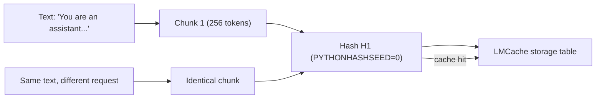

### 7.3 Beyond Prefix: "Anywhere" Reuse

Fundamental difference from vLLM's native prefix caching (which requires exact match from the **beginning** of the sequence): LMCache can reuse a chunk's cache **regardless of its position** in the final prompt, as long as its content — and thus its hash — matches a chunk already computed elsewhere. This mechanism is what makes CacheBlend possible (section 9).

---

<a id="8-cache-hierarchy"></a>
## 8. The Cache Hierarchy (L0 to L3)

The cache between vLLM and LMCache does not work as two isolated systems, but as a **single hierarchical cache system** where each level has a specific role.

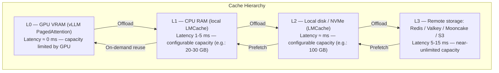

### 8.1 The Four Levels

| Level | Location | Manager | Typical Latency | Role |
|---|---|---|---|---|
| **L0** | GPU VRAM | vLLM (PagedAttention) | ≈ 0 ms | Active cache, fastest, most constrained capacity |
| **L1** | CPU RAM | LMCache | 1-5 ms | "Hot" cache for recently used prefixes |
| **L2** | Local disk (NVMe) | LMCache | ≈ ms | Long documents, less frequent prefixes, GPUDirect Storage possible |
| **L3** | Redis / Valkey / Mooncake / S3 | LMCache | 5-15 ms | Shared cache between pods/nodes and persistent, near-unlimited capacity |

### 8.2 Available L2/L3 Backends

| Backend | Level | Characteristic |
|---|---|---|
| **CPU RAM** | L1 | Fastest after VRAM |
| **Local disk (SSD/NVMe)** | L2 | Higher capacity, ideal with GDS |
| **Redis / Valkey** | L2 distributed | Fast inter-node sharing (5-15 ms) |
| **Mooncake** | L2 high-performance distributed | RDMA-optimized for inter-node transfers |
| **InfiniStore** | L2 distributed | KV storage backend dedicated to inference |
| **S3 (or compatible)** | L2/L3 persistent | Near-unlimited capacity, highest latency, lowest cost |
| **NIXL** | Transport + storage | High-performance KV transfer library, native RDMA |
| **GDS** | GPU-to-disk transport | Direct access without detour through CPU RAM |

### 8.3 Search Order and Priority Rules

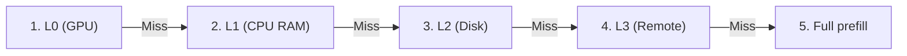

| Rule | Description |
|---|---|
| L0 cache hit | Always highest priority (fastest) |
| L1 cache hit | Second priority (1-5 ms) |
| L2/L3 cache hit | Last priority (slower, but persistent and shared) |
| Eviction | LMCache uses an **LRU** (Least Recently Used) policy by default to manage L1/L2 space |

### 8.4 Choosing an L2/L3 Backend

The choice depends on the deployment context: **Redis/Valkey/Mooncake** for fast intra-cluster sharing; **S3** for long-term persistence at very large scale and low cost; **Mooncake/NIXL** when inter-node RDMA bandwidth is available and critical for performance.

---

<a id="9-cacheblend"></a>
## 9. CacheBlend: Non-Prefix Reuse

This is the most significant innovation in the vLLM + LMCache ecosystem for RAG use cases.

### 9.1 The Problem Solved

In a classic RAG scenario, a final prompt is constructed by concatenating several dynamically retrieved document passages, in an **order that varies with each request**, preceded by a common system prompt. Standard prefix caching can only reuse what is strictly identical **from the very beginning** of the sequence: if the same passages appear but in a different order (very common in RAG, depending on vector search results), prefix caching almost systematically fails from the second chunk — the cache hit rate collapses.

### 9.2 The Principle

The KV cache of a chunk computed in isolation is **not mathematically identical** to the same chunk computed in the context of different text, due to positional encoding and cross-attention with neighboring chunks. CacheBlend solves this problem in two steps:

1. **Raw reuse** of pre-computed KV blocks for each chunk, independently of their order — near-total cache hit (close to 100%) instead of the very low rate obtained with prefix caching alone.
2. **Selective recomputation** of a fraction of tokens (parameter `LMCACHE_BLEND_RECOMPUTE_RATIOS`, typically 0.15, i.e. 15%) to correct deviations introduced by the new context.

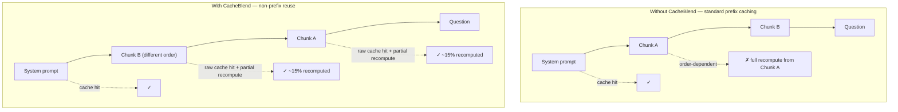

### 9.3 Configuration

```python
os.environ["LMCACHE_ENABLE_BLENDING"] = "True"
os.environ["LMCACHE_BLEND_SPECIAL_STR"] = " # # "        # Separator between chunks
os.environ["LMCACHE_USE_LAYERWISE"] = "True"              # Required for blending
os.environ["LMCACHE_BLEND_CHECK_LAYERS"] = "1"             # Verification layer
os.environ["LMCACHE_BLEND_RECOMPUTE_RATIOS"] = "0.15"      # 15% of tokens recomputed
```

**Associated technical mechanisms:**
- **Chunk separator** (`LMCACHE_BLEND_SPECIAL_STR`): precisely identifies where each independent chunk begins and ends in the final sequence.
- **Mandatory "layerwise" mode**: blending must be activated layer by layer, since the decision of which tokens to recompute can depend on the activation observed at a specific layer.
- **Verification layer** (`LMCACHE_BLEND_CHECK_LAYERS`): determines at which model layer the system evaluates the deviation between stored cache and fresh computation.
- **Positional encoding update**: reused blocks have their positional encoding adjusted to match their new position, essential since attention depends on the relative position of tokens.
- **Optional sparse attention** (`enable_sparse`, `FLASHINFER` backend): to further refine generation quality after blending.

**Usage with pre-tokenized tokens** — each chunk must be tokenized individually, then concatenated with the special separator:

```python
sys_prompt = tokenizer.encode("You are a very helpful assistant.")
chunk1_prompt = tokenizer.encode("Hello, how are you?" * 500)[1:]
blend_special_str = tokenizer.encode(os.getenv("LMCACHE_BLEND_SPECIAL_STR"))[1:]
first_prompt = sys_prompt + blend_special_str + chunk1_prompt + ...
llm.generate(prompts={"prompt_token_ids": first_prompt})
```

### 9.4 Measured Results

On the "2WikiMQA" RAG dataset (512-token chunks, Llama 70B model on two A40 GPUs), CacheBlend reduces average TTFT by a factor of **3x** compared to standard KV reuse, while maintaining response quality (F1 score) thanks to selective recomputation. Other measurements cite TTFT reductions of up to **4.5x** on certain RAG workloads, with a cache hit rate close to 100% for chunks. Under high load (several requests per second), the throughput advantage increases further, as prefill computation reduction frees more GPU capacity to process more requests in parallel.

### 9.5 Current Practical Limitation

CacheBlend integration in a standard `vllm serve` deployment (OpenAI-compatible `/v1/chat/completions` endpoint) remains constrained: this endpoint only accepts raw text, whereas CacheBlend requires fine-grained control of segmentation into raw `input_ids`. In practice, exploiting CacheBlend in production currently requires either the `/v1/completions` endpoint with explicit `input_ids`, or an intermediate layer managing tokenization and chunk separator insertion itself.

---

<a id="10-pd-disaggregation"></a>
## 10. Prefill/Decode Disaggregation (PD)

### 10.1 The Principle

In a disaggregated architecture, two distinct pools of vLLM workers are deployed:

- A **"prefiller"** pool: dedicated to initial prompt processing (compute-intensive, `kv_role: kv_producer`).
- A **"decoder"** pool: dedicated to token-by-token generation (latency-sensitive, `kv_role: kv_consumer`).

The KV cache computed by the prefiller must be **physically transferred** to the decoder — this is exactly the role LMCache plays in this topology.

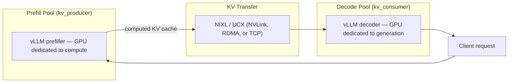

### 10.2 Concrete Configuration

**Prefill Node** (`kv_role: kv_producer`):

```bash
vllm serve $MODEL \
  --kv-transfer-config '{"kv_connector":"LMCacheMPConnector","kv_role":"kv_producer"}'
```

**Decode Node** (`kv_role: kv_consumer`):

```bash
vllm serve $MODEL \
  --kv-transfer-config '{"kv_connector":"LMCacheMPConnector","kv_role":"kv_consumer"}'
```

The `UCX_TLS=cuda_ipc,cuda_copy,tcp` transport declared at startup allows UCX to automatically select the fastest channel between the two pools, based on their physical topology (same multi-GPU node, or separate nodes connected by network).

A concrete demo example available in the vLLM repository (`examples/disaggregated/lmcache`) uses **NIXL** for a disaggregated deployment on a single node, with a FastAPI proxy server coordinating exchanges between the prefiller and decoder.

### 10.3 LMCache as a Safety Net

A key aspect, particularly relevant in combination with LMCache: if the cache transferred from prefiller to decoder is **not immediately consumed** (load, queues), it **lands in LMCache** instead of being lost. Subsequent requests needing the same cache can then recover it directly from LMCache, without requesting a new prefill computation — disaggregated serving and shared cache **reinforce each other** rather than being two independent mechanisms.

### 10.4 Measured Results

On a 1P1D configuration (1 prefill + 1 decode) with 8x H100, at 3.6 requests/s of 8000 input tokens and 200 output tokens, the system achieves peak performance in TTFT and ITL (Inter-Token Latency).

---

<a id="11-fault-tolerance"></a>
## 11. Fault Tolerance and Resilience

### 11.1 The Circuit Breaker: `SafeLMCacheConnectorV1`

If LMCache becomes unavailable, the inference system must not collapse. The `SafeLMCacheConnectorV1` mechanism implements a **circuit breaker**:

- **Mechanism**: vLLM monitors LMCache's state. If the service encounters too many consecutive failures (e.g. 3), the circuit opens.
- **Behavior**: once the circuit is open, vLLM stops using LMCache and automatically falls back to its native cache. The service continues operating, with potentially degraded performance, but without outage.
- **Automatic recovery**: the system periodically retries reconnecting, with an exponential backoff (typically between 30 and 300 seconds). As soon as LMCache becomes operational again, the circuit closes and collaboration resumes.
- **Overhead**: in normal operation, this mechanism adds sub-millisecond overhead.

### 11.2 Lifecycle Independence ("No Fate-Sharing")

In multiprocess mode (`LMCacheMPConnector`), the KV cache **survives an inference engine crash**, since it shares neither the process nor the memory space of vLLM. This property enables **request migration** in Kubernetes (see section 13): if a vLLM instance dies during processing, the session can be migrated to a new instance with its KV cache intact.

### 11.3 Fail-Injection on the L2 Adapter

Fallback mechanisms exist to switch to a partial recovery path (segmented-prefix) in case of a remote L2 backend failure, avoiding total request failure rather than a complete stall.

---

<a id="12-cache-coherence"></a>
## 12. Cache Coherence: The Critical Watchpoint

This is the most technical and subtle problem of this integration. Mismanaged, it can produce **incorrect results (hallucinations)** without the system detecting an explicit error.

### 12.1 The Underlying Problem

The LLM attention mechanism requires the entire KV cache (all previous tokens) to be **perfectly coherent**. If vLLM uses its local cache for some tokens and LMCache provides another part computed in a different context, the data is mixed and the attention context becomes corrupted, generating erroneous results.

### 12.2 Common Causes

- **Chunk/block misalignment**: the problem often occurs when vLLM's local cache (`vllm_cached_tokens`) is not aligned with the block size (`chunk_size`) used by LMCache.
- **APC and LMCache race condition**: poorly managed overlap between vLLM's automatic local cache and the external cache.
- **Dtype inconsistency**: mixing FP8 workers and FP16 workers in the same cluster causes **silent cache misses**, since serialized tensors no longer match. This pitfall is particularly insidious because it produces no error or visible warning — the cache is simply, systematically, never reused.

### 12.3 Safeguards

- **Deterministic hash**: `PYTHONHASHSEED=0` ensures hashes remain consistent across all processes in the cluster.
- **Overlap management**: the LMCache connector handles overlaps between local and external cache.
- **Strict dtype consistency**: `--kv-cache-dtype` must be strictly identical across all workers in the same cluster.
- Continuous fixes are applied by the project to improve block ID management reliability and prevent duplication.

---

<a id="13-kubernetes-integration"></a>
## 13. Kubernetes Integration: vLLM Production Stack

### 13.1 Overview

**vLLM Production Stack** is the official, Kubernetes-native reference deployment, natively integrating LMCache. This is not a simple demo example: it is the open-source reference implementation for operating vLLM at full cluster scale, packaged as a **Helm chart + Kubernetes operator (CRDs)**. It is not part of vLLM's core per se, but constitutes a dedicated sub-project for enterprise deployments, maintained jointly with LMCache.

Unlike solutions that run "bare" vLLM (KServe, KubeAI, AIBrix in their basic configuration), the Production Stack is the most advanced official implementation in terms of LMCache-powered KV offloading — one of its most important performance features.

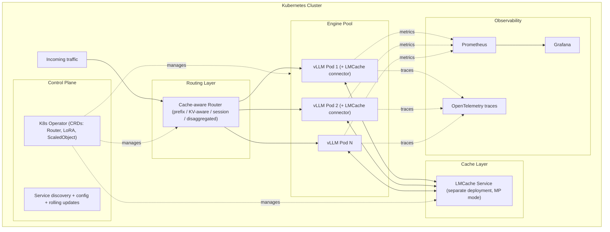

### 13.2 Key Operator Components

- **Router CRD**: custom Kubernetes resource defining routing policy (round-robin, session-based, prefix-aware, KV-aware, disaggregated-prefill).
- **LoRA management via CRD**: LoRA adapters can be declared and managed as first-class Kubernetes resources, dynamically loaded without redeploying the full pod.
- **Kubernetes-native autoscaling**: the number of vLLM replicas adjusts based on real load metrics (queue depth, cache pressure), not just CPU/RAM. The project's 2026 roadmap explicitly plans integration of **KEDA**-driven scaling in the operator CRD.
- **Request migration**: if a vLLM instance dies during processing, the session can be migrated to a new instance with its KV cache intact, thanks to the external persistence provided by LMCache — a direct benefit of the multiprocess connector's "no fate-sharing" mode.
- **Request-rewrite / security**: PII detection before the request reaches the model, security and rate limiting policies configurable at the router level.

### 13.3 How Kubernetes Concretely Orchestrates Cache Sharing

1. **Separate deployment**: LMCache (in MP mode) is deployed as its own Kubernetes service, with its own resources (RAM sized for L1, PVC or network access for L2), independent of the vLLM pod lifecycle.
2. **Service discovery**: each vLLM pod connects to the LMCache service via its internal Kubernetes DNS name, without static IP configuration. In Kubernetes, the LMCache operator can create a **ConfigMap** (`<name>-connection`) containing the server address, mounted by vLLM pods.
3. **Independent scaling**: the number of LMCache replicas (for P2P mode) and the number of vLLM replicas evolve independently according to their respective bottlenecks (cache memory vs GPU compute).
4. **Unified observability**: KV cache-specific metrics (per-token hit rate, request lifecycle, per-level L1/L2 utilization) are exposed alongside standard Kubernetes metrics, consolidated in the same Grafana dashboards.
5. **`hostIPC: true`**: when CUDA IPC transport is used between pods (manual DaemonSet deployment without the operator), this parameter is **mandatory** on LMCache and vLLM pods to enable CUDA IPC communication. The LMCache operator handles this automatically when used.

### 13.4 Helm Deployment — Values File

```yaml
servingEngineSpec:
  runtimeClassName: ""
  modelSpec:
    - name: "my-model"
      repository: "lmcache/vllm-openai"     # Docker image with vLLM + LMCache
      tag: "latest"                          # Prefer a versioned tag in production
      modelURL: "meta-llama/Llama-3.1-8B-Instruct"
      replicaCount: 2
      requestCPU: 10
      requestMemory: "40Gi"
      requestGPU: 1
      pvcStorage: "50Gi"
      vllmConfig:
        enableChunkedPrefill: false          # Disabled for LMCache
        enablePrefixCaching: false           # Disabled to avoid conflicts
        maxModelLen: 16384
        v1: 1                                 # Required with lmcache/vllm-openai images
      lmcacheConfig:
        enabled: true
        cpuOffloadingBufferSize: "20"        # L1 cache size in GB
        hf_token: "<YOUR_HF_TOKEN>"

  cacheserverSpec:
    replicaCount: 1
    containerPort: 8080
    servicePort: 81
    repository: "lmcache/vllm-openai"
    tag: "latest"
    resources:
      requests:
        cpu: "4"
        memory: "8G"
      limits:
        cpu: "4"
        memory: "10G"
```

**Deployment:**

```bash
helm repo add vllm https://vllm-project.github.io/production-stack/
helm install vllm vllm/vllm-stack -f my-values.yaml
```

**Verification:**

```bash
kubectl get pods
kubectl logs -f <vllm-pod-name>
# Look for: "Initializing LMCacheConfig under kv_transfer_config"
```

### 13.5 Advanced Configurations

**Local disk offload (L2):**

```yaml
lmcacheConfig:
  enabled: true
  cpuOffloadingBufferSize: "20"
  localDisk:
    enabled: true
    size: "100Gi"
```

**Prefill-Decode disaggregation via Helm:**

```yaml
servingEngineSpec:
  modelSpec:
    - name: "llama-prefill"
      vllmConfig:
        lmcacheConfig:
          kvRole: "kv_producer"
          enablePD: true
    - name: "llama-decode"
      vllmConfig:
        lmcacheConfig:
          kvRole: "kv_consumer"
          enablePD: true
```

### 13.6 Production Tuning Table

| Parameter | Recommendation | Impact |
|---|---|---|
| `lmcacheConfig.cpuOffloadingBufferSize` | Adjust based on available node RAM | Too small = frequent evictions; too large = waste |
| `LMCACHE_CHUNK_SIZE` | 256 tokens (default). 128-256 for highly varied prefixes | Influences cache sharing granularity |
| `vllmConfig.gpuMemoryUtilization` | 0.80 - 0.90 | GPU memory headroom for cache growth |
| `vllmConfig.enablePrefixCaching` | **Disabled** when LMCache is active | Avoids conflicts between the two cache systems |
| `vllmConfig.enableChunkedPrefill` | **Disabled** | Not compatible with LMCache |
| `replicaCount` | Adjusted to load, driven by HPA/KEDA on Prometheus metrics (`vllm:num_requests_waiting`) | Horizontal scalability |

### 13.7 Key Production Considerations

1. **`hostIPC: true`** mandatory for CUDA IPC communication in manual deployment (handled automatically by the operator).
2. **Versioned Docker tags** (e.g. `lmcache/vllm-openai:2026-01-XX-vN`) rather than `latest`, to avoid regressions.
3. **Secret management** via `ExternalSecrets` for HF tokens and remote storage credentials.
4. **Careful resource sizing** of CPU/RAM for vLLM workers and the LMCache server.
5. **Canary updates** (`rollingUpdate`) for vLLM workers, natively supported by the Production Stack.

---

<a id="14-cache-aware-routing"></a>
## 14. Cache-Aware Routing (KV-aware routing)

### 14.1 Available Strategies

The vLLM Production Stack router supports multiple strategies, combinable:

- **Round-robin**: simple distribution, without cache awareness — the baseline reference.
- **Session-based**: a user session stays pinned to the same instance for its entire duration.
- **Prefix-aware**: detects that two requests share a prefix and routes the second to the instance that already processed the first.
- **KV-aware**: routes to the instance with the highest KV cache hit rate for the given request, by querying the global view maintained by LMCache — a finer approach than simple prefix-matching, as it accounts for actually available cache (including via CacheBlend, non-prefix).
- **Disaggregated-prefill-aware**: routes specifically to the correct pool (prefiller or decoder) based on the required processing phase.

### 14.2 Why KV-aware Routing Is Essential at Scale

Without it, increasing the number of vLLM replicas **mechanically dilutes** the cache hit rate: a request has less and less chance of landing on the instance that already has the relevant context, as the cluster grows. KV-aware routing, coupled with LMCache as a shared fallback cache, enables **horizontal scaling without losing the cache benefit**.

### 14.3 Progress Status (2026 Roadmap)

KV-aware and prefix-aware routing, initially available on the application router side, is being integrated directly into the Production Stack **operator CRDs** (`VLLMRouter` CRD), alongside native support for prefill/decode disaggregation via CRD and KEDA-driven automatic scaling — three priority (P0) work items on the project's 2026 roadmap.

---

<a id="15-observability-and-metrics"></a>
## 15. Observability and Metrics

### 15.1 LMCache Metrics Exposed

LMCache exposes detailed metrics via vLLM's `/metrics` endpoint (prefix `lmcache:`).

| Category | Metric | Description |
|---|---|---|
| **Requests** | `lmcache:num_retrieve_requests` | Total number of retrieval requests |
| | `lmcache:num_store_requests` | Total number of store requests |
| **Tokens** | `lmcache:num_requested_tokens` | Tokens requested for retrieval |
| | `lmcache:num_hit_tokens` | Tokens found in cache |
| **Hit Rate** | `lmcache:retrieve_hit_rate` | Hit rate for retrievals |
| | `lmcache:lookup_hit_rate` | Hit rate for lookups |
| **Utilization** | `lmcache:local_cache_usage` | Local cache (RAM) utilization |
| | `lmcache:remote_cache_usage` | Remote cache utilization |
| **Performance** | `lmcache:time_to_retrieve` | Cache retrieval time |

### 15.2 Prometheus Configuration

```yaml
scrape_configs:
  - job_name: 'lmcache'
    static_configs:
      - targets: ['<vllm-worker-ip>:8000']
    scrape_interval: 15s
```

**Important note**: in v1 mode, vLLM and LMCache run in separate processes. The `PROMETHEUS_MULTIPROC_DIR` variable must be identical in both processes for correct metric aggregation.

### 15.3 What to Monitor Continuously

- The **cache hit rate**, measured **per token** (not just per request), to detect progressive degradation.
- The **per-level utilization rate** (L1 vs L2) to adjust RAM/disk sizing.
- **Overall HBM pressure**: LMCache provides a net benefit only when the KV cache footprint exceeds available VRAM capacity; under low memory pressure, the additional layer can represent a net cost on the order of a few percent.
- **Latency (TTFT)** and **throughput**.
- **Memory utilization** (GPU, CPU, disk).

### 15.4 Observed Resilience in Logs

LMCache logs constitute direct, measurable proof of proper routing and reuse operation, by precisely detailing the number of tokens retrieved from cache relative to the request total (see examples in section 5.3).

---

<a id="16-configuration-reference"></a>
## 16. Complete Configuration Reference

### 16.1 vLLM Parameters for LMCache

| Parameter | Recommended Value | Reason |
|---|---|---|
| `--enable-prefix-caching` | `false` | Avoids conflicts with LMCache |
| `--enable-chunked-prefill` | `false` | Not compatible with LMCache |
| `--max-model-len` | Per workload | Limits context length |
| `--kv-cache-dtype` | `fp8` or `fp16`, identical across all workers | Consistency essential (see section 12) |
| `--gpu-memory-utilization` | 0.80-0.90 | Headroom for cache growth |
| `--disable-hybrid-kv-cache-manager` | Enabled when needed (hybrid models, or `--kv-offloading-backend` shortcut) | Disables vLLM's internal hybrid cache |

### 16.2 Key LMCache Environment Variables

| Variable | Role | Typical Default |
|---|---|---|
| `LMCACHE_CONFIG_FILE` | Path to a complete YAML configuration file | — |
| `LMCACHE_CHUNK_SIZE` | Cache chunk size (in tokens) | 256 |
| `LMCACHE_ENABLE_BLENDING` | Enables CacheBlend | `False` |
| `LMCACHE_BLEND_SPECIAL_STR` | Separator between chunks for CacheBlend | — |
| `LMCACHE_USE_LAYERWISE` | Layerwise mode (required for blending) | `False` |
| `LMCACHE_BLEND_CHECK_LAYERS` | Blending verification layer | 1 |
| `LMCACHE_BLEND_RECOMPUTE_RATIOS` | Fraction of tokens recomputed in blending | 0.15 |
| `NO_GPU_EXT` | Disables GPU dependencies (useful in CPU-only environments, e.g. Apple Silicon) | — |
| `PYTHONHASHSEED` | Set to `0` to ensure deterministic hashes across processes | — |
| `PROMETHEUS_MULTIPROC_DIR` | Shared directory for multi-process metric aggregation | — |

### 16.3 `lmcache server` Options (MP Mode)

| Option | Role |
|---|---|
| `--port` | ZMQ port for vLLM communication (default 5555) |
| `--http-port` | HTTP port for health checks and metrics (default 8080) |
| `--l1-size-gb` | L1 cache (RAM) size in GB |
| `--eviction-policy` | Eviction policy (LRU by default) |
| `--chunk-size` | Chunk size (use a small value like 16 only for demo) |

### 16.4 `kv_transfer_config` — Key Fields

| Field | Possible Values | Role |
|---|---|---|
| `kv_connector` | `LMCacheConnectorV1`, `LMCacheConnectorV1Dynamic`, `LMCacheMPConnector` | Connector implementation choice |
| `kv_role` | `kv_both`, `kv_producer` (`kv_sender`), `kv_consumer` (`kv_retriever`) | Instance's role regarding the cache |
| `kv_connector_module_path` | Python module path | Required for dynamic loading |
| `kv_connector_extra_config.lmcache.mp.host` / `.port` | LMCache server address | Required in MP mode with non-local host |
| `kv_connector_extra_config.lmcache.mp.mp_transfer_mode` | `lmcache_driven` (recommended) or `cpu` | Who drives block transfer |

### 16.5 Roles (`kv_role`) — Detailed Table

| Role | Description |
|---|---|
| `kv_both` | The instance can both **store** (send) and **retrieve** cache. Standard mode. |
| `kv_retriever` / `kv_consumer` | The instance only retrieves cache (read-only). Used for decode workers in PD. |
| `kv_sender` / `kv_producer` | The instance only sends cache (write-only). Used for a pure prefill node in PD. |

---

<a id="17-local-guide"></a>
## 17. Practical Guide: Setting Up a Local Test Environment

This guide helps understand the mechanism on a development machine, **even without a GPU** (CPU mode), before a production deployment.

### 17.1 Prerequisites

| Item | Specification |
|---|---|
| System | macOS (Apple Silicon) or Ubuntu |
| Python | ≥ 3.11 (tested with 3.12) |
| cmake | Installed (`brew install cmake` on macOS) |
| Disk space | ~5 GB for sources and model |

### 17.2 Installation

```bash
mkdir -p ~/projects-test && cd ~/projects-test
python3 -m venv .venv-lmcache
source .venv-lmcache/bin/activate
pip install -U pip wheel setuptools

git clone https://github.com/vllm-project/vllm.git
git clone https://github.com/LMCache/LMCache.git
```

**vLLM (CPU version)** — option to compile from source:

```bash
cd ~/projects-test/vllm
pip install uv
VIRTUAL_ENV=~/projects-test/.venv-lmcache \
  uv pip install -r requirements/cpu.txt --index-strategy unsafe-best-match

pip install setuptools_scm setuptools_rust
VIRTUAL_ENV=~/projects-test/.venv-lmcache VLLM_TARGET_DEVICE=cpu \
  uv pip install -e . --no-build-isolation

python -c 'import vllm; print(vllm.__version__); from vllm.distributed.kv_transfer.kv_connector.v1.base import KVConnectorBase_V1; print("v1 OK")'
```

Faster alternative option (pre-compiled wheel):

```bash
bash ~/projects-test/LMCache/.github/scripts/install_vllm_cpu.sh
```

**LMCache** (without GPU dependencies, essential off-CUDA machine):

```bash
cd ~/projects-test/LMCache
NO_GPU_EXT=1 pip install -e .
```

### 17.3 Start the LMCache Server (Terminal A)

```bash
cd ~/projects-test
source .venv-lmcache/bin/activate
lmcache server --port 5555 --http-port 8080 --l1-size-gb 1 --eviction-policy LRU
```

Verification:

```bash
curl http://localhost:8080/healthcheck
```

### 17.4 Start vLLM with LMCache (Terminal B)

```bash
cd ~/projects-test
source .venv-lmcache/bin/activate

# macOS Apple Silicon: avoids OpenMP deadlock
export VLLM_CPU_OMP_THREADS_BIND=nobind
export OMP_NUM_THREADS=1
export KMP_BLOCKTIME=0

export VLLM_DEVICE=cpu
export VLLM_CPU_KVCACHE_SPACE=1
export VLLM_HOST_IP=127.0.0.1
export GLOO_SOCKET_IFNAME=lo0

vllm serve facebook/opt-125m \
  --port 18000 \
  --dtype bfloat16 \
  --disable-hybrid-kv-cache-manager \
  --no-enable-prefix-caching \
  --max-model-len 2048 \
  --max-num-seqs 1 \
  --kv-transfer-config '{
    "kv_connector": "LMCacheMPConnector",
    "kv_role": "kv_both",
    "kv_connector_module_path": "lmcache.integration.vllm.lmcache_mp_connector",
    "kv_connector_extra_config": {
      "lmcache.mp.host": "tcp://localhost",
      "lmcache.mp.port": 5555,
      "lmcache.mp.mp_transfer_mode": "lmcache_driven"
    }
  }'
```

### 17.5 Test the Cache

**First request (populates the cache)**:

```bash
curl http://localhost:18000/v1/completions \
  -H "Content-Type: application/json" \
  -d '{"model": "facebook/opt-125m", "prompt": "The future of artificial intelligence is", "max_tokens": 50}'
```

This request computes the KV cache for the prefix, stores it in LMCache (L1), then generates the response. Note the TTFT.

**Second identical request (reuses the cache)**:

```bash
curl http://localhost:18000/v1/completions \
  -H "Content-Type: application/json" \
  -d '{"model": "facebook/opt-125m", "prompt": "The future of artificial intelligence is", "max_tokens": 50}'
```

vLLM queries LMCache, which finds the cache in L1 and returns it; the prefill phase is completely skipped; generation starts immediately. The TTFT should be noticeably lower (up to 67% reduction on this example).

**Metrics verification:**

```bash
curl http://localhost:8080/healthcheck
curl http://localhost:8080/metrics
```

### 17.6 Integrated Benchmark

```bash
lmcache bench server \
  --rpc-url tcp://127.0.0.1:5555 \
  --url http://127.0.0.1:8080 \
  --mode cpu \
  --transfer-mode lmcache_driven \
  --num-tokens 512 \
  --end 3
```

A success displays `CHECKSUM MATCH OK` × 3.

### 17.7 Docker Version for GPU (Optional)

```bash
git clone https://github.com/LMCache/LMCache-Examples.git
cd LMCache-Examples/demo-rag-blending
export HF_TOKEN="your_token"
./run-server-blend.sh
```

This demo launches two vLLM instances side by side: one with LMCache + CacheBlend, one without LMCache, with a Streamlit interface to compare performance in real time.

---

<a id="18-kubernetes-guide"></a>
## 18. Practical Guide: Production Kubernetes Deployment

See section 13 for the architecture and detailed `values.yaml` files. Summary of essential commands:

| Action | Command / File |
|---|---|
| **Deploy the stack** | `helm install vllm vllm/vllm-stack -f my-values.yaml` |
| **Basic LMCache config** | `lmcacheConfig.enabled: true` and `cpuOffloadingBufferSize: "20"` |
| **Remote cache config** | `cacheserverSpec` section in `values.yaml` |
| **Verification logs** | `kubectl logs -f <vllm-pod>` (search for `LMCacheConfig`) |
| **Prometheus metrics** | `/metrics` endpoint on vLLM pods |
| **KServe alternative** | Dedicated manifests for HuggingFace vLLM backend with LMCache mounted as config volume (support added via KServe PR #4320) |

---

<a id="19-troubleshooting"></a>
## 19. Troubleshooting

| Problem | Cause | Solution |
|---|---|---|
| `cudaErrorMapBufferObjectFailed` | Missing `hostIPC: true` in Kubernetes | Add `hostIPC: true` on LMCache and vLLM pods |
| vLLM crashes on startup on macOS | OpenMP deadlock | `export VLLM_CPU_OMP_THREADS_BIND=nobind`, `OMP_NUM_THREADS=1`, `KMP_BLOCKTIME=0` |
| Insufficient memory | Overly generous allocations | Reduce `VLLM_CPU_KVCACHE_SPACE`, `--l1-size-gb`, `--max-model-len`, `--max-num-seqs` |
| `RuntimeError: Cannot re-initialize CUDA in forked subprocess` | Multiprocessing method incompatible with CUDA | `export VLLM_WORKER_MULTIPROC_METHOD=spawn` |
| Cache never reused, no visible error | `--kv-cache-dtype` inconsistency between workers | Strictly align KV dtype across all cluster workers |
| Inconsistent results / unexplained hallucinations | Misalignment between `vllm_cached_tokens` and `chunk_size`, or APC/LMCache race condition | Verify block size alignment, update to latest coherence fixes |
| Cache hit rate dilution at scale | Absence of KV-aware routing | Enable KV-aware or prefix-aware routing in the Production Stack router |
| Total service outage if LMCache goes down | Absence of circuit breaker | Use `SafeLMCacheConnectorV1` |

---

<a id="20-checklist"></a>
## 20. Optimal Deployment Checklist

- [ ] Connector choice (in-process vs multiprocess) aligned with actual cluster topology
- [ ] `--kv-cache-dtype` strictly identical across all workers
- [ ] L1 (RAM) sizing based on actual working set of hot contexts
- [ ] L2/L3 backend chosen per need (Redis/Mooncake for speed, S3 for persistence and cost)
- [ ] CacheBlend enabled and calibrated (`LMCACHE_BLEND_RECOMPUTE_RATIOS`) if workload is RAG-type with reordered chunks
- [ ] Prefill/decode disaggregation considered if load ratio justifies it
- [ ] `SafeLMCacheConnectorV1` enabled for fault tolerance
- [ ] Deployment via vLLM Production Stack operator rather than manual deployment
- [ ] KV-aware routing enabled beyond a handful of replicas
- [ ] Request migration configured to tolerate instance crashes
- [ ] `hostIPC: true` configured if CUDA IPC is used between pods (handled automatically by operator)
- [ ] Monitoring of per-token hit rate, per storage level, and overall HBM pressure
- [ ] `PROMETHEUS_MULTIPROC_DIR` consistent between vLLM process and LMCache process
- [ ] Net benefit validation via A/B test before/after LMCache activation on real workload (gain is significant only if GPU memory pressure is real — rule of thumb: ≥ 50% of tokens in shared prefixes)
- [ ] Versioned Docker tags (not `latest`) in production

---

<a id="21-glossary"></a>
## 21. Technical Glossary

| Term | Definition |
|---|---|
| **PagedAttention** | vLLM's native paged KV cache management mechanism, in GPU memory |
| **KVConnectorV1** | Official pluggable interface of vLLM (since 0.9.0) for connecting an external KV cache backend |
| **LMCacheConnectorV1** | In-process connector implementation, LMCache in the same process as vLLM |
| **LMCacheConnectorV1Dynamic** | Dynamic loading variant of the connector module, decoupled from vLLM's release cycle |
| **LMCacheMPConnector** | Multiprocess implementation, LMCache as independent daemon |
| **SafeLMCacheConnectorV1** | Variant integrating a circuit breaker for fault tolerance |
| **Chunk** | Fixed-size segment of tokens, atomic unit of cache storage and sharing in LMCache |
| **Content-addressing** | Identifying a chunk by the hash of its content, regardless of its position |
| **CacheBlend** | Non-prefix KV cache reuse mechanism with selective recomputation |
| **APC** | Automatic Prefix Caching — vLLM's native local prefix cache (L0 level) |
| **TTFT** | Time To First Token — delay before the first generated token, key metric optimized by shared KV cache |
| **ITL** | Inter-Token Latency — delay between two successive generated tokens |
| **NIXL** | High-performance KV transfer library, RDMA support |
| **UCX** | Unified transport layer automatically selecting the best physical channel |
| **GDS (GPUDirect Storage)** | Direct GPU-to-NVMe storage transfer without detour through CPU RAM |
| **kv_producer / kv_consumer** (or kv_sender / kv_retriever) | Roles declared by vLLM instances in a disaggregated prefill/decode architecture |
| **No fate-sharing** | Property whereby the KV cache survives independently of the inference engine's lifecycle |
| **KV-aware routing** | Routing strategy directing a request to the instance with the best expected cache hit rate |
| **vLLM Production Stack** | Official reference Kubernetes deployment, integrating vLLM + LMCache + router + observability |

---

<a id="22-sources"></a>
## 22. Sources

This document consolidates all technical explanations previously exchanged on this subject, completed and verified by the following sources (consulted in July 2026):

- Official vLLM documentation — Connector API v1, disaggregated examples, Production Stack integration (`docs.vllm.ai`)
- Official LMCache documentation — Quickstart, integration guide, configuration reference, dynamic connector (`docs.lmcache.ai`)
- GitHub repository `vllm-project/production-stack` — 2026 roadmap, releases, KV-aware routing issues
- GitHub repositories `LMCache/LMCache` and `LMCache/LMCache-Examples`
- KServe — KV cache offloading guide with HuggingFace vLLM backend
- Third-party technical articles on large-scale LMCache/vLLM production deployments (GKE Inference, CoreWeave, Cohere)
